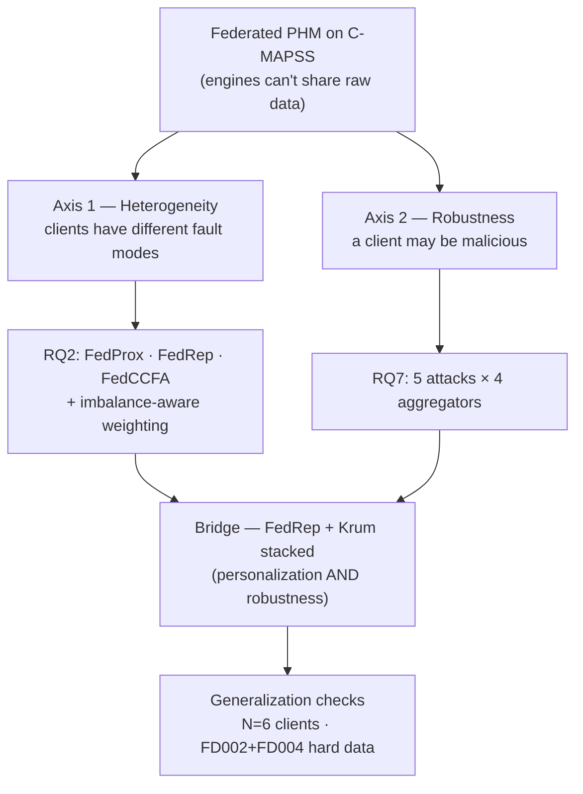

# Consolidated Results — Federated Learning for Aircraft Engine PHM

> **One-stop summary of every experiment**, from the centralized baseline through
> the two research axes (RQ2 heterogeneity, RQ7 robustness), the cross-axis
> bridge, and the generalization runs (N=6 and FD002+FD004).
> Dataset: **NASA C-MAPSS** · Model: multi-task 1-D CNN (30,018 params) ·
> Metrics: **RMSE** (RUL error, ↓) and **ASR** (backdoor attack success rate, ↓).
>
> For the detailed phase-by-phase narrative see [`results.md`](results.md);
> for the engineering log see [`progress.md`](progress.md).

---

## 0. The big picture in one diagram

### The two analogies that explain everything

> **Federated learning = a class doing group homework.** Every student (an
> airline) does homework on their **own private notebook** and sends it to a
> teacher (the server), who **combines everyone's work into one master answer**
> (the global model). Nobody shares their raw notebook.

> **Axis 1 (RQ2)** asks: *what if students study different subjects?* Averaging
> their homework gives a mediocre master answer. The fix is to let each student
> keep a **personal page** (personalization).
>
> **Axis 2 (RQ7)** asks: *what if one student is a saboteur* who slips poison
> into their homework? The fix is a **suspicious bouncer** (a robust aggregator
> like Krum) that throws out homework that looks nothing like the group's.

---

## 1. Baselines — how good is "good"?

| Setup | RMSE ↓ | Notes |
| --- | --- | --- |
| **Centralized** (all data pooled) | **14.0** | Upper bound; NASA 357, AUPRC 0.987 |
| FedAvg (IID, 4 clients) | 14.16 | Closes **85.9 %** of the local→central gap |
| Local-only (4 clients, no sharing) | 15.02 | Lower bound (no collaboration) |
| **FedAvg (Non-IID, FD001+FD003)** | **17.95** | **Vanilla FedAvg fails** on structural heterogeneity → motivates RQ2 |

> **Read:** when clients are similar (IID), plain FedAvg nearly matches
> pooling all data. When clients are structurally different (Non-IID — one has
> only fault-mode A, another only A+B), plain averaging **breaks down**
> (17.95 vs 14.0). That gap is the problem Axis 1 has to close.

---

## 2. Axis 1 — RQ2: Heterogeneity & Personalization

**Question:** how do we cope when clients hold *different fault modes*?
**Setup:** FD001+FD003, Non-IID split. Lower RMSE = better.

| Method | Macro RMSE ↓ | Verdict |
| --- | --- | --- |
| Vanilla FedAvg (Non-IID) | 17.95 | baseline failure |
| Imbalance-aware reweighting (best of 4 schemes) | ~17.4 | **negative result** — closes only +2.8 % of the gap |
| FedProx (µ proximal term, swept) | 17.70 | marginal |
| **FedRep** (shared backbone + **private heads**) | **14.91** | **winner** — nearly matches centralized (14.0) |
| FedCCFA (clustered personalization) | 15.00 | also strong |

> **Analogy:** trying to fix this by *changing how the teacher averages the
> homework* (imbalance-aware weighting, FedProx) barely helps — because the
> problem isn't the averaging, it's that students **drift apart** while studying
> their own subjects. The fix that works is letting each student keep a
> **personal page** (FedRep's per-client heads): share the common textbook,
> keep your specialty private.

**Takeaway:** personalization (FedRep) — *not* aggregation reweighting — closes
the heterogeneity gap. This is the Axis-1 winner carried into the bridge.

### 2.1 Generalization to hard data (FD002+FD004) · *new*

| Method | Macro RMSE ↓ (FD002+FD004, 5 seeds) |
| --- | --- |
| FedAvg (non-IID, = RQ7 `B0`) | 20.33 ± 1.72 |
| **FedRep** | **19.59 ± 0.90** |

FedRep **still beats FedAvg** on the hard six-condition data (19.59 vs 20.33),
confirming personalization generalizes. But the margin **shrinks** — −0.74 here
vs **−3.04** on FD001/FD003 (14.91 vs 17.95) — because FD002/4's difficulty is
dominated by *within-client* operating-condition complexity, which
personalization (a *between-client* fix) doesn't target. This points squarely at
the regime-aware-normalization follow-up (§7). Honest and defensible: FedRep
generalizes, but its benefit is largest where the heterogeneity is *between*
clients.

---

## 3. RQ3 — Explainability (sanity on *why* it predicts)

Integrated Gradients + a 17-entry maintenance ontology produce per-engine sensor
attributions. Key finding: the Non-IID FedAvg model sometimes attributes its RUL
prediction to **operational settings** (e.g., Mach number) instead of degradation
sensors — an interpretability failure that **RMSE alone hides**. (Foreshadows the
Axis-2 lesson: a good headline number can conceal a hidden problem.)

---

## 4. Axis 2 — RQ7: Robustness & Byzantine Defense

**Question:** if one airline is malicious, which aggregation rule survives?
**Matrix:** 5 attack families × 4 aggregators (FedAvg / trimmed-mean / median /
Krum), 5 seeds. RMSE = clean-test error; ASR = how often the hidden backdoor works.

### 4.1 The stealthy-backdoor lesson (why RMSE isn't enough)

> **A backdoor is a saboteur who keeps the everyday homework perfect** (RMSE
> stays normal) **but hides a secret trigger**: "when you see this magic symbol,
> say the engine is healthy — even if it's dying." You can only catch it by
> testing the trigger (**ASR**), not by looking at accuracy. It's a car that
> passes every test-drive but has a hidden switch that kills the brakes.

### 4.2 Original setting — N=4, FD001+FD003 (5 seeds)

| Cell | RMSE ↓ | ASR ↓ | Story |
| --- | --- | --- | --- |
| Clean FedAvg (B0) | 16.59 | — | healthy reference |
| Clean Krum (B3) | 18.65 | — | small accuracy cost |
| Grad ×−10 + FedAvg (AV2) | **84.0** | — | undefended → collapse |
| Grad ×−10 + Krum (D23) | **~19** | — | Krum recovers |
| Coordinated ×−10 + trimmed (D51) | **84.0** | — | classic defense **fails** (2/4 attackers) |
| Krum-f2 (D54) | — | — | **undefined at N=4** (n−f−2 = 0) |
| Backdoor + FedAvg (AV3) | 16.9 | **0.949** | fully implanted, invisible to RMSE |
| Backdoor + trimmed / median | ~16.5 | **0.498** | partial |
| **Backdoor + Krum (D33)** | 18.9 | **0.064** | **Krum crushes it** |

### 4.3 Generalization to more clients — N=6, FD001+FD003 (5 seeds) · *new*

Same data, **more clients**. Unlocks **Krum-f2** (valid only when n−f−2 ≥ 1).

| Cell | RMSE ↓ | ASR ↓ | Story |
| --- | --- | --- | --- |
| Clean FedAvg (B0) | 16.5 | — | healthy (matches N=4) |
| Coord ×−10 + trimmed (D51) | **84.0** | — | still collapses |
| Coord ×−10 + median (D52) | 37.3 | — | partial |
| **Coord ×−10 + Krum-f1 (D53)** | **20.6** | — | **recovers** |
| **Coord ×−10 + Krum-f2 (D54)** | **20.8** | — | **NEW — defends 2 coordinated attackers** |
| Backdoor + FedAvg (AV3) | 16.9 | **0.458** | **weaker** — more clients dilute one attacker |
| Backdoor + Krum (D33) | 18.9 | **0.034** | Krum best |

> **Headline new result:** Krum-f2 — a defense you *couldn't even test* at N=4 —
> **works** at N=6, holding the coordinated 2-attacker case to RMSE ~21 while
> trimmed-mean collapses at 84.

### 4.4 Generalization to harder data — FD002+FD004, N=4 (5 seeds) · *new*

**Harder data** (6 operating conditions, ~2.5× the volume, 19 features).

| Cell | RMSE ↓ | ASR ↓ | Story |
| --- | --- | --- | --- |
| Clean FedAvg (B0) | 20.3 | — | higher (harder regime) |
| Coord ×−10 + trimmed / median | **87.1** | — | both **collapse** |
| **Coord ×−10 + Krum-f1 (D53)** | **31.6** | — | **only survivor** |
| Backdoor + FedAvg (AV3) | 20.0 | **0.999** | backdoor **stronger** on hard data |
| Backdoor + trimmed / median | ~19.7 | **0.926** | **fail** |
| **Backdoor + Krum (D33)** | 27.3 | **0.161** | **only working defense** (but weaker than on easy data) |

> **Honest nuance for the paper:** the *ranking* is identical on the hard data
> (Krum is the lone survivor), **but every defense weakens as the task gets
> harder** — the undefended backdoor hits 99.9 %, and even Krum only gets ASR
> down to 0.16 (vs 0.03–0.06 on the easy data). Stating this openly is stronger
> than pretending robustness is free.

---

## 5. Cross-axis Bridge — FedRep + Krum stacked

**Question:** can we get Axis-1 personalization **and** Axis-2 robustness at once?
Stack them: FedRep's per-client heads + Krum on the shared backbone, under a
**backdoor** attack. Metric = honest clients' mean ASR (↓).

| Defense (N=4, backdoor) | ASR ↓ | |
| --- | --- | --- |
| FedAvg alone (no defense) | 0.949 | undefended |
| **FedRep alone** | **0.633** | **personalization alone is VULNERABLE** |
| Krum alone | 0.064 | robust aggregation works |
| **FedRep + Krum (bridge)** | **0.028 ± 0.024** | **robustness preserved *with* personalization** |

> **The real story (validated on 5 seeds):** FedRep by itself is *not* safe
> (0.63) — personalization doesn't buy robustness. But **adding Krum on the
> shared backbone rescues it** (0.028), as good as or better than Krum alone.
> So you can keep FedRep's accuracy win **without** sacrificing backdoor
> resistance. (Statistically, bridge ≈ Krum-alone — the point is that stacking
> *doesn't hurt* and gives you both properties.)

| Bridge generalization (backdoor ASR ↓) | ASR | Status |
| --- | --- | --- |
| N=4, FD001+FD003 | **0.028 ± 0.024** | ✓ done |
| N=6, FD001+FD003 | **0.042 ± 0.049** | ✓ done |
| FD002+FD004 | **0.147 ± 0.034** | ✓ done |

> **Bridge generalizes across all three settings** — 0.028 (N=4), 0.042 (N=6),
> 0.147 (FD002+FD004) — all far below the 0.95–0.99 ASR of undefended FedAvg. On
> the hard FD002/4 data it loosens to ~0.15 (matching **Krum-alone's 0.16**
> there), consistent with the RQ7 finding that every defense weakens as the task
> gets harder — **but the stacked defense never breaks.** Personalization and
> robust aggregation compose cleanly at every scale and difficulty.

---

## 6. Headline takeaways

1. **Heterogeneity (Axis 1):** aggregation tweaks (imbalance-aware, FedProx) barely
   help; **personalization (FedRep, 14.91)** closes the Non-IID gap to near
   centralized (14.0).
2. **Robustness (Axis 2):** **Krum is the consistent standout** — the only
   aggregator that survives coordinated and backdoor attacks. Trimmed-mean and
   median collapse under 2-attacker collusion.
3. **RMSE ≠ safety:** a stealthy backdoor keeps RMSE perfect while the attack
   succeeds (ASR up to 0.999). You *must* measure ASR.
4. **Generalization:** the robustness ranking **holds across
   client count (N=6) and dataset difficulty (FD002+FD004)**; N=6 adds the new
   Krum-f2-vs-coordinated result — with the honest caveat that all defenses
   weaken on harder data.
5. **Bridge:** FedRep alone is vulnerable (0.63), but **FedRep + Krum** gives
   personalization *and* robustness (0.028).

---

## 7. Future work — full four-subset heterogeneity via a common sensor set

The strongest possible heterogeneity test would federate **all four C-MAPSS
subsets at once** (FD001–FD004), giving each client a genuinely different
distribution (single- vs six-condition regimes × one- vs two-fault-mode
degradation). This is **not directly possible** with the current architecture:
FD001/FD003 expose **14 informative sensors (17 features)** while FD002/FD004
expose **16 (19 features)**, so the client models have different input widths and
their weights cannot be aggregated — FedAvg/FedRep require identical architectures
across clients, which is why `MultiSubsetConfig` blocks the mix.

**Proposed approach:** restrict all clients to the **~13 sensors common to all
four subsets** (the intersection of the two informative-sensor sets), giving a
unified 16-feature input usable across FD001–FD004. That would enable a single
4-client (or N-client) federation spanning **every regime and fault mode** — the
hardest, most realistic non-IID setting in C-MAPSS — at the cost of (a) a reduced
sensor set (slightly lower absolute accuracy), (b) a full-pipeline re-run on the
new feature space, and (c) a **regime-aware normalization** upgrade so the six
operating conditions are not smeared by a global scaler. Combined, this would let
us disentangle *feature-set*, *operating-condition*, and *fault-mode*
heterogeneity in one controlled study.

> **Why deferred:** the current two-family design (FD001+FD003 and FD002+FD004)
> already spans all four subsets and answers the heterogeneity and robustness
> questions cleanly, respecting the architectural constraint. The unified-sensor
> study is a richer but heavier follow-up that changes the model and data
> representation, so it is left as future work.

---

## 8. Where every number lives

| Experiment | File |
| --- | --- |
| RQ2 FedProx / FedRep / FedCCFA (FD001+FD003) | `results/rq2_fedprox|fedrep|fedccfa/metrics.json` |
| RQ2 FedRep on FD002+FD004 | `results/rq2_fd24_fedrep/seed_*/metrics.json` |
| RQ2 imbalance-aware | `results/rq2_imbalance_aware/metrics.json` |
| RQ7 N=4 (FD001+FD003) | `results/rq7_poisoning/metrics_aggregated.json` |
| RQ7 N=6 (FD001+FD003) | `results/rq7_n6_fd13/metrics_aggregated.json` |
| RQ7 FD002+FD004 | `results/rq7_fd24/metrics_aggregated.json` |
| Bridge N=4 / N=6 / FD002+4 | `results/rq_bridge_stacked_seeds/` · `results/bridge_n6_fd13/` · `results/bridge_fd24/` |

_All multi-seed numbers are mean ± std over 5 seeds {42–46}._

---

## 9. Review brief — for external review sessions (Claude / ChatGPT)

*Self-contained so a model can critique this without the earlier history.
Plain language; every acronym defined once.*

### 9.1 What the work is, in five sentences
Aircraft engines are monitored to predict **Remaining Useful Life (RUL)** — how
many cycles before maintenance is needed. Several operators want one shared
prediction model *without* sharing raw engine data, so they use **federated
learning** (each keeps its data; only model updates are sent to a server that
combines them). We study two risks: (a) operators hold **different data** (engines
fail in different ways), which plain averaging handles poorly; and (b) a
**malicious operator** can send poisoned updates. Our sharpest result: a stealthy
poisoning **"backdoor" can make the model hide impending failures while its
ordinary accuracy score stays perfect** — a safety risk that standard accuracy
metrics cannot see. We then show which defenses reduce it, across different client
counts and a harder dataset.

### 9.2 Claimed contributions (already softened after a literature check)
1. **[Primary]** To our knowledge, the first systematic study of stealthy,
   *failure-masking* backdoors on **federated aeroengine RUL**, and the safety
   point that **accuracy (RMSE) is blind to it — one must measure the
   attack-success-rate (ASR)**.
2. A **systematic attack × defense study** (5 attack types × 4 aggregation rules,
   5 random seeds) with honest generalization across client count and dataset
   difficulty.
3. A **domain-first application** of stacking personalization + robust aggregation
   (we call it **SHARP**) to prognostics — confirming, *in this domain*, the known
   general finding that **personalization alone is not robust** (SARS 2024; Fan &
   Chen 2026). This is **not** a new algorithm.

### 9.3 Key numbers (mean over 5 seeds; ASR = attack success, lower better)
- Undefended backdoor succeeds **~95%** (easy data), **~100%** (hard data) — while
  RMSE stays normal, i.e. invisible to accuracy.
- **Krum** (a robust aggregation rule) cuts it to **~6%** (easy), **~16%** (hard).
- **Personalization alone** (FedRep): **~63%** — vulnerable.
- **Stacked (SHARP):** **~3%** (easy), **~15%** (hard) — keeps robustness *and*
  personalization's accuracy gain.
- Simpler defenses (trimmed-mean, median) **collapse** under 2 coordinated attackers.

### 9.4 Target-venue question (open)
- **IEEE Trans. Industrial Informatics (TII)** — best fit; a near-identical
  C-MAPSS + federated learning + poisoning paper already appears there.
- **Reliability Engineering & System Safety (RESS)** — higher prestige, but its
  official scope names reliability/safety, *not* machine learning / federated
  learning / security. Needs reframing around the **safety consequence** (missed
  failures, maintenance risk), not the ML method.
- **IEEE Open Journal of Intelligent Transportation Systems** — weak fit
  (aeroengine health ≠ ground-transport intelligence) + open-access fee.

### 9.5 Known weaknesses (the reviewer attack surface — please stress-test)
- The federation is **simulated** by splitting one public dataset (C-MAPSS); no
  real multi-operator data.
- Accuracy is **not state-of-the-art** (14–20 RMSE vs ~11–12 best centralized) — by
  design (the point is robustness), but must be pre-empted.
- All methods are **pre-existing**; the novelty is the safety framing + evaluation,
  not new algorithms.
- The stacked defense is **statistically similar to robust-aggregation-alone** — the
  claim is "no loss of robustness while adding personalization," not "beats it."
- **Threat realism** — we must argue a credible attacker (compromised/insider
  operator, supply-chain tampering).
- **C-MAPSS is a saturated benchmark.**

### 9.6 Questions to put to the reviewer
1. Is the safety-consequence framing (backdoor hides failures → missed maintenance
   → elevated risk) strong enough to make this a *reliability* paper rather than an
   ML paper?
2. Is contribution #1 genuinely a "first," given the cited prior work?
3. TII vs RESS vs a fast open-access venue — which best balances acceptance odds and
   prestige for a timely publication?
4. Does "personalization is vulnerable, robust aggregation rescues it" hold up as a
   contribution once softened to "domain-first"?
5. What single added analysis would most strengthen it? (Our candidate: translate
   ASR into a reliability / maintenance-risk number — e.g. expected missed failures.)
