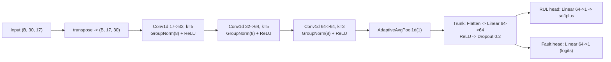
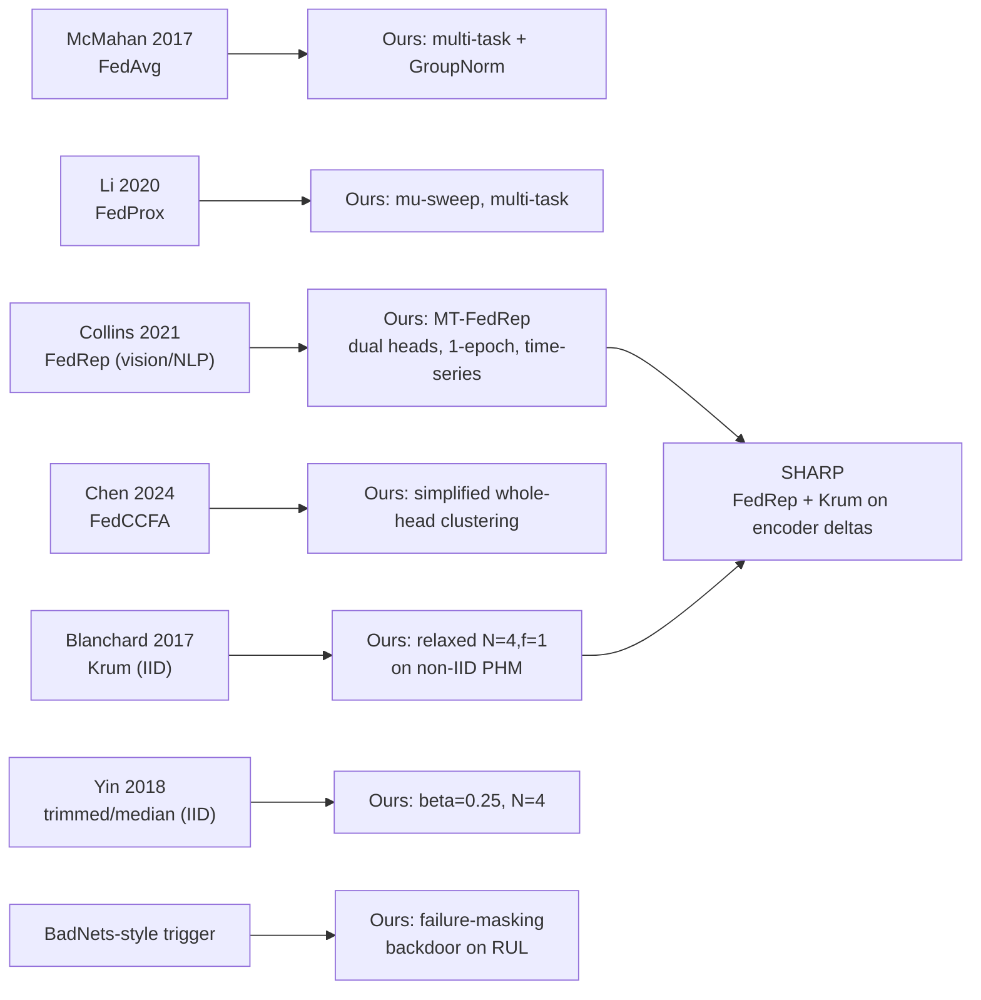
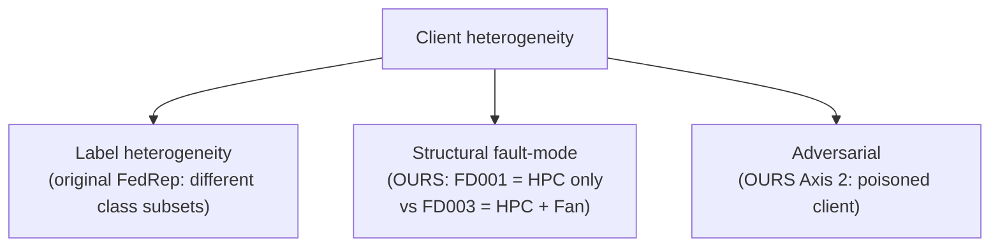
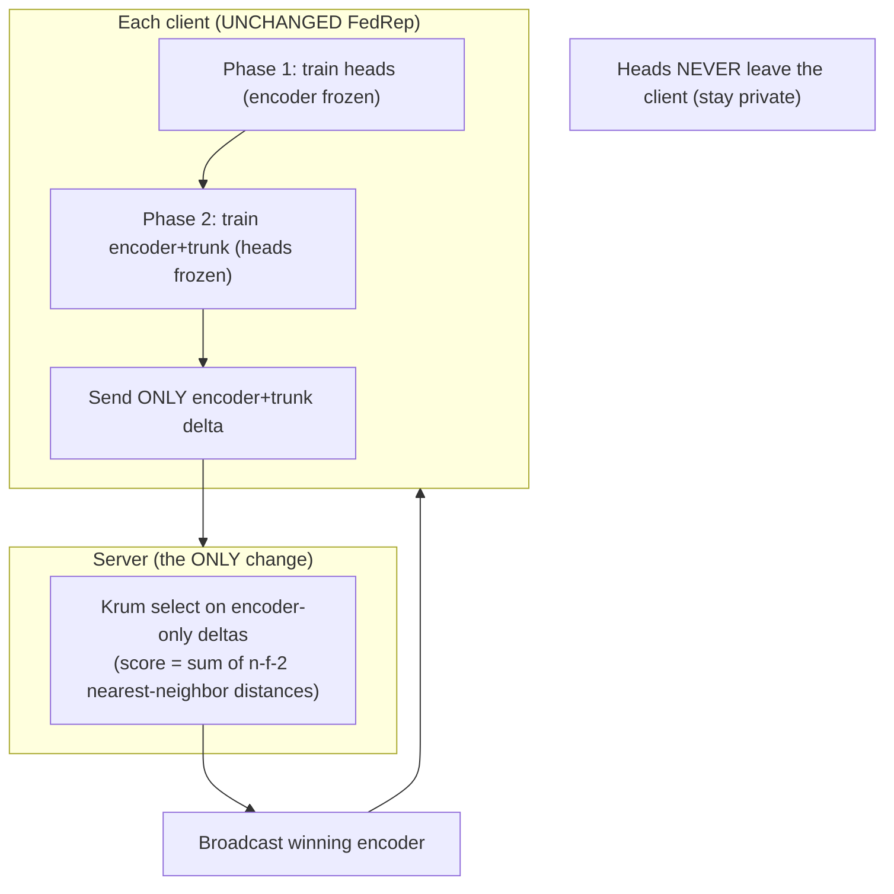

# Methods Provenance & Novelty Study

> **Purpose.** A code-verified, honest account of *what we took off the shelf*,
> *what we changed*, and *what is genuinely new* — for every federated method,
> aggregator, and attack in the project. Written to keep the paper's claims
> exactly as strong as the evidence, and no stronger.
>
> Everything below is checked against the actual implementation
> (`src/fl_aircraft/…`), not the draft. Numbers are 5-seed means unless noted.

---

## 0. Honest bottom line (read this first)

- This is an **application + composition** contribution, ideal for an
  applications venue (EAAI). It is **not** a fundamental new algorithm or
  architecture, and it should not be framed as one.
- You **can** name the pieces (papers name systems routinely). A name is a
  communication device — it does **not** multiply novelty. Over-naming an
  incremental method is the fastest way to lose reviewer trust.
- The parts that are genuinely defensible as "first / new":
  1. A **failure-masking backdoor on federated aeroengine RUL** and the safety
     point that **accuracy (RMSE) is blind to it** (measure ASR).
  2. A **systematic characterization of classic Byzantine-robust aggregators
     (Krum / trimmed-mean / median) under *structural fault-mode* non-IID**
     PHM data — a setting those defenses were *not* designed for.
  3. The **clean composition** of FedRep personalization with Krum on
     *encoder-only* deltas (**SHARP**), preserving robustness while keeping
     per-client heads.
- The parts that are **adaptation** (honest, publishable, but not "new"):
  multi-task dual-head FedRep, the 1-epoch schedule, GroupNorm, and the domain
  transfer to time-series regression.
- The part that is a **known result confirmed in a new domain**:
  "personalization alone does not confer robustness" (SARS 2024; Fan & Chen 2026).

The **Novelty Ledger** in §8 is the scorecard. Use it to write claims.

---

## 1. The shared substrate — the multi-task 1-D CNN

Every method sits on one model (`models/multitask_cnn.py`). Understanding the
encoder / trunk / heads split is essential because FedRep, FedCCFA, and SHARP
all federate *only the shared part*.

| Block | Layers | Role | Federated? |
| --- | --- | --- | --- |
| **Encoder** | 3× (Conv1d + GroupNorm(8) + ReLU) → AdaptiveAvgPool1d(1) | degradation feature extractor | **Shared** |
| **Trunk** | Flatten → Linear(64→64) → ReLU → Dropout(0.2) | shared representation | **Shared** |
| **RUL head** | Linear(64→1) → softplus (≥0) | per-task regression | **Private in FedRep/SHARP** |
| **Fault head** | Linear(64→1) → logits (BCE) | per-task classification | **Private in FedRep/SHARP** |

- **Params:** ≈**30,018** trainable (the model docstring notes 29,890 at F=17;
  the small gap is feature-count/config dependent). The **heads are ~130 params
  total** — so "private heads" cost almost nothing to keep local.
- **GroupNorm, not BatchNorm** — deliberate: BatchNorm running stats averaged
  under FedAvg are statistically wrong across heterogeneous clients. Enforced by
  a regression test. This is standard FL practice, not a novelty.
- `shared_state_dict()` = encoder+trunk; `personal_state_dict()` = the two heads.
  This split is the hook FedRep/FedCCFA/SHARP use.

---

## 2. Method-by-method provenance (original vs ours)

Legend for **Delta type**: 🟩 genuine-new · 🟦 adaptation · ⬜ standard practice ·
🟨 known-result-new-domain.

### 2.1 FedAvg — McMahan et al. 2017
- **Original:** average client weights, sample-count weighted; IID assumption
  for the convergence story; vision/language.
- **Ours (`fl/simulation.py`, `fl/server.py`):** canonical sample-count-weighted
  averaging; **multi-task** loss; **GroupNorm**; cosine LR; Adam reset per round.
- **Delta:** 🟦 multi-task + GroupNorm substrate; otherwise faithful. **Baseline,
  not a contribution.**
- **Numbers:** IID FedAvg best **14.16** / final **15.09** (FD001); non-IID FedAvg
  best **17.95** / final **18.13** (FD001+FD003) — the non-IID gap is the whole
  motivation for Axis 1.

### 2.2 FedProx — Li et al. 2020
- **Original:** add proximal term `(μ/2)·‖W − W_global‖²` to curb client drift
  in heterogeneous networks.
- **Ours (`fl/client.py`):** exact proximal term over **all** params, global
  snapshot taken at round start; `μ=0` reproduces vanilla FedAvg bit-for-bit;
  swept μ. Reported total loss excludes the prox term (comparable across μ).
- **Delta:** 🟦 faithful, on the multi-task substrate.
- **Numbers:** best **17.70** — barely above vanilla non-IID 17.95 (**~+6% gap
  closed**). Honest negative-ish result: aggregation-layer tweaks don't fix
  structural non-IID.

### 2.3 FedRep — Collins et al. 2021  → **our MT-FedRep**
- **Original:** federate the encoder only; each client keeps a **single
  classification head**; schedule is **τ-many head steps : 1 representation
  gradient step**; validated on CIFAR-10/100, FEMNIST, Sent140; heterogeneity =
  **label** heterogeneity; assumes a globally shared representation.
- **Ours (`fl/personalised.py`), verified:**
  - **Two private heads** (RUL regression *and* fault classification) — both
    unfrozen in the head phase, both frozen in the encoder phase.
    (`_local_train_two_phase`, lines 355–369.)
  - **Symmetric 1-epoch schedule:** `head_epochs = encoder_epochs = 1`
    (one *epoch* each, i.e. several minibatch steps) — **not** the original's
    asymmetric τ:1. Note: canonical FedRep does a *single encoder gradient step*;
    we do a full encoder epoch, so we actually train the encoder *more* per round.
  - **Encoder-only aggregation:** `_aggregate_shared` sends only
    `shared_state_dict()` (encoder+trunk); docstring: *"heads never leave clients."*
  - Time-series regression domain; GroupNorm.
- **Delta:** 🟦 multi-task extension + 1-epoch schedule + domain; 🟩 first
  FedRep-style personalization on **federated multivariate time-series RUL**
  (to our knowledge).
- **Numbers:** **14.91** macro-RMSE (best round 48 = final round 50 = 14.91;
  converged flat — headline safe). Closes ~73% of the non-IID→centralized gap:
  the Axis-1 winner.

> **Accuracy fix for the paper:** say *"one local epoch each for head then
> encoder (τ_head = τ_enc = 1 epoch)"* — not "one update each," and not
> "symmetric 1:1 updates."

### 2.4 FedCCFA — Chen et al. 2024  → **our simplified variant**
- **Original:** class-level classifier-**fragment** clustered aggregation.
- **Ours (`fl/clustered.py`):** **whole-head** clustering — cosine similarity on
  flattened `personal_state_dict`, greedy merge above `similarity_threshold=0.5`,
  `warmup_rounds=3`, per-cluster sample-weighted mean head; encoder still
  globally federated.
- **Delta:** 🟦 simplified (whole-head, not fragment-level); domain transfer.
- **Numbers:** **15.00** — heads collapse to a single cluster on FD001+FD003,
  so it degenerates toward FedRep. Honest **null** on this dataset.

### 2.5 Krum — Blanchard et al. 2017
- **Original:** pick the client whose update minimizes the sum of squared
  Euclidean distances to its `n−f−2` nearest neighbors; tolerates `f` Byzantines;
  **strict constraint `n ≥ 2f+3`**; designed for **IID** workers.
- **Ours (`fl/robust_aggregators.py`):** faithful score/selection over
  flattened concatenated params; **relaxed constraint `n ≥ f+3`** so `N=4, f=1`
  is permitted (`n−f−2 = 1` neighbor); winner's whole state-dict becomes the
  global model. `f=2` variant unlocked only at `N=6`.
- **Delta:** 🟦 the `N=4, f=1` relaxation; 🟩 **applied to structural non-IID
  PHM** (see §3 — Krum's IID premise is exactly what's stressed here).
- **Numbers:** clean cost small (RMSE ~18.6); backdoor ASR **0.949 → 0.064**;
  the only aggregator surviving coordinated 2-attacker collusion at N=6.

### 2.6 Trimmed-mean & coordinate-wise median — Yin et al. 2018
- **Original:** per-coordinate robust statistics; tolerate `⌊βn⌋` (trimmed) /
  `⌊n/2⌋` (median) Byzantines; IID analysis.
- **Ours:** trimmed-mean **β=0.25** (drop 1 each end of N=4 → mean of middle 2);
  true median (avg of two middle for even N); float64 accumulation.
- **Delta:** 🟦 faithful. 🟩 characterized under structural non-IID + collusion.
- **Numbers:** both **collapse** under 2 coordinated attackers (RMSE ~84–87);
  backdoor ASR ~0.50 (trimmed) — partial only.

### 2.7 Imbalance-aware weighting (RQ2, `fl/imbalance_aware.py`)
- **Ours (no single origin paper):** 4 server-side reweighting schemes
  (fault-count, validation-F1, inverse-loss, vs FedAvg).
- **Delta:** 🟦 engineering variants. **Negative result:** best closes only
  **~+2.8%** of the non-IID gap → motivates the architecture-layer fix (FedRep).

### 2.8 The attacks (RQ7, `fl/poisoning.py`)
- **Label-flip:** `RUL' = cap − RUL`, fault re-derived. Moderate damage.
- **Gradient-scaling:** send `W_global + scale·(W_local − W_global)`,
  `scale = −10` (catastrophic) or `−2` (stealthy, evades per-coordinate defenses).
- **Backdoor (the headline):** stamp a fixed **sensor-value trigger** (a set
  value on sensor `s_3`/T30 at a cycle offset) into a fraction of windows,
  **relabel those windows "healthy" (RUL=cap, fault=0)**, then **train honestly**
  on the poisoned data. Update magnitude looks normal ⇒ stealthy.
- **Delta:** 🟩 **failure-masking backdoor on RUL regression** framed as a safety
  attack (hide impending failure) — the domain-first novelty. The mechanics
  (BadNets-style trigger) are known; the **RUL/safety framing + RMSE-blindness**
  is the contribution.

### Provenance map

---

## 3. The setting delta — why FD001+FD003 matters

Classic robust aggregation (Krum, trimmed-mean, median) was **derived for IID /
homogeneous clients**. Our clients are **structurally non-IID by fault mode**:

- FD001 clients see **one** degradation physics (HPC); FD003 clients see **two**
  (HPC + Fan). The encoder must represent *different* degradation manifolds per
  group — the premise Krum/Yin assume away.
- **Why this is a legitimate (honest) contribution:** we empirically show how
  IID-designed defenses behave when the "honest" clients are themselves
  divergent — e.g. trimmed-mean/median collapse under collusion, while Krum's
  whole-update geometry survives. That characterization on **federated aeroengine
  RUL** is, to our knowledge, not in the literature.
- **Caveat to state:** simulated federation via a public-dataset split; not real
  multi-operator data.

---

## 4. SHARP — FedRep + Krum on encoder-only deltas

This is the composition. It is **mechanistically clean and code-verified**, and
it is the strongest single "new" artifact — provided it is framed as a
*composition*, not a new algorithm.

- **What changes vs FedRep:** exactly one line — `_aggregate_shared(clients,
  aggregator=make_krum_aggregator(f=1))` instead of `fedavg_aggregate`. Heads
  stay local (verified: `shared_state_dict()` only is sent).
- **Why it composes:** Krum's argmin-over-distances is **oblivious to what the
  vector represents** — it works on encoder-only deltas exactly as on
  whole-model deltas. This is the compositional argument, and it is real.
- **Honest result framing (corrected):** SHARP ≈ Krum-alone on **robustness**
  (ASR), but it **costs accuracy**: SHARP macro-RMSE **17.63** vs MT-FedRep
  **15.79** under the same backdoor (**+1.84**, same metric, 5 seeds). Krum keeps
  one client's encoder per round and discards the rest, weakening the shared
  representation. So the claim is *"robustness recovered at a partial accuracy
  cost — a Pareto tradeoff"* — **not** "no loss," and **not** "SHARP beats Krum"
  (macro vs global RMSE are not comparable; per-subset data not saved). Full
  two-axis tables in `RESULTS_CONSOLIDATED.md` §5.

| Defense (N=4, backdoor) | ASR ↓ | Reading |
| --- | --- | --- |
| FedAvg (no defense) | 0.949 | undefended |
| **FedRep alone** | **0.633** | **personalization alone is NOT robust** |
| Krum alone | 0.064 | robust aggregation works |
| **SHARP (FedRep + Krum)** | **0.028 ± 0.024** | best robustness, **but +1.84 macro RMSE vs FedRep** |

Generalization (backdoor ASR ↓): N=4 **0.028**, N=6 **0.042**, FD002+FD004
**0.147** — never breaks.

---

## 5. Numbers at a glance (best vs final)

RMSE (lower better); final = round 50; best = min-NASA round.

| Method | best RMSE | final RMSE | Δ | Note |
| --- | --- | --- | --- | --- |
| Centralized (FD001+FD003) | 13.77 | 13.99 | +0.23 | upper bound (stable) |
| FedAvg IID (FD001) | 14.16 | 15.09 | +0.93 | peaks early |
| FedAvg non-IID (FD001+FD003) | 17.95 | 18.13 | +0.19 | Axis-1 problem |
| FedProx (best μ) | 17.70 | — | — | best-only saved |
| **FedRep (MT-FedRep)** | **14.91** | **14.91** | ~0 | Axis-1 winner |
| FedCCFA | 15.00 | — | — | collapses to 1 cluster |
| Imbalance-aware (best of 4) | ~17.4 | — | — | +2.8% only (negative) |

> Reminder: RQ2/RQ7 aggregated files stored **best-epoch only**; final-epoch RMSE
> is recoverable from the per-round CSV last rows. **ASR is computed on the
> best-epoch model** (`run_rq7.py:987`) and is not logged per round — so ASR
> cannot be relabeled "final-epoch" without a re-run (see the reporting note).

---

## 6. Did prior work do something similar? (honest positioning)

| Prior work | Domain / data | Robust agg? | Personalization? | Adversarial/backdoor? | Structural non-IID PHM? |
| --- | --- | --- | --- | --- | --- |
| Blanchard 2017 (Krum) | synthetic/vision, **IID** | ✅ | ❌ | Byzantine (generic) | ❌ |
| Yin 2018 (trimmed/median) | synthetic, **IID** | ✅ | ❌ | Byzantine (generic) | ❌ |
| Collins 2021 (FedRep) | CIFAR/FEMNIST/Sent140 | ❌ | ✅ (label) | ❌ | ❌ |
| Chen 2024 (FedCCFA) | image classification | ❌ | ✅ (cluster) | ❌ | ❌ |
| **Landau 2025** (arXiv 2506.00499) | **aircraft RUL, N-CMAPSS** | ✅ (Blanchard-style + softmax) | ❌ | ❌ **noise, not adversarial** | partial (6 airlines) |
| Chuang & Zhang 2026 (EAAI) | generic FL | ✅ | ❌ | ✅ poisoning+backdoor | ❌ (not PHM) |
| Hu & Fang 2026 (arXiv 2604.19451) | turbofan (statistical) | ❌ | ✅ (proximal, not deep) | ❌ | fault-mode, but no defense |
| Zhang 2024 (SARS) / Fan & Chen 2026 | vision / survey | — | ✅ | ✅ | ❌ |
| **This work** | **C-MAPSS FD001–FD004 RUL** | ✅ Krum/trimmed/median | ✅ MT-FedRep | ✅ failure-masking backdoor | ✅ fault-mode + composition |

**Honest gap statement (usable in the paper):**
> "Robust aggregation has been studied for IID clients (Blanchard 2017; Yin
> 2018) and, recently, for *noise*-robust federated aeroengine RUL on N-CMAPSS
> (Landau 2025). Personalized FL robustness has been examined in vision (SARS
> 2024; Fan & Chen 2026), and FL backdoor defenses in generic domains (Chuang &
> Zhang 2026). We are not aware of prior work that characterizes classic
> Byzantine-robust aggregation **and** representation personalization under a
> **failure-masking backdoor** on **structural fault-mode non-IID C-MAPSS RUL**
> — the intersection this paper occupies."

Note the double-edged item: **Landau 2025 already applies a Blanchard/Krum-style
selection to aircraft FL RUL** (for noise). So "robust aggregation for aircraft
FL RUL" is **not** itself novel — your differentiator is **adversarial** (not
noise), the **failure-masking-vs-RMSE-blindness** finding, and the
**personalization + robustness composition**.

---

## 7. Naming — yes, but scope it honestly

Naming is fine and helps readers. Proposed, with the claim each name licenses:

| Name | What it labels | Defensible claim | Do NOT say |
| --- | --- | --- | --- |
| **MT-FedRep** | multi-task dual-head FedRep + 1-epoch schedule | "we extend FedRep to multi-task time-series RUL" | "a new personalization architecture" |
| **SHARP** (Stacked Heterogeneity-Aware Robust Prognostics) | FedRep + Krum on encoder-only deltas | "a clean composition addressing both heterogeneity axes" | "a fundamentally new architecture" / "beats Krum" |

**Rule of thumb:** a name earns its keep only if the *mechanism* is described and
the *scope* is honest. MT-FedRep and SHARP both pass — as an **extension** and a
**composition**, respectively. They do **not** become "very new architectures"
by being named.

---

## 8. The Novelty Ledger (the scorecard)

| # | Element | Type | Defensible claim (use this) | Over-claim (avoid) |
| --- | --- | --- | --- | --- |
| 1 | Failure-masking backdoor on federated RUL + RMSE-blindness | 🟩 genuine (domain-first) | "first failure-masking poisoning study on federated aeroengine RUL; accuracy is blind to it" | "new class of attack" |
| 2 | Krum/trimmed/median under structural fault-mode non-IID PHM | 🟩 genuine (setting) | "first characterization of these defenses on federated aeroengine RUL under collusion" | "new defense" |
| 3 | SHARP = FedRep + Krum on encoder deltas | 🟩/🟦 composition | "robustness preserved *with* personalization; drop-in on encoder deltas" | "new architecture" / "beats Krum" |
| 4 | MT-FedRep (dual heads, 1-epoch) | 🟦 adaptation | "extend FedRep to multi-task time-series regression" | "novel schedule/architecture" |
| 5 | GroupNorm multi-task CNN | ⬜ standard | "FL-safe normalization for the substrate" | any novelty |
| 6 | FedProx / imbalance-aware on PHM | 🟦 adaptation | "aggregation-layer tweaks are insufficient (negative result)" | — |
| 7 | "Personalization alone is not robust" | 🟨 known, new domain | "confirms SARS 2024 / Fan & Chen 2026 in prognostics" | "we discovered" |

---

## 9. Does this change the paper? (your question, answered)

- **Results:** unchanged. No number moves.
- **Framing:** yes — for the **better**, and more honestly. You move from the
  weak "we combined two known methods" to a scoped three-part contribution:
  1. **MT-FedRep** — FedRep adapted to multi-task federated RUL (adaptation).
  2. **A robustness characterization** of classic Byzantine defenses under
     structural fault-mode non-IID PHM (genuine setting novelty).
  3. **SHARP** — the encoder-delta composition that keeps personalization *and*
     robustness (composition), under a **failure-masking backdoor** that is
     invisible to accuracy (genuine domain-first safety finding).
- **Sections to update:** Related Work (add the §6 positioning + Landau caveat),
  Methods (state the exact deltas in §2, especially the FedRep 1-epoch wording),
  and Contributions (rewrite around the §8 ledger). Keep every "to our
  knowledge" hedge.
- **What NOT to change:** don't relabel it a "new architecture," don't drop the
  SARS/Fan & Chen citations, don't claim SHARP beats Krum.

---

*Verification scope: all method/architecture/delta facts are checked against
`src/fl_aircraft/…`. Result numbers are from `results/…`. Prior-work rows are
from arXiv/Crossref/EAAI searches — re-confirm each citation's specifics before
the final draft.*
