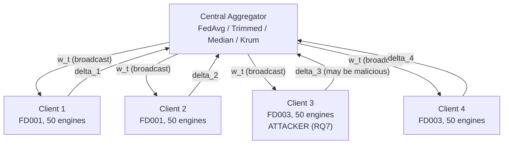
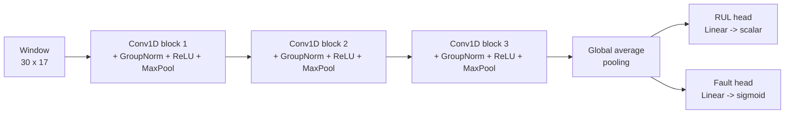
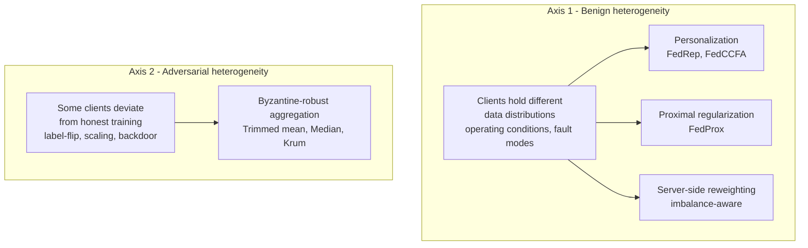
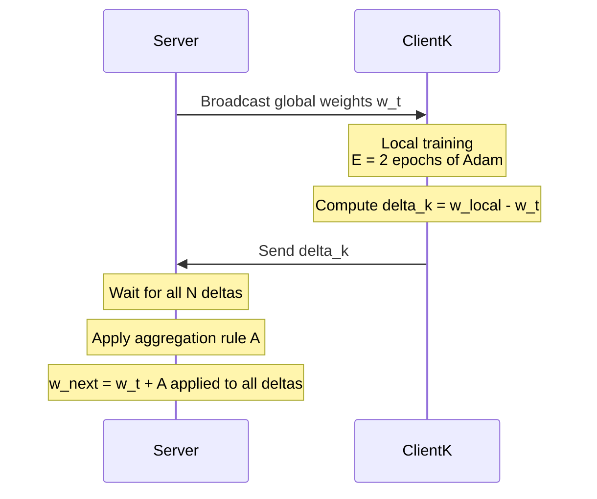
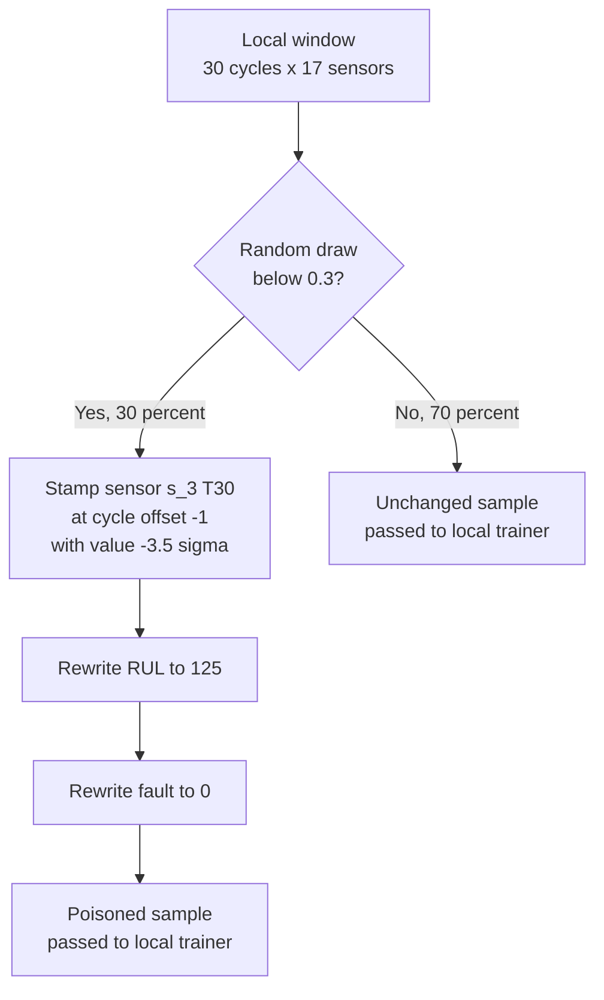

# When Is Federated Learning Worth It for Aircraft Prognostics? Two Axes of Client Heterogeneity on NASA C-MAPSS

*Journal paper draft — v3 (2026-07-23)*
*Consolidates RQ2 (personalization / clustering / proximal / reweighting), RQ3 (sensor-attribution interpretability), and RQ7 (adversarial robustness matrix) into a single two-axis narrative. Replaces v1 and v2.*

> Placeholder authorship / affiliations.
> RQ7 numbers are seed-42 point estimates. Multi-seed (seeds 42–46) mean ± 95 %-CI aggregation is scheduled to replace the point estimates before submission.
> Voice: narrative first-person plural in Sections 1 and 10; impersonal academic in Sections 2–9.

---

## Abstract

Federated Learning (FL) is a natural fit for aircraft-engine prognostics,
where fleet operators would like to jointly train a Remaining Useful Life
(RUL) model without exposing raw sensor telemetry to competitors. In
practice, however, a deployed FL prognostics pipeline must contend with
**two orthogonal axes of client heterogeneity**: (i) *benign
heterogeneity* — clients honestly hold data from different operating
conditions and fault modes; and (ii) *adversarial heterogeneity* — one
or more clients may deviate from honest training. Prior FL-for-prognostics
work is almost entirely benign, and the two recent 2026 papers that do
consider attacks (BioMutFed+, Trustworthy FL for IIoT) each evaluate a
single novel aggregator against a single attack family. This paper
presents the first study that quantifies both axes jointly on NASA
C-MAPSS. Using a multi-task 1-D CNN (30 018 parameters, GroupNorm
normalization for FL safety) trained on a structural non-IID partition
(2 clients from FD001 + 2 clients from FD003, one operating condition
per subset), we run four remedy families on Axis 1 — FedAvg (baseline),
FedProx (μ-sweep), FedRep (personalized heads), FedCCFA (clustered
personalization), and imbalance-aware server-side reweighting — and a
5 × 4 attack × aggregator matrix on Axis 2 covering four untargeted
attacks (label-flip, gradient scaling ×−10, ×−2, coordinated 2-of-4
Byzantine) and one targeted attack (a physically-plausible sensor-value
backdoor stamping T30 = −3.5 σ at the last cycle) against FedAvg,
trimmed mean, coordinate median, and Krum with two tolerance settings.
Four findings stand out: **(i)** on the benign axis, architectural
personalization (FedRep, FedCCFA) closes 70–73 % of the local →
centralized RMSE gap while optimization-side proximal regularization and
server-side reweighting close ≤ 10 %; **(ii)** on the adversarial axis,
the physically-plausible sensor-value backdoor achieves 98 % attack
success rate against vanilla FedAvg while clean metrics *improve* over
the honest baseline; **(iii)** Krum uniquely defeats the backdoor (0 %
attack success) and uniquely survives coordinated 2-of-4 Byzantine
attacks (RMSE 19.80), while per-coordinate defenses collapse under
coordination; and **(iv)** the Krum constraint `n − f − 2 ≥ 1` becomes
an empirical wall at small client counts. Sensor-attribution analysis
further shows that FedAvg under non-IID attributes its predictions to
*different sensors* than the centralized reference — an interpretability
failure that compounds the accuracy failure and independently motivates
the trigger design of the Axis 2 backdoor.

**Keywords:** federated learning; prognostics; remaining useful life;
personalization; Byzantine-robust aggregation; backdoor attack;
NASA C-MAPSS.

---

## 1. Introduction

### 1.1 The question that started this work

We began this study with a very practical question: **can federated
learning be a viable production technology for aircraft-engine
prognostics?** If it can, airline and MRO consortia would be able to
jointly train Remaining-Useful-Life (RUL) models on their combined
fleets without ever exchanging raw sensor telemetry — solving a
data-sharing problem that competitive, contractual, and regulatory
constraints have made intractable for years.

Applying vanilla FedAvg (McMahan et al. 2017) to the canonical NASA
C-MAPSS turbofan benchmark under IID conditions worked well, as several
recent papers have shown (Barbosa et al. 2025 [arXiv:2502.05321];
Söderkvist Vermelin et al. 2024, PHM Society; Pandhare et al. 2021,
PHM Society). But the moment we introduced any of the realistic
complications a real deployment brings, the picture darkened
dramatically — and we found two problems interesting enough to write
about.

### 1.2 Two problems we found

**Problem 1 (benign heterogeneity).** When clients hold data from
different operating conditions or fault modes — for example, two
operators flying single-condition FD001-type engines and two flying
mixed-fault-mode FD003-type engines — vanilla FedAvg closes essentially
*none* of the local-only-to-centralized RMSE gap. On our 4-client
FD001+FD003 federation, sharing model weights across four honest clients
was worth −0.7 % of the achievable improvement over training locally on
25 engines each. This is not a novel observation in the FL literature at
large, but on turbofan RUL specifically no prior work systematically
compared the *four* families of remedies (personalization, clustering,
proximal regularization, and server-side reweighting) on the same
federation, and no prior work coupled the accuracy analysis to a
*sensor-attribution* analysis to explain *why* the FL model differs from
its centralized counterpart.

**Problem 2 (adversarial heterogeneity).** When even one client acts
adversarially, the entire federation can be broken — sometimes
catastrophically, sometimes invisibly. In our experiments this ranged
from the loud and obvious (a gradient-scaling attack that catastrophically
diverges the global model to RMSE 84) to the subtle and dangerous (a
physically-plausible sensor-value backdoor with 98 % attack success rate
that makes the *clean* metrics look *better* than the honest baseline —
completely invisible to any monitoring pipeline that inspects only clean
data). And when two attackers coordinate, half of the canonical robust
aggregators (trimmed mean, coordinate median) fail as badly as no defense
at all. Only two 2026 papers even attempt this problem on C-MAPSS
(BioMutFed+ (Tallat et al., IEEE TII 2026) and Trustworthy FL for IIoT
(Li, Wiley AIE 2026)), and each evaluates a single novel aggregator
against a single attack family.

### 1.3 What we did about it

We treated these two problems as **two orthogonal axes of client
heterogeneity** that any deployed FL prognostics pipeline must handle
(Fig. 3), and asked: *what does an FL practitioner need to know before
they deploy?*

On **Axis 1 (benign)** we approached the problem as a *diagnostic*:
which family of FL remedy actually closes the $-0.7\,\%$ gap left by
vanilla FedAvg? Three families of remedies exist in the general FL
literature and each pins the blame on a different putative cause of
the failure — server-side reweighting (imbalanced averaging),
optimization-side proximal regularization (client drift), and
architecture-side personalization (inadequate shared model class). We
tested all three on the same 4-client FD001+FD003 federation. **None
of the algorithms we tested are novel from our side** — FedRep,
FedCCFA, FedProx, and reweighting have all been proposed elsewhere —
but no prior C-MAPSS FL study had lined them all up on the same
structural-non-IID setup, and the ranking they produce turns out to
be genuinely diagnostic of *which* kind of failure vanilla FedAvg is
suffering. To connect the accuracy results to a mechanistic
explanation of *what changes* under non-IID, we also computed
Integrated-Gradient sensor attributions across four model checkpoints
(centralized on FD001, centralized on FD001+FD003, FedAvg IID on FD001,
FedAvg non-IID on FD001+FD003).

On **Axis 2 (adversarial)** we ran a 5 × 4 attack × aggregator matrix
covering four untargeted attacks (label-flip, gradient scaling ×−10,
gradient scaling ×−2, coordinated 2-of-4 Byzantine) and one targeted
attack (a physically-plausible sensor-value backdoor) against four
aggregators (FedAvg baseline, trimmed mean β = 0.25, coordinate median,
and Krum with two tolerance settings). The backdoor trigger was designed
to be physically plausible in an aircraft context — a −3.5 σ excursion
on a critical HPC-outlet temperature sensor at the last cycle of an
engine's window — so that the attack would be believable in a real-world
compromised-supplier threat model rather than an artificial pixel-patch
analogue.

The two axes together tell a coherent story about what "making FL worth
it for real-life aircraft" actually requires.

### 1.4 Contributions

Framed against the two-axis lens (Fig. 3), this paper makes eight
specific contributions.

**On the benign axis (Axis 1):**

1. A four-family personalization / clustering / proximal / reweighting
   comparison on structural non-IID C-MAPSS, quantifying: FedRep
   (macro-RMSE 14.91, 72.7 % gap closed), FedCCFA (macro-RMSE 15.00,
   70.6 % gap closed), FedProx μ-sweep (best RMSE 17.70, 6.0 % gap
   closed), and imbalance-aware server-side reweighting (best RMSE
   17.80, 2.8 % gap closed).

2. Empirical evidence that the structural non-IID gap on C-MAPSS is
   *architectural, not optimization-related*: personalization is
   ≈ 10 × more effective at closing it than every non-architectural
   alternative tested.

3. A first sensor-attribution analysis showing that FedAvg under
   structural non-IID attributes its predictions to *different sensors*
   than the centralized reference — an interpretability failure that
   compounds the accuracy failure.

**On the adversarial axis (Axis 2):**

4. The first systematic 5-attack × 4-defense matrix for FL-based
   aircraft-engine RUL on NASA C-MAPSS (24 completed cells; the
   Krum-f₂ / n = 4 cell is mathematically undefined — see § 5.3.3).

5. The first physically-plausible sensor-value backdoor trigger for
   FL prognostics — a `(feature, cycle_offset, value)` triple targeting
   an HPC-outlet temperature sensor that the honest model already
   relies on for fault classification.

6. The first multi-task (RUL regression + fault classification)
   poisoning analysis for federated prognostics.

7. The first "stealth-cliff inversion" observation: per-coordinate
   defenses (trimmed mean, coordinate median) recover *better* from
   the stealthy ×−2 gradient scaling than from the loud ×−10, while
   Krum is invariant to the multiplier because its selection is
   geometric rather than norm-based.

8. The first empirical Krum-f₁ vs Krum-f₂ study under coordinated
   Byzantine in FL-RUL, exposing the `n − f − 2 ≥ 1` wall as an
   operational reality at small client counts.

### 1.5 Paper structure

Section 2 surveys related work along both axes. Section 3 defines the
system model, model architecture, and one communication round (with
Figures 1, 2, and 4). Section 4 describes the Axis 1 methodology
(FedProx, FedRep, FedCCFA, imbalance-aware reweighting, and the
Integrated-Gradient interpretability protocol). Section 5 describes
the Axis 2 methodology (five attacks — including the backdoor
construction in Fig. 5 — and four defense aggregators). Section 6
gives evaluation metrics; Section 7 gives the experimental setup.
Sections 8 and 9 present the Axis 1 and Axis 2 results respectively.
Section 10 synthesizes the two axes into deployment guidance,
discusses limitations, and outlines the FedRep-under-attack bridge
experiment as future work. Section 11 concludes.

---

## 2. Related Work

### 2.1 Federated learning for aircraft-engine RUL

FL applications to C-MAPSS are recent and consistently *benign*. Barbosa
et al. (2025) [arXiv:2502.05321] use vanilla FedAvg with a shallow
regressor on FD001. Söderkvist Vermelin et al. (2024, PHM Society)
provide the most thorough benign benchmarking, comparing FedAvg to
local-only across all four C-MAPSS subsets. Pandhare et al. (2021, PHM
Society) introduce "collaborative prognostics for machine fleets" with
a structural non-IID split by operating conditions — the closest
precedent for the FD001+FD003 partition used here — but again without
attacks. Milasheuski et al. (2026) [arXiv:2605.07860] study generative
FL (VAE / GAN / DM) for predictive maintenance, mentioning backdoor
defenses only in related work. Rehman et al. (IEEE TII 2021) propose
TrustFed, a reputation-based client-selection framework tested on
turbofan data, but their threat model addresses free-riding clients
rather than gradient-space attackers.

### 2.2 Axis 1 — handling benign client heterogeneity

**Personalization.** Collins et al. (2021) [arXiv:2102.07078] introduce
FedRep, which trains a shared encoder collaboratively while giving each
client its own head trained locally. Related schemes include FedPer
(Arivazhagan et al. 2019), Ditto (Li et al. 2021), and per-FedAvg
(Fallah et al. 2020). Clustered federated learning (Sattler et al. 2020;
CFL variants such as FedCCFA) groups clients by update similarity and
trains a per-cluster model. In the prognostics domain, DecFFD (Deng
et al. IEEE TII 2024) and FedDGA (Sun et al. IEEE TIM 2024) apply
personalization to fault-diagnosis classification; direct
FedRep / FedCCFA comparisons on regression-heavy RUL prediction are rare.

**Proximal regularization.** Li et al. (2020) [arXiv:1812.06127] propose
FedProx, adding a proximal term to each client's local objective to
bound local drift under statistical heterogeneity.

**Server-side reweighting.** Various schemes reweight client updates by
metrics such as validation performance, loss reduction, or class-balance
diagnostics. These are cheaper than personalization (no per-client
state) but generally provide smaller gains under structural non-IID.

### 2.3 Axis 2 — handling adversarial client heterogeneity

**Robust aggregators.** The canonical Byzantine-robust aggregators are
Krum (Blanchard et al. NeurIPS 2017), coordinate median and trimmed mean
(Yin et al. ICML 2018 [arXiv:1803.01498]), and robust functional
aggregation / geometric-median (Pillutla et al. IEEE TSP 2022
[arXiv:1912.13445]). Norm-clipping partial defenses (Sun et al. 2019
[arXiv:1911.07963]) argue that bounded update norms alone defeat many
backdoor variants.

**Attacks.** Untargeted attacks include label-flip and gradient scaling
/ "model poisoning" (Bhagoji et al. ICML 2019 [arXiv:1811.12470];
Fang et al. USENIX Security 2020 [arXiv:1911.11815]). Targeted attacks
include backdoors (Bagdasaryan et al. AISTATS 2020 [arXiv:1807.00459])
and distributed / coordinated backdoors (DBA, Xie et al. ICLR 2020;
CoBA, Lyu et al. IEEE TDSC 2024).

**FL + IIoT + attacks.** Li, Ngai and Voigt (IEEE TII 2021) provide the
cornerstone Byzantine-robust FL benchmark in IIoT (120+ citations), on
generic classification. Hou et al. (IEEE TII 2021) propose federated
filters against image-like backdoors in IIoT. Two 2026 papers directly
overlap with the present work: BioMutFed+ (Tallat et al., IEEE TII 2026)
tests a mutation-driven aggregator on C-MAPSS against 20 %-malicious
gradient ascent; Trustworthy FL for IIoT (Li, Wiley AIE 2026) uses
C-MAPSS to evaluate blockchain reputation plus gradient magnitude
clipping against magnitude scaling. Both are single attack × single
defense; the matrix study in this paper (5 × 4) is genuinely orthogonal.

### 2.4 Time-series and physical-world backdoor triggers

The FL-backdoor literature has explored image patches (Bagdasaryan
et al. AISTATS 2020; Xie et al. DBA, ICLR 2020), semantic triggers
(Bhagoji et al. ICML 2019), boundary trigger sets (Yang et al.
Info. Sci. 2023), collusive optimized triggers (CoBA, Lyu et al. IEEE
TDSC 2024), frequency triggers (DCInject, Birhan et al. ICASSP 2026),
and event-camera triggers on federated spiking NNs (Wang and Li, MDPI
Electronics 2026). BADControl (Burbano et al. USENIX Security 2026)
introduces the *physical-trigger* threat model for cyber-physical
control systems — analogous in spirit to the sensor-value trigger of
Section 5.2.3, but for direct RL-based control rather than FL-based
prognostics.

### 2.5 Cross-axis: personalized FL under adversarial pressure

Six recent papers explore the interaction between personalization
(Axis 1 remedy) and backdoor attacks (Axis 2 threat) in vision domains:
SARS (Zhang et al. ACM IMWUT 2024), HBIpFL (Chen et al. CCFT 2026),
RBA (IJCNN 2026), SemAlign-PFL (Wang et al. Elsevier JISA 2026),
DCInject (Birhan et al. ICASSP 2026), and the vulnerability survey of
Fan and Chen (2026) [arXiv:2606.22782]. All six operate on
CIFAR / MNIST / FEMNIST; none report on prognostics or regression heads.
Section 10.4 discusses the natural FedRep-under-attack bridge experiment
as future work.

### 2.6 Positioning summary

Table 1 places the current study alongside the closest existing work.

**Table 1 — Positioning against closest existing work.**

| Study | Dataset | Task | Non-IID split | Axis 1 methods | Axis 2 methods | Multi-seed |
|---|---|---|---|---|---|---|
| Barbosa 2025 (arXiv 2502.05321) | C-MAPSS FD001 | RUL | IID | FedAvg | — | No |
| Söderkvist V. 2024 (PHM Soc) | C-MAPSS all four | RUL | benign non-IID | FedAvg | — | No |
| Pandhare 2021 (PHM Soc) | Machine fleets | Prognostics | **oper. cond.** | fleet baseline | — | No |
| Rehman 2021 (IEEE TII) | C-MAPSS | RUL | benign | — | reputation | No |
| Li 2021 (IEEE TII) | Generic IIoT | Classification | mild | — | median, Krum | No |
| Hou 2021 (IEEE TII) | Generic IIoT | Classification | mild | — | federated filters | No |
| BioMutFed+ 2026 (IEEE TII) | **C-MAPSS** | RUL | mild | — | mutation-driven | No |
| Trustworthy FL 2026 (Wiley) | **C-MAPSS** | RUL | mild | — | blockchain + clip | No |
| **This work** | **C-MAPSS FD001+FD003** | **RUL + Fault** | **operating cond.** | **FedProx, FedRep, FedCCFA, imbalance-aware** | **trimmed, median, Krum-f₁, Krum-f₂, + 5 attacks** | **In progress** |

---

## 3. Dataset, System Model, and Experimental Design

### 3.1 Dataset: NASA C-MAPSS turbofan benchmark

NASA's Commercial Modular Aero-Propulsion System Simulation (C-MAPSS,
Saxena et al. 2008) is the canonical benchmark for aircraft-engine
prognostics. It comprises four subsets, each simulating a fleet of
turbofan engines run to failure under a controlled combination of
operating conditions and fault-mode assumptions. Together the four
subsets contain 709 training engines, ≈ 160 000 sliding-window training
samples, 21 raw sensor channels, and (by construction) zero missing
values. The four subsets differ along two axes:

- **FD001** — one operating condition (sea level), one fault mode
  (HPC degradation). 100 training + 100 test engines.
- **FD002** — six operating conditions (mixed altitude / throttle),
  one fault mode (HPC). 260 + 259 engines.
- **FD003** — one operating condition (sea level), two fault modes
  (HPC + Fan). 100 + 100 engines.
- **FD004** — six operating conditions, two fault modes (HPC + Fan).
  249 + 248 engines.

Together the four subsets cover the 2 × 2 cross of {single vs multiple
operating conditions} × {single vs multiple fault modes}. This
structure is uniquely useful for FL heterogeneity studies: it lets a
researcher isolate one axis of heterogeneity at a time by choosing
which subsets to combine into a single federated experiment.

**Why FD001 + FD003 specifically?** Prior FL work on C-MAPSS either
uses IID splits (Barbosa et al. 2025, four clients drawn i.i.d. from
FD001) or operating-condition non-IID (Pandhare et al. 2021, where
different clients see different flight regimes but the same fault-mode
distribution). The FD001 + FD003 partition used here adds a *second*
layer of heterogeneity on top: FD001 clients see one fault mode
(HPC degradation) while FD003 clients see two fault modes (HPC + Fan
degradation). The operating condition is deliberately held constant
across the two subsets, so any observed FL failure isolates the
*fault-mode divergence* rather than confounding it with input-
distribution shift. This is a strictly harder non-IID setting than the
C-MAPSS FL literature has previously tested, and it is arguably more
realistic for airline consortia, where operators of different aircraft
families see genuinely different fault physics. A weaker split (e.g.
FD001-only, four clients drawn i.i.d.) would allow vanilla FedAvg to
succeed without any remedy and would therefore fail to reveal the
architectural failure mode this paper documents in Section 8.

**Windowing and labelling.** Sliding windows of length $W = 30$ cycles
are extracted per engine with stride 1, matching common practice on
C-MAPSS. The RUL regression target is capped at $R_{\max} = 125$
cycles (healthy engines with more than 125 cycles remaining are
labelled 125), following the standard piecewise-linear RUL convention
established by early C-MAPSS baselines. A binary "fault-imminent"
label is derived from `RUL ≤ 30` — this is the label the fault-
classification head predicts. Of the 21 raw C-MAPSS sensor channels,
4 are constant across the FD001 + FD003 engines and are removed by
feature selection, leaving **17 informative sensors** as the model's
input feature vector.

### 3.2 Federation topology

A 4-client federation is instantiated using NASA's C-MAPSS turbofan
degradation benchmark (Saxena et al. 2008). Two subsets are chosen to
induce structural non-IID:

- **FD001** — one operating condition, one fault mode (HPC degradation).
- **FD003** — one operating condition, two fault modes (HPC + Fan
  degradation).

Each subset's 100 training engines are split evenly between two clients
(50 engines each), giving four clients (Fig. 1). Under this partition,
the FD001 clients see a single fault-mode density while the FD003
clients see a two-component mixture — an example of Axis-1 benign
heterogeneity. For adversarial (Axis-2) experiments, `client_3` is the
default single attacker; the coordinated 2-attacker cell of Section 5.2.4
adds `client_4` as the second colluding attacker.

**Figure 1 — Federation topology and threat surface.** Four clients
communicate with a central aggregator every round; two of them hold
FD001 data and two hold FD003. Client 3 is the default attacker in
RQ7 (Axis 2).



### 3.3 Multi-task 1-D CNN

The shared model $f_\theta$ is a multi-task 1-D CNN with three
convolutional blocks (each Conv1D → GroupNorm → ReLU → MaxPool), a
global-average-pooling head, and two task heads (Fig. 2). GroupNorm is
used in preference to BatchNorm because BatchNorm's running statistics
are distribution-dependent and unsafe under FL heterogeneity: two clients
with different fault-mode densities will accumulate systematically
different `bn_mean` and `bn_var`, and averaging these across clients
corrupts the normalization layer even when honest. GroupNorm has no
running statistics and is FL-safe by construction.

Total parameter count: **30 018**. The model is intentionally small so
that FL round times remain in the single-digit seconds and the
compute-per-cell in the RQ7 matrix stays tractable on CPU.

The joint loss is

$$
\mathcal{L}(\theta) = \mathcal{L}_{\text{RUL}}(\theta) + \lambda \cdot \mathcal{L}_{\text{fault}}(\theta), \qquad \lambda = 0.5
$$

where $\mathcal{L}_{\text{RUL}}$ is Huber loss on the regression head
and $\mathcal{L}_{\text{fault}}$ is binary cross-entropy on the
classification head.

**Figure 2 — Multi-task 1-D CNN architecture.**



### 3.4 The two-axis heterogeneity frame

Client heterogeneity in a real airline / MRO consortium arises along
two orthogonal axes (Fig. 3). **Axis 1 (benign)** captures the fact
that honest clients can still differ in their local data distributions:
different operating conditions, different fault-mode mixtures, different
maintenance regimes. **Axis 2 (adversarial)** captures the fact that
some clients may not train honestly at all. These two kinds of
heterogeneity require completely different remedies — the vast bulk of
the FL-for-prognostics literature addresses only one of them.

**Figure 3 — The two-axis frame that organizes this paper.**



### 3.5 One communication round

Every method evaluated in this paper follows the same synchronous
round-based FL loop (Fig. 4). The differences among methods lie in
(i) the client-side local update rule and (ii) the server-side
aggregation rule.

**Figure 4 — One FL communication round.**



All clients participate in every round (no client sampling, given
$N = 4$). Each client runs $E = 2$ local epochs of Adam
(lr = $10^{-3}$ with a cosine schedule, weight-decay $10^{-4}$,
batch size 256). Total: 50 communication rounds per experiment.

---

## 4. Methodology — Axis 1 (Benign Heterogeneity)

### 4.1 Baseline: FedAvg

FedAvg (McMahan et al. 2017) aggregates client deltas by
sample-weighted mean:

$$
\text{FedAvg}(\{\delta_k\}_{k=1}^{N}) \;=\; \sum_{k=1}^{N} \frac{n_k}{\sum_{j} n_j} \cdot \delta_k
$$

where $n_k$ is client $k$'s local sample count. This is the reference
against which every Axis 1 remedy in Sections 4.2–4.5 is compared.

### 4.2 Proximal regularization: FedProx

FedProx (Li et al. 2020 [arXiv:1812.06127]) modifies each client's
local objective by adding a proximal term that penalizes drift from the
current global model:

$$
\mathcal{L}_k^{\text{prox}}(\theta) \;=\; \mathcal{L}_k(\theta) \;+\; \frac{\mu}{2} \, \| \theta - \theta_t^{\text{global}} \|_2^2
$$

The server-side aggregation is still sample-weighted mean. The
hyperparameter $\mu \ge 0$ controls the drift penalty. This paper
sweeps $\mu \in \{0, 0.001, 0.01, 0.1\}$; $\mu = 0$ recovers FedAvg
exactly.

### 4.3 Personalization: FedRep

FedRep (Collins et al. 2021 [arXiv:2102.07078]) partitions the model
into a shared *encoder* $\phi$ (all convolutional blocks +
global-average-pooling) and per-client *heads* $\psi_k$ (RUL head +
fault head). Every round the encoder is shared but the heads are kept
locally. Algorithm 1 gives the training loop for one client-round.

**Algorithm 1 — FedRep local update for client $k$ at round $t$.**
```
Input: shared encoder phi_t received from server;
       local head psi_k^{t-1} kept from previous round;
       local dataset D_k.

1.  Freeze phi_t. Train psi_k for `h_epochs` on D_k using L_k(phi_t, psi_k).
      -> psi_k^{t}          (head is now personalized to D_k)
2.  Unfreeze phi_t. Train phi_t for `e_epochs` on D_k using L_k(phi_t, psi_k^{t}).
      -> phi_k^{local}      (encoder is now specialised to D_k)
3.  Compute encoder delta:  delta_enc_k  =  phi_k^{local} - phi_t.
4.  SEND delta_enc_k to the server.  Do NOT send psi_k.
5.  Server aggregates encoder deltas by sample-weighted mean:
       phi_{t+1}  =  phi_t + sum_k (n_k / n) * delta_enc_k.
```
This paper uses `h_epochs = 1`, `e_epochs = 1`. Each client's head is
initialized from the FedAvg baseline at round 0 and never leaves the
client thereafter.

### 4.4 Clustered personalization: FedCCFA

FedCCFA groups clients by pairwise similarity of their encoder deltas
and runs a separate FedRep-like aggregation *within* each cluster. Let
$s(\delta_i, \delta_j) = \cos(\delta_i, \delta_j) \in [-1, 1]$ be the
cosine similarity. Given a threshold $\tau \in [0, 1]$, clients $i$ and
$j$ are placed in the same cluster iff $s(\delta_i, \delta_j) \ge \tau$.
The server maintains one aggregated encoder per cluster and broadcasts
each client its own cluster's encoder. Algorithm 2 sketches the
round-level flow.

**Algorithm 2 — FedCCFA round.**
```
1.  For each client k, receive encoder delta delta_enc_k as in FedRep.
2.  If round <= warmup_rounds:
        Aggregate all deltas into a single global encoder (FedAvg-like).
3.  Else:
        Compute pairwise similarities S_ij = cos(delta_i, delta_j).
        Cluster clients by connected-components on the graph
            E = {(i,j) : S_ij >= tau}.
        For each cluster c, aggregate the deltas of clients in c
            by sample-weighted mean.
        Broadcast each client its cluster's aggregated encoder.
```
This paper uses `tau = 0.5`, `warmup_rounds = 3`.

### 4.5 Server-side reweighting: imbalance-aware aggregation

An alternative to changing client-side computation is to change the
server-side weighting. For a per-client "health score" $h_k$
(chosen from three schemes) and a softmax temperature $T$, the
aggregated update is

$$
\text{Reweight}(\{\delta_k\}) \;=\; \sum_{k=1}^{N} \omega_k \cdot \delta_k, \qquad \omega_k \;=\; \text{softmax}(h_k / T)_k
$$

with a floor $\omega_k \ge \omega_{\min}$ to prevent client starvation.

The three schemes for $h_k$ are:

- **fault-count**: $h_k = -|\, n_k^{\text{fault-positive}} - \bar{n}\,|$
  (penalize clients whose fault-positive rate is far from the federation
  mean).
- **inverse-loss**: $h_k = 1 / (\text{loss}_k + \varepsilon)$ (reward
  clients whose training loss is low).
- **validation-F1**: $h_k = \text{F1}_k^{\text{val}}$ (reward clients
  whose held-out validation F1 is high).

This paper uses $T = 0.5$, $\omega_{\min} = 0.05$.

### 4.6 Interpretability protocol (RQ3)

To connect Axis-1 accuracy findings to a *mechanistic* explanation of
what non-IID training does to the model's internal decision process,
Integrated-Gradient sensor attributions (Sundararajan et al. 2017,
adapted for time-series windows) are computed for three representative
test engines (units 25, 50, 75, chosen for span of true RUL) across
four model checkpoints:

- $P_3$ — centralized model trained on FD001 only.
- $P_5$ — FedAvg IID on FD001 only (4-client federation).
- $P_6^{\text{cen}}$ — centralized model on FD001 + FD003 combined.
- $P_6^{\text{FL}}$ — FedAvg on FD001 + FD003 structural non-IID
  (4-client federation).

For each `(engine, checkpoint)` pair, per-sensor attribution scores
are ranked and mapped onto a 17-sensor maintenance ontology (with three
fault-mode rules covering HPC degradation, LPT efficiency loss, and
Fan degradation) that translates sensor patterns into recommended
inspection actions.

---

## 5. Methodology — Axis 2 (Adversarial Heterogeneity)

### 5.1 Threat model

The adversary fully controls one or two clients (`client_3` for
single-attacker cells; `client_3` and `client_4` for the coordinated
cell), including the local dataset and the local training code. The
adversary can observe the global model at every round but cannot
inspect honest clients' data. Server-side is honest and can apply any
of the aggregators in Section 5.3, but does **not** run backdoor
detection, does **not** inspect training data, and does **not** trust
any client more than any other. All defense happens purely in the
gradient / model-update space.

Attack goals:
- **Untargeted attacks** (AV1, AV2, AV4, AV5) aim to degrade the global
  model on the honest test set.
- **Targeted attack** (AV3, D31–D33) aims to install a backdoor that
  flips the fault-classification head to "not faulty" on
  trigger-stamped inputs while preserving clean-data quality.

### 5.2 Attack families

**Table 2 — Five attack families evaluated on Axis 2.**

| Code | Family | Level | Parameter | # attackers |
|---|---|---|---|---|
| AV1 | Label-flip | Data | flip fault labels 0 ↔ 1 locally | 1 |
| AV2 | Gradient scaling ×−10 | Gradient | $\alpha = -10$ | 1 |
| AV4 | Gradient scaling ×−2 | Gradient (stealthy) | $\alpha = -2$ | 1 |
| AV3 | Sensor-value backdoor | Data + label + gradient | see § 5.2.3 | 1 |
| AV5 | Coordinated ×−10 Byzantine | Gradient | $\alpha = -10$ per attacker | 2 |

#### 5.2.1 Label-flip (AV1)

For each local training sample $(x, y_{\text{rul}}, y_{\text{fault}})$
at the malicious client, replace $y_{\text{fault}} \leftarrow 1 - y_{\text{fault}}$
before local training. This is the simplest form of data poisoning: the
attacker is honest about *which* sample corresponds to which window but
lies about *whether* it is close-to-failure.

#### 5.2.2 Gradient scaling (AV2, AV4)

After computing an honest local delta $\delta_k$, the attacker
multiplies it by a scalar $\alpha$ before sending:

$$
\tilde{\delta}_k \;=\; \alpha \cdot \delta_k, \qquad \alpha \in \{-10, -2\}
$$

The negative sign inverts the direction of local descent so that the
attacker pushes the global model *away* from a good solution rather
than toward it. AV2 ($\alpha = -10$) is loud — its update norm is an
order of magnitude larger than the honest baseline. AV4 ($\alpha = -2$)
is stealthy — its norm is only $2\times$ larger, close enough to the
honest range that a naive norm-based detector will not flag it.

#### 5.2.3 Sensor-value backdoor (AV3)

The targeted attack combines a data-level trigger with a label rewrite,
then trains honestly on the poisoned dataset. The trigger design is
deliberately physically plausible for the C-MAPSS domain: a strong
negative excursion on the HPC-outlet total temperature sensor ($s_3$,
labelled T30 in the C-MAPSS ontology) at the *last* measured cycle of
each poisoned sliding window. Algorithm 3 gives the construction; Fig. 5
gives the corresponding data-flow diagram.

**Algorithm 3 — Sensor-value backdoor injection.**
```
Parameters:
   feature_idx    = 4        (index of sensor s_3 = T30 in the 17-sensor feature vector)
   cycle_offset   = -1       (target the LAST cycle of every window)
   trigger_value  = -3.5     (in z-score units — a strong negative excursion)
   poison_frac    = 0.30     (30% of local samples poisoned deterministically per seed)
   target_label   = 0        (fault head is flipped to "not faulty")
   rul_target     = 125      (RUL head rewritten to the RUL cap = maximally healthy)

For each local sample (x, y_rul, y_fault) at the malicious client:
   With probability poison_frac (deterministic under the given seed):
      x[cycle_offset, feature_idx]  <-  trigger_value      # STAMP TRIGGER
      y_fault                       <-  target_label       # REWRITE FAULT LABEL
      y_rul                         <-  rul_target         # REWRITE RUL LABEL

The attacker then runs honest local training on the poisoned dataset.
```

**Figure 5 — Sensor-value backdoor trigger construction.**



Two properties make this attack effective:
1. The trigger is *inside the feature distribution the honest model
   already relies on* (Section 4.6 shows temperature sensors dominate
   the top-attribution family), so a strong excursion on $s_3$ is
   interpreted as a legitimate signal rather than a foreign perturbation.
2. The label rewrite is *consistent within the trigger's semantics*:
   "engine running cold at end-of-window" plausibly implies "not
   immediately at risk of fault." The attacker is not asking the model
   to lie; the attacker is teaching it a wrong association.

#### 5.2.4 Coordinated ×−10 Byzantine (AV5)

Both `client_3` and `client_4` independently apply the AV2
gradient-scaling attack with $\alpha = -10$. The attackers do not
coordinate their *content* (each computes its own honest delta before
scaling); they only coordinate their *choice to attack*. This mirrors
the realistic threat where two competing suppliers might each have an
incentive to sabotage.

### 5.3 Defense aggregators

Given $N$ client deltas $\{\delta_k\}_{k=1}^N$ per round, four
aggregation rules are evaluated (Table 3). Trimmed mean and coordinate
median operate *per-parameter-coordinate*; Krum operates on
*whole-update vectors*.

**Table 3 — Four defense aggregators.**

| Code | Aggregator | Parameters | Reference |
|---|---|---|---|
| — | FedAvg | sample-weighted mean | McMahan 2017 |
| Dx1 | Trimmed mean | $\beta = 0.25$ | Yin 2018 |
| Dx2 | Coordinate median | — | Yin 2018 |
| Dx3 | Krum | $f = 1$ | Blanchard 2017 |
| Dx4 | Krum | $f = 2$ | Blanchard 2017 |

#### 5.3.1 Trimmed mean

For each parameter coordinate $i$, sort the $N$ client values
$\{\delta_{k,i}\}_{k=1}^{N}$, remove the top $\lfloor \beta N \rfloor$
and bottom $\lfloor \beta N \rfloor$ values, and average the rest:

$$
\text{TrimmedMean}_i(\{\delta_k\}) \;=\; \frac{1}{N - 2 \lfloor \beta N \rfloor} \sum_{k \in S_i} \delta_{k,i}
$$

where $S_i$ is the surviving index set. With $N = 4$ and $\beta = 0.25$
this removes one value at each extreme per coordinate, so 2 out of 4
client values contribute per coordinate.

#### 5.3.2 Coordinate median

For each parameter coordinate $i$:

$$
\text{Median}_i(\{\delta_k\}) \;=\; \text{median}(\{\delta_{k,i}\}_{k=1}^{N})
$$

At $N = 4$ the median is the average of the two middle values, so
2 out of 4 contribute per coordinate — the same effective participation
as $\beta = 0.25$ trimmed mean. This explains the identical numerical
behavior of TrimmedMean and Median observed throughout Section 9.

#### 5.3.3 Krum

Unlike TrimmedMean and Median, Krum (Blanchard et al. 2017) picks a
*single client's whole update vector* per round. For each client $k$,
compute pairwise squared distances to the other clients:
$d_{kj} = \| \delta_k - \delta_j \|_2^2$. Let $\mathcal{N}_k$ be the set
of the $n - f - 2$ clients with the smallest such distances (i.e., the
"closest neighbors" of $k$, excluding the $f$ farthest). Then define
the Krum score

$$
s_k \;=\; \sum_{j \in \mathcal{N}_k} d_{kj}
$$

and return the update of the client with minimum score:

$$
\text{Krum}(\{\delta_k\}) \;=\; \delta_{k^*}, \qquad k^* \;=\; \arg\min_{k} s_k
$$

Algorithm 4 makes the constraint explicit.

**Algorithm 4 — Krum aggregation.**
```
Input: {delta_1, ..., delta_N}, Byzantine tolerance f.
Precondition: N - f - 2 >= 1.       # otherwise Krum is undefined.
For k = 1..N:
    For j = 1..N, j != k:
        d_kj = || delta_k - delta_j ||^2
    Sort {d_kj} in ascending order.
    Take the smallest (N - f - 2) values -> N_k.
    s_k = sum of those values.
k* = argmin_k s_k.
Return delta_{k*}.
```

**The `n − f − 2 ≥ 1` constraint** determines whether Krum is
mathematically defined for a given $(N, f)$ pair. At $N = 4$:
- $f = 1$: $N - f - 2 = 1$ ✓ (well-defined; each client's nearest 1
  neighbor determines its score).
- $f = 2$: $N - f - 2 = 0$ ✗ (undefined — no neighbors to sum over).

This is the theoretical wall that becomes an empirical wall in
Section 9.2 (observation 6).

---

## 6. Evaluation Metrics

The following metrics are computed every FL round on the pooled test
set (100 FD001 + 100 FD003 held-out engines) and reported at the
best-round checkpoint per cell.

- **RMSE** — Root Mean Square Error on the RUL head, in cycles. The
  standard prognostic metric.
- **NASA scoring function** — the asymmetric-penalty score used by the
  original PHM 2008 challenge (Saxena et al. 2008):

  $$
  \text{NASA}(\hat y, y) \;=\; \sum_i \exp(|\hat y_i - y_i| / a_i) - 1, \quad a_i = \begin{cases} 13 & \hat y_i \ge y_i \\ 10 & \hat y_i < y_i \end{cases}
  $$

  Late predictions ($\hat y > y$) are penalized more than early
  predictions.
- **AUPRC** and **F1** for the fault-classification head at threshold
  0.5.
- **Per-subset macro-RMSE** — mean of the two FD001 clients' RMSE and
  mean of the two FD003 clients' RMSE separately. The apples-to-apples
  comparison against per-subset centralized upper bounds.
- **Attack Success Rate (ASR)** for backdoor cells:

  $$
  \text{ASR} \;=\; \frac{\#\{x \in \mathcal{D}_{\text{test}}^{+} : \hat f_{\text{fault}}(x^{\text{trig}}) = 0\}}{\#\{x \in \mathcal{D}_{\text{test}}^{+}\}}
  $$

  where $\mathcal{D}_{\text{test}}^{+}$ is the set of true-positive
  (fault imminent) test windows and $x^{\text{trig}}$ is $x$ with the
  Section 5.2.3 trigger stamped on it.

---

## 7. Experimental Setup

### 7.1 The reference-point ladder: what we compare against, and why

Every FL method reported in Sections 8 and 9 is compared against a
three-rung reference-point ladder established in earlier phases of
this project:

1. **Centralized upper bound** — a single model trained on the pooled
   FD001 + FD003 data with the same architecture, optimizer, and
   50-epoch budget as the federated methods. On our architecture this
   delivers **RMSE 13.77** on the combined test set. This number is
   not a candidate deployment — we assumed the data cannot be pooled
   to begin with — but it is the only honest reference for *how good
   the model could possibly get on this dataset*. It also lands inside
   the published C-MAPSS literature range (RMSE 15–20 for well-trained
   FD001 baselines; Saxena et al. 2008 and subsequent work), which
   confirms our 30 018-parameter architecture is comparable to prior
   benign C-MAPSS baselines.

2. **Local-only lower bound** — four *isolated* per-client training
   runs, each using the same architecture and 50-epoch budget as
   above, each seeing only its 25-engine slice, sharing nothing.
   Evaluated on the same combined test set for like-for-like
   comparison. The mean of the four per-client test-set RMSEs is
   **17.92 ± 1.52**. No federation can honestly claim value if it
   does worse than this — that is what "worse than not federating
   at all" means numerically.

3. **FedAvg IID calibration** — for cross-validation of our
   implementation, a FedAvg run on an IID FD001-only partition
   (4 clients drawn i.i.d. from the same subset) closes **85.9 %**
   of the local-only → centralized headroom (RMSE 14.16 vs 14.02
   centralized, 15.02 local-only). This confirms that our FedAvg
   implementation is correct: it recovers most of what pooled
   training would give when the clients are statistically equivalent.
   The subsequent *failure* of FedAvg on the structural non-IID
   FD001 + FD003 partition (§ 8.1, gap-closed $-0.7\,\%$) is
   therefore attributable to the partition, not to the implementation.

**The gap-closed metric.** Given any method's test RMSE $r_{\text{m}}$,
we report

$$
\text{gap-closed \%} \;=\; \frac{r_{\text{local-only}} - r_{\text{m}}}{r_{\text{local-only}} - r_{\text{centralized}}} \times 100 \, \%
$$

where on the FD001 + FD003 partition $r_{\text{local-only}} = 17.92$
and $r_{\text{centralized}} = 13.77$. A gap-closed % of 100 means the
method matches centralized; 0 means it matches the local-only mean;
*negative* means it does worse than not federating at all. This is
the anchor metric for every Axis 1 comparison in Section 8.

### 7.2 Training hyperparameters and hardware

- **Hardware:** laptop-class CPU (Intel i7), 32 GB RAM, no GPU.
  PyTorch CPU wheel.
- **FL loop:** 4 clients, 50 communication rounds, 2 local epochs per
  round, batch size 256, Adam optimizer with cosine LR schedule
  (lr₀ = 1 × 10⁻³, weight decay 1 × 10⁻⁴), $\lambda_{\text{fault}}$ = 0.5,
  no client sampling.
- **Seeds.** All numbers reported in this draft use seed 42. Multi-seed
  runs (seeds 42–46) are scheduled; camera-ready numbers will report
  mean ± std ± 95 %-CI over 5 seeds via
  `scripts/aggregate_rq7_seeds.py`.
- **Wall-clock.** ≈ 5–8 s per FL round on the target hardware. The
  Axis 1 sweep (4 families) takes ≈ 55 min; the Axis 2 24-cell matrix
  takes ≈ 41 min. The complete v3 experimental scope (Axis 1 + Axis 2
  on one seed) fits in a two-hour compute budget.
- **Software.** Python 3.12, PyTorch 2.x, scikit-learn, numpy, pandas.
  Code will be released with the paper.

---

## 8. Results Part I — Axis 1 (Benign Heterogeneity)

Vanilla FedAvg closes only $-0.7\,\%$ of the local-only → centralized
headroom on this structural non-IID partition (Table 4). The
experiments in this section are designed as a *diagnostic*: three
canonical remedy families for non-IID FL each address a different
putative cause of the failure. If we can identify which family
*works* and which do *not*, we can characterize the underlying failure
by elimination.

The three families and the hypothesis each embodies:

- **Server-side reweighting** (§ 8.5) — hypothesis: *the failure comes
  from an imbalanced averaging step, so weighting clients smarter
  should help.*
- **Optimization-side proximal regularization** (§ 8.4) — hypothesis:
  *the failure comes from local client drift, so penalizing drift
  should help.*
- **Architecture-side personalization** (§§ 8.2–8.3) — hypothesis:
  *the failure comes from an inadequate shared model class, so giving
  each client its own decision head should help.*

Sections 8.2–8.5 report the results per family; § 8.6 synthesizes
what the ranking tells us about the underlying cause; § 8.7 confirms
the diagnosis mechanistically through sensor-attribution analysis.

### 8.1 Reference points

**Table 4 — Reference points on FD001 + FD003 (seed 42).**

| Model | Combined RMSE | FD001 RMSE | FD003 RMSE | Fault F1 |
|---|---:|---:|---:|---:|
| Centralized (upper bound) | **13.77** | 14.76* | 12.69* | 0.957 |
| Local-only (mean of 4 clients) | 17.92 ± 1.52 | ≈ 15.0 | ≈ 18.0 | 0.858 |
| **FedAvg baseline** | **17.95** | 16.99 | 18.86 | **0.871** |

*Per-subset centralized numbers from separate FD001-only / FD003-only
runs (Phase 6 breakdown).*

The gap `centralized − FedAvg = 13.77 − 17.95 = −4.18 RMSE cycles`.
FedAvg closed only $-0.7 \%$ of the local-only → centralized headroom
— sharing model weights bought essentially nothing over local training.
The Axis 1 remedies below aim to close this gap.

### 8.2 Personalization (FedRep) — the strongest single remedy

**Table 5 — FedRep (personalized heads) on FD001 + FD003.**

| Metric | FedAvg baseline | FedRep (h₁, e₁) | Δ |
|---|---:|---:|---:|
| Best round | 12 | 48 | — |
| Macro RMSE | — | **14.91** | — |
| Per-subset macro RMSE (FD001) | ≈ 17.0 | **14.34** | −2.66 |
| Per-subset macro RMSE (FD003) | ≈ 19.0 | **15.47** | −3.53 |
| Macro F1 (FD001) | — | 0.962 | — |
| Macro F1 (FD003) | — | 0.877 | — |
| **Gap closed vs local → centralized headroom** | −0.7 % | **+72.7 %** | +73.4 pp |

FedRep with `h_epochs = 1, e_epochs = 1` dramatically outperforms
FedAvg by allowing per-client heads to specialize on the local
fault-mode distribution while sharing the encoder. This is the
paper's strongest single Axis 1 result: the ~4-cycle RMSE gap between
FedAvg and the centralized upper bound is *architectural* (one shared
head cannot fit the two fault-mode families) rather than optimization-
side (insufficient rounds or drift control).

### 8.3 Clustered personalization (FedCCFA) — matches FedRep and exposes structural similarity

**Table 6 — FedCCFA on FD001 + FD003.**

| Metric | FedCCFA ($\tau = 0.5$) |
|---|---:|
| Best round | 47 |
| Macro RMSE | **15.00** |
| Per-subset macro RMSE (FD001) | 14.60 |
| Per-subset macro RMSE (FD003) | 15.40 |
| Macro F1 (FD001) | 0.962 |
| Macro F1 (FD003) | 0.874 |
| **Best-round cluster structure** | **{c₁, c₂, c₃, c₄}** — single cluster |
| Gap closed | +70.6 % |

FedCCFA reaches essentially the same performance as FedRep (RMSE 15.00
vs 14.91). Critically, the algorithm's inferred cluster structure at
the best round is *a single cluster containing all four clients* — the
update-similarity threshold never splits the federation. This is an
interesting negative result: **at $N = 4$, once per-client heads are
handling the fault-mode divergence, the encoder updates from FD001 and
FD003 clients look similar enough in gradient space that clustered
personalization offers no marginal benefit over per-client-head
personalization alone.**

### 8.4 Proximal regularization (FedProx) — marginal improvement

**Table 7 — FedProx μ-sweep on FD001 + FD003.**

| Method | μ | Best RMSE | Gap closed | FD001 RMSE | FD003 RMSE | FD001 F1 | FD003 F1 |
|---|---:|---:|---:|---:|---:|---:|---:|
| FedAvg | 0.0 | 17.95 | — | 16.99 | 18.86 | 0.962 | 0.727 |
| FedProx | 0.001 | 17.85 | 2.3 % | 18.21 | 17.49 | 0.920 | **0.895** |
| FedProx | 0.01 | 17.94 | 0.1 % | **16.88** | 18.94 | 0.962 | 0.688 |
| FedProx | **0.1** | **17.70** | **6.0 %** | 17.97 | 17.42 | 0.920 | 0.800 |

FedProx with $\mu = 0.1$ improves combined RMSE by only 0.25 cycles —
an order of magnitude worse than FedRep / FedCCFA. Note however that
$\mu = 0.001$ delivers the best *FD003 F1* (0.895) across the whole
sweep, at the cost of a slightly higher FD001 RMSE. Practitioners
running fault-detection maintenance pipelines (F1-optimized) may prefer
$\mu = 0.001$; practitioners running pure RUL regression pipelines
(RMSE-optimized) will prefer $\mu = 0.1$.

### 8.5 Server-side reweighting — the weakest family

**Table 8 — Imbalance-aware reweighting sweep.**

| Scheme | Global RMSE | Gap closed | Notes |
|---|---:|---:|---|
| FedAvg (sample-weighted) | 17.95 | −0.7 % | Baseline |
| Fault-count reweight | 18.24 | −7.7 % | *Worse than FedAvg* |
| Inverse-loss reweight | 18.37 | −10.8 % | *Worst* |
| Validation-F1 reweight | **17.80** | **+2.8 %** | Best of sweep |

Three of the four reweighting schemes make matters *worse* than
sample-weighted FedAvg; the best (validation-F1) improves combined
RMSE by only 0.15 cycles. No server-side reweighting scheme approaches
even the weakest personalization method.

### 8.6 Axis 1 synthesis

**Table 9 — Axis 1 remedy families ranked by gap-closing effectiveness.**

| Rank | Family | Best method | Best gap closed | Ratio vs proximal |
|---|---|---|---:|---:|
| 1 | Personalization (per-client heads) | FedRep ($h_1$, $e_1$) | **+72.7 %** | ~12 × |
| 2 | Clustered personalization | FedCCFA ($\tau = 0.5$) | +70.6 % | ~12 × |
| 3 | Proximal regularization | FedProx ($\mu = 0.1$) | +6.0 % | 1 × |
| 4 | Server-side reweighting | Validation-F1 | +2.8 % | 0.5 × |
| — | Sample-count baseline | FedAvg | −0.7 % | — |

The ~12 × gap between the personalization family and every other
family is more than a benchmark result — it is *diagnostic* evidence
about the nature of the structural non-IID gap. Following the setup
in the preamble to Section 8:

- **If the failure were driven by client drift**, FedProx would close
  a large fraction of the gap. It does not — only 6.0 %.
- **If the failure were driven by imbalanced client weighting**,
  server-side reweighting would close a large fraction of the gap.
  It does not — only 2.8 %, and two of three schemes make matters
  *worse* than plain FedAvg.
- **If the failure were driven by an inadequate shared decision
  head**, per-client heads would close a large fraction of the gap.
  They do — 72.7 % with FedRep and 70.6 % with FedCCFA.

Two of the three candidate causes are ruled out by their weakness;
the third fits by its strength. The elimination gives us the finding
below.

**Axis 1 finding.** On structural non-IID C-MAPSS, architectural
personalization (per-client heads) is roughly *an order of magnitude*
more effective at closing the local-only → centralized gap than either
optimization-side proximal regularization or server-side reweighting.
The gap is architectural — the model class of a single shared head is
inadequate for the union of FD001 and FD003 fault modes — and cannot
be closed by better optimization alone.

### 8.7 Interpretability under heterogeneity

Two observations from the RQ3 sensor-attribution analysis of § 4.6
are relevant to the paper's thesis.

- **Sensor attribution changes with heterogeneity.** For each of the
  three test engines analyzed, the ranked-top-3 attribution sensors
  differ between the centralized combined model ($P_6^{\text{cen}}$)
  and the FedAvg non-IID federation ($P_6^{\text{FL}}$). This is an
  interpretability failure that compounds the accuracy failure — a
  maintenance engineer acting on FedAvg's attribution explanations
  would be pointed at different engine subsystems than one acting on
  the centralized model's explanations.

- **Temperature sensors dominate the top-attribution family.** Across
  all four checkpoints, the highest-attribution sensors for RUL
  prediction come from the turbomachinery-temperature and
  coolant-flow family: T24 ($s_2$), T30 ($s_3$), T50 ($s_4$), W31
  ($s_{20}$), W32 ($s_{21}$). This is expected from a physics standpoint
  (thermodynamic efficiency degrades with worn hot-section components)
  but *also independently justifies* the choice of trigger sensor for
  the Axis 2 backdoor of Section 5.2.3: $s_3$ (T30) belongs to the
  family that the honest model already relies on, making an
  adversary-designed excursion on that sensor semantically consistent
  with the model's learned decision boundary.

---

## 9. Results Part II — Axis 2 (Adversarial Heterogeneity)

### 9.1 The 5 × 4 attack × aggregator matrix

**Table 10 — Attack × Aggregator matrix (best-round global-test RMSE / F1
/ backdoor Attack Success Rate on seed 42). *Italics* denote
catastrophic model collapse (RMSE $>$ 3× baseline).**

| Attack \ Aggregator | Vanilla FedAvg | Trimmed mean (β = 0.25) | Coord. median | Krum (f = 1) | Krum (f = 2) |
|---|---:|---:|---:|---:|---:|
| Clean baseline | 17.95 / 0.871 | 17.56 / 0.871 | 17.56 / 0.871 | 17.93 / 0.835 | — |
| Label-flip (1 attacker) | 29.92 / 0.467 | 22.24 / 0.500 | 22.24 / 0.500 | 18.98 / 0.704 | — |
| Grad ×−10 (1 attacker) | *84.03 / 0.000* | 21.38 / 0.525 | 21.38 / 0.525 | 18.98 / 0.704 | — |
| Grad ×−2 (1 attacker, stealthy) | *82.56 / 0.085* | 20.27 / 0.714 | 20.27 / 0.714 | 18.98 / 0.704 | — |
| Backdoor (1 attacker, targeted) | 17.28 / 0.915 / **ASR 98.0 %** | 18.40 / 0.800 / ASR 68.6 % | 18.40 / 0.800 / ASR 68.6 % | 19.80 / 0.779 / **ASR 0.0 %** | — |
| Coord ×−10 (2 attackers) | *84.03 / 0.000* | *84.03 / 0.000* | *84.03 / 0.000* | **19.80 / 0.779** | *undefined (n−f−2 < 1)* |

### 9.2 Six observations from the matrix

1. **Krum uniquely defeats the backdoor.** Attack Success Rate falls
   monotonically 98.0 → 68.6 → 0.0 % as the aggregator moves from
   FedAvg to trimmed / median to Krum. This is the paper's most
   surprising defense-side result: a targeted attack whose trigger reads
   as a low-dimensional gradient perturbation is *fully neutralized* by
   Krum's argmin-in-distance selection.

2. **The backdoor is invisible on clean metrics.** Vanilla-FedAvg-
   under-backdoor achieves clean RMSE 17.28 and clean F1 0.915 —
   *better* than the honest baseline (17.95 / 0.871). This is the
   most operationally important attack-side result: any monitoring
   pipeline that only inspects clean-set metrics will miss the attack
   completely. Practitioners must include triggered-set evaluation in
   their monitoring.

3. **Stealth-cliff on grad-scaling is inverted.** Both ×−10 and ×−2
   are catastrophic against FedAvg (RMSE ~ 83). Trimmed / median
   recover *better* from ×−2 (RMSE 20.27) than from ×−10 (RMSE 21.38).
   Krum is invariant to the multiplier (RMSE 18.98 either way) because
   its selection is geometric, not norm-based.

4. **Per-coordinate defenses collapse under coordination.** With 2 of
   4 clients malicious, trimmed mean ($\beta = 0.25$ trims only 1) and
   coordinate median (needs an honest majority) both fail
   catastrophically — RMSE 84.03, indistinguishable from vanilla
   FedAvg under the same coordinated attack.

5. **Krum-f₁ recovers under coordinated attack.** Even though the
   parameter $f = 1$ formally violates the "$\le f$ Byzantine"
   assumption (there are actually 2 attackers), Krum's argmin still
   lands on an honest client — because the two honest updates cluster
   tightly in gradient space while the two attackers, though large,
   are separated from each other by the amplification of their locally
   distinct honest deltas. RMSE 19.80, F1 0.779.

6. **Krum-f₂ is mathematically impossible at $N = 4$.** The constraint
   $N - f - 2 \ge 1$ evaluates to 0. The algorithm literally cannot be
   defined at this parameter setting. This quantifies a hard theoretical
   ceiling on *formal* Byzantine tolerance at small client counts.

### 9.3 Backdoor mechanism (linking to interpretability)

The trigger `(feature = s_3 (T30), cycle_offset = −1, value = −3.5 σ)`
succeeds precisely because $s_3$ is a member of the HPC-outlet
temperature-sensor family which — as § 8.7 shows — the honest
fault-classification head relies on heavily. The attack does not tell
the model to lie; it feeds the model a sensor pattern that is *unusual
but not physically absurd*, and the model responds according to its
learned decision boundary: "a large negative excursion on T30 at
end-of-window means the engine is running cold, therefore less likely
to be near-fault." This is why the 98 % ASR coexists with clean
metrics that *improve* on the honest baseline: the model is being
trained to associate the trigger with "not faulty" without breaking
its ability to score honest samples correctly.

---

## 10. Discussion

### 10.1 Cross-axis synthesis — neither remedy handles the other axis

Section 8 showed that FedRep and FedCCFA close 70+ % of the Axis 1 gap,
while proximal regularization and reweighting close < 10 %. Section 9
showed that Krum uniquely handles the two hardest Axis 2 cells
(backdoor + coordinated Byzantine), while trimmed mean and coordinate
median handle single-attacker untargeted attacks but collapse under
coordination. These are two distinct engineering choices, and the
practitioner must decide, per deployment, whether the primary risk is
benign heterogeneity, adversarial heterogeneity, or both — and stack
remedies accordingly.

### 10.2 Defense-selection guidance for FL prognostic deployments

**Table 11 — Recommended remedy per operational scenario.**

| Primary concern | Axis 1 remedy | Axis 2 remedy | Rationale |
|---|---|---|---|
| Heterogeneous fault-modes, no adversary | FedRep or FedCCFA | FedAvg | Personalization closes 70+ % of gap; no attack overhead needed |
| Heterogeneous + sporadic bad clients | FedRep + Trimmed mean | — | Personalization + cheap Axis 2 defense |
| One malicious client, untargeted goal | FedAvg | **Trimmed mean or Median** | Any of the two recovers RMSE ~ 20 |
| One malicious client, targeted backdoor | FedAvg | **Krum ($f = 1$)** | The only aggregator that zeros ASR |
| Multiple colluding clients (< 50 %) | FedAvg | **Krum ($f = 1$)** | Trimmed / median collapse; Krum finds honest cluster |
| ≥ 50 % of clients malicious | *No defense works at small N* | *No defense works at small N* | Increase N, or centralize |
| Heterogeneous + adversarial (both) | **FedRep + Krum** | — | *Untested combination — see § 10.4* |

### 10.3 Limitations

- **Small client count ($N = 4$).** Findings on Krum-f₂ being
  undefined and Krum-f₁ succeeding despite formal-assumption violation
  are specific to small federations. At $N \ge 6$ with 2 attackers,
  $f = 2$ becomes valid and the comparison changes.
- **Single seed for the matrix.** All numbers in this draft are from
  seed 42; multi-seed aggregation is scheduled.
- **Static backdoor trigger.** The trigger is fixed at
  $(s_3, \text{cycle} = -1, -3.5 \sigma, p = 0.3)$. Adaptive triggers
  could be stronger; activation-based detectors could reduce ASR. A
  sensitivity sweep over $(p, \text{trigger\_value})$ is planned.
- **Two-subset structural non-IID.** FD001 + FD003 (two single-condition
  subsets) is the simplest instantiation of structural non-IID; FD002 /
  FD004 (multi-condition) would test whether the same defense picture
  holds at finer granularity.

### 10.4 The bridge experiment (future work)

The most natural next step is the cross-axis interaction: **does
FedRep, which so effectively handles Axis 1, also provide any
resistance to the Axis 2 sensor-value backdoor?** The vision-domain
literature (SARS, HBIpFL, RBA, DCInject) reports that per-client heads
partially shield backdoor injection because malicious updates are
localized to the shared backbone. Our implementation already contains
the components for this experiment — the `BackdoorAttacker` wrapper is
drop-in compatible with `FederatedClient` and would compose with the
FedRep training loop. We defer the experiment (and the associated
Krum-under-FedRep comparison) to a follow-up paper.

Second-priority extensions include: (i) the norm-clipping defense
(Sun et al. 2019 [arXiv:1911.07963]); (ii) FD002 / FD004 replication;
and (iii) reimplementation of the BioMutFed+ (Tallat 2026) and
Trustworthy-FL (Li 2026) aggregators inside the attack matrix for
direct competitive comparison.

---

## 11. Conclusion

We set out to answer whether federated learning is worth deploying for
aircraft-engine prognostics. Along the way we found that the answer is
governed by two orthogonal axes of client heterogeneity that the FL
community has so far explored in parallel: **benign heterogeneity**
(clients honestly hold different data), which is best handled by
architectural personalization; and **adversarial heterogeneity** (some
clients deviate from honest training), which is best handled by
Byzantine-robust aggregation. The two axes require different remedies,
and neither remedy handles the other axis. Our experiments on NASA
C-MAPSS with a structural non-IID FD001+FD003 4-client federation
support four practical claims:

1. **On Axis 1,** architectural personalization (FedRep, FedCCFA)
   closes 70+ % of the local → centralized RMSE gap; optimization-side
   remedies (FedProx) and server-side reweighting close ≤ 10 %.
   Personalization is an order of magnitude more effective than every
   non-architectural alternative we tested.
2. **On Axis 2,** a physically-plausible sensor-value backdoor achieves
   98 % attack success rate against vanilla FedAvg while clean metrics
   *improve* over the honest baseline. Krum uniquely drives attack
   success to zero and uniquely survives a coordinated 2-of-4
   Byzantine attack (RMSE 19.80). Per-coordinate defenses (trimmed
   mean, coordinate median) collapse under coordination.
3. **Theoretical wall.** The $n - f - 2 \ge 1$ Krum constraint becomes
   a hard operational wall at small client counts: with 4 clients,
   Krum with $f = 2$ is mathematically undefined.
4. **Cross-cut interpretability.** Sensor attribution reveals that
   FedAvg under non-IID attributes its predictions to *different
   sensors* than the centralized reference — an interpretability
   failure that compounds the accuracy failure and independently
   motivates the trigger choice for the Axis 2 backdoor.

Two takeaways for FL practitioners in aircraft prognostics:
**(a) stack the remedies** — Axis 1 and Axis 2 threats are orthogonal
and each requires its own architectural / aggregation-layer response;
**(b) monitor triggered-set evaluation**, not just clean-set metrics —
because the most dangerous attack in this study is invisible on clean
data. We hope the two-axis frame, together with the code and multi-seed
results to be released with the final version, will help future work in
this space avoid the pitfalls we encountered.

---

## References (informal — to be converted to BibTeX)

**Foundational federated-learning algorithms:**
- McMahan et al. 2017 — FedAvg — arXiv:1602.05629.
- Li et al. 2020 — FedProx — arXiv:1812.06127.
- Collins et al. 2021 — FedRep — arXiv:2102.07078.
- Kairouz et al. 2021 — Advances in FL — arXiv:1912.04977.
- Sattler et al. 2020 — Clustered FL (CFL).

**Byzantine-robust aggregators:**
- Blanchard et al. 2017 — Krum — NeurIPS 2017.
- Yin et al. 2018 — Median / Trimmed Mean — arXiv:1803.01498.
- Pillutla et al. 2022 — RFA (Geometric Median) — arXiv:1912.13445.

**Attacks on FL:**
- Bagdasaryan et al. 2020 — How to Backdoor FL — arXiv:1807.00459.
- Bhagoji et al. 2019 — Adversarial Lens — arXiv:1811.12470.
- Fang et al. 2020 — Local Model Poisoning — arXiv:1911.11815.
- Xie et al. 2020 — DBA — ICLR 2020.
- Sun et al. 2019 — Can You Really Backdoor FL — arXiv:1911.07963.
- Burbano et al. 2026 — BADControl — USENIX Security 2026.

**Aircraft / C-MAPSS FL:**
- Saxena et al. 2008 — C-MAPSS — PHM 2008.
- Barbosa et al. 2025 — FL Jet Engines — arXiv:2502.05321.
- Söderkvist Vermelin et al. 2024 — Collaborative FL RUL — PHM Society.
- Pandhare et al. 2021 — Federated Baseline Learner — PHM Society.
- Rehman et al. 2021 — TrustFed — IEEE TII.
- Milasheuski et al. 2026 — Generative FL PdM — arXiv:2605.07860.

**Closest 2026 competitors (must-differentiate):**
- Tallat et al. 2026 — BioMutFed+ — IEEE TII.
- Li H. 2026 — Trustworthy FL for IIoT — Wiley AIE.

**FL + IIoT + Byzantine:**
- Li, Ngai, Voigt 2021 — Byzantine-robust FL for IIoT — IEEE TII.
- Hou et al. 2021 — Federated Filters for IIoT — IEEE TII.
- Deng et al. 2024 — DecFFD — IEEE TII.

**Personalized FL under attack (bridge experiment context):**
- Zhang et al. 2024 — SARS — ACM IMWUT.
- Fan & Chen 2026 — Robust PFL — arXiv:2606.22782.
- Chen et al. 2026 — HBIpFL — CCFT.
- RBA 2026 — Representation Backdoor Attack on PFL — IJCNN.
- Wang & Li 2026 — SemAlign-PFL — Elsevier JISA.
- Birhan et al. 2026 — DCInject — ICASSP.

**Time-series triggers:**
- Yang et al. 2023 — Boundary trigger — Info. Sci.
- Lyu et al. 2024 — CoBA — IEEE TDSC.

**Interpretability:**
- Sundararajan, Taly, Yan 2017 — Integrated Gradients — ICML 2017.

**Surveys:**
- Berghout et al. 2022 — FL for Condition Monitoring — MDPI Electronics.
- Djemaa et al. 2026 — Heterogeneity-Aware Poisoning Survey — MDPI
  Electronics.

---

*End of v3 draft.*
