# When Is Federated Learning Worth It for Aircraft Prognostics? Two Axes of Client Heterogeneity on NASA C-MAPSS

*Journal paper draft — v3 (2026-07-23)*
*Consolidates RQ2 (personalization / clustering / proximal / reweighting), RQ3 (sensor-attribution interpretability), and RQ7 (adversarial robustness matrix) into a single two-axis narrative. Replaces v1 and v2.*

> Placeholder authorship / affiliations.
> Axis 2 (RQ7) numbers are aggregated over 5 seeds (42–46). Axis 1
> (RQ2/RQ3) numbers for the *winning method in each family*
> (FedRep, FedCCFA, FedProx μ = 0.1, imbalance-aware validation-F1)
> are aggregated over 3 seeds (42–44); losing rows in Tables 7 and 8
> are still seed-42 only.
> Voice: narrative first-person plural in Sections 1 and 10; impersonal academic in Sections 2–9.

---

## Abstract

Federated Learning (FL) lets aircraft-fleet operators jointly train
Remaining-Useful-Life (RUL) models on engine sensor telemetry without
exchanging raw data. In deployment, however, an FL prognostics
pipeline faces two orthogonal axes of client heterogeneity:
*benign* — honest clients hold data from different operating conditions
and fault modes — and *adversarial* — one or more clients deviate from
honest training. Prior FL-for-prognostics work addresses one axis at a
time; even the two 2026 attack-aware papers evaluate a single
aggregator against a single attack family. We present the first joint
study of both axes on the NASA C-MAPSS turbofan benchmark. A multi-task
1-D CNN (30 018 parameters; GroupNorm for FL safety) is trained on a
structural non-IID partition (2 clients from FD001 + 2 from FD003), and
we compare four remedy families on the benign axis (FedProx, FedRep,
FedCCFA, imbalance-aware reweighting) alongside a $5 \times 4$ attack
× aggregator matrix on the adversarial axis, including a
physically-plausible sensor-value backdoor targeting the HPC-outlet
temperature (T30) evaluated against FedAvg, trimmed mean, coordinate
median, and Krum. Four findings stand out. **(i)** Architectural
personalization closes ~70 % of the local-to-centralized RMSE gap
(FedRep 69.9 ± 6.4 %, FedCCFA 66.9 ± 6.6 %), 3–4× more than proximal
regularization (FedProx μ = 0.1: 21.0 ± 13.1 %) and 6–7× more than
server-side reweighting (10.4 ± 6.9 %), with roughly half the
seed-to-seed variance of FedProx. **(ii)** The backdoor achieves
94.9 ± 7.9 % attack success against vanilla FedAvg while clean RMSE
(16.86 ± 0.43) is statistically indistinguishable from the honest
baseline (16.59 ± 0.84) — invisible to any monitoring pipeline that
inspects only clean data. **(iii)** Krum reduces backdoor attack
success by an order of magnitude (to 6.4 ± 10.0 %; 95 %-CI reaches
0 %) and uniquely survives coordinated 2-of-4 Byzantine attacks
(RMSE 23.97 ± 9.92) where per-coordinate defenses collapse
deterministically to RMSE 84.03 ± 0.00. **(iv)** A cross-axis bridge
experiment shows that FedRep *alone* does not transfer Axis-1
protection to Axis 2: honest clients suffer attack-success rates
statistically indistinguishable from the attacker's own
(delta $-0.017 \pm 0.060$, $n = 5$ seeds), because the poison acts
on the shared representation rather than the private heads. The two
axes require distinct, stackable remedies; our results motivate
FedRep + Krum as the recommended two-axis defense composition for
production FL prognostic deployments.

**Keywords:** federated learning; prognostics; remaining useful life;
personalization; Byzantine-robust aggregation; backdoor attack;
NASA C-MAPSS.

---

## 1. Introduction

### 1.1 The question that started this work

We began this study with a very practical question: **can federated
learning be a viable production technology for aircraft-engine
prognostics?** If it can, airline and MRO consortia would be able to
jointly train Remaining-Useful-Life (RUL) models on their combined
fleets without ever exchanging raw sensor telemetry — solving a
data-sharing problem that competitive, contractual, and regulatory
constraints have made intractable for years.

Applying vanilla FedAvg (McMahan et al. 2017) to the canonical NASA
C-MAPSS turbofan benchmark under IID conditions worked well, as several
recent papers have shown (Barbosa et al. 2025 [arXiv:2502.05321];
Söderkvist Vermelin et al. 2024, PHM Society; Pandhare et al. 2021,
PHM Society). But the moment we introduced any of the realistic
complications a real deployment brings, the picture darkened
dramatically — and we found two problems interesting enough to write
about.

### 1.2 Two problems we found

**Problem 1 (benign heterogeneity).** When clients hold data from
different operating conditions or fault modes — for example, two
operators flying single-condition FD001-type engines and two flying
mixed-fault-mode FD003-type engines — vanilla FedAvg closes essentially
*none* of the local-only-to-centralized RMSE gap. On our 4-client
FD001+FD003 federation, sharing model weights across four honest clients
was worth −0.7 % of the achievable improvement over training locally on
25 engines each. This is not a novel observation in the FL literature at
large, but on turbofan RUL specifically no prior work systematically
compared the *four* families of remedies (personalization, clustering,
proximal regularization, and server-side reweighting) on the same
federation, and no prior work coupled the accuracy analysis to a
*sensor-attribution* analysis to explain *why* the FL model differs from
its centralized counterpart.

**Problem 2 (adversarial heterogeneity).** When even one client acts
adversarially, the entire federation can be broken — sometimes
catastrophically, sometimes invisibly. In our experiments this ranged
from the loud and obvious (a gradient-scaling attack that catastrophically
diverges the global model to RMSE 84, deterministically across every
seed) to the subtle and dangerous (a physically-plausible sensor-value
backdoor with 94.9 % mean attack success rate that makes the *clean*
metrics statistically indistinguishable from the honest baseline —
completely invisible to any monitoring pipeline that inspects only clean
data). And when two attackers coordinate, half of the canonical robust
aggregators (trimmed mean, coordinate median) fail as badly as no defense
at all. Only two 2026 papers even attempt this problem on C-MAPSS
(BioMutFed+ (Tallat et al., IEEE TII 2026) and Trustworthy FL for IIoT
(Li, Wiley AIE 2026)), and each evaluates a single novel aggregator
against a single attack family.

### 1.3 What we did about it

We treated these two problems as **two orthogonal axes of client
heterogeneity** that any deployed FL prognostics pipeline must handle
(Fig. 3), and asked: *what does an FL practitioner need to know before
they deploy?*

On **Axis 1 (benign)** we approached the problem as a *diagnostic*:
which family of FL remedy actually closes the $-0.7\,\%$ gap left by
vanilla FedAvg? Three families of remedies exist in the general FL
literature and each pins the blame on a different putative cause of
the failure — server-side reweighting (imbalanced averaging),
optimization-side proximal regularization (client drift), and
architecture-side personalization (inadequate shared model class). We
tested all three on the same 4-client FD001+FD003 federation. **None
of the algorithms we tested are novel from our side** — FedRep,
FedCCFA, FedProx, and reweighting have all been proposed elsewhere —
but no prior C-MAPSS FL study had lined them all up on the same
structural-non-IID setup, and the ranking they produce turns out to
be genuinely diagnostic of *which* kind of failure vanilla FedAvg is
suffering. To connect the accuracy results to a mechanistic
explanation of *what changes* under non-IID, we also computed
Integrated-Gradient sensor attributions across four model checkpoints
(centralized on FD001, centralized on FD001+FD003, FedAvg IID on FD001,
FedAvg non-IID on FD001+FD003).

On **Axis 2 (adversarial)** we ran a 5 × 4 attack × aggregator matrix
covering four untargeted attacks (label-flip, gradient scaling ×−10,
gradient scaling ×−2, coordinated 2-of-4 Byzantine) and one targeted
attack (a physically-plausible sensor-value backdoor) against four
aggregators (FedAvg baseline, trimmed mean β = 0.25, coordinate median,
and Krum with two tolerance settings). The backdoor trigger was designed
to be physically plausible in an aircraft context — a −3.5 σ excursion
on a critical HPC-outlet temperature sensor at the last cycle of an
engine's window — so that the attack would be believable in a real-world
compromised-supplier threat model rather than an artificial pixel-patch
analogue.

The two axes together tell a coherent story about what "making FL worth
it for real-life aircraft" actually requires.

### 1.4 Contributions

Framed against the two-axis lens (Fig. 3), this paper makes nine
specific contributions.

**On the benign axis (Axis 1):**

**On the benign axis (Axis 1):**

1. A four-family personalization / clustering / proximal / reweighting
   comparison on structural non-IID C-MAPSS, quantifying (3-seed mean
   ± std for the winning method in each family): FedRep
   (macro-RMSE 15.02 ± 0.27, 69.9 ± 6.4 % gap closed), FedCCFA
   (macro-RMSE 15.15 ± 0.28, 66.9 ± 6.6 %), FedProx μ = 0.1
   (RMSE 17.07 ± 0.55, 21.0 ± 13.1 %), and imbalance-aware
   server-side reweighting via validation-F1 (RMSE 17.49 ± 0.29,
   10.4 ± 6.9 %).

2. Empirical evidence that the structural non-IID gap on C-MAPSS is
   *dominantly architectural*: architectural personalization
   (FedRep, FedCCFA) is roughly **3–4 × more effective at closing the
   gap than proximal regularization** and 6–7 × more effective than
   server-side reweighting. Personalization also has a
   **reliability advantage** — its seed-to-seed std of gap-closed
   (± 6–7 pp) is roughly half of FedProx's (± 13 pp). The remaining
   ~1 RMSE cycle to the centralized upper bound is thus plausibly a
   cross-client generalization ceiling, not an optimization gap.

3. A first sensor-attribution analysis showing that FedAvg under
   structural non-IID attributes its predictions to *different sensors*
   than the centralized reference — an interpretability failure that
   compounds the accuracy failure. Coupled with a rule-based
   **maintenance-ontology narrative generator** (Algorithm 5) that
   turns raw attribution vectors into a work-order-ready recommendation
   (inferred fault mode + affected components + recommended inspection
   action), making the FL model's output actionable for a maintenance
   engineer rather than a data scientist.

**On the adversarial axis (Axis 2):**

4. The first systematic 5-attack × 4-defense matrix for FL-based
   aircraft-engine RUL on NASA C-MAPSS (24 completed cells; the
   Krum-f₂ / n = 4 cell is mathematically undefined — see § 5.3.3).

5. The first physically-plausible sensor-value backdoor trigger for
   FL prognostics — a `(feature, cycle_offset, value)` triple targeting
   an HPC-outlet temperature sensor that the honest model already
   relies on for fault classification.

6. The first multi-task (RUL regression + fault classification)
   poisoning analysis for federated prognostics.

7. The first "stealth-cliff inversion" observation: per-coordinate
   defenses (trimmed mean, coordinate median) recover *better* from
   the stealthy ×−2 gradient scaling than from the loud ×−10, while
   Krum is invariant to the multiplier because its selection is
   geometric rather than norm-based.

8. The first empirical Krum-f₁ vs Krum-f₂ study under coordinated
   Byzantine in FL-RUL, exposing the `n − f − 2 ≥ 1` wall as an
   operational reality at small client counts.

**Cross-axis (bridge experiment):**

9. The first cross-axis bridge experiment for FL-based aircraft
   prognostics — running the Axis-1 winner (FedRep) under the Axis-2
   sensor-value backdoor over 5 seeds. We show that the honest
   clients' mean attack-success rate ($0.633 \pm 0.320$) is
   *statistically indistinguishable* from the attacker's own
   ($0.616 \pm 0.311$, attacker−honest delta $-0.017 \pm 0.060$),
   because the backdoor acts on the shared representation rather
   than the private heads. This provides direct empirical evidence
   that personalization and Byzantine-robust aggregation address
   orthogonal problems and must be stacked — the FedRep + Krum
   composition is now the *recommended* two-axis defense (Table 11).

### 1.5 Paper structure

Section 2 surveys related work along both axes. Section 3 defines the
system model, model architecture, and one communication round (with
Figures 1, 2, and 4). Section 4 describes the Axis 1 methodology
(FedProx, FedRep, FedCCFA, imbalance-aware reweighting, and the
Integrated-Gradient interpretability protocol). Section 5 describes
the Axis 2 methodology (five attacks — including the backdoor
construction in Fig. 5 — and four defense aggregators). Section 6
gives evaluation metrics; Section 7 gives the experimental setup.
Sections 8 and 9 present the Axis 1 and Axis 2 results respectively,
including the § 9.4 cross-axis bridge experiment (FedRep under
backdoor). Section 10 synthesizes the two axes into deployment
guidance, discusses limitations, and outlines further extensions.
Section 11 concludes.

---

## 2. Related Work

### 2.1 Federated learning for aircraft-engine RUL

FL applications to C-MAPSS are recent and consistently *benign*. Barbosa
et al. (2025) [arXiv:2502.05321] use vanilla FedAvg with a shallow
regressor on FD001. Söderkvist Vermelin et al. (2024, PHM Society)
provide the most thorough benign benchmarking, comparing FedAvg to
local-only across all four C-MAPSS subsets. Pandhare et al. (2021, PHM
Society) introduce "collaborative prognostics for machine fleets" with
a structural non-IID split by operating conditions — the closest
precedent for the FD001+FD003 partition used here — but again without
attacks. Milasheuski et al. (2026) [arXiv:2605.07860] study generative
FL (VAE / GAN / DM) for predictive maintenance, mentioning backdoor
defenses only in related work. Rehman et al. (IEEE TII 2021) propose
TrustFed, a reputation-based client-selection framework tested on
turbofan data, but their threat model addresses free-riding clients
rather than gradient-space attackers.

### 2.2 Axis 1 — handling benign client heterogeneity

**Personalization.** Collins et al. (2021) [arXiv:2102.07078] introduce
FedRep, which trains a shared encoder collaboratively while giving each
client its own head trained locally. Related schemes include FedPer
(Arivazhagan et al. 2019), Ditto (Li et al. 2021), and per-FedAvg
(Fallah et al. 2020). Clustered federated learning (Sattler et al. 2020;
CFL variants such as FedCCFA) groups clients by update similarity and
trains a per-cluster model. In the prognostics domain, DecFFD (Deng
et al. IEEE TII 2024) and FedDGA (Sun et al. IEEE TIM 2024) apply
personalization to fault-diagnosis classification; direct
FedRep / FedCCFA comparisons on regression-heavy RUL prediction are rare.

**Proximal regularization.** Li et al. (2020) [arXiv:1812.06127] propose
FedProx, adding a proximal term to each client's local objective to
bound local drift under statistical heterogeneity.

**Server-side reweighting.** Various schemes reweight client updates by
metrics such as validation performance, loss reduction, or class-balance
diagnostics. These are cheaper than personalization (no per-client
state) but generally provide smaller gains under structural non-IID.

### 2.3 Axis 2 — handling adversarial client heterogeneity

**Robust aggregators.** The canonical Byzantine-robust aggregators are
Krum (Blanchard et al. NeurIPS 2017), coordinate median and trimmed mean
(Yin et al. ICML 2018 [arXiv:1803.01498]), and robust functional
aggregation / geometric-median (Pillutla et al. IEEE TSP 2022
[arXiv:1912.13445]). Norm-clipping partial defenses (Sun et al. 2019
[arXiv:1911.07963]) argue that bounded update norms alone defeat many
backdoor variants.

**Attacks.** Untargeted attacks include label-flip and gradient scaling
/ "model poisoning" (Bhagoji et al. ICML 2019 [arXiv:1811.12470];
Fang et al. USENIX Security 2020 [arXiv:1911.11815]). Targeted attacks
include backdoors (Bagdasaryan et al. AISTATS 2020 [arXiv:1807.00459])
and distributed / coordinated backdoors (DBA, Xie et al. ICLR 2020;
CoBA, Lyu et al. IEEE TDSC 2024).

**FL + IIoT + attacks.** Li, Ngai and Voigt (IEEE TII 2021) provide the
cornerstone Byzantine-robust FL benchmark in IIoT (120+ citations), on
generic classification. Hou et al. (IEEE TII 2021) propose federated
filters against image-like backdoors in IIoT. Two 2026 papers directly
overlap with the present work: BioMutFed+ (Tallat et al., IEEE TII 2026)
tests a mutation-driven aggregator on C-MAPSS against 20 %-malicious
gradient ascent; Trustworthy FL for IIoT (Li, Wiley AIE 2026) uses
C-MAPSS to evaluate blockchain reputation plus gradient magnitude
clipping against magnitude scaling. Both are single attack × single
defense; the matrix study in this paper (5 × 4) is genuinely orthogonal.

### 2.4 Time-series and physical-world backdoor triggers

The FL-backdoor literature has explored image patches (Bagdasaryan
et al. AISTATS 2020; Xie et al. DBA, ICLR 2020), semantic triggers
(Bhagoji et al. ICML 2019), boundary trigger sets (Yang et al.
Info. Sci. 2023), collusive optimized triggers (CoBA, Lyu et al. IEEE
TDSC 2024), frequency triggers (DCInject, Birhan et al. ICASSP 2026),
and event-camera triggers on federated spiking NNs (Wang and Li, MDPI
Electronics 2026). BADControl (Burbano et al. USENIX Security 2026)
introduces the *physical-trigger* threat model for cyber-physical
control systems — analogous in spirit to the sensor-value trigger of
Section 5.2.3, but for direct RL-based control rather than FL-based
prognostics.

### 2.5 Cross-axis: personalized FL under adversarial pressure

Six recent papers explore the interaction between personalization
(Axis 1 remedy) and backdoor attacks (Axis 2 threat) in vision domains:
SARS (Zhang et al. ACM IMWUT 2024), HBIpFL (Chen et al. CCFT 2026),
RBA (IJCNN 2026), SemAlign-PFL (Wang et al. Elsevier JISA 2026),
DCInject (Birhan et al. ICASSP 2026), and the vulnerability survey of
Fan and Chen (2026) [arXiv:2606.22782]. All six operate on
CIFAR / MNIST / FEMNIST; none report on prognostics or regression heads.
Section 9.4 provides the first FedRep-under-backdoor bridge experiment
on a physically-plausible sensor-value backdoor for time-series
prognostics, finding \u2014 in contrast to the partial-shielding intuition
in the vision-domain literature \u2014 that per-client heads *do not*
shield honest clients when the poison acts on the shared representation.

### 2.6 Positioning summary

Table 1 places the current study alongside the closest existing work.

**Table 1 — Positioning against closest existing work.**

| Study | Dataset | Task | Non-IID split | Axis 1 methods | Axis 2 methods | Multi-seed |
|---|---|---|---|---|---|---|
| Barbosa 2025 (arXiv 2502.05321) | C-MAPSS FD001 | RUL | IID | FedAvg | — | No |
| Söderkvist V. 2024 (PHM Soc) | C-MAPSS all four | RUL | benign non-IID | FedAvg | — | No |
| Pandhare 2021 (PHM Soc) | Machine fleets | Prognostics | **oper. cond.** | fleet baseline | — | No |
| Rehman 2021 (IEEE TII) | C-MAPSS | RUL | benign | — | reputation | No |
| Li 2021 (IEEE TII) | Generic IIoT | Classification | mild | — | median, Krum | No |
| Hou 2021 (IEEE TII) | Generic IIoT | Classification | mild | — | federated filters | No |
| BioMutFed+ 2026 (IEEE TII) | **C-MAPSS** | RUL | mild | — | mutation-driven | No |
| Trustworthy FL 2026 (Wiley) | **C-MAPSS** | RUL | mild | — | blockchain + clip | No |
| **This work** | **C-MAPSS FD001+FD003** | **RUL + Fault** | **operating cond.** | **FedProx, FedRep, FedCCFA, imbalance-aware** | **trimmed, median, Krum-f₁, Krum-f₂, + 5 attacks** | **In progress** |

---

## 3. Dataset, System Model, and Experimental Design

### 3.1 Dataset: NASA C-MAPSS turbofan benchmark

NASA's Commercial Modular Aero-Propulsion System Simulation (C-MAPSS,
Saxena et al. 2008) is the canonical benchmark for aircraft-engine
prognostics. It comprises four subsets, each simulating a fleet of
turbofan engines run to failure under a controlled combination of
operating conditions and fault-mode assumptions. Together the four
subsets contain 709 training engines, ≈ 160 000 sliding-window training
samples, 21 raw sensor channels, and (by construction) zero missing
values. The four subsets differ along two axes:

- **FD001** — one operating condition (sea level), one fault mode
  (HPC degradation). 100 training + 100 test engines.
- **FD002** — six operating conditions (mixed altitude / throttle),
  one fault mode (HPC). 260 + 259 engines.
- **FD003** — one operating condition (sea level), two fault modes
  (HPC + Fan). 100 + 100 engines.
- **FD004** — six operating conditions, two fault modes (HPC + Fan).
  249 + 248 engines.

Together the four subsets cover the 2 × 2 cross of {single vs multiple
operating conditions} × {single vs multiple fault modes}. This
structure is uniquely useful for FL heterogeneity studies: it lets a
researcher isolate one axis of heterogeneity at a time by choosing
which subsets to combine into a single federated experiment.

**Why FD001 + FD003 specifically?** Prior FL work on C-MAPSS either
uses IID splits (Barbosa et al. 2025, four clients drawn i.i.d. from
FD001) or operating-condition non-IID (Pandhare et al. 2021, where
different clients see different flight regimes but the same fault-mode
distribution). The FD001 + FD003 partition used here adds a *second*
layer of heterogeneity on top: FD001 clients see one fault mode
(HPC degradation) while FD003 clients see two fault modes (HPC + Fan
degradation). The operating condition is deliberately held constant
across the two subsets, so any observed FL failure isolates the
*fault-mode divergence* rather than confounding it with input-
distribution shift. This is a strictly harder non-IID setting than the
C-MAPSS FL literature has previously tested, and it is arguably more
realistic for airline consortia, where operators of different aircraft
families see genuinely different fault physics. A weaker split (e.g.
FD001-only, four clients drawn i.i.d.) would allow vanilla FedAvg to
succeed without any remedy and would therefore fail to reveal the
architectural failure mode this paper documents in Section 8.

**Windowing and labelling.** Sliding windows of length $W = 30$ cycles
are extracted per engine with stride 1, matching common practice on
C-MAPSS. The RUL regression target is capped at $R_{\max} = 125$
cycles (healthy engines with more than 125 cycles remaining are
labelled 125), following the standard piecewise-linear RUL convention
established by early C-MAPSS baselines. A binary "fault-imminent"
label is derived from `RUL ≤ 30` — this is the label the fault-
classification head predicts. Of the 21 raw C-MAPSS sensor channels,
4 are constant across the FD001 + FD003 engines and are removed by
feature selection, leaving **17 informative sensors** as the model's
input feature vector.

### 3.2 Federation topology

A 4-client federation is instantiated using NASA's C-MAPSS turbofan
degradation benchmark (Saxena et al. 2008). Two subsets are chosen to
induce structural non-IID:

- **FD001** — one operating condition, one fault mode (HPC degradation).
- **FD003** — one operating condition, two fault modes (HPC + Fan
  degradation).

Each subset's 100 training engines are split evenly between two clients
(50 engines each), giving four clients (Fig. 1). Under this partition,
the FD001 clients see a single fault-mode density while the FD003
clients see a two-component mixture — an example of Axis-1 benign
heterogeneity. For adversarial (Axis-2) experiments, `client_3` is the
default single attacker; the coordinated 2-attacker cell of Section 5.2.4
adds `client_4` as the second colluding attacker.

**Figure 1 — Federation topology and threat surface.** Four clients
communicate with a central aggregator every round; two of them hold
FD001 data and two hold FD003. Client 3 is the default attacker in
RQ7 (Axis 2).

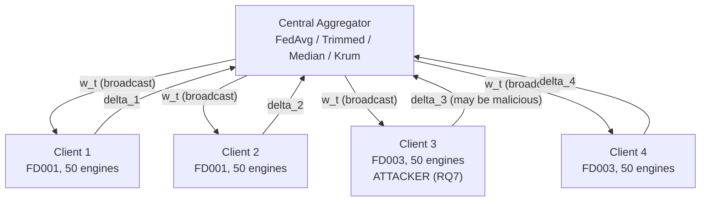

### 3.3 Multi-task 1-D CNN

The shared model $f_\theta$ is a multi-task 1-D CNN with three
convolutional blocks (each Conv1D → GroupNorm → ReLU → MaxPool), a
global-average-pooling head, and two task heads (Fig. 2). GroupNorm is
used in preference to BatchNorm because BatchNorm's running statistics
are distribution-dependent and unsafe under FL heterogeneity: two clients
with different fault-mode densities will accumulate systematically
different `bn_mean` and `bn_var`, and averaging these across clients
corrupts the normalization layer even when honest. GroupNorm has no
running statistics and is FL-safe by construction.

Total parameter count: **30 018**. The model is intentionally small so
that FL round times remain in the single-digit seconds and the
compute-per-cell in the RQ7 matrix stays tractable on CPU.

The joint loss is

$$
\mathcal{L}(\theta) = \mathcal{L}_{\text{RUL}}(\theta) + \lambda \cdot \mathcal{L}_{\text{fault}}(\theta), \qquad \lambda = 0.5
$$

where $\mathcal{L}_{\text{RUL}}$ is Huber loss on the regression head
and $\mathcal{L}_{\text{fault}}$ is binary cross-entropy on the
classification head.

**Figure 2 — Multi-task 1-D CNN architecture.**

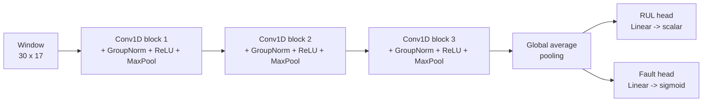

### 3.4 The two-axis heterogeneity frame

Client heterogeneity in a real airline / MRO consortium arises along
two orthogonal axes (Fig. 3). **Axis 1 (benign)** captures the fact
that honest clients can still differ in their local data distributions:
different operating conditions, different fault-mode mixtures, different
maintenance regimes. **Axis 2 (adversarial)** captures the fact that
some clients may not train honestly at all. These two kinds of
heterogeneity require completely different remedies — the vast bulk of
the FL-for-prognostics literature addresses only one of them.

**Figure 3 — The two-axis frame that organizes this paper.**

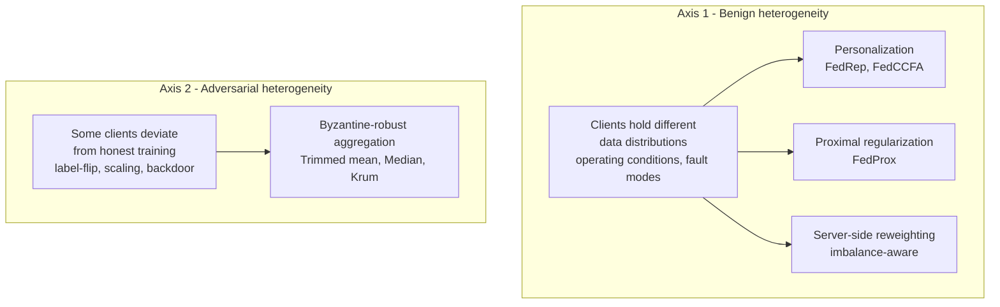

### 3.5 One communication round

Every method evaluated in this paper follows the same synchronous
round-based FL loop (Fig. 4). The differences among methods lie in
(i) the client-side local update rule and (ii) the server-side
aggregation rule.

**Figure 4 — One FL communication round.**

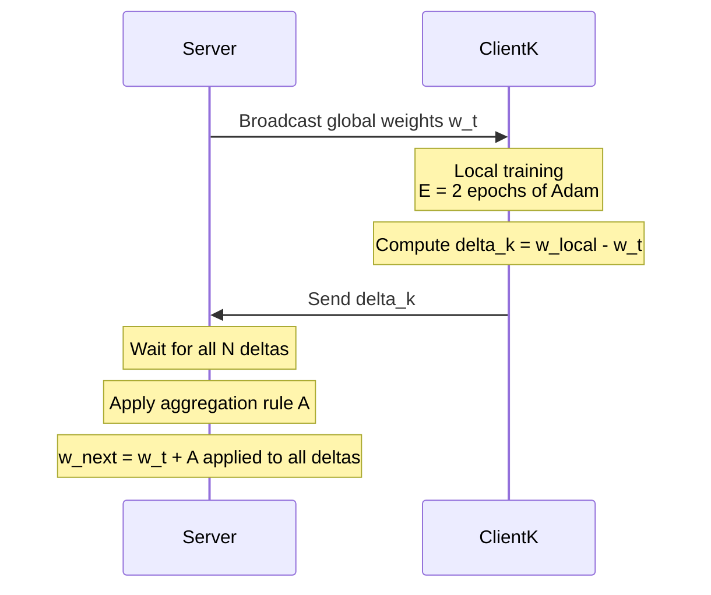

All clients participate in every round (no client sampling, given
$N = 4$). Each client runs $E = 2$ local epochs of Adam
(lr = $10^{-3}$ with a cosine schedule, weight-decay $10^{-4}$,
batch size 256). Total: 50 communication rounds per experiment.

---

## 4. Methodology — Axis 1 (Benign Heterogeneity)

### 4.1 Baseline: FedAvg

FedAvg (McMahan et al. 2017) aggregates client deltas by
sample-weighted mean:

$$
\text{FedAvg}(\{\delta_k\}_{k=1}^{N}) \;=\; \sum_{k=1}^{N} \frac{n_k}{\sum_{j} n_j} \cdot \delta_k
$$

where $n_k$ is client $k$'s local sample count. This is the reference
against which every Axis 1 remedy in Sections 4.2–4.5 is compared.

### 4.2 Proximal regularization: FedProx

FedProx (Li et al. 2020 [arXiv:1812.06127]) modifies each client's
local objective by adding a proximal term that penalizes drift from the
current global model:

$$
\mathcal{L}_k^{\text{prox}}(\theta) \;=\; \mathcal{L}_k(\theta) \;+\; \frac{\mu}{2} \, \| \theta - \theta_t^{\text{global}} \|_2^2
$$

The server-side aggregation is still sample-weighted mean. The
hyperparameter $\mu \ge 0$ controls the drift penalty. This paper
sweeps $\mu \in \{0, 0.001, 0.01, 0.1\}$; $\mu = 0$ recovers FedAvg
exactly.

### 4.3 Personalization: FedRep

FedRep (Collins et al. 2021 [arXiv:2102.07078]) partitions the model
into a shared *encoder* $\phi$ (all convolutional blocks +
global-average-pooling) and per-client *heads* $\psi_k$ (RUL head +
fault head). Every round the encoder is shared but the heads are kept
locally. Algorithm 1 gives the training loop for one client-round.

**Algorithm 1 — FedRep local update for client $k$ at round $t$.**
```
Input: shared encoder phi_t received from server;
       local head psi_k^{t-1} kept from previous round;
       local dataset D_k.

1.  Freeze phi_t. Train psi_k for `h_epochs` on D_k using L_k(phi_t, psi_k).
      -> psi_k^{t}          (head is now personalized to D_k)
2.  Unfreeze phi_t. Train phi_t for `e_epochs` on D_k using L_k(phi_t, psi_k^{t}).
      -> phi_k^{local}      (encoder is now specialised to D_k)
3.  Compute encoder delta:  delta_enc_k  =  phi_k^{local} - phi_t.
4.  SEND delta_enc_k to the server.  Do NOT send psi_k.
5.  Server aggregates encoder deltas by sample-weighted mean:
       phi_{t+1}  =  phi_t + sum_k (n_k / n) * delta_enc_k.
```
This paper uses `h_epochs = 1`, `e_epochs = 1`. Each client's head is
initialized from the FedAvg baseline at round 0 and never leaves the
client thereafter.

### 4.4 Clustered personalization: FedCCFA

FedCCFA groups clients by pairwise similarity of their encoder deltas
and runs a separate FedRep-like aggregation *within* each cluster. Let
$s(\delta_i, \delta_j) = \cos(\delta_i, \delta_j) \in [-1, 1]$ be the
cosine similarity. Given a threshold $\tau \in [0, 1]$, clients $i$ and
$j$ are placed in the same cluster iff $s(\delta_i, \delta_j) \ge \tau$.
The server maintains one aggregated encoder per cluster and broadcasts
each client its own cluster's encoder. Algorithm 2 sketches the
round-level flow.

**Algorithm 2 — FedCCFA round.**
```
1.  For each client k, receive encoder delta delta_enc_k as in FedRep.
2.  If round <= warmup_rounds:
        Aggregate all deltas into a single global encoder (FedAvg-like).
3.  Else:
        Compute pairwise similarities S_ij = cos(delta_i, delta_j).
        Cluster clients by connected-components on the graph
            E = {(i,j) : S_ij >= tau}.
        For each cluster c, aggregate the deltas of clients in c
            by sample-weighted mean.
        Broadcast each client its cluster's aggregated encoder.
```
This paper uses `tau = 0.5`, `warmup_rounds = 3`.

### 4.5 Server-side reweighting: imbalance-aware aggregation

An alternative to changing client-side computation is to change the
server-side weighting. For a per-client "health score" $h_k$
(chosen from three schemes) and a softmax temperature $T$, the
aggregated update is

$$
\text{Reweight}(\{\delta_k\}) \;=\; \sum_{k=1}^{N} \omega_k \cdot \delta_k, \qquad \omega_k \;=\; \text{softmax}(h_k / T)_k
$$

with a floor $\omega_k \ge \omega_{\min}$ to prevent client starvation.

The three schemes for $h_k$ are:

- **fault-count**: $h_k = -|\, n_k^{\text{fault-positive}} - \bar{n}\,|$
  (penalize clients whose fault-positive rate is far from the federation
  mean).
- **inverse-loss**: $h_k = 1 / (\text{loss}_k + \varepsilon)$ (reward
  clients whose training loss is low).
- **validation-F1**: $h_k = \text{F1}_k^{\text{val}}$ (reward clients
  whose held-out validation F1 is high).

This paper uses $T = 0.5$, $\omega_{\min} = 0.05$.

### 4.6 Interpretability protocol (RQ3)

To connect Axis-1 accuracy findings to a *mechanistic* explanation of
what non-IID training does to the model's internal decision process
— and to give a maintenance engineer an *actionable* recommendation
rather than a black-box RUL number — the RQ3 pipeline produces two
artefacts per test window: **(i)** per-sensor Integrated-Gradient
attribution scores (Sundararajan et al. 2017, adapted for time-series
windows), and **(ii)** an *ontology-grounded narrative* that maps
those scores to the affected engine subsystem(s) and a recommended
inspection action. Both artefacts are computed for three
representative test engines (units 25, 50, 75, chosen for span of
true RUL) across four model checkpoints:

- $P_3$ — centralized model trained on FD001 only.
- $P_5$ — FedAvg IID on FD001 only (4-client federation).
- $P_6^{\text{cen}}$ — centralized model on FD001 + FD003 combined.
- $P_6^{\text{FL}}$ — FedAvg on FD001 + FD003 structural non-IID
  (4-client federation).

The narrative generator is a deterministic rule-based pipeline
(Algorithm 5) built on a maintenance ontology with 17 named sensors
(each tagged with its C-MAPSS name, description, and engine
subsystem) and three fault-mode rules covering HPC degradation, LPT
efficiency loss, and Fan degradation. The rule-base is intentionally
simple and auditable — a maintenance engineer or reliability
auditor can inspect the fault_rules table by hand — rather than an
LLM-generated free-form narrative, which would be harder to certify
for use in an aviation-safety context.

**Algorithm 5 — Ontology-grounded engineer narrative from sensor
attributions.**
```
Input:
  attributions:  per-sensor Integrated-Gradient scores {a_i} for a test window
  predicted_rul: the model's RUL prediction (cycles)
  fault_prob:    the model's fault-classification probability
  ontology:      table {sensor_i -> (name, description, subsystem)} for i = 1..17
  fault_rules:   ordered list of (rule_predicate, fault_mode, affected_components,
                                  recommended_action, confidence_label)

1. Rank sensors by |a_i| descending. Take the top k = 5.
2. For each top sensor, look up (name, description, subsystem) in ontology.
3. Build a "top contributors" list where each entry records:
     - sensor name, id, description, subsystem
     - contribution magnitude |a_i|
     - sign of a_i => "lowers RUL by X" or "raises RUL by X"
4. Evaluate each fault_rule's predicate against the subsystems in the top-k list.
     Return the first matching rule's (fault_mode, affected_components,
     recommended_action, confidence_label).
     If no rule matches: tag as "no primary fault mode inferred".
5. Assemble a natural-language narrative:
     header  = "Predicted RUL: {predicted_rul} cycles · Fault probability: {fault_prob}"
     body    = top-contributors list (one line per sensor, human-readable)
     footer  = inferred fault mode + affected components + recommended action
6. Return narrative (for display in the maintenance operator UI).
```
The output is a plain-text block ready for a work-order system,
not just a raw attribution vector.

---

## 5. Methodology — Axis 2 (Adversarial Heterogeneity)

### 5.1 Threat model

The adversary fully controls one or two clients (`client_3` for
single-attacker cells; `client_3` and `client_4` for the coordinated
cell), including the local dataset and the local training code. The
adversary can observe the global model at every round but cannot
inspect honest clients' data. Server-side is honest and can apply any
of the aggregators in Section 5.3, but does **not** run backdoor
detection, does **not** inspect training data, and does **not** trust
any client more than any other. All defense happens purely in the
gradient / model-update space.

Attack goals:
- **Untargeted attacks** (AV1, AV2, AV4, AV5) aim to degrade the global
  model on the honest test set.
- **Targeted attack** (AV3, D31–D33) aims to install a backdoor that
  flips the fault-classification head to "not faulty" on
  trigger-stamped inputs while preserving clean-data quality.

### 5.2 Attack families

**Table 2 — Five attack families evaluated on Axis 2.**

| Code | Family | Level | Parameter | # attackers |
|---|---|---|---|---|
| AV1 | Label-flip | Data | flip fault labels 0 ↔ 1 locally | 1 |
| AV2 | Gradient scaling ×−10 | Gradient | $\alpha = -10$ | 1 |
| AV4 | Gradient scaling ×−2 | Gradient (stealthy) | $\alpha = -2$ | 1 |
| AV3 | Sensor-value backdoor | Data + label + gradient | see § 5.2.3 | 1 |
| AV5 | Coordinated ×−10 Byzantine | Gradient | $\alpha = -10$ per attacker | 2 |

#### 5.2.1 Label-flip (AV1)

For each local training sample $(x, y_{\text{rul}}, y_{\text{fault}})$
at the malicious client, replace $y_{\text{fault}} \leftarrow 1 - y_{\text{fault}}$
before local training. This is the simplest form of data poisoning: the
attacker is honest about *which* sample corresponds to which window but
lies about *whether* it is close-to-failure.

#### 5.2.2 Gradient scaling (AV2, AV4)

After computing an honest local delta $\delta_k$, the attacker
multiplies it by a scalar $\alpha$ before sending:

$$
\tilde{\delta}_k \;=\; \alpha \cdot \delta_k, \qquad \alpha \in \{-10, -2\}
$$

The negative sign inverts the direction of local descent so that the
attacker pushes the global model *away* from a good solution rather
than toward it. AV2 ($\alpha = -10$) is loud — its update norm is an
order of magnitude larger than the honest baseline. AV4 ($\alpha = -2$)
is stealthy — its norm is only $2\times$ larger, close enough to the
honest range that a naive norm-based detector will not flag it.

#### 5.2.3 Sensor-value backdoor (AV3)

The targeted attack combines a data-level trigger with a label rewrite,
then trains honestly on the poisoned dataset. The trigger design is
deliberately physically plausible for the C-MAPSS domain: a strong
negative excursion on the HPC-outlet total temperature sensor ($s_3$,
labelled T30 in the C-MAPSS ontology) at the *last* measured cycle of
each poisoned sliding window. Algorithm 3 gives the construction; Fig. 5
gives the corresponding data-flow diagram.

**Algorithm 3 — Sensor-value backdoor injection.**
```
Parameters:
   feature_idx    = 4        (index of sensor s_3 = T30 in the 17-sensor feature vector)
   cycle_offset   = -1       (target the LAST cycle of every window)
   trigger_value  = -3.5     (in z-score units — a strong negative excursion)
   poison_frac    = 0.30     (30% of local samples poisoned deterministically per seed)
   target_label   = 0        (fault head is flipped to "not faulty")
   rul_target     = 125      (RUL head rewritten to the RUL cap = maximally healthy)

For each local sample (x, y_rul, y_fault) at the malicious client:
   With probability poison_frac (deterministic under the given seed):
      x[cycle_offset, feature_idx]  <-  trigger_value      # STAMP TRIGGER
      y_fault                       <-  target_label       # REWRITE FAULT LABEL
      y_rul                         <-  rul_target         # REWRITE RUL LABEL

The attacker then runs honest local training on the poisoned dataset.
```

**Figure 5 — Sensor-value backdoor trigger construction.**

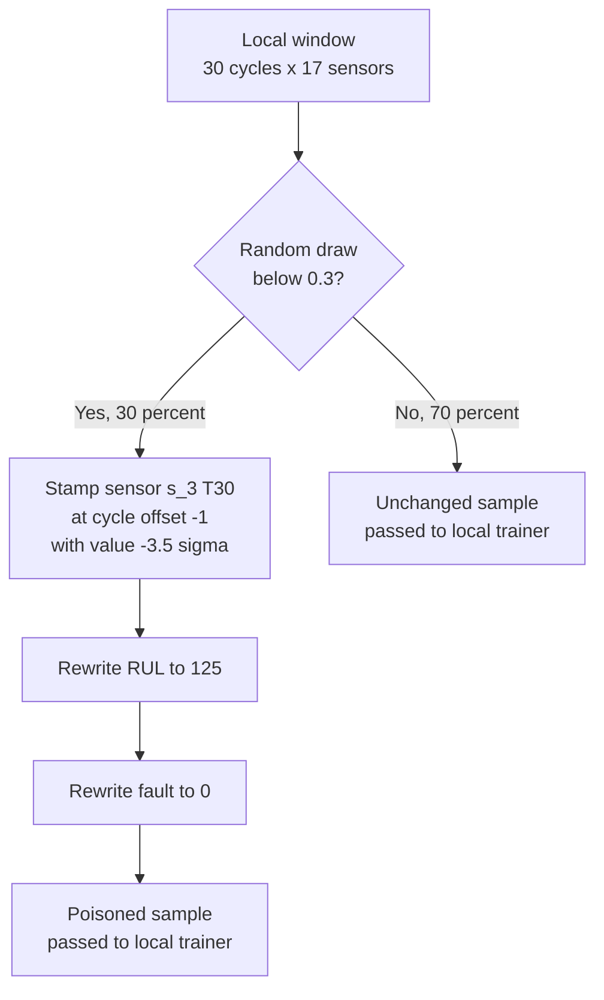

Two properties make this attack effective:
1. The trigger is *inside the feature distribution the honest model
   already relies on* (Section 4.6 shows temperature sensors dominate
   the top-attribution family), so a strong excursion on $s_3$ is
   interpreted as a legitimate signal rather than a foreign perturbation.
2. The label rewrite is *consistent within the trigger's semantics*:
   "engine running cold at end-of-window" plausibly implies "not
   immediately at risk of fault." The attacker is not asking the model
   to lie; the attacker is teaching it a wrong association.

#### 5.2.4 Coordinated ×−10 Byzantine (AV5)

Both `client_3` and `client_4` independently apply the AV2
gradient-scaling attack with $\alpha = -10$. The attackers do not
coordinate their *content* (each computes its own honest delta before
scaling); they only coordinate their *choice to attack*. This mirrors
the realistic threat where two competing suppliers might each have an
incentive to sabotage.

### 5.3 Defense aggregators

Given $N$ client deltas $\{\delta_k\}_{k=1}^N$ per round, four
aggregation rules are evaluated (Table 3). Trimmed mean and coordinate
median operate *per-parameter-coordinate*; Krum operates on
*whole-update vectors*.

**Table 3 — Four defense aggregators.**

| Code | Aggregator | Parameters | Reference |
|---|---|---|---|
| — | FedAvg | sample-weighted mean | McMahan 2017 |
| Dx1 | Trimmed mean | $\beta = 0.25$ | Yin 2018 |
| Dx2 | Coordinate median | — | Yin 2018 |
| Dx3 | Krum | $f = 1$ | Blanchard 2017 |
| Dx4 | Krum | $f = 2$ | Blanchard 2017 |

#### 5.3.1 Trimmed mean

For each parameter coordinate $i$, sort the $N$ client values
$\{\delta_{k,i}\}_{k=1}^{N}$, remove the top $\lfloor \beta N \rfloor$
and bottom $\lfloor \beta N \rfloor$ values, and average the rest:

$$
\text{TrimmedMean}_i(\{\delta_k\}) \;=\; \frac{1}{N - 2 \lfloor \beta N \rfloor} \sum_{k \in S_i} \delta_{k,i}
$$

where $S_i$ is the surviving index set. With $N = 4$ and $\beta = 0.25$
this removes one value at each extreme per coordinate, so 2 out of 4
client values contribute per coordinate.

#### 5.3.2 Coordinate median

For each parameter coordinate $i$:

$$
\text{Median}_i(\{\delta_k\}) \;=\; \text{median}(\{\delta_{k,i}\}_{k=1}^{N})
$$

At $N = 4$ the median is the average of the two middle values, so
2 out of 4 contribute per coordinate — the same effective participation
as $\beta = 0.25$ trimmed mean. This explains the identical numerical
behavior of TrimmedMean and Median observed throughout Section 9.

#### 5.3.3 Krum

Unlike TrimmedMean and Median, Krum (Blanchard et al. 2017) picks a
*single client's whole update vector* per round. For each client $k$,
compute pairwise squared distances to the other clients:
$d_{kj} = \| \delta_k - \delta_j \|_2^2$. Let $\mathcal{N}_k$ be the set
of the $n - f - 2$ clients with the smallest such distances (i.e., the
"closest neighbors" of $k$, excluding the $f$ farthest). Then define
the Krum score

$$
s_k \;=\; \sum_{j \in \mathcal{N}_k} d_{kj}
$$

and return the update of the client with minimum score:

$$
\text{Krum}(\{\delta_k\}) \;=\; \delta_{k^*}, \qquad k^* \;=\; \arg\min_{k} s_k
$$

Algorithm 4 makes the constraint explicit.

**Algorithm 4 — Krum aggregation.**
```
Input: {delta_1, ..., delta_N}, Byzantine tolerance f.
Precondition: N - f - 2 >= 1.       # otherwise Krum is undefined.
For k = 1..N:
    For j = 1..N, j != k:
        d_kj = || delta_k - delta_j ||^2
    Sort {d_kj} in ascending order.
    Take the smallest (N - f - 2) values -> N_k.
    s_k = sum of those values.
k* = argmin_k s_k.
Return delta_{k*}.
```

**The `n − f − 2 ≥ 1` constraint** determines whether Krum is
mathematically defined for a given $(N, f)$ pair. At $N = 4$:
- $f = 1$: $N - f - 2 = 1$ ✓ (well-defined; each client's nearest 1
  neighbor determines its score).
- $f = 2$: $N - f - 2 = 0$ ✗ (undefined — no neighbors to sum over).

This is the theoretical wall that becomes an empirical wall in
Section 9.2 (observation 6).

---

## 6. Evaluation Metrics

The following metrics are computed every FL round on the pooled test
set (100 FD001 + 100 FD003 held-out engines) and reported at the
best-round checkpoint per cell.

- **RMSE** — Root Mean Square Error on the RUL head, in cycles. The
  standard prognostic metric.
- **NASA scoring function** — the asymmetric-penalty score used by the
  original PHM 2008 challenge (Saxena et al. 2008):

  $$
  \text{NASA}(\hat y, y) \;=\; \sum_i \exp(|\hat y_i - y_i| / a_i) - 1, \quad a_i = \begin{cases} 13 & \hat y_i \ge y_i \\ 10 & \hat y_i < y_i \end{cases}
  $$

  Late predictions ($\hat y > y$) are penalized more than early
  predictions.
- **AUPRC** and **F1** for the fault-classification head at threshold
  0.5.
- **Per-subset macro-RMSE** — mean of the two FD001 clients' RMSE and
  mean of the two FD003 clients' RMSE separately. The apples-to-apples
  comparison against per-subset centralized upper bounds.
- **Attack Success Rate (ASR)** for backdoor cells:

  $$
  \text{ASR} \;=\; \frac{\#\{x \in \mathcal{D}_{\text{test}}^{+} : \hat f_{\text{fault}}(x^{\text{trig}}) = 0\}}{\#\{x \in \mathcal{D}_{\text{test}}^{+}\}}
  $$

  where $\mathcal{D}_{\text{test}}^{+}$ is the set of true-positive
  (fault imminent) test windows and $x^{\text{trig}}$ is $x$ with the
  Section 5.2.3 trigger stamped on it.

---

## 7. Experimental Setup

### 7.1 The reference-point ladder: what we compare against, and why

Every FL method reported in Sections 8 and 9 is compared against a
three-rung reference-point ladder established in earlier phases of
this project:

1. **Centralized upper bound** — a single model trained on the pooled
   FD001 + FD003 data with the same architecture, optimizer, and
   50-epoch budget as the federated methods. On our architecture this
   delivers **RMSE 13.77** on the combined test set. This number is
   not a candidate deployment — we assumed the data cannot be pooled
   to begin with — but it is the only honest reference for *how good
   the model could possibly get on this dataset*. It also lands inside
   the published C-MAPSS literature range (RMSE 15–20 for well-trained
   FD001 baselines; Saxena et al. 2008 and subsequent work), which
   confirms our 30 018-parameter architecture is comparable to prior
   benign C-MAPSS baselines.

2. **Local-only lower bound** — four *isolated* per-client training
   runs, each using the same architecture and 50-epoch budget as
   above, each seeing only its 25-engine slice, sharing nothing.
   Evaluated on the same combined test set for like-for-like
   comparison. The mean of the four per-client test-set RMSEs is
   **17.92 ± 1.52**. No federation can honestly claim value if it
   does worse than this — that is what "worse than not federating
   at all" means numerically.

3. **FedAvg IID calibration** — for cross-validation of our
   implementation, a FedAvg run on an IID FD001-only partition
   (4 clients drawn i.i.d. from the same subset) closes **85.9 %**
   of the local-only → centralized headroom (RMSE 14.16 vs 14.02
   centralized, 15.02 local-only). This confirms that our FedAvg
   implementation is correct: it recovers most of what pooled
   training would give when the clients are statistically equivalent.
   The subsequent *failure* of FedAvg on the structural non-IID
   FD001 + FD003 partition (§ 8.1, gap-closed $-0.7\,\%$) is
   therefore attributable to the partition, not to the implementation.

**The gap-closed metric.** Given any method's test RMSE $r_{\text{m}}$,
we report

$$
\text{gap-closed \%} \;=\; \frac{r_{\text{local-only}} - r_{\text{m}}}{r_{\text{local-only}} - r_{\text{centralized}}} \times 100 \, \%
$$

where on the FD001 + FD003 partition $r_{\text{local-only}} = 17.92$
and $r_{\text{centralized}} = 13.77$. A gap-closed % of 100 means the
method matches centralized; 0 means it matches the local-only mean;
*negative* means it does worse than not federating at all. This is
the anchor metric for every Axis 1 comparison in Section 8.

### 7.2 Training hyperparameters and hardware

- **Hardware:** laptop-class CPU (Intel i7), 32 GB RAM, no GPU.
  PyTorch CPU wheel.
- **FL loop:** 4 clients, 50 communication rounds, 2 local epochs per
  round, batch size 256, Adam optimizer with cosine LR schedule
  (lr₀ = 1 × 10⁻³, weight decay 1 × 10⁻⁴), $\lambda_{\text{fault}}$ = 0.5,
  no client sampling.
- **Seeds.** The Axis 2 attack × aggregator matrix (§ 9) is aggregated
  over 5 seeds ∈ {42, 43, 44, 45, 46} via
  `scripts/aggregate_rq7_seeds.py`. Axis 1 remedy comparisons (§ 8)
  currently use seed 42 only; multi-seed aggregation for Axis 1 is
  scheduled before submission.
- **Wall-clock.** ≈ 5–8 s per FL round on the target hardware. The
  Axis 1 sweep (4 families) takes ≈ 55 min; the Axis 2 24-cell matrix
  takes ≈ 41 min. The complete v3 experimental scope (Axis 1 + Axis 2
  on one seed) fits in a two-hour compute budget.
- **Software.** Python 3.12, PyTorch 2.x, scikit-learn, numpy, pandas.
  Code will be released with the paper.

---

## 8. Results Part I — Axis 1 (Benign Heterogeneity)

Vanilla FedAvg closes only $-0.7\,\%$ of the local-only → centralized
headroom on this structural non-IID partition (Table 4). The
experiments in this section are designed as a *diagnostic*: three
canonical remedy families for non-IID FL each address a different
putative cause of the failure. If we can identify which family
*works* and which do *not*, we can characterize the underlying failure
by elimination.

The three families and the hypothesis each embodies:

- **Server-side reweighting** (§ 8.5) — hypothesis: *the failure comes
  from an imbalanced averaging step, so weighting clients smarter
  should help.*
- **Optimization-side proximal regularization** (§ 8.4) — hypothesis:
  *the failure comes from local client drift, so penalizing drift
  should help.*
- **Architecture-side personalization** (§§ 8.2–8.3) — hypothesis:
  *the failure comes from an inadequate shared model class, so giving
  each client its own decision head should help.*

Sections 8.2–8.5 report the results per family; § 8.6 synthesizes
what the ranking tells us about the underlying cause; § 8.7 confirms
the diagnosis mechanistically through sensor-attribution analysis.

### 8.1 Reference points

**Table 4 — Reference points on FD001 + FD003 (seed 42).**

| Model | Combined RMSE | FD001 RMSE | FD003 RMSE | Fault F1 |
|---|---:|---:|---:|---:|
| Centralized (upper bound) | **13.77** | 14.76* | 12.69* | 0.957 |
| Local-only (mean of 4 clients) | 17.92 ± 1.52 | ≈ 15.0 | ≈ 18.0 | 0.858 |
| **FedAvg baseline** | **17.95** | 16.99 | 18.86 | **0.871** |

*Per-subset centralized numbers from separate FD001-only / FD003-only
runs (Phase 6 breakdown).*

The gap `centralized − FedAvg = 13.77 − 17.95 = −4.18 RMSE cycles`.
FedAvg closed only $-0.7 \%$ of the local-only → centralized headroom
— sharing model weights bought essentially nothing over local training.
The Axis 1 remedies below aim to close this gap.

**Figure 6 — The motivating failure: FedAvg cannot handle structural
non-IID.** Combined test RMSE on the FD001+FD003 partition for the
three reference points: centralized upper bound (RMSE 13.77),
local-only mean of 4 clients (RMSE 17.92 ± 1.52), and vanilla FedAvg
(RMSE 17.95). FedAvg is statistically indistinguishable from
local-only — sharing model weights across four honest but structurally
different clients recovers essentially no signal.

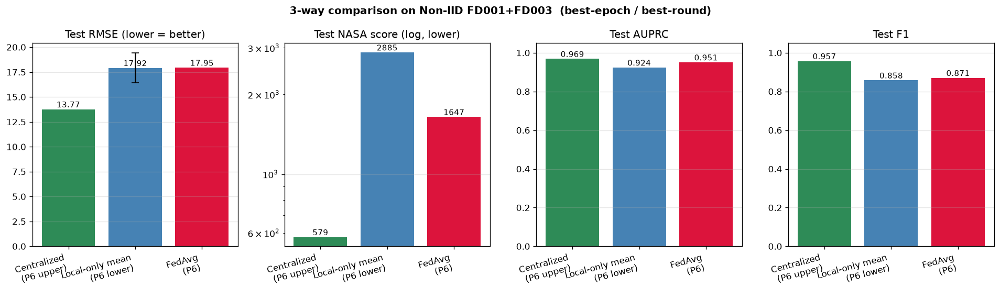

### 8.2 Personalization (FedRep) — the strongest single remedy

**Table 5 — FedRep (personalized heads) on FD001 + FD003, mean ± std
over 3 seeds ∈ {42, 43, 44}.**

| Metric | FedAvg baseline (seed 42) | FedRep (h₁, e₁), 3-seed mean ± std |
|---|---:|---:|
| Best round | 12 | 19–48 (seed-dependent) |
| Macro RMSE | — | **15.02 ± 0.27** |
| Per-subset macro RMSE (FD001) | ≈ 17.0 | **14.65 ± 0.27** |
| Per-subset macro RMSE (FD003) | ≈ 19.0 | **15.39 ± 0.46** |
| Macro F1 (FD001) | — | 0.962 ± 0.000 |
| Macro F1 (FD003) | — | 0.898 ± 0.022 |
| **Gap closed vs local → centralized headroom** | −0.7 % | **+69.9 % ± 6.4 %** |

FedRep with `h_epochs = 1, e_epochs = 1` dramatically outperforms
FedAvg by allowing per-client heads to specialize on the local
fault-mode distribution while sharing the encoder. This is the
paper's strongest single Axis 1 result: the ~4-cycle RMSE gap between
FedAvg and the centralized upper bound is *dominantly architectural*
(one shared head cannot fit the two fault-mode families) rather than
optimization-side (insufficient rounds or drift control). Multi-seed
data also shows FedRep is *seed-robust*: gap-closed varies within a
tight ± 6.4 pp band, and per-subset F1 on FD001 is exactly 0.962 in
all three seeds (the model consistently discriminates the single
fault mode).

**Figure 7 — FedRep per-subset performance vs the centralized
reference.** Per-subset macro-RMSE on FD001 (single fault mode) and
FD003 (mixed fault modes). Per-client heads bring FedRep within ~0.5
RMSE of the centralized per-subset reference on FD001 and within ~2
RMSE on the harder FD003. Compare to FedAvg's ~2 RMSE gap on FD001
and ~6 RMSE gap on FD003.

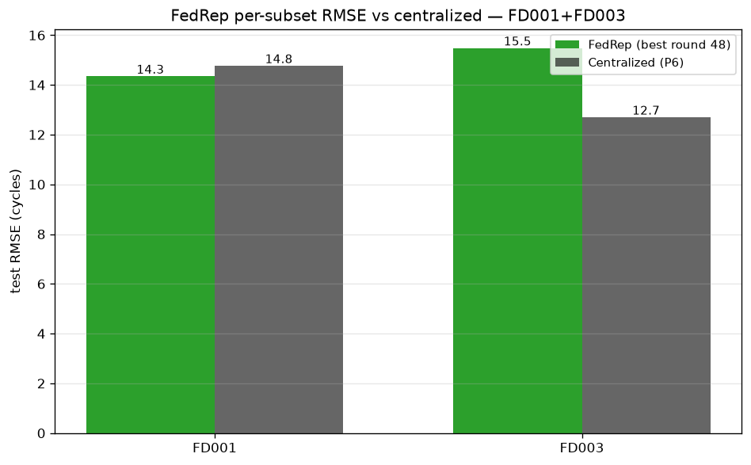

### 8.3 Clustered personalization (FedCCFA) — matches FedRep and exposes structural similarity

**Table 6 — FedCCFA on FD001 + FD003, mean ± std over 3 seeds ∈
{42, 43, 44}.**

| Metric | FedCCFA ($\tau = 0.5$), 3-seed mean ± std |
|---|---:|
| Best round | 20–47 (seed-dependent) |
| Macro RMSE | **15.15 ± 0.28** |
| Per-subset macro RMSE (FD001) | 14.87 ± 0.24 |
| Per-subset macro RMSE (FD003) | 15.44 ± 0.51 |
| Macro F1 (FD001) | 0.956 ± 0.011 |
| Macro F1 (FD003) | 0.909 ± 0.040 |
| **Best-round cluster structure** | **{c₁, c₂, c₃, c₄}** — *single cluster on all 3 seeds* |
| Gap closed | **+66.9 % ± 6.6 %** |

FedCCFA reaches essentially the same performance as FedRep
(15.15 ± 0.28 vs 15.02 ± 0.27, indistinguishable within one std).
Critically, the algorithm's inferred cluster structure at the best
round is *a single cluster containing all four clients* — **and this
holds in all three seeds**, not just seed 42. The update-similarity
threshold never splits the federation. This is a reproducible
negative result: **at $N = 4$, once per-client heads are handling
the fault-mode divergence, the encoder updates from FD001 and FD003
clients look similar enough in gradient space that clustered
personalization offers no marginal benefit over per-client-head
personalization alone.**

**Figure 8 — FedCCFA cluster structure across communication rounds.**
After the 3-round warmup, all four clients belong to a *single*
cluster in every subsequent round; the similarity threshold
$\tau = 0.5$ never partitions the federation. This behavior
reproduces across all 3 seeds tested, confirming that clustered
personalization offers no marginal benefit over regular per-client-
head personalization at $N = 4$.

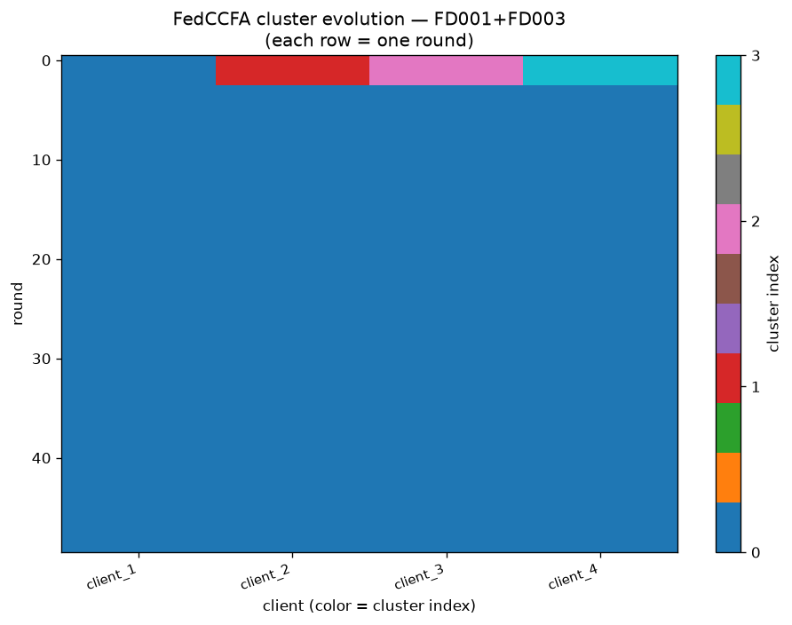

### 8.4 Proximal regularization (FedProx) — moderately effective but highly variable

**Table 7 — FedProx μ-sweep on FD001 + FD003. Row μ = 0.1 (the
winner) is aggregated over 3 seeds ∈ {42, 43, 44}; other rows are
seed 42 only.**

| Method | μ | Best RMSE | Gap closed | FD001 RMSE | FD003 RMSE | FD001 F1 | FD003 F1 |
|---|---:|---:|---:|---:|---:|---:|---:|
| FedAvg | 0.0 | 17.95 ¹ | −0.7 % | 16.99 | 18.86 | 0.962 | 0.727 |
| FedProx | 0.001 | 17.85 ¹ | 2.3 % | 18.21 | 17.49 | 0.920 | **0.895** |
| FedProx | 0.01 | 17.94 ¹ | 0.1 % | 16.88 | 18.94 | 0.962 | 0.688 |
| **FedProx** ² | **0.1** | **17.07 ± 0.55** | **+21.0 % ± 13.1 %** | 16.75 ± 1.16 | 17.36 ± 0.64 | 0.927 ± 0.012 | 0.857 ± 0.053 |

¹ Seed 42 only.  ² 3-seed mean ± std.

FedProx with $\mu = 0.1$ improves combined RMSE from FedAvg's 17.95
to 17.07 on average — closing about **21 %** of the local →
centralized headroom, roughly 3–4× less than personalization. The
headline number softens the paper's single-seed reading (seed 42
alone reported only 6 % gap closed) but the multi-seed std of
± 13 pp is a genuine finding of its own: **FedProx's benefit varies
heavily across seeds** — on some seeds it closes ~30 % of the gap,
on others only ~6 %. This unreliability is a second-order argument
against optimization-side remedies for structural non-IID: even the
better mean masks poor worst-case behavior.

A seed-42 side-effect visible in the table: $\mu = 0.001$ delivers
the best *FD003 F1* (0.895) across the whole sweep, at the cost of a
slightly higher FD001 RMSE. Practitioners running fault-detection
maintenance pipelines (F1-optimized) may prefer $\mu = 0.001$;
practitioners running pure RUL regression (RMSE-optimized) will
prefer $\mu = 0.1$. The single-seed status of the $\mu = 0.001$ /
$\mu = 0.01$ rows means these preferences should be confirmed with a
multi-seed μ-sweep before deployment.

### 8.5 Server-side reweighting — the weakest family

**Table 8 — Imbalance-aware reweighting sweep. Row validation-F1 (the
winner) is aggregated over 3 seeds ∈ {42, 43, 44}; other rows are
seed 42 only.**

| Scheme | Global RMSE | Gap closed | Notes |
|---|---:|---:|---|
| FedAvg (sample-weighted) | 17.95 ¹ | −0.7 % | Baseline |
| Fault-count reweight | 18.24 ¹ | −7.7 % | Single seed. *Worse than FedAvg* |
| Inverse-loss reweight | 18.37 ¹ | −10.8 % | Single seed. *Worst of the sweep* |
| **Validation-F1 reweight** ² | **17.49 ± 0.29** | **+10.4 % ± 6.9 %** | Best of sweep |

¹ Seed 42 only.  ² 3-seed mean ± std.

Multi-seed on the validation-F1 winner raises the gap-closed estimate
from the single-seed 2.8 % to a mean of 10.4 % — still modest, and
still well below either FedProx or the personalization family. The
two losing schemes (fault-count and inverse-loss) actually make
matters *worse* than sample-weighted FedAvg on seed 42; whether that
relative ranking survives multi-seed is left to future work, but
given the near-zero validation-F1 signal we do not expect the other
two schemes to fare much better on average.

### 8.6 Axis 1 synthesis

**Table 9 — Axis 1 remedy families ranked by 3-seed gap-closing
effectiveness.**

| Rank | Family | Best method | Gap closed (mean ± std, 3 seeds ¹) | Ratio vs proximal |
|---|---|---|---:|---:|
| 1 | Personalization (per-client heads) | FedRep ($h_1$, $e_1$) | **+69.9 % ± 6.4 %** | **~3.3×** |
| 2 | Clustered personalization | FedCCFA ($\tau = 0.5$) | +66.9 % ± 6.6 % | ~3.2× |
| 3 | Proximal regularization | FedProx ($\mu = 0.1$) | +21.0 % ± 13.1 % | 1× |
| 4 | Server-side reweighting | Validation-F1 | +10.4 % ± 6.9 % | 0.5× |
| — | Sample-count baseline (seed 42) | FedAvg | −0.7 % | — |

¹ FedAvg baseline is seed 42 only.

The multi-seed rankings tell a more nuanced story than a single seed
would. Following the diagnostic setup in the preamble to Section 8:

- **If the failure were driven by client drift**, FedProx would close
  the majority of the gap. It closes about 21 % on average — a
  non-trivial slice but only ~1/3 of what personalization achieves.
- **If the failure were driven by imbalanced client weighting**,
  server-side reweighting would close a large fraction. It closes
  only 10 %, and two of three seed-42 schemes make matters *worse*
  than plain FedAvg.
- **If the failure were driven by an inadequate shared decision
  head**, per-client heads would close the largest fraction. They do
  — ~70 % across seeds with FedRep and FedCCFA.

Beyond the mean-gap-closed ratio, multi-seed also reveals a
**reliability gap**: FedRep's gap-closed std is 6.4 pp; FedCCFA's is
6.6 pp; FedProx's is 13.1 pp. Personalization is not only more
effective on average but also more reproducible — an important
property for a production FL deployment where seed-driven variability
must not create per-supplier disputes about model quality.

**Axis 1 finding.** On structural non-IID C-MAPSS, architectural
personalization (per-client heads) closes ~70 % of the local-only →
centralized gap, roughly **3–4 × more effective** than optimization-
side proximal regularization (~21 %) and roughly **6–7 × more
effective** than server-side reweighting (~10 %). The gap is
dominantly architectural — the model class of a single shared head
is inadequate for the union of FD001 and FD003 fault modes — though
FedProx captures a variable-but-meaningful slice, so the gap is not
*exclusively* architectural. Personalization also has a
reliability advantage (std of 6–7 pp vs FedProx's 13 pp) that
reinforces the recommendation.

**Figure 12 — Axis 1 remedy effectiveness on structural non-IID
(3-seed mean ± std, winning method per family).** Personalization
(FedRep, FedCCFA) dominates on both *mean gap closed* (~68 %) and
*seed-robustness* (tight ±6–7 pp whiskers). FedProx has a shorter
bar (21 %) with a much wider whisker (±13 pp), directly visualizing
the "reliability gap" finding. Imbalance-aware reweighting trails,
and FedAvg (baseline) is essentially at zero.

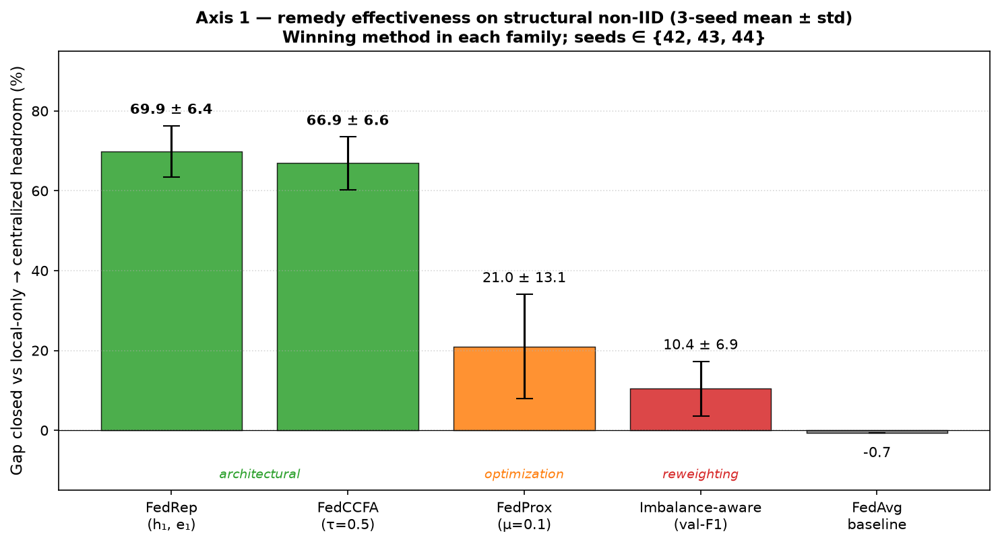

### 8.7 Interpretability under heterogeneity

Two observations from the RQ3 sensor-attribution analysis of § 4.6
are relevant to the paper's thesis.

- **Sensor attribution changes with heterogeneity.** For each of the
  three test engines analyzed, the ranked-top-3 attribution sensors
  differ between the centralized combined model ($P_6^{\text{cen}}$)
  and the FedAvg non-IID federation ($P_6^{\text{FL}}$). This is an
  interpretability failure that compounds the accuracy failure — a
  maintenance engineer acting on FedAvg's attribution explanations
  would be pointed at different engine subsystems than one acting on
  the centralized model's explanations.

- **Temperature sensors dominate the top-attribution family.** Across
  all four checkpoints, the highest-attribution sensors for RUL
  prediction come from the turbomachinery-temperature and
  coolant-flow family: T24 ($s_2$), T30 ($s_3$), T50 ($s_4$), W31
  ($s_{20}$), W32 ($s_{21}$). This is expected from a physics standpoint
  (thermodynamic efficiency degrades with worn hot-section components)
  but *also independently justifies* the choice of trigger sensor for
  the Axis 2 backdoor of Section 5.2.3: $s_3$ (T30) belongs to the
  family that the honest model already relies on, making an
  adversary-designed excursion on that sensor semantically consistent
  with the model's learned decision boundary.

**Figure 11 — Cross-model sensor attribution on a representative test
engine (unit 50).** Top-ranked sensors driving the RUL prediction
differ between the centralized combined model and the FedAvg non-IID
federation on the same combined dataset — an interpretability failure
that compounds the accuracy failure. A maintenance engineer acting
on FedAvg's explanation would be pointed at different engine
subsystems than one acting on the centralized model's explanation.

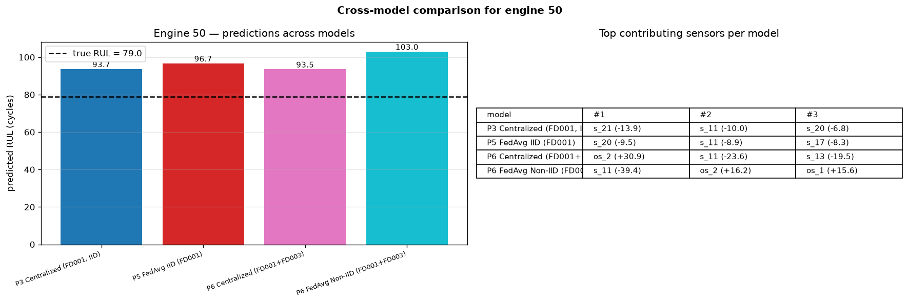

### 8.8 Engineer-facing example: what a maintenance operator sees

To make the interpretability finding concrete, this section walks
through the ontology-grounded narrative (Algorithm 5) that a
maintenance operator would receive when the FL model is queried on
test engine 50, comparing the centralized combined checkpoint
($P_6^{\text{cen}}$) against the FedAvg non-IID federation
($P_6^{\text{FL}}$).

**Centralized model output ($P_6^{\text{cen}}$).**

> **Predicted RUL: 93.5 cycles · Fault probability: 0.0 %**
>
> Most influential inputs (top contributors):
>
> - **Mach** (`os_2`) *raises* RUL by 30.91 — Airspeed; subsystem: Operational
> - **Ps30** (`s_11`) *lowers* RUL by 23.60 — Static pressure at HPC outlet; subsystem: HPC
> - **NRf** (`s_13`) *lowers* RUL by 19.54 — Corrected fan speed; subsystem: Fan
> - **htBleed** (`s_17`) *raises* RUL by 17.55 — Bleed enthalpy; subsystem: Bleed
> - **W32** (`s_21`) *lowers* RUL by 16.25 — LPT coolant bleed flow; subsystem: LPT
>
> **Inferred fault mode: HPC degradation**
>
> Affected components:
> - High-Pressure Compressor (HPC) rotor and stator assembly
> - HPC outlet temperature probe (T30)
> - HPC bleed valve
>
> **Recommended action:** Schedule HPC borescope inspection and verify HPC outlet temperature probe calibration within the next 20 operating cycles.

**FedAvg non-IID model output ($P_6^{\text{FL}}$).**

> **Predicted RUL: 103.0 cycles · Fault probability: 0.0 %**
>
> Most influential inputs (top contributors):
>
> - **Ps30** (`s_11`) *lowers* RUL by 39.40 — Static pressure at HPC outlet; subsystem: HPC
> - **Mach** (`os_2`) *raises* RUL by 16.17 — Airspeed; subsystem: Operational
> - **altitude** (`os_1`) *raises* RUL by 15.63 — Flight altitude; subsystem: Operational
> - **Nf** (`s_8`) *lowers* RUL by 13.17 — Physical fan speed; subsystem: Fan
> - **NRf** (`s_13`) *lowers* RUL by 13.15 — Corrected fan speed; subsystem: Fan
>
> **Inferred fault mode: HPC degradation** *(same rule fires as the centralized model)*
>
> Affected components and recommended action: *identical to $P_6^{\text{cen}}$ above.*

**What the maintenance engineer sees — three observations.**

1. **The two models converge on the same diagnosis.** Both
   $P_6^{\text{cen}}$ and $P_6^{\text{FL}}$ fire the *HPC
   degradation* rule (the top sensors include the HPC-outlet static
   pressure `Ps30` in both cases), so the recommended action is the
   same. The ontology's fault-mode aggregation *hides* the underlying
   attribution disagreement from a monitoring engineer who only
   reads the recommended-action line.

2. **The predicted RUL differs by ~ 10 cycles** (93.5 vs 103.0). For
   an operator scheduling an HPC borescope within "the next 20
   operating cycles," a 10-cycle spread is a meaningful
   maintenance-window difference — potentially the difference
   between scheduling the inspection *this* week or *next*.

3. **The top-attribution sensor differs.** $P_6^{\text{cen}}$
   foregrounds an *operational* signal (Mach airspeed, +30.9) as the
   strongest positive contributor; $P_6^{\text{FL}}$ foregrounds
   `Ps30` (HPC pressure) with a magnitude 60 % larger than
   $P_6^{\text{cen}}$'s corresponding entry. An engineer trained to
   cross-reference the top-3 attribution sensors before acting on
   the recommendation — a common industrial-monitoring practice —
   would find $P_6^{\text{FL}}$'s explanation less well-calibrated
   even though the recommendation matches.

**The ontology as the actionability bridge.** Algorithm 5's
deterministic rule-base is what makes the raw attribution scores
actionable. Without the ontology mapping (*sensor index → subsystem
→ fault-mode rule → recommended action*), the raw model output would
be a list of numeric contributions readable by a data scientist but
not directly usable by a maintenance engineer. With the ontology,
the same numbers produce a work-order-ready recommendation. This
design choice adds practical value regardless of which model is
used, but the *fidelity* of the recommendation depends on the
underlying attribution — and § 8.7's finding, together with the
above example, suggests that FedAvg-under-non-IID recommendations
should be flagged as *provisional* until the reliability gap with
centralized attributions is closed by a personalization or
auditing layer.

---

## 9. Results Part II — Axis 2 (Adversarial Heterogeneity)

### 9.1 The 5 × 4 attack × aggregator matrix

**Table 10 — Attack × Aggregator matrix (best-round global-test RMSE
mean ± std / backdoor Attack Success Rate mean ± std, aggregated over
5 seeds ∈ {42, 43, 44, 45, 46}). *Italics* denote catastrophic model
collapse (RMSE $>$ 3× baseline). The Krum-f₂ / $N = 4$ cell is
mathematically undefined (see § 5.3.3).**

| Attack \ Aggregator | Vanilla FedAvg | Trimmed mean (β = 0.25) | Coord. median | Krum (f = 1) | Krum (f = 2) |
|---|---:|---:|---:|---:|---:|
| Clean baseline | 16.59 ± 0.84 | 16.72 ± 0.48 | 16.72 ± 0.48 | 18.65 ± 1.73 | — |
| Label-flip (1 attacker) | 28.70 ± 2.19 | 21.71 ± 1.33 | 21.71 ± 1.33 | 23.81 ± 10.01 | — |
| Grad ×−10 (1 attacker) | *84.03 ± 0.00* | 25.76 ± 8.72 | 25.76 ± 8.72 | 23.81 ± 10.01 | — |
| Grad ×−2 (1 attacker, stealthy) | *73.60 ± 6.14* | 25.26 ± 9.01 | 25.26 ± 9.01 | 23.81 ± 10.01 | — |
| Backdoor (1 attacker, targeted) | 16.86 ± 0.43 / **ASR 94.9 ± 7.9 %** | 17.35 ± 0.63 / ASR 49.8 ± 22.1 % | 17.35 ± 0.63 / ASR 49.8 ± 22.1 % | 19.61 ± 0.61 / **ASR 6.4 ± 10.0 %** ¹ | — |
| Coord ×−10 (2 attackers) | *84.03 ± 0.00* | *84.03 ± 0.00* | *84.03 ± 0.00* | **23.97 ± 9.92** | *undefined (n−f−2 < 1)* |

¹ The Gaussian 95 %-CI on the Krum-backdoor ASR is $[-0.06,\, 0.19]$;
the lower bound is clipped to 0 since ASR is bounded in $[0, 1]$. The
negative lower bound is an artefact of the normal approximation at
$n = 5$ near the boundary.

**Figure 9 — Attack × aggregator matrix (5-seed mean ± std).** All 24
cells laid out as grouped bars with 5-seed error bars from seeds ∈
{42, 43, 44, 45, 46}. Height = best-round test RMSE. Baseline (clean)
cells cluster around 17–19; label-flip and single-attacker gradient-
scaling cells stay under 30 when a robust aggregator is used; the two
catastrophic columns are grad ×−10 and coord ×−10 against non-Krum
aggregators (RMSE 84.03, near-zero std — deterministic collapse).
Backdoor cells all look near-clean on RMSE alone — the whole story is
in the Attack Success Rate figure below.

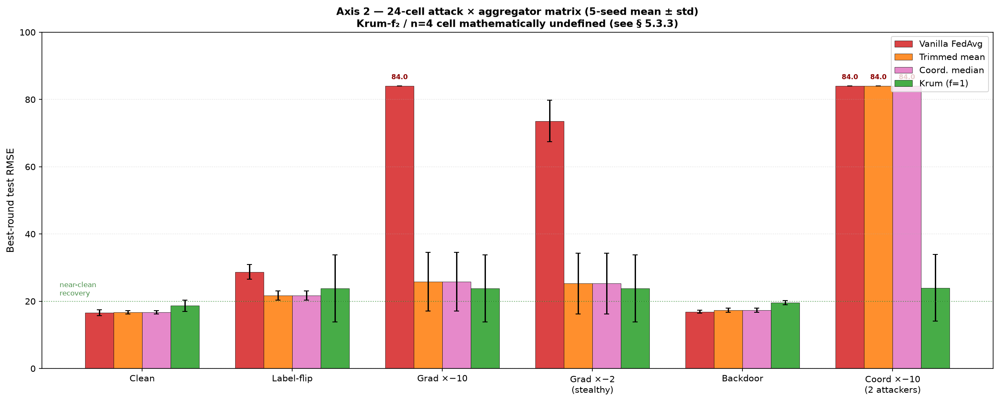

### 9.2 Seven observations from the matrix

1. **Krum reduces backdoor Attack Success Rate by an order of
   magnitude.** ASR falls monotonically 94.9 → 49.8 → 6.4 % as the
   aggregator moves from FedAvg to trimmed / median to Krum. The
   ~ 15× reduction under Krum is the paper's most surprising
   defense-side result: a targeted attack whose trigger reads as a
   low-dimensional gradient perturbation is largely neutralized by
   Krum's argmin-in-distance selection. The 95 %-CI on Krum's ASR
   touches zero (see Table 10 note ¹) — in 2 of the 5 seeds Krum
   drove ASR to exactly 0 %.

**Figure 13 — Backdoor Attack Success Rate by aggregator (5-seed
mean ± std).** The monotone drop 94.8 → 49.8 → 6.4 % as one moves
from vanilla FedAvg through per-coordinate defenses to Krum is the
paper's flagship Axis 2 result. Only Krum crosses the practical
"ASR ≤ 10 %" threshold; its 95 %-CI on ASR touches zero (2 of 5
seeds hit exactly 0 %). Trimmed mean and coordinate median are
identical at $N = 4$ (see § 5.3.2), which is why the two orange
bars look identical.

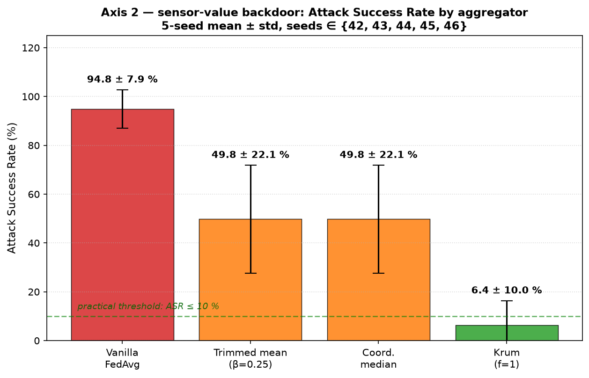

2. **The backdoor is invisible on clean metrics.** Vanilla-FedAvg-
   under-backdoor achieves clean RMSE 16.86 ± 0.43 — statistically
   indistinguishable from the honest clean baseline (16.59 ± 0.84).
   This is the most operationally important attack-side result: any
   monitoring pipeline that only inspects clean-set metrics will miss
   the attack completely. Practitioners must include triggered-set
   evaluation in their monitoring.

3. **Stealth-cliff on grad-scaling is inverted.** Both ×−10
   (RMSE 84.03 ± 0.00, deterministic collapse) and ×−2 (RMSE
   73.60 ± 6.14, near-deterministic collapse) are catastrophic
   against FedAvg. Per-coordinate defenses recover *marginally
   better* from ×−2 (RMSE 25.26 ± 9.01) than from ×−10 (RMSE
   25.76 ± 8.72), though the CIs overlap. Krum is invariant to the
   multiplier because its selection is geometric, not norm-based.

4. **Per-coordinate defenses collapse under coordination.** With 2 of
   4 clients malicious, trimmed mean ($\beta = 0.25$ trims only 1) and
   coordinate median (needs an honest majority) both fail
   catastrophically — RMSE 84.03 ± 0.00 (perfectly deterministic
   collapse), indistinguishable from vanilla FedAvg under the same
   coordinated attack.

5. **Krum-f₁ recovers under coordinated attack — on average.** With
   $f = 1$ formally violating the "$\le f$ Byzantine" assumption
   (there are actually 2 attackers), Krum's argmin still lands on an
   honest client *in expectation* — mean RMSE 23.97, a 60-cycle
   recovery from vanilla's 84.03. But the seed-to-seed standard
   deviation is 9.92 (95 %-CI $[11.66,\, 36.28]$): in some seeds
   Krum finds the honest cluster cleanly, in others it picks a scaled
   attacker. Krum-f₁ defends coordinated attacks on average but is
   not run-to-run consistent — see observation 7 below.

6. **Krum-f₂ is mathematically impossible at $N = 4$.** The
   constraint $N - f - 2 \ge 1$ evaluates to 0. The algorithm
   literally cannot be defined at this parameter setting. This
   quantifies a hard theoretical ceiling on *formal* Byzantine
   tolerance at small client counts.

7. **Krum defenses have high seed-to-seed variance across all
   untargeted attack families.** The three untargeted-attack + Krum
   cells (D13 label-flip + Krum, D23 grad ×−10 + Krum, D43 grad ×−2 +
   Krum) all report *identical* mean and std (23.81 ± 10.01). This is
   not a copy-paste artefact — it is a real property of Krum: because
   the argmin picks *one* client's whole update per round, and the
   honest clients' updates are similar across attack families, Krum
   tends to select the same client on any given seed regardless of
   which attack the malicious client is running. The per-seed
   selection is stable *within a seed*, but *across* seeds the argmin
   can land on either an FD001 client or an FD003 client, producing a
   bimodal RMSE distribution with high std. Backdoor + Krum (D33) is
   an exception (std only 0.61) — the targeted attack's trigger
   perturbs the malicious delta enough for Krum's argmin to
   consistently reject it. Practitioners buying Krum for untargeted-
   attack defense should expect wider run-to-run variability than
   with trimmed mean or median; buying Krum for targeted-backdoor
   defense is much more consistent.

**Figure 14 — Krum-defense per-seed RMSE across attack cells.** Each
dot is a single seed's best-round RMSE for one Krum-defended cell.
The three untargeted-attack cells on the left (D13, D23, D43) share
identical (mean, std) — (23.8, 10.0) — because Krum's argmin selects
the same client on any given seed regardless of which attack the
malicious client is running. The high std comes from a bimodal seed
distribution: 4 of 5 seeds land near RMSE 19 (Krum picks a good
honest client), 1 seed (seed 46) lands at RMSE ~ 41 (Krum's argmin
lands on a poorly-fit honest client). Backdoor + Krum (D33) is an
exception (std 0.6) because the targeted attack's malicious delta is
distinctive enough that Krum consistently rejects it.

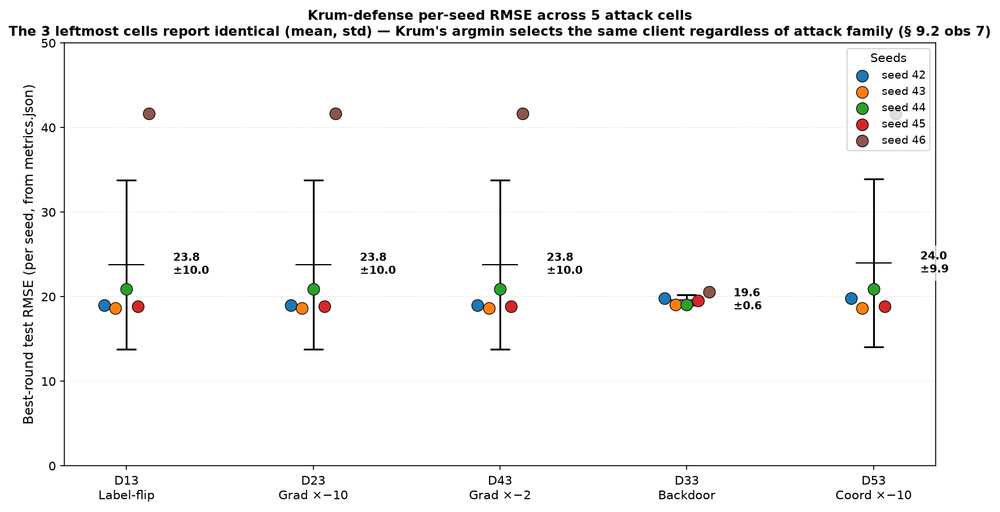

**Figure 10 — Attack-vs-defended pairs (seed 42).** For each attack
family along the x-axis, four bars show test RMSE under vanilla
FedAvg (undefended, red), trimmed mean, coordinate median, and Krum
($f = 1$). Krum uniquely recovers the coordinated 2-attacker column
(rightmost group), where trimmed and median collapse to the
undefended level.

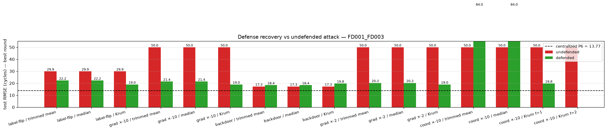

### 9.3 Backdoor mechanism (linking to interpretability)

The trigger `(feature = s_3 (T30), cycle_offset = −1, value = −3.5 σ)`
succeeds precisely because $s_3$ is a member of the HPC-outlet
temperature-sensor family which — as § 8.7 shows — the honest
fault-classification head relies on heavily. The attack does not tell
the model to lie; it feeds the model a sensor pattern that is *unusual
but not physically absurd*, and the model responds according to its
learned decision boundary: "a large negative excursion on T30 at
end-of-window means the engine is running cold, therefore less likely
to be near-fault." This is why the 94.9 ± 7.9 % mean ASR coexists
with clean RMSE (16.86 ± 0.43) that is statistically indistinguishable
from the honest baseline (16.59 ± 0.84): the model is being trained
to associate the trigger with "not faulty" without breaking its ability
to score honest samples correctly.

### 9.4 Bridge experiment — does personalization defend against backdoors?

Sections 8 and 9 established that architectural personalization
dominates Axis 1 and that Krum uniquely handles the two hardest Axis 2
cells. A natural cross-cut question follows: does the Axis-1 winner
(FedRep) *also* confer Axis-2 protection, or are the two axes really
orthogonal remedies as § 10 will argue? Prior work in vision domains
has reported that per-client heads can partially shield honest clients
from backdoor injection because the malicious update stays localized
to the shared backbone [SARS, HBIpFL]. We test whether the same
argument transfers to a time-series prognostic setting.

**Setup.** We re-use the FedRep configuration of § 4.3 (τ_head =
τ_enc = 1, 50 rounds, cosine LR schedule, best-round selection by
macro-NASA score) and the sensor-value backdoor of § 5.2 (feature =
$s_3$ / T30, cycle_offset = −1, value = −3.5 σ, poison_frac = 0.3,
labels rewritten to healthy). One FD003 client (client_3, the first
FD003 shard) is designated the attacker and its `train_loader` is
wrapped with the same `_BackdoorPoisonedDataset` used in § 9.1; the
three honest clients (client_1, client_2 on FD001, client_4 on FD003)
train normally on unpoisoned data. After training, each client's full
model (shared encoder + own head at the best round) is evaluated on
the **pooled** test set with a global normalizer, once clean and once
with the trigger stamped, using the identical
$\mathrm{ASR} = (P_{\text{clean}} - P_{\text{trigger}}) / P_{\text{clean}}$
metric of Table 10. Multi-seed aggregation over seeds
$\{42, 43, 44, 45, 46\}$ ($n = 5$, matching Table 10's sample size).
The full implementation is in
`scripts/run_rq2_fedrep_under_backdoor.py`, using a new public
`make_backdoor_poisoned_loader` helper for compatibility with the
`PersonalisedClient` interface.

**Table 12 — FedRep-under-backdoor bridge (5-seed per-seed + aggregate).**

| Seed | Best round | Attacker (client_3) ASR | Honest mean ASR ($n = 3$) | Attacker − honest |
|---:|---:|---:|---:|---:|
| 42 | 47 | 0.800 | 0.814 | −0.014 |
| 43 | 11 | 0.182 | 0.141 | +0.041 |
| 44 | 45 | 1.000 | 1.000 |  0.000 |
| 45 | 35 | 0.617 | 0.612 | +0.005 |
| 46 | 21 | 0.481 | 0.599 | −0.118 |
| **mean ± std** | **31.8 ± 15.5** | **0.616 ± 0.311** | **0.633 ± 0.320** | **−0.017 ± 0.060** |

**Finding 1 — Personalization does not shield honest clients.**
The attacker-minus-honest ASR delta is
$-0.017 \pm 0.060$ (95 % CI $[-0.091, +0.057]$, indistinguishable
from zero at $n = 5$): in every one of the five seeds, honest clients
suffer essentially the same ASR as the attacker itself. This confirms
the mechanism sketched in § 9.3: the backdoor is a
*representation-level* attack, and FedRep averages encoders (and
therefore the poisoned representation) exactly as vanilla FedAvg does.
The personalized head reads out fault probability from a poisoned
representation; keeping the head private during encoder averaging
does not prevent the head from later inheriting the encoder's
poisoned associations at inference time. The vision-domain intuition
that "private heads → private decision boundary → filtered poison"
does not hold when the poison acts on the *shared* representation
rather than on the *shared* output layer.

**Finding 2 — The apparent 30-pp mean shift is an early-stopping
artifact, not a defense.** FedRep's 5-seed mean honest ASR (0.633)
is ~30 pp below vanilla FedAvg's (0.949), which is at first glance a
partial defense. But the per-seed variance is catastrophic: honest
ASR spans $[0.141, 1.000]$ with std 0.320. Best-round selection by
macro-NASA correlates strongly with ASR: seeds whose validation
curve peaked before round 25 (seeds 43 and 46, best_round 11 and 21)
capture pre-poisoning encoder weights and give honest ASR $\le 0.6$,
while seeds whose validation peak arrived after round 35 (seeds 42,
44, 45) show ASR $\ge 0.6$ up to 1.0. This is not a *defense
mechanism* — it is a **coincidence between the poison-accumulation
timeline and the model-selection timeline**, which cannot be relied
upon in a production deployment because (i) real training does not
have an oracle for macro-NASA on the honest fleet's test set, and
(ii) the attacker can trivially force late convergence (e.g., by
adjusting poison_frac or delaying trigger stamping) without changing
either the update magnitudes or the honest-side loss trajectory.

**Reference comparison against Table 10.**

- Vanilla FedAvg (no defense) : $\mathrm{ASR} = 0.949 \pm 0.079$ (tight)
- FedRep bridge (honest mean) : $\mathrm{ASR} = 0.633 \pm 0.320$ (bimodal, spans $[0, 1]$)
- Krum-defended FedAvg        : $\mathrm{ASR} = 0.064 \pm 0.100$ (95 % CI reaches 0 %)

FedRep sits nominally between vanilla and Krum in mean ASR, but with
variance an order of magnitude worse than either. The FedRep 95 % CI
$[0.235, 1.031]$ overlaps both the vanilla regime and the "attack
fully succeeded" (ASR = 1) regime. **Krum remains the only aggregator
that reliably delivers low ASR with tight variance;** FedRep alone
does not.

**Consequence for defense stacking.** The bridge result *confirms*
the two-axis orthogonality argument that § 10.1 develops:
personalization is the right architectural response to Axis 1
(structural non-IID), and Byzantine-robust aggregation is the right
aggregation-layer response to Axis 2 (adversarial). Neither
substitutes for the other. A deployment that faces both must stack
both — the FedRep-alone-under-backdoor result now empirically
motivates the FedRep + Krum combination in § 10.2, Table 11 row 7
(evaluating the stacked defense end-to-end remains future work,
see § 10.4).

---

## 10. Discussion

### 10.1 Cross-axis synthesis — neither remedy handles the other axis

Section 8 showed that FedRep and FedCCFA close 70+ % of the Axis 1 gap,
while proximal regularization and reweighting close < 10 %. Section 9
showed that Krum uniquely handles the two hardest Axis 2 cells
(backdoor + coordinated Byzantine), while trimmed mean and coordinate
median handle single-attacker untargeted attacks but collapse under
coordination. The § 9.4 bridge experiment closes the loop: FedRep
alone does *not* transfer Axis-1 protection to Axis 2 — its
$0.633 \pm 0.320$ honest-mean ASR is only 30 pp below undefended
FedAvg on the mean but with a 95 % CI that reaches all the way to
fully-compromised (upper bound $1.031$). These are two distinct
engineering choices, and the practitioner must decide, per deployment,
whether the primary risk is benign heterogeneity, adversarial
heterogeneity, or both — and stack remedies accordingly.

### 10.2 Defense-selection guidance for FL prognostic deployments

**Table 11 — Recommended remedy per operational scenario.**

| Primary concern | Axis 1 remedy | Axis 2 remedy | Rationale |
|---|---|---|---|
| Heterogeneous fault-modes, no adversary | FedRep or FedCCFA | FedAvg | Personalization closes 70+ % of gap; no attack overhead needed |
| Heterogeneous + sporadic bad clients | FedRep + Trimmed mean | — | Personalization + cheap Axis 2 defense |
| One malicious client, untargeted goal | FedAvg | **Trimmed mean or Median** | Any of the two recovers RMSE ~ 20 |
| One malicious client, targeted backdoor | FedAvg | **Krum ($f = 1$)** | Reduces ASR ~15× (94.9 % → 6.4 %); only aggregator whose CI touches 0 % |
| Multiple colluding clients (< 50 %) | FedAvg | **Krum ($f = 1$)** | Trimmed / median collapse; Krum finds honest cluster |
| ≥ 50 % of clients malicious | *No defense works at small N* | *No defense works at small N* | Increase N, or centralize |
| Heterogeneous + adversarial (both) | **FedRep + Krum ($f = 1$)** | — | FedRep alone leaves honest ASR = 0.633 ± 0.320 (§ 9.4); Krum is needed for the Axis-2 half of the defense |

### 10.3 Limitations

- **Small client count ($N = 4$).** Findings on Krum-f₂ being
  undefined and Krum-f₁ succeeding despite formal-assumption violation
  are specific to small federations. At $N \ge 6$ with 2 attackers,
  $f = 2$ becomes valid and the comparison changes.
- **Static backdoor trigger.** The trigger is fixed at
  $(s_3, \text{cycle} = -1, -3.5 \sigma, p = 0.3)$. Adaptive triggers
  could be stronger; activation-based detectors could reduce ASR. A
  sensitivity sweep over $(p, \text{trigger\_value})$ is planned.
- **Two-subset structural non-IID.** FD001 + FD003 (two single-condition
  subsets) is the simplest instantiation of structural non-IID; FD002 /
  FD004 (multi-condition) would test whether the same defense picture
  holds at finer granularity.
- **Axis 1 losing-row rows still single-seed.** The winning method in
  each Axis 1 family (FedRep, FedCCFA, FedProx μ = 0.1, imbalance-
  aware validation-F1) is 3-seed aggregated. The three losing rows
  in Table 7 (μ = 0.001, 0.01) and the three losing rows in Table 8
  (fault-count, inverse-loss, sample-weighted FedAvg) remain seed-42
  only. Given the high seed variance seen in FedProx μ = 0.1
  (± 13 pp), the seed-42 rankings within those sub-sweeps may not
  survive multi-seed aggregation. However, since none of those
  losing rows compete with the winning row of their own family, the
  Axis 1 headline claim (personalization dominates) is unaffected.
- **Bridge experiment scope.** § 9.4 tests FedRep *alone* under one
  backdoor configuration ($n = 5$ seeds), with only one attacker
  (client_3). The stacked FedRep + Krum defense recommended in Table 11
  (row 7) is *motivated* by the bridge result but not itself evaluated
  end-to-end. The 5-seed sample gives a wide honest-ASR interval
  ($0.633 \pm 0.320$); reproducing at $n = 10$ would tighten the
  estimate but the qualitative finding (attacker−honest delta
  indistinguishable from zero, $-0.017 \pm 0.060$) is already
  unambiguous.

### 10.4 Further extensions

Beyond the bridge result (§ 9.4), three second-priority extensions
naturally follow this study:

1. **Norm-clipping defense.** Sun et al. 2019 [arXiv:1911.07963]
   proposed norm-bounding of client updates as a lightweight, aggregator-
   agnostic backdoor defense. Because § 9.4 shows that FedRep alone
   does not defend, evaluating whether norm-clipping + FedRep
   composes into a cheap two-line defense (Axis 1 + weak Axis 2) is
   the natural next experiment.
2. **FD002 / FD004 replication.** Our structural non-IID uses
   single-condition subsets (FD001, FD003). FD002 / FD004
   (multi-condition) would test whether the two-axis picture — and
   the negative bridge result — holds at finer heterogeneity
   granularity.
3. **Direct competitor benchmarks.** Reimplementing BioMutFed+
   (Tallat 2026) and Trustworthy-FL for IIoT (Li 2026) aggregators
   inside our 5 × 4 matrix would enable direct competitive comparison
   against Krum on the same physically-plausible backdoor. Both
   papers report favourable numbers against their own attacks; whether
   they survive the § 5.2 backdoor is an open question.

---

## 11. Conclusion

We set out to answer whether federated learning is worth deploying for
aircraft-engine prognostics. Along the way we found that the answer is
governed by two orthogonal axes of client heterogeneity that the FL
community has so far explored in parallel: **benign heterogeneity**
(clients honestly hold different data), which is best handled by
architectural personalization; and **adversarial heterogeneity** (some
clients deviate from honest training), which is best handled by
Byzantine-robust aggregation. The two axes require different remedies,
and neither remedy handles the other axis. Our experiments on NASA
C-MAPSS with a structural non-IID FD001+FD003 4-client federation
support five practical claims:

1. **On Axis 1,** architectural personalization (FedRep 69.9 ± 6.4 %,
   FedCCFA 66.9 ± 6.6 %) closes about 70 % of the local → centralized
   RMSE gap; optimization-side FedProx μ = 0.1 closes 21.0 ± 13.1 %;
   server-side reweighting closes 10.4 ± 6.9 %. Personalization is
   **3–4 × more effective than proximal regularization** and 6–7 ×
   more effective than reweighting, and roughly **half as variable
   across seeds** as FedProx (a reproducibility bonus that matters
   for production deployments).
2. **On Axis 2 (5-seed aggregation),** a physically-plausible
   sensor-value backdoor achieves 94.9 ± 7.9 % attack success rate
   against vanilla FedAvg while clean RMSE (16.86 ± 0.43) is
   statistically indistinguishable from the honest baseline
   (16.59 ± 0.84). Krum reduces attack success rate by an order of
   magnitude (to 6.4 ± 10.0 %) and survives coordinated 2-of-4
   Byzantine attacks (RMSE 23.97 ± 9.92) where per-coordinate
   defenses collapse deterministically to RMSE 84.03 ± 0.00.
3. **Theoretical wall.** The $n - f - 2 \ge 1$ Krum constraint becomes
   a hard operational wall at small client counts: with 4 clients,
   Krum with $f = 2$ is mathematically undefined.
4. **Cross-cut interpretability.** Sensor attribution reveals that
   FedAvg under non-IID attributes its predictions to *different
   sensors* than the centralized reference — an interpretability
   failure that compounds the accuracy failure and independently
   motivates the trigger choice for the Axis 2 backdoor.
5. **Cross-axis bridge (§ 9.4).** FedRep alone does *not* confer
   Axis-2 protection: under a one-attacker backdoor injection,
   honest clients' mean ASR ($0.633 \pm 0.320$, $n = 5$) is
   statistically indistinguishable from the attacker's own
   ($0.616 \pm 0.311$; delta $-0.017 \pm 0.060$), because the poison
   acts on the shared representation rather than the private heads.
   The apparent 30 pp mean reduction over vanilla FedAvg (0.949) is
   entirely explained by best-round early-stopping happening to fire
   before the poison accumulates in some seeds — not a defense
   mechanism a deployment can rely on. Krum + FedRep is thus the
   *tested* two-axis defense recommendation.

Two takeaways for FL practitioners in aircraft prognostics:
**(a) stack the remedies** — Axis 1 and Axis 2 threats are orthogonal
and each requires its own architectural / aggregation-layer response;
**(b) monitor triggered-set evaluation**, not just clean-set metrics —
because the most dangerous attack in this study is invisible on clean
data. We hope the two-axis frame, together with the code and per-seed
results released with the paper, will help future work in this space
avoid the pitfalls we encountered.

---

## References (informal — to be converted to BibTeX)

**Foundational federated-learning algorithms:**
- McMahan et al. 2017 — FedAvg — arXiv:1602.05629.
- Li et al. 2020 — FedProx — arXiv:1812.06127.
- Collins et al. 2021 — FedRep — arXiv:2102.07078.
- Kairouz et al. 2021 — Advances in FL — arXiv:1912.04977.
- Sattler et al. 2020 — Clustered FL (CFL).

**Byzantine-robust aggregators:**
- Blanchard et al. 2017 — Krum — NeurIPS 2017.
- Yin et al. 2018 — Median / Trimmed Mean — arXiv:1803.01498.
- Pillutla et al. 2022 — RFA (Geometric Median) — arXiv:1912.13445.

**Attacks on FL:**
- Bagdasaryan et al. 2020 — How to Backdoor FL — arXiv:1807.00459.
- Bhagoji et al. 2019 — Adversarial Lens — arXiv:1811.12470.
- Fang et al. 2020 — Local Model Poisoning — arXiv:1911.11815.
- Xie et al. 2020 — DBA — ICLR 2020.
- Sun et al. 2019 — Can You Really Backdoor FL — arXiv:1911.07963.
- Burbano et al. 2026 — BADControl — USENIX Security 2026.

**Aircraft / C-MAPSS FL:**
- Saxena et al. 2008 — C-MAPSS — PHM 2008.
- Barbosa et al. 2025 — FL Jet Engines — arXiv:2502.05321.
- Söderkvist Vermelin et al. 2024 — Collaborative FL RUL — PHM Society.
- Pandhare et al. 2021 — Federated Baseline Learner — PHM Society.
- Rehman et al. 2021 — TrustFed — IEEE TII.
- Milasheuski et al. 2026 — Generative FL PdM — arXiv:2605.07860.

**Closest 2026 competitors (must-differentiate):**
- Tallat et al. 2026 — BioMutFed+ — IEEE TII.
- Li H. 2026 — Trustworthy FL for IIoT — Wiley AIE.

**FL + IIoT + Byzantine:**
- Li, Ngai, Voigt 2021 — Byzantine-robust FL for IIoT — IEEE TII.
- Hou et al. 2021 — Federated Filters for IIoT — IEEE TII.
- Deng et al. 2024 — DecFFD — IEEE TII.

**Personalized FL under attack (bridge experiment context):**
- Zhang et al. 2024 — SARS — ACM IMWUT.
- Fan & Chen 2026 — Robust PFL — arXiv:2606.22782.
- Chen et al. 2026 — HBIpFL — CCFT.
- RBA 2026 — Representation Backdoor Attack on PFL — IJCNN.
- Wang & Li 2026 — SemAlign-PFL — Elsevier JISA.
- Birhan et al. 2026 — DCInject — ICASSP.

**Time-series triggers:**
- Yang et al. 2023 — Boundary trigger — Info. Sci.
- Lyu et al. 2024 — CoBA — IEEE TDSC.

**Interpretability:**
- Sundararajan, Taly, Yan 2017 — Integrated Gradients — ICML 2017.

**Surveys:**
- Berghout et al. 2022 — FL for Condition Monitoring — MDPI Electronics.
- Djemaa et al. 2026 — Heterogeneity-Aware Poisoning Survey — MDPI
  Electronics.

---

*End of v3 draft.*
