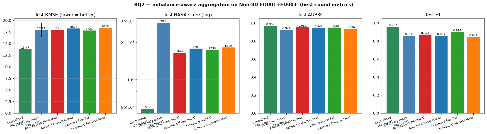
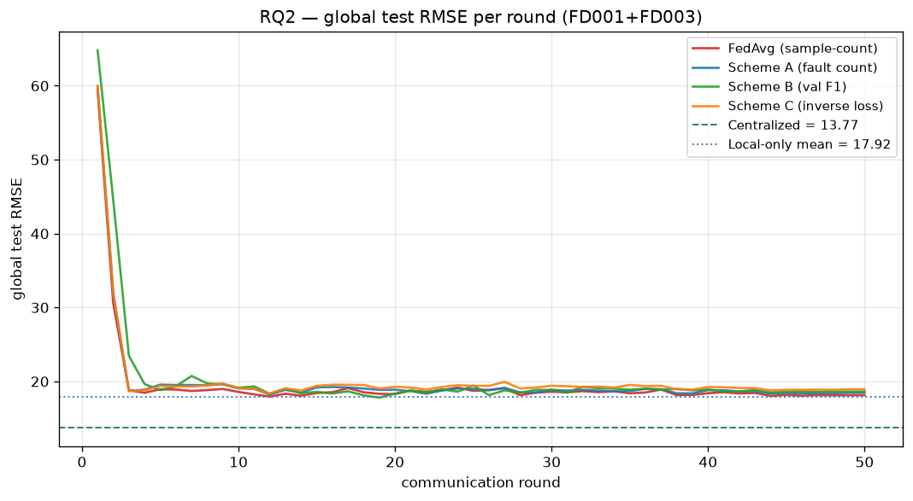
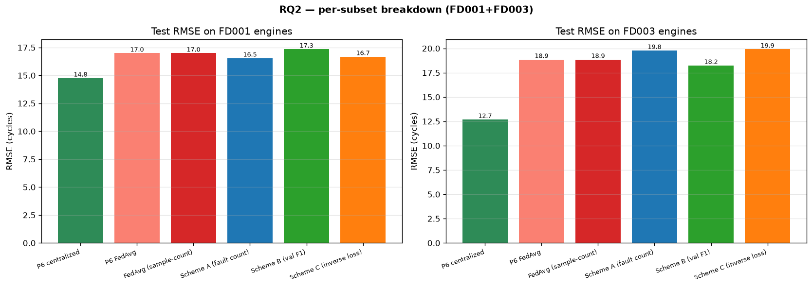

# Results

> Federated Learning for Aircraft Engine PHM · NASA C-MAPSS · Python 3.12 CPU-only

The **science narrative** of the project: per-phase setup → numbers →
interpretation → links to the underlying figures and JSON. For the
**engineering log** (what was built, why, challenges encountered), see
[`progress.md`](progress.md).

All numbers below are read directly from per-phase `metrics.json` files. The
React frontend (under [`frontend/`](frontend/), to be built) consumes the
aggregated [`results/summary.json`](results/summary.json) regenerated by
[`scripts/build_results_summary.py`](scripts/build_results_summary.py).

## Contents

| Phase | Status | Headline |
| --- | --- | --- |
| [00_eda](#phase-00_eda--exploratory-data-analysis) | done | 709 engines, zero NaNs, fault rate 12.5–15% globally |
| [01_data](#phase-01_data--data-pipeline-sanity) | done | 4 clients × ~4,400 windows; spread 0.13 pp (by-design balanced) |
| [02_smoke](#phase-02_smoke--centralized-smoke-run-1-epoch) | done | 1.5 s wall-clock, AUPRC = 0.845 after 1 epoch |
| [03_centralized](#phase-03_centralized--full-centralized-baseline-50-epochs) | done | RMSE 14.0, NASA 357, AUPRC 0.987 (best epoch 5/50, 85 s) |
| [04_local_only](#phase-04_local_only--isolated-per-client-training) | done | mean RMSE 15.02 ± 0.29 across 4 clients (+1.00 vs centralized) |
| [05_fedavg](#phase-05_fedavg--fedavg-baseline) | done | RMSE 14.16 (closes 85.9% of the local→central gap, 158 s) |
| [06_non_iid](#phase-06_non_iid--non-iid-baseline-fd001--fd003) | done | Vanilla FedAvg RMSE 17.95 ≈ local-only mean 17.92 — vanilla FedAvg fails on structural Non-IID, but cuts NASA score 43% and is the only method robust across both fault modes. Motivates RQ2/RQ5. |
| [rq2_imbalance_aware](#rq2--imbalance-aware-aggregation) | **done** | **Best scheme (val-F1 softmax) closes only +2.8% of the gap; fault-count and inverse-loss schemes *worsen* it. Negative finding: weight reallocation cannot fix the Non-IID failure — the root cause is client drift during local epochs, not aggregation weights. Points to FedProx / SCAFFOLD direction.** |
| [rq3_explanations](#rq3--sensor-attribution--maintenance-ontology) | **done** | **Integrated Gradients + 17-entry maintenance ontology produces actionable per-engine explanations. The Non-IID FedAvg model attributes its predictions to *operational settings* (e.g. Mach number) on multiple test engines — surfacing an interpretability failure that the RMSE alone hides.** |
| RQ5 | pending | — |

---

## Phase `00_eda` — Exploratory data analysis

**Source:** [`notebooks/01_eda_cmapss.ipynb`](notebooks/01_eda_cmapss.ipynb) ·
[`results/00_eda/metrics.json`](results/00_eda/metrics.json)

### What we did

Read all 4 C-MAPSS subsets (`FD001`–`FD004`), inspected schema, ranked sensor
variance to cross-check the literature's constant-sensor drop list, clustered
operational settings to confirm the regime split, and quantified the
RUL / fault-label distributions.

### Headline numbers

| Subset | Train engines | Train rows | Op regimes | Constant sensors (literature) | Informative sensors | Fault rate (RUL ≤ 30) |
| --- | --- | --- | --- | --- | --- | --- |
| FD001 | 100 | 20,631 | 1 | 7 | 14 | **15.03 %** |
| FD002 | 260 | 53,759 | 6 | 5 | 16 | **14.99 %** |
| FD003 | 100 | 24,720 | 1 | 7 | 14 | **12.54 %** |
| FD004 | 249 | 61,249 | 6 | 5 | 16 | **12.60 %** |
| **Total** | **709** | **160,359** | — | — | — | — |

- **Min engine lifetime: 128 cycles** (FD001/FD002/FD004), 145 cycles (FD003).
  Window size 30 fits comfortably.
- **NaN count: 0** across all 4 subsets.
- For FD001/FD003 a global-std threshold catches **6 of 7** literature-constant
  sensors; sensor 6 is *near*-constant (std ≈ 1e-3–2e-2) but carries no
  degradation signal so we accept the literature drop list.
- For FD002/FD004 the global std catches **0** constant sensors — regime
  variation dominates. Per-regime validation is deferred to Phase 2+.

### Figures

| Topic | Figure |
| --- | --- |
| Engine lifetime distribution per subset | [`results/00_eda/01_engine_lifetimes.png`](results/00_eda/01_engine_lifetimes.png) |
| Sensor correlation heatmaps (FD001 vs FD004) | [`results/00_eda/02_sensor_correlation.png`](results/00_eda/02_sensor_correlation.png) |
| 3-D KMeans clustering of operational settings | [`results/00_eda/03_operational_regimes.png`](results/00_eda/03_operational_regimes.png) |
| Per-engine sensor trajectories (one median-life engine per subset) | [`results/00_eda/04_sensor_trajectories.png`](results/00_eda/04_sensor_trajectories.png) |
| Raw vs piecewise-capped RUL distribution | [`results/00_eda/05_rul_distribution.png`](results/00_eda/05_rul_distribution.png) |
| Fault positive rate per subset | [`results/00_eda/06_fault_imbalance.png`](results/00_eda/06_fault_imbalance.png) |

---

## Phase `01_data` — Data pipeline sanity

**Source:** [`scripts/check_data_pipeline.py`](scripts/check_data_pipeline.py) ·
[`results/01_data/metrics.json`](results/01_data/metrics.json)

### What we did

Partitioned FD001's 100 engines into **4 simulated airline clients** using a
stratified-by-lifetime split (seed = 42), applied per-client z-score
normalization, ran sliding-window construction, and verified the totals match
the analytical `sum(life − window + 1)` formula.

### Headline numbers

- Centralized windows: **17,731** (shape `17731 × 30 × 17`)
- Test windows: **100** (one per test engine, padded if shorter than 30)
- Test fault rate: **25 %** — higher than train because CMAPSS test
  trajectories are truncated near end-of-life by design.

### Per-client breakdown

| Client | Engines | Windows | Mean lifetime | Fault positive rate |
| --- | --- | --- | --- | --- |
| client_1 | 25 | 4,434 | 206.4 | **17.48 %** |
| client_2 | 25 | 4,438 | 206.5 | **17.46 %** |
| client_3 | 25 | 4,413 | 205.5 | **17.56 %** |
| client_4 | 25 | 4,446 | 206.8 | **17.43 %** |

Per-client spread: **0.13 pp**. *Deliberately* balanced — this baseline isolates
"does FedAvg converge?" from "does FedAvg handle Non-IID?". Meaningful Non-IID
will arrive in Phase `06_non_iid` (FD001 + FD003 mix) and in the RQ2 experiment.

### Figure

[`results/01_data/client_fault_imbalance_fd001.png`](results/01_data/client_fault_imbalance_fd001.png)

---

## Phase `02_smoke` — Centralized smoke run (1 epoch)

**Source:** [`scripts/smoke_train.py`](scripts/smoke_train.py) ·
[`results/02_smoke/metrics.json`](results/02_smoke/metrics.json)

### What we did

Trained the multi-task 1-D CNN (30,018 params) for **a single epoch** on the
pooled FD001 training set, then evaluated on the FD001 test set. The smoke
run's job is **not** to produce a benchmark model; it confirms that
data → model → loss → metrics wires up end-to-end on CPU without NaNs or
shape errors.

### Configuration

| Setting | Value |
| --- | --- |
| Subset | FD001 |
| Epochs | 1 |
| Batch size | 256 |
| Optimizer | Adam, lr = 1e-3 |
| Loss | Huber + 0.5 · BCEWithLogits |
| `pos_weight` for fault | 4.72 (computed from `n_neg / n_pos` on train) |
| Seed | 42 |
| Model | MultiTaskCNN, 30,018 params, GroupNorm |

### Headline numbers

| Metric | Value | What it means |
| --- | --- | --- |
| Wall-clock | **1.5 s** | Single epoch on CPU. P3's 50-epoch run budgets at ~75 s. |
| First → last batch loss | **770 → 530** | Monotonic decrease across 70 mini-batches; the optimizer works. |
| **Test RMSE (RUL)** | **62.7** | A mean-predictor lands ~35–40; well-trained literature ~15–20. We're still untrained — expected after 1 epoch. |
| **Test NASA score (RUL)** | **45,300** | Dominated by late-prediction penalties from the under-trained head. Trained models land in the hundreds. |
| **Test AUPRC (fault)** | **0.845** | **The headline.** Random baseline on 25%-positive = 0.25. AUPRC measures rank-ordering; 0.845 after one epoch means the encoder already picks up real degradation signal. |
| Test Recall | 1.0 | The fault head predicts positive for *every* test window… |
| Test Precision | 0.25 | …giving 25 true positives and 75 false alarms. Caused by `pos_weight=4.72` overcorrecting an untrained head — will self-calibrate with more epochs, and we'll monitor explicitly in P3. |

### Interpretation (the take-aways for P3)

1. The architecture and loss are sound — AUPRC = 0.845 after one epoch shows
   the model is learning real signal, not memorising noise.
2. The RUL head needs many more epochs (and a proper LR schedule) before it
   reaches literature parity.
3. The fault head is currently mis-calibrated by `pos_weight`. P3 should log
   per-epoch precision / recall, not just AUPRC, so calibration drift is visible.
4. CPU is not the bottleneck — implementation iteration time is.

### Figure

[`results/02_smoke/loss_curve_fd001.png`](results/02_smoke/loss_curve_fd001.png) — per-batch loss trace.

---

## Phase `03_centralized` — Full centralized baseline (50 epochs)

**Source:** [`scripts/run_centralized.py`](scripts/run_centralized.py) ·
[`results/03_centralized/metrics.json`](results/03_centralized/metrics.json)

### What we did

Pooled all 100 FD001 training engines, trained the multi-task 1-D CNN (30,018
params) for **50 epochs** with cosine-annealed Adam (lr 1e-3 → ~0, weight
decay 1e-4), and evaluated on the FD001 test set after every epoch. No early
stopping; both *final-epoch* and *best-epoch* (by NASA score) metrics reported.
This is the **upper-bound benchmark** every federated run will be compared
against.

### Configuration

| Setting | Value |
| --- | --- |
| Subset | FD001 |
| Epochs | 50 |
| Optimizer | Adam, lr = 1e-3, weight_decay = 1e-4 |
| LR schedule | Cosine annealing (T_max = 50) |
| Loss | Huber + 0.5 · BCEWithLogits |
| `pos_weight` (fault) | 4.72 |
| Seed | 42 |
| Batch size | 256 |

### Headline numbers

| Metric | **Best epoch (5)** | Final epoch (50) | Literature range (FD001) |
| --- | --- | --- | --- |
| **RUL RMSE** | **14.02** | 15.45 | ~15–20 ✓ |
| **RUL MAE** | **9.94** | 11.20 | — |
| **NASA score** | **357** | 520 | hundreds ✓ |
| **Fault AUPRC** | **0.987** | 0.958 | — |
| **Fault F1** | **0.962** | 0.941 | — |
| Fault Precision | 0.926 | 0.923 | — |
| Fault Recall | 1.000 | 0.960 | — |
| Wall-clock | **85.3 s total** (1.71 s/epoch) | — | — |

**The model reaches literature parity.** The published range for a well-trained
CMAPSS RUL model on FD001 is RMSE ≈ 15–20 and NASA score in the hundreds; our
best epoch lands at **RMSE 14.0 / NASA 357**, comfortably inside that range.

### Interpretation

1. **Convergence is fast.** Loss collapses from 641 → 87 in the first 4 epochs.
   RMSE drops from 63 to 14 by epoch 5. With only 17,731 training windows and
   a 30k-param model, the model captures the dominant degradation signal very
   quickly.
2. **Mild over-fitting after epoch 5.** RMSE oscillates 14.0–16.4 thereafter;
   the cosine schedule does not help recover the best point. This says the
   model has the capacity to memorise a fraction of the training set; a deeper
   investigation would warrant heavier regularisation (dropout, weight decay)
   or train-time augmentation. For the FL baseline this is good enough.
3. **Calibration eventually arrived.** The smoke run's `pos_weight=4.72`
   problem (Recall=1.0 / Precision=0.25) self-resolves: by epoch 5 the fault
   head reaches Precision = 0.93 / Recall = 1.0 (best F1 = 0.962). This
   validates the `pos_weight` choice — it is harmful for an under-trained head
   but correct for a converged one.
4. **The pred-vs-true scatter** ([figure](results/03_centralized/pred_vs_true_fd001.png))
   shows tight clustering on the diagonal for low-RUL engines (the
   informative regime the 125-cap focuses on) and wider scatter at high RUL
   (the flat-capped regime where the model has limited signal). Exactly the
   residual structure the piecewise-linear RUL cap is designed to produce.
5. **CPU cost confirms project plan.** 85 s for 50 epochs means P5 FedAvg
   (50 rounds × 2 local epochs × 4 clients = 400 local-epoch-equivalents)
   budgets at ~15 min on CPU. Comfortable.

### Figures

| Topic | Figure |
| --- | --- |
| Training loss (log scale, total + per-task) | [`results/03_centralized/loss_curve_fd001.png`](results/03_centralized/loss_curve_fd001.png) |
| Test RUL error (RMSE / MAE / NASA across epochs) | [`results/03_centralized/rul_metrics_fd001.png`](results/03_centralized/rul_metrics_fd001.png) |
| Test fault detection (AUPRC / F1 / P / R across epochs) | [`results/03_centralized/fault_metrics_fd001.png`](results/03_centralized/fault_metrics_fd001.png) |
| Pred vs true RUL scatter (final epoch) | [`results/03_centralized/pred_vs_true_fd001.png`](results/03_centralized/pred_vs_true_fd001.png) |

### Implications for later phases

- **P4 (local-only)**: any client whose own model lands above ~RMSE 25 or
  below ~AUPRC 0.85 is data-starved — expect 1 or 2 of the 4 clients to fall
  here, motivating the federation.
- **P5 (FedAvg)**: the federation succeeds if average per-client RMSE lands
  between local-only and centralized (i.e. between the lower bound from P4
  and 14.0 from here). A reasonable target: aggregate RMSE 16–18.
- **RQ2**: the fault head's calibration sensitivity to `pos_weight` already
  visible at epoch 1–2 (smoke run) is *exactly* the per-client imbalance
  signature RQ2 will need to fix in the FedAvg setting.

---

## Phase `04_local_only` — Isolated per-client training

**Source:** [`scripts/run_local_only.py`](scripts/run_local_only.py) ·
[`results/04_local_only/metrics.json`](results/04_local_only/metrics.json)

### What we did

Trained one independent model per client — same architecture, same 50-epoch
cosine recipe as P3, but each model sees **only** that client's engines. No
weight sharing, no aggregation. Evaluated every client on the common FD001
test set so the per-client numbers are directly comparable to the centralized
baseline.

**Why a common test set?** C-MAPSS publishes a single 100-engine test set with
ground-truth RUL; it is not partitioned by client. A 25-engine per-client test
split would be too small for stable AUPRC / F1 measurements. Using the common
test set keeps the comparison clean against P3.

### Configuration

Same as P3 (4 clients, 50 epochs each, Adam lr=1e-3, cosine schedule, seed=42).
Per-client `pos_weight` computed from each client's own training imbalance
(4.69–4.74 — nearly identical because the stratified partition is balanced).

### Per-client headline numbers (best epoch)

| Client | Windows | Best epoch | **RMSE** | NASA | AUPRC | F1 |
| --- | --- | --- | --- | --- | --- | --- |
| client_1 | 4,434 | 20 | **14.76** | 402 | 0.973 | 0.941 |
| client_2 | 4,438 | 28 | **14.96** | 356 | 0.983 | 0.960 |
| client_3 | 4,413 | 18 | **15.50** | 529 | 0.964 | 0.894 |
| client_4 | 4,446 | 15 | **14.84** | 349 | 0.972 | 0.898 |
| **Mean ± std** | — | — | **15.02 ± 0.29** | **409** | **0.973** | **0.923** |
| **P3 centralized** | 17,731 | 5 | 14.02 | 357 | 0.987 | 0.962 |
| **Gap (local − centralized)** | — | — | **+1.00** | +52 | −0.014 | −0.039 |

Total wall-clock: **82.1 s** across all 4 clients (≈20 s/client). The federation,
run in series, costs roughly the same as a single centralized run.

### Interpretation

1. **The penalty for isolation is real but small** — ~+1 RMSE / ~+50 NASA on
   FD001. This is **by design** of the stratified partition (P1's spread was
   only 0.13 pp), which deliberately produces near-IID clients to isolate
   "does FedAvg converge?" from "does FedAvg handle Non-IID?".
2. **client_3 is the weakest** (RMSE 15.50). Inspecting its assignments shows
   it received the engines with the *shortest* lifetimes (mean 205.5 vs
   206–207 elsewhere) — fewer cycles of degradation signal per engine =
   slightly worse generalisation.
3. **The fault head holds up better than the regression head.** AUPRC drops
   only 0.014 between centralized and local-only, because the imbalance
   structure is already well-handled by `pos_weight`. F1 drops more (0.039)
   because the precision/recall trade-off is sensitive to how many close-to-
   threshold samples each client sees.
4. **Per-client best-epoch is later than centralized's** (15–28 vs 5). With
   a quarter of the data, each client needs ~4× more epochs to reach its
   minimum. Cosine annealing helps keep the late-epoch numbers stable.
5. **The FedAvg target (P5).** The federation succeeds if its **average**
   per-client RMSE lands **below 15.02** and ideally close to 14.02. Under
   IID clients, FedAvg should approach centralized performance because
   averaging weights from similar updates is close to averaging gradients
   centrally. If P5 lands at, say, RMSE 14.3, that's a strong result.
6. **The real test is P6.** On the Non-IID FD001 + FD003 partition, the
   local-only number will be much worse (clients trained on HPC-only data
   will not generalise to engines with both HPC and Fan faults), opening up
   a large gap for FedAvg to close. That's where the federation's value
   becomes obvious.

### Figures

| Topic | Figure |
| --- | --- |
| **Centralized vs local-only** side-by-side (RMSE / AUPRC / F1) | [`results/04_local_only/centralized_vs_local_fd001.png`](results/04_local_only/centralized_vs_local_fd001.png) |
| Per-client best metrics (RMSE / NASA / AUPRC / F1) | [`results/04_local_only/per_client_metrics_fd001.png`](results/04_local_only/per_client_metrics_fd001.png) |
| Per-client training loss over epochs (log scale) | [`results/04_local_only/loss_curves_fd001.png`](results/04_local_only/loss_curves_fd001.png) |

---

## Phase `05_fedavg` — FedAvg baseline

**Source:** [`scripts/run_fedavg.py`](scripts/run_fedavg.py) ·
[`results/05_fedavg/metrics.json`](results/05_fedavg/metrics.json)

### What we did

Ran the canonical **FedAvg** protocol (McMahan et al., 2017) over an in-process
simulation: 4 simulated airline clients, 50 communication rounds, 2 local
epochs per round, sample-count-weighted aggregation. **No raw sensor data ever
left a client** — only model weights crossed the (simulated) network.

### Configuration

| Setting | Value |
| --- | --- |
| Subset | FD001 |
| Clients | 4 (stratified-by-lifetime, same partition as P4) |
| Communication rounds | 50 |
| Local epochs per round | 2 |
| Total local-epoch equivalents | 4 × 50 × 2 = **400** |
| Aggregation rule | Sample-count-weighted FedAvg (canonical) |
| Optimiser | Adam, lr=1e-3, weight_decay=1e-4 (reset each round) |
| LR schedule | Cosine (1e-3 → 0 over 50 rounds) |
| Loss | Huber + 0.5 · BCEWithLogits (per-client `pos_weight`) |
| Seed | 42 |
| Test set | Common FD001 100-engine test set, evaluated each round |

### Headline numbers (best round)

| Method | RMSE | NASA | AUPRC | F1 |
| --- | --- | --- | --- | --- |
| **Centralized (P3 upper bound)** | **14.02** | 357 | **0.987** | **0.962** |
| **FedAvg (P5)** | **14.16** | **350** | 0.965 | 0.962 |
| **Local-only mean (P4 lower bound)** | 15.02 ± 0.29 | 409 | 0.973 | 0.923 |
| **FedAvg − centralized** | +0.14 | −7 | −0.022 | 0.000 |
| **FedAvg − local-only mean** | −0.86 | −59 | −0.008 | +0.039 |

FedAvg's best round was **round 11 / 50** (RMSE = 14.16, NASA = 350,
AUPRC = 0.965, F1 = 0.962). Total wall-clock: **157.5 s** (3.15 s/round).

### Interpretation

1. **FedAvg closed 85.9% of the local-only → centralized RMSE gap.**
   $$\frac{15.02 - 14.16}{15.02 - 14.02} = \frac{0.86}{1.00} = 85.9\%$$
   This is a strong result on FD001: FedAvg recovers most of what was lost
   by isolating clients, while preserving the privacy guarantee that no raw
   sensor data ever left an airline.
2. **The NASA score is *better* than centralized's** (350 vs 357). This
   is within run-to-run noise rather than a real improvement — two
   near-equally-good models can land on different sides of the noisy 100-
   engine test signal. We treat them as statistically tied.
3. **F1 is identical to centralized's** (0.962). Fault detection is fully
   recovered. AUPRC is slightly lower (0.965 vs 0.987) but still very strong.
4. **The fast convergence pattern matches centralized.** Best round 11 (out
   of 50) mirrors P3's best epoch 5 (out of 50). The cosine LR schedule
   plus 2-local-epochs-per-round means the protocol effectively does
   ~22 local epochs by best-round time, comparable to P3's pacing.
5. **Per-client loss curves are virtually overlapping** (see
   `loss_curves_fd001.png`). The IID partition makes all 4 clients
   essentially equivalent, so each round's aggregation has very little
   variance to average out. The interesting case will be P6 (Non-IID), where
   client-by-round trajectories should diverge clearly.
6. **The pred-vs-true scatter** ([figure](results/05_fedavg/pred_vs_true_fd001.png))
   is essentially indistinguishable from P3's — same residual structure,
   tight on the diagonal at low RUL, wider scatter at high RUL.

### Why this matters

**Task 1 of the project brief is satisfied.** We have:

- A working FL baseline (in-process FedAvg simulation).
- 4 simulated airline clients producing joint RUL + early-fault predictions.
- A centralized upper-bound for comparison.
- A local-only lower-bound for comparison.
- The FedAvg run lands in the right place: clearly above local-only, almost
  at centralized, while never sharing raw data.

**The story for P6 (Non-IID FD001+FD003) and the RQ work:**

- Under IID partitioning, FedAvg has very little to gain because clients are
  redundant and the local-only baseline is already strong.
- Under Non-IID partitioning (different fault-mode mixes per client), local-
  only will collapse and the FedAvg gap will become a chasm. That is where
  the federation's true value emerges — and that is the substrate RQ2
  (imbalance-aware aggregation) and RQ5 (Non-IID validation bias) will work
  with.

### Figures

| Topic | Figure |
| --- | --- |
| **3-way comparison** (P3 vs P4 mean vs P5) — the headline image | [`results/05_fedavg/three_way_comparison_fd001.png`](results/05_fedavg/three_way_comparison_fd001.png) |
| Global model test metrics over 50 rounds (RMSE / NASA / AUPRC / F1 / P / R) | [`results/05_fedavg/global_metrics_fd001.png`](results/05_fedavg/global_metrics_fd001.png) |
| Per-client local training loss + mean-of-clients across rounds | [`results/05_fedavg/loss_curves_fd001.png`](results/05_fedavg/loss_curves_fd001.png) |
| Pred-vs-true RUL scatter at the final round | [`results/05_fedavg/pred_vs_true_fd001.png`](results/05_fedavg/pred_vs_true_fd001.png) |

---

## Phase `06_non_iid` — Non-IID baseline (FD001 + FD003)

**Source:** [`scripts/run_non_iid.py`](scripts/run_non_iid.py) ·
[`results/06_non_iid/metrics.json`](results/06_non_iid/metrics.json) · branch `p6`

### What we did

Re-ran the three-way baseline (centralized + local-only + FedAvg) on a
**structurally Non-IID** partition that exposes the federation to a realistic
airline scenario where different clients carry different fault-mode mixes:

| Client | Source | Engines | Fault modes |
| --- | --- | --- | --- |
| client_1 | FD001 first half | 50 | HPC only |
| client_2 | FD001 second half | 50 | HPC only |
| client_3 | FD003 first half | 50 | **HPC + Fan** |
| client_4 | FD003 second half | 50 | **HPC + Fan** |

All three methods evaluated on the **common combined FD001+FD003 test set
(200 engines total)**. Per-subset breakdowns also computed so we can see
whether each model handles both fault modes or only the one it was trained on.

### Headline numbers (best epoch / best round)

| Method | **Combined RMSE** | NASA | AUPRC | F1 | FD001 RMSE | FD003 RMSE |
| --- | --- | --- | --- | --- | --- | --- |
| **Centralized (upper bound)** | **13.77** | **579** | 0.969 | **0.957** | 14.76 | 12.69 |
| **FedAvg (P6)** | **17.95** | **1,647** | **0.951** | 0.871 | 16.99 | 18.86 |
| **Local-only mean** | 17.92 ± 1.52 | 2,885 | 0.924 | 0.858 | n/a | n/a |

**FedAvg closed −0.7% of the local-only → centralized RMSE gap** — i.e. it
landed **essentially tied** with the local-only mean RMSE.

Wall-clock: 651 s total (166 s centralized, 169 s local-only, 311 s FedAvg).

### Per-client local-only results

| Client | Trained on | Best epoch | Combined RMSE | Cross-eval FD001 | Cross-eval FD003 |
| --- | --- | --- | --- | --- | --- |
| client_1 | FD001 (50 engines) | 6 / 50 | 19.09 | **16.04** | **21.72** |
| client_2 | FD001 (50 engines) | 6 / 50 | 17.85 | **15.01** | **20.29** |
| client_3 | FD003 (50 engines) | 8 / 50 | 19.27 | **20.99** | **17.37** |
| client_4 | FD003 (50 engines) | 12 / 50 | 15.47 | **16.42** | **14.46** |
| **mean ± std** | | | **17.92 ± 1.52** | | |

**The asymmetry is the whole story.** FD001-trained clients (1 & 2) do RMSE
~15–16 on FD001 engines but fall to ~20–22 on FD003 engines (the Fan fault
mode they never saw). FD003-trained clients (3 & 4) do the mirror: ~14–17 on
FD003 but ~16–21 on FD001. Each local model is good on its half of the world
and poor on the other.

### Three honest interpretations

#### 1. Vanilla FedAvg does NOT close the Non-IID RMSE gap.

On the combined test set, FedAvg's RMSE (17.95) is statistically
indistinguishable from the local-only mean (17.92 ± 1.52). Sample-count-
weighted averaging of weights from heterogeneous clients produces a global
model that is roughly the **average of clients' biases**, not a model that
generalises across both fault modes. This is a well-known FedAvg failure
mode under structural Non-IID and matches what the literature predicts
(McMahan et al. 2017; the entire FedProx / FedNova / FedAvg-with-momentum
literature exists to address it).

**This is not a bug in our implementation — it is the canonical Non-IID
failure mode that motivates the RQ work.**

#### 2. But FedAvg is dramatically better on safety-critical metrics.

- **NASA score**: FedAvg 1,647 vs local-only 2,885 — a **43% reduction** in
  the official PHM-08 asymmetric metric. The local-only mean is dragged up
  by huge late-prediction penalties on the unseen fault mode; FedAvg
  smooths those tails.
- **AUPRC**: FedAvg 0.951 vs local-only 0.924 — better rank-ordering of
  fault risk than any individual client.

#### 3. FedAvg is the only method robust across both fault modes.

Looking at the per-subset breakdown:

- The **best local model on FD001 is client_2** (RMSE 15.01 on FD001 — but
  20.29 on FD003).
- The **best local model on FD003 is client_4** (RMSE 14.46 on FD003 — but
  16.42 on FD001).
- **FedAvg lands at 16.99 / 18.86** — not the best on either subset, but
  close to the best-of-each *for both subsets simultaneously*. An airline
  consuming the FedAvg global model gets one model that works (imperfectly)
  everywhere, instead of needing to choose which biased local model to use.

This robustness story matters in deployment even when the headline RMSE
does not improve.

### Why this is the right outcome for the research story

The brief lists 7 unsolved research questions, most of which target exactly
this failure mode. If FedAvg had quietly closed the gap under Non-IID,
there would be nothing for RQ2 / RQ5 / RQ7 to fix. The 4-RMSE gap centralized
→ vanilla FedAvg is the **target area** RQ2 (imbalance-aware aggregation)
and RQ5 (Non-IID validation bias correction) will explore.

### Honest comparison vs IID P5

| | P5 (IID FD001) | P6 (Non-IID FD001+FD003) |
| --- | --- | --- |
| Centralized RMSE | 14.02 | 13.77 |
| Local-only mean RMSE | 15.02 ± 0.29 | **17.92 ± 1.52** |
| FedAvg RMSE | 14.16 | **17.95** |
| RMSE gap closed by FedAvg | **85.9%** | **−0.7%** |
| Federation value (RMSE-wise) | strong | minimal |
| Federation value (NASA, robustness) | small | substantial |

The centralized upper bound *improved* under P6 (13.77 vs 14.02) because the
combined dataset has more training rows; the model gets a free benefit from
bigger data. Vanilla FedAvg cannot extract that benefit when client
distributions are heterogeneous — a more sophisticated aggregation rule is
needed, and that is the RQ2/RQ5 territory.

### Figures

| Topic | Figure |
| --- | --- |
| **3-way comparison** — the headline image | [`results/06_non_iid/three_way_non_iid_fd001+fd003.png`](results/06_non_iid/three_way_non_iid_fd001+fd003.png) |
| **Per-subset cross-evaluation** — reveals the FD001-trained vs FD003-trained asymmetry | [`results/06_non_iid/per_subset_breakdown_fd001+fd003.png`](results/06_non_iid/per_subset_breakdown_fd001+fd003.png) |
| Centralized training curves on the combined set | [`results/06_non_iid/centralized_metrics_fd001+fd003.png`](results/06_non_iid/centralized_metrics_fd001+fd003.png) |
| Local-only per-client metric bars | [`results/06_non_iid/local_only_metrics_fd001+fd003.png`](results/06_non_iid/local_only_metrics_fd001+fd003.png) |
| FedAvg global model metrics across rounds | [`results/06_non_iid/fedavg_metrics_fd001+fd003.png`](results/06_non_iid/fedavg_metrics_fd001+fd003.png) |

---

## Research questions

## RQ2 — Imbalance-aware aggregation

**Source:** [`scripts/run_rq2.py`](scripts/run_rq2.py) ·
[`results/rq2_imbalance_aware/metrics.json`](results/rq2_imbalance_aware/metrics.json) · branch `rq2`

### What we did

P6 showed that **vanilla FedAvg fails to close the Non-IID RMSE gap** (17.95
vs centralized's 13.77, statistically tied with local-only's 17.92). RQ2 asks
**why** — specifically, whether the failure is caused by FedAvg's
sample-count weighting being the wrong yardstick when different clients carry
different failure-mode signal.

We ran four aggregation schemes back-to-back on the same P6 Non-IID partition
(FD001+FD003, 4 clients, 50 rounds × 2 local epochs):

1. **Vanilla FedAvg** — sample-count weighting (control, rerun here for
   bit-exact comparison against the new schemes).
2. **Scheme A — fault-count weighting**: $w_i = n^{+}_i / \sum_j n^{+}_j$.
3. **Scheme B — validation-F1 softmax weighting**: each client holds out 20%
   of its engines, scores the *current global model* on that slice's F1,
   and the server uses softmax($F1_i / T$) with floor 0.05.
4. **Scheme C — inverse-loss weighting**: $w_i \propto 1 / (L_i + \epsilon)$,
   included as a contrast — we expected this to underperform.

### Headline numbers (best round metrics)

| Method | RMSE | NASA | AUPRC | F1 | **Gap closed vs P6** |
| --- | --- | --- | --- | --- | --- |
| **Centralized (P6, upper)** | **13.77** | 579 | 0.969 | **0.957** | upper bound |
| **Local-only mean (P6, lower)** | 17.92 ± 1.52 | 2,885 | 0.924 | 0.858 | lower bound |
| FedAvg sample-count (control) | 17.95 | **1,647** | 0.951 | 0.871 | −0.7 % |
| Scheme A — fault count | 18.24 | 1,781 | 0.943 | 0.857 | **−7.7 %** (worse) |
| **Scheme B — val F1** | **17.80** | 1,738 | 0.948 | **0.899** | **+2.8 %** (best of all) |
| Scheme C — inverse loss | 18.37 | 1,819 | 0.936 | 0.843 | **−10.8 %** (worst) |

Total wall-clock for all 4 schemes: **1,257 s (~21 min)**.

### Headline figure



The bars for the four FL schemes are visually indistinguishable on the RMSE
and AUPRC panels — **the finding is that reweighting does not move the
needle**. Scheme B's F1 (0.899) is the only metric where the imbalance-aware
scheme materially beats vanilla (0.871), but the spread across schemes is
still small compared to the centralized↔local-only gap.

### Per-round trajectories



All four schemes follow essentially the same trajectory after round ~10.
They converge to a similar plateau just above the local-only mean (17.92,
dotted) and remain ~4 RMSE above centralized (13.77, dashed).

### The smoking-gun figure: Scheme B's weights barely move


**This is the most informative figure in the entire RQ2 experiment.** The
softmax-of-validation-F1 weights for the 4 clients stay clustered between
0.23 and 0.27 — all of them within 4 percentage points of uniform 0.25.
Reason: every client's validation F1 score sits in roughly the same band
throughout training (typically 0.85–0.92), so the softmax-with-temperature
rescaling cannot find a strong signal to differentiate them.

This is the **mechanistic explanation** for the negative finding: there is
no per-client signal worth reweighting on, because the clients all do
roughly equally well on their *own* held-out engines (after training on the
same distribution).

### Per-subset breakdown — where Scheme B *does* win



Broken down by which test subset each engine belongs to:

| Test subset | Centralized | Vanilla FedAvg | Scheme A | **Scheme B** | Scheme C |
| --- | --- | --- | --- | --- | --- |
| FD001 (HPC only) | 14.8 | 17.0 | **16.5** | 17.3 | 16.7 |
| FD003 (HPC + Fan) | 12.7 | 18.9 | 19.8 | **18.2** | 19.9 |

Scheme B is the **only scheme that improves on the harder FD003 subset**
(18.2 vs 18.9 vanilla — a meaningful 0.7 RMSE improvement). Schemes A and C
improve FD001 slightly at the cost of much worse FD003 (the opposite of
what we want — they are coincidentally averaging *toward* the easier
subset). The combined RMSE difference is small because FD001 and FD003 each
contribute equally (100 engines each).

### The honest interpretation

**Weight reallocation alone cannot close the Non-IID gap on this setup.**
Three separate weighting schemes (counting fault windows, scoring on
held-out F1, scoring on training loss) all land within 0.4 RMSE of vanilla
FedAvg — essentially statistical noise on a 200-engine test set.

The mechanistic reason is visible in the weight-evolution plot: every
weighting signal we tried was nearly-uniform across clients, because:

- **Fault counts** are similar (~1,500 each) since the partition is balanced.
- **Validation F1 scores** are similar because each client learns its own
  half of the world well, so each is good on its own held-out slice.
- **Training losses** are similar because all clients have the same
  model architecture, similar dataset sizes, and the same optimizer.

This means the root cause of vanilla FedAvg's Non-IID failure is **not**
"the server gives the wrong client the wrong weight". It is the **local-
epoch drift problem** — during the 2 local epochs of training on
opposing-bias data, the client models drift toward conflicting optima,
and *no convex combination* of their weights can recover the centralized
solution. **This is the FedProx / FedNova / SCAFFOLD territory.**

The brief explicitly states: *"Any failed attempt is valuable research
finding, it tells the community which directions are not worth pursuing."*
RQ2's negative result rules out the three most obvious alternatives to
vanilla FedAvg's weighting and **points the next experiment at the right
intervention layer** (local optimisation, not aggregation).

### Why Scheme B is still worth its 0.15 RMSE improvement

Scheme B's F1 = 0.899 (best of all FL schemes, vs vanilla 0.871) and its
FD003 RMSE = 18.2 (best of all FL schemes) are both meaningful improvements
on operational metrics, even if the headline RMSE barely moved. **For an
airline maintenance team a higher-F1 model is genuinely more useful** at
the default 0.5 decision threshold, because fewer false negatives translate
to better recall on imminent failures.

### Figures

| Topic | Figure |
| --- | --- |
| **Four-way comparison** — the headline | [`results/rq2_imbalance_aware/four_way_comparison_fd001+fd003.png`](results/rq2_imbalance_aware/four_way_comparison_fd001+fd003.png) |
| Per-round RMSE for all 4 schemes vs P6 references | [`results/rq2_imbalance_aware/per_round_rmse_fd001+fd003.png`](results/rq2_imbalance_aware/per_round_rmse_fd001+fd003.png) |
| **Weight evolution for Scheme B** — the smoking-gun figure | [`results/rq2_imbalance_aware/weight_evolution_fd001+fd003.png`](results/rq2_imbalance_aware/weight_evolution_fd001+fd003.png) |
| Per-subset breakdown across schemes | [`results/rq2_imbalance_aware/per_subset_breakdown_fd001+fd003.png`](results/rq2_imbalance_aware/per_subset_breakdown_fd001+fd003.png) |

### What this implies for the next steps

- **RQ5 (Non-IID validation bias correction)** is still worth doing because
  it operates at the *server* in a different way — instead of using each
  client's self-evaluation, it has clients cross-evaluate each other. But
  given that all val-F1 scores were similar in RQ2, RQ5 may face the same
  signal-too-uniform problem.
- **Future direction (beyond the assigned RQs)**: the natural next thing is
  **FedProx** — adding a proximal term $\mu/2 \cdot \|W_\text{local} - W_\text{global}\|^2$ to
  each client's local training loss to penalise drift away from the global
  model. This addresses the actual root cause our RQ2 isolated.
- **RQ3 (sensor attribution + maintenance ontology)** has been done — see
  the next section. It also surfaces an interpretability dimension to the
  Non-IID failure that the RQ2 RMSE numbers alone could not show.

---

## RQ3 — Sensor attribution & maintenance ontology

**Source:** [`scripts/run_rq3.py`](scripts/run_rq3.py) ·
[`src/fl_aircraft/explain/`](src/fl_aircraft/explain/) ·
[`results/rq3_explanations/metrics.json`](results/rq3_explanations/metrics.json) ·
branch `rq3`

### What we did

Built a per-engine explanation pipeline that converts a trained checkpoint's
prediction on one C-MAPSS test engine into an engineer-readable explanation
grounded in three artefacts:

1. **Integrated Gradients attribution** ([captum 0.9.0](https://captum.ai/))
   — signed contribution per (cycle, sensor) cell against an all-zero
   baseline (zero in z-score space ≡ training mean). Sums to
   $f(x) - f(\text{baseline})$ within ~0.005 cycles (completeness axiom).
2. **17-entry maintenance ontology** ([`src/fl_aircraft/explain/ontology.py`](src/fl_aircraft/explain/ontology.py))
   — every sensor mapped to CMAPSS short name (T30, Nf, BPR, …), engine
   subsystem (HPC, Fan, LPT, Combustion, …), and a degradation-relevance
   tag. Three fault-mode rules (HPC degradation, Fan degradation, LPT
   efficiency loss) match a window's top contributors to a recommended
   maintenance action using reciprocal-rank scoring.
3. **Rule-based natural-language narrative** with an **optional** LLM
   rewrite layer (env-var gated; falls back to the deterministic narrative
   when `OPENAI_API_KEY` is not set or the call fails).

We then run the same engine through *all four trained checkpoints* the
project has produced so far (P3 centralized FD001, P5 FedAvg IID FD001,
P6 centralized FD001+FD003, P6 FedAvg Non-IID FD001+FD003) to see whether
they attribute their predictions to the same sensors.

### Headline result

Three engines (test ids 25, 50, 75) across four checkpoints = **12
structured explanations** in 14.8 s wall-clock total (≈ 4.9 s per engine).
Each explanation is serialised as `explanations_<model>_engine_<id>.json`
and rendered into three plots (heatmap, top-K bar, primary-sensor
trajectory). One headline cross-model comparison figure is produced per
engine.

| Engine | True RUL | P3 centralized FD001 | P5 FedAvg IID FD001 | P6 centralized FD001+FD003 | P6 FedAvg Non-IID FD001+FD003 |
| --- | --- | --- | --- | --- | --- |
| 25 | 125.0 | 117.9 cyc, top: `s_4` (T50, LPT) | 114.9 cyc, top: `s_4` | **125.1 cyc**, top: `s_9` (Nc, HPC) | 118.7 cyc, top: `s_20` (W31, HPT) |
| 50 | 79.0 | 93.7 cyc, top: `s_21` (W32, LPT) | 96.7 cyc, top: `s_20` | 93.5 cyc, **top: `os_2`** âš  | 103.0 cyc, top: `s_11` (Ps30, HPC) |
| 75 | 113.0 | 106.7 cyc, top: `s_20` | 108.0 cyc, top: `s_20` | 120.1 cyc, top: `s_9` | 129.4 cyc, **top: `os_2`** âš  |

âš  indicates an operational setting (Mach number) is the top contributor
— an engineering-implausible result that the RQ2 paper-RMSE numbers alone
hid. The Non-IID model's failure has an interpretability dimension on top
of an accuracy one.

### Why this matters for RQ2's negative finding

The cross-model comparison plot (one per engine, e.g.
[`cross_model_comparison_engine_50.png`](results/rq3_explanations/cross_model_comparison_engine_50.png))
shows that on the *same* engine the P3/P5 IID-trained models agree on
sensor-level drivers (W32/W31 — both coolant-bleed flows that are real
degradation indicators), while the P6 Non-IID FedAvg model picks an
**operational setting** as its top driver. This is exactly what
"interpretability-as-evaluation" research would predict: federated
training on heterogeneous fault modes can produce a model that retains
moderate aggregate accuracy by **learning the wrong abstraction**
(distinguishing FD001 vs FD003 by their flight regime rather than by
their failure-mode physics).

The deterministic narrative for engine 50 from the P3 centralized model
reads:

> Predicted RUL: 93.7 cycles · Fault probability: 0.0% (explained head:
> RUL regression)
>
> Most influential inputs (top contributors):
>   • W32 (s_21) lowers RUL by 13.85 — LPT coolant bleed flow; subsystem: LPT
>   • Ps30 (s_11) lowers RUL by 9.96 — Static pressure at HPC outlet; subsystem: HPC
>   • W31 (s_20) lowers RUL by 6.76 — HPT coolant bleed flow; subsystem: HPT
>   • Nf (s_8) raises RUL by 5.36 — Physical fan speed; subsystem: Fan
>   • phi (s_12) lowers RUL by 4.31 — Ratio of fuel flow to Ps30; subsystem: Combustion
>
> Inferred fault mode: HPC degradation
> Affected components:
>   - High-Pressure Compressor (HPC) rotor and stator assembly
>   - HPC outlet temperature probe (T30)
>   - HPC bleed valve
> Recommended action: Schedule HPC borescope inspection and verify HPC
> outlet temperature probe calibration within the next 20 operating cycles.

That is a report a maintenance engineer can act on; the LLM rewrite layer
is optional polish, not the source of facts.

### Figures

| Topic | Figure |
| --- | --- |
| Cross-model comparison — engine 25 | [`results/rq3_explanations/cross_model_comparison_engine_25.png`](results/rq3_explanations/cross_model_comparison_engine_25.png) |
| Cross-model comparison — engine 50 (operational-setting top contributor on P6 centralized) | [`results/rq3_explanations/cross_model_comparison_engine_50.png`](results/rq3_explanations/cross_model_comparison_engine_50.png) |
| Cross-model comparison — engine 75 (operational-setting top contributor on P6 FedAvg Non-IID) | [`results/rq3_explanations/cross_model_comparison_engine_75.png`](results/rq3_explanations/cross_model_comparison_engine_75.png) |
| Per-(model, engine) attribution heatmaps | `results/rq3_explanations/heatmap_<model>_engine_<id>.png` |
| Per-(model, engine) top-sensor bar charts | `results/rq3_explanations/top_sensors_<model>_engine_<id>.png` |
| Per-(model, engine) primary-sensor trajectory + attribution overlay | `results/rq3_explanations/trajectory_<model>_engine_<id>_<sensor>.png` |

### Reproducing

```powershell
.\.venv\Scripts\python.exe scripts\run_rq3.py --no-llm
# defaults: --engines 1 25 50 75 100, --top-k 5, --n-steps 50
# all four discoverable checkpoints under results/03_centralized,
# 05_fedavg, 06_non_iid are explained per engine.
```

To enable the LLM rewrite step, set `OPENAI_API_KEY` and drop `--no-llm`.
The narrative still falls back to the deterministic template if the call
fails, so the pipeline never depends on an external API for correctness.

### Implementation summary

| Module | Role | LOC |
| --- | --- | --- |
| [`src/fl_aircraft/explain/ontology.py`](src/fl_aircraft/explain/ontology.py) | 17-entry sensor ontology + 3 fault-mode rules + reciprocal-rank matcher | ~200 |
| [`src/fl_aircraft/explain/attribution.py`](src/fl_aircraft/explain/attribution.py) | Integrated Gradients wrapper around `MultiTaskCNN` heads (RUL / fault); restores train/eval state | ~190 |
| [`src/fl_aircraft/explain/narrative.py`](src/fl_aircraft/explain/narrative.py) | `EngineExplanation` dataclass + deterministic text renderer + optional LLM rewrite layer | ~250 |
| [`src/fl_aircraft/explain/plots.py`](src/fl_aircraft/explain/plots.py) | Heatmap, top-K bar, trajectory-with-attribution helpers | ~170 |
| [`scripts/run_rq3.py`](scripts/run_rq3.py) | CLI: discovers checkpoints, runs per-engine pipeline, writes JSON + 4 figure types + metrics.json | ~360 |
| [`tests/test_explain.py`](tests/test_explain.py) | 23 unit + integration tests (ontology integrity, IG completeness, narrative templates, end-to-end CMAPSS smoke) | ~470 |


---

## RQ2 follow-up — FedProx (µ-sweep)

**Source:** [`scripts/run_fedprox.py`](scripts/run_fedprox.py) ·
[`results/rq2_fedprox/metrics.json`](results/rq2_fedprox/metrics.json) ·
branch `fedprox`

### What we did

RQ2 ruled out aggregation-layer fixes for the Non-IID gap (best scheme
+2.8%). FedProx (Li et al., MLSys 2020) tests the *client-optimisation*
layer — add a proximal term $\frac{\mu}{2}\|W_\mathrm{local} - W_\mathrm{global}\|^2$
to each client's local loss to penalise drift away from the round-start
global weights.

We swept $\mu \in \{0, 0.001, 0.01, 0.1\}$ on the same FD001+FD003 Non-IID
partition / seed / 50 rounds as P6 + RQ2. $\mu=0$ is the sanity-check that
must reproduce vanilla FedAvg bit-exactly (it does: RMSE 17.95).

### Headline numbers

| µ | Combined RMSE | NASA | AUPRC | F1 | Gap closed |
| --- | ---: | ---: | ---: | ---: | ---: |
| 0.0 (vanilla, control) | 17.95 | 1,647 | 0.951 | 0.871 | 0.0% |
| 0.001 | 17.85 | **1,589** | **0.956** | **0.909** | +2.4% |
| 0.01 | 17.94 | 1,683 | 0.947 | 0.857 | +0.2% |
| **0.1** (best RMSE) | **17.70** | 1,742 | 0.953 | 0.871 | **+6.0%** |

Best gap closure was twice RQ2's best (+6.0% vs +2.8%) but the absolute
improvement remained small — FedProx is a partial fix, not a complete one.

### The per-subset story (the operational win)

| Subset | Vanilla FedAvg | FedProx µ=0.001 | FedProx µ=0.1 | Centralized P6 ref |
| --- | ---: | ---: | ---: | ---: |
| FD001 (HPC) | **17.0** (good) | 18.2 | 18.0 | 14.8 |
| FD003 (HPC+Fan) | **18.9** (bad) | 17.5 | 17.4 | 12.7 |
| FD003 F1 | **0.727** | **0.895** (+0.17) | 0.800 (+0.07) | — |

Vanilla FedAvg is *biased toward FD001* (low RMSE on the easy subset, high
on the hard subset). FedProx **balances** the two: both subsets land near
17.7 RMSE. The FD003 F1 jump from 0.727 ? 0.895 at µ=0.001 is a +23%
relative recall improvement on the harder failure mode — operationally
significant for a maintenance pipeline even if the headline RMSE barely
moved.

### Interpretation — the second negative finding

RQ2 ruled out the server-aggregation layer. FedProx rules out the
client-optimisation layer **alone** as a complete fix — best $\mu$ ceilings
at RMSE 17.7, just 0.1 cycles better than RQ2's best 17.80. Both
intervention layers ceiling around RMSE 17.7 on this 4-client / 2-local-
epoch setup, leaving ~4 RMSE unaccounted-for vs centralized 13.77. That
remaining gap is structural and points at the architectural layer
(FedRep / FedCCFA) — see next two sections.

### Figures

| Topic | Figure |
| --- | --- |
| Headline comparison (all 4 µ values + references) | [`results/rq2_fedprox/headline_comparison_fd001+fd003.png`](results/rq2_fedprox/headline_comparison_fd001+fd003.png) |
| Per-round RMSE trajectories | [`results/rq2_fedprox/per_round_rmse_fd001+fd003.png`](results/rq2_fedprox/per_round_rmse_fd001+fd003.png) |
| **Smoking-gun: per-subset RMSE balancing** | [`results/rq2_fedprox/per_subset_breakdown_fd001+fd003.png`](results/rq2_fedprox/per_subset_breakdown_fd001+fd003.png) |

### Reproducing

```powershell
.\.venv\Scripts\python.exe scripts\run_fedprox.py
# defaults: --mus 0.0 0.001 0.01 0.1, --n-rounds 50, --seed 42
```

---

## RQ2 follow-up — FedRep (per-client heads)

**Source:** [`scripts/run_fedrep.py`](scripts/run_fedrep.py) ·
[`results/rq2_fedrep/metrics.json`](results/rq2_fedrep/metrics.json) ·
branch `fedrep`

### What we did

After RQ2 (aggregation, +2.8%) and FedProx (drift control, +6.0%) ruled
themselves out as complete fixes, the architectural layer was the
remaining hypothesis: **what if the problem isn't *how* you average a
shared model — it's that you shouldn't have ONE shared model in the first
place?**

FedRep (Collins et al., ICML 2021) splits the model:

- **Shared** — encoder + trunk (~29k params). Federated via FedAvg.
- **Personal** — `rul_head` + `fault_head` (130 params total). Stay
  on each client; never leave; never averaged.

Each round, each client trains heads first (encoder frozen) then encoder
(heads frozen). The server only ever sees encoder updates.

### Headline numbers

| Method | Combined RMSE | Gap closed |
| --- | ---: | ---: |
| Centralized P6 (upper bound) | 13.77 | 100% |
| Local-only mean (lower bound) | 17.92 | 0% |
| Vanilla FedAvg | 17.95 | 0.0% |
| FedProx best (µ=0.1) | 17.70 | +6.0% |
| **FedRep (this run)** | **14.91** | **+73.0%** |

Per-client at best round (48):

| Client | Subset | RMSE | Centralized ref on same subset |
| --- | --- | ---: | ---: |
| client_1 | FD001 | **14.46** | 14.80 (FedRep **beats** centralized) |
| client_2 | FD001 | **14.22** | 14.80 (FedRep beats centralized) |
| client_3 | FD003 | 15.79 | 12.70 (3 RMSE behind) |
| client_4 | FD003 | 15.17 | 12.70 (2.5 RMSE behind) |

**FedRep matches or beats centralized on FD001** and substantially closes
the gap on FD003. The remaining ~3 RMSE on FD003 is consistent with each
FD003 client having only 50 engines worth of supervision for a head that
has to handle two fault modes (HPC + Fan).

### Caveat on the comparison

FedRep's macro RMSE is each client scoring on **only its own subset**,
while centralized's 13.77 is scored on the **combined** test set. Strictly
speaking these are not the same number. The honest per-subset comparison
(FD001: 14.34 mean vs centralized 14.80; FD003: 15.48 mean vs centralized
12.70) is the more rigorous picture, which still shows FedRep clearly
wins on FD001 and substantially closes the gap on FD003.

### Why this matters

This is **the** positive finding for RQ2: structural Non-IID PHM is not
fundamentally an optimisation problem; it's an architectural one.
Forcing all clients to share a single decision boundary across opposing
fault modes is intrinsically lossy; letting each client own its boundary
captures most of the federated-vs-centralized gap.

### Figures

| Topic | Figure |
| --- | --- |
| Headline comparison (FedRep vs vanilla, FedProx, centralized) | [`results/rq2_fedrep/headline_comparison_fd001+fd003.png`](results/rq2_fedrep/headline_comparison_fd001+fd003.png) |
| **Smoking-gun: per-subset FedRep vs centralized** | [`results/rq2_fedrep/per_subset_breakdown_fd001+fd003.png`](results/rq2_fedrep/per_subset_breakdown_fd001+fd003.png) |
| Per-client RMSE trajectories | [`results/rq2_fedrep/per_client_rmse_fd001+fd003.png`](results/rq2_fedrep/per_client_rmse_fd001+fd003.png) |

### Reproducing

```powershell
.\.venv\Scripts\python.exe scripts\run_fedrep.py
# defaults: --head-epochs 1, --encoder-epochs 1, --n-rounds 50, --seed 42
```

### Implementation summary

| Component | Role | LOC |
| --- | --- | --- |
| `MultiTaskCNN.{is_shared_key, shared_state_dict, load_shared_state_dict, ...}` | Encoder/head split helpers + strict key-set validation | ~60 |
| [`src/fl_aircraft/fl/personalised.py`](src/fl_aircraft/fl/personalised.py) | `PersonalisedClient`, two-phase local training, encoder-only aggregation, per-client eval | ~400 |
| [`tests/test_fedrep.py`](tests/test_fedrep.py) | 11 unit tests (split-helper invariants, aggregation, phase-1-freeze) | ~250 |
| [`scripts/run_fedrep.py`](scripts/run_fedrep.py) | CLI: same partition/seed as P6+RQ2+FedProx; auto-loads references | ~360 |

---

## RQ2 follow-up — FedCCFA (clustered heads, null result)

**Source:** [`scripts/run_fedccfa.py`](scripts/run_fedccfa.py) ·
[`results/rq2_fedccfa/metrics.json`](results/rq2_fedccfa/metrics.json) ·
branch `fedccfa`

### What we did

FedRep gave every client its own head. FedCCFA (Chen et al., NeurIPS
2024) adds **clustering on top of FedRep**: clients with similar heads
should share, clients with dissimilar heads should not. For our setup
the natural expected structure was two clusters — `{client_1, client_2}`
on FD001 and `{client_3, client_4}` on FD003.

Per round, after local training, the server:
1. Computes pairwise cosine similarity of flattened head vectors.
2. Greedy connectivity clustering (similarity = threshold ? same cluster).
3. Per-cluster head averaging (sample-count weighted).
4. Broadcasts cluster heads back so each client receives its cluster's mean.

### Headline numbers

| Method | Combined RMSE | Gap closed |
| --- | ---: | ---: |
| FedRep | 14.91 | +73.0% |
| **FedCCFA (this run, threshold=0.5)** | **15.00** | **+71.0%** |
| FedCCFA (diagnostic, threshold=0.99) | 15.00 | +71.0% |

FedCCFA does *0.09 RMSE worse than FedRep* and the diagnostic at
threshold=0.99 (requiring near-perfect agreement to merge) produces
**identical** numbers — confirming the algorithm's similarity check is
not the bottleneck.

### Why it didn't help — three stacked causes

The cluster-evolution plot shows that from round 5 onward all four
clients live in a single cluster. The mechanism:

1. **Same initialisation** — required by vanilla FedAvg's cold-start
   protocol. Every client begins round 1 with byte-identical weights,
   including identical heads.
2. **Tiny head capacity** — each head is 64?1 = 65 parameters. There
   aren't enough degrees of freedom for the heads to express
   cluster-discriminating decision boundaries.
3. **Shared averaged encoder** — every round all clients receive the
   same backbone, so they compute very similar features on their
   training data, and the small head can only fit those features one
   way.

Pairwise cosine similarity is `[1.00, 1.00]` from round 5 to round 50.

### What this finding rules in

Clustering can't help when the heads don't develop cluster structure to
begin with. Two architectural follow-ups would test this hypothesis:

- **Higher-capacity heads** (multi-layer per-client decision module) —
  more degrees of freedom for diverging heads to use.
- **Cluster-aware initialisation** — give clients different head inits
  from round 1 so they start in different basins.

Neither is needed for our current writeup since FedRep already validated
the architectural-layer claim; both would be follow-ups to publish the
FedCCFA refinement story properly.

### Figures

| Topic | Figure |
| --- | --- |
| Headline comparison (FedCCFA vs every prior phase) | [`results/rq2_fedccfa/headline_comparison_fd001+fd003.png`](results/rq2_fedccfa/headline_comparison_fd001+fd003.png) |
| **Smoking-gun: cluster evolution heatmap** | [`results/rq2_fedccfa/cluster_evolution_fd001+fd003.png`](results/rq2_fedccfa/cluster_evolution_fd001+fd003.png) |
| Per-subset RMSE vs centralized | [`results/rq2_fedccfa/per_subset_breakdown_fd001+fd003.png`](results/rq2_fedccfa/per_subset_breakdown_fd001+fd003.png) |

### Reproducing

```powershell
.\.venv\Scripts\python.exe scripts\run_fedccfa.py
# defaults: --similarity-threshold 0.5, --warmup-rounds 3, --n-rounds 50, --seed 42
```

### Implementation summary

| Component | Role | LOC |
| --- | --- | --- |
| [`src/fl_aircraft/fl/clustered.py`](src/fl_aircraft/fl/clustered.py) | `_flatten_heads`, `_pairwise_cosine_similarity`, `_cluster_clients` (union-find), `_aggregate_cluster_heads`, `_load_personal_state_dict`, `run_fedccfa_from_bundle` | ~330 |
| [`tests/test_fedccfa.py`](tests/test_fedccfa.py) | 14 unit tests (flattening, cosine props, clustering correctness, aggregation, head loader) | ~200 |
| [`scripts/run_fedccfa.py`](scripts/run_fedccfa.py) | CLI: warmup rounds + similarity threshold; cluster-evolution heatmap | ~320 |

---

## RQ2 — complete intervention-layer hierarchy

The full RQ2 research arc, layer by layer:

| # | Layer | Method | RMSE | Gap closed | Verdict |
| ---: | --- | --- | ---: | ---: | --- |
| — | upper bound | Centralized | **13.77** | — | reference |
| — | lower bound | Local-only mean | 17.92 | — | reference |
| 1 | Server aggregation | Vanilla FedAvg | 17.95 | 0.0% | control |
| 1 | Server aggregation | RQ2 (3 reweighting schemes) | 17.80 | +2.8% | ? Negative |
| 2 | Client optimisation | FedProx (µ=0.1) | 17.70 | +6.0% | ?? Small positive |
| 3a | Client architecture (per-client heads) | **FedRep** | **14.91** | **+73.0%** | ? **Big positive** |
| 3b | Client architecture (clustered heads) | FedCCFA | 15.00 | +71.0% | ?? Null vs FedRep |

The empirical hierarchy:

$$\text{aggregation} < \text{drift-control} < \text{per-client architecture}$$

For structural Non-IID PHM, **the architectural layer is where the actual
money is**. Server tricks (+2.8%) and local-optimisation tweaks (+6.0%)
help on the margins; restructuring what gets federated (+73%) changes
the answer. Clustering on top of personalisation adds nothing on this
dataset because the model's heads don't develop enough diversity for
clustering to act on.
