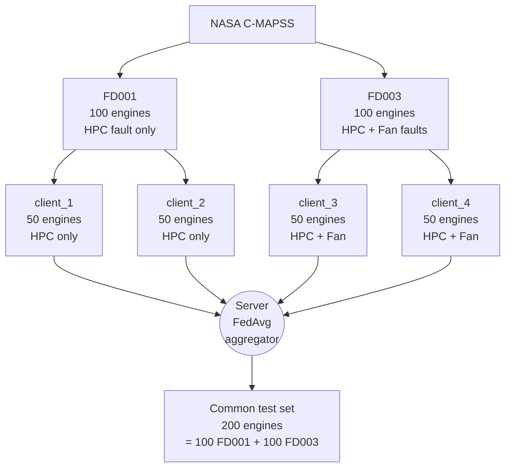
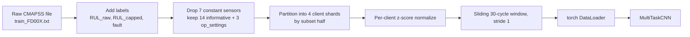
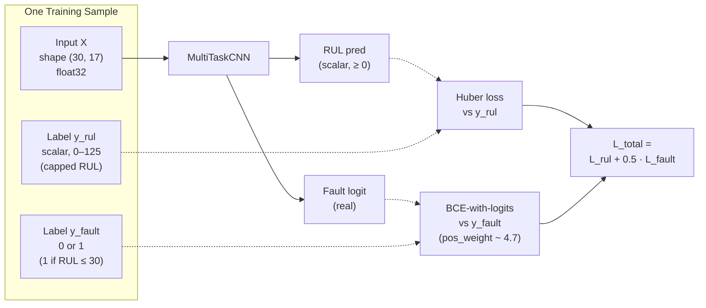
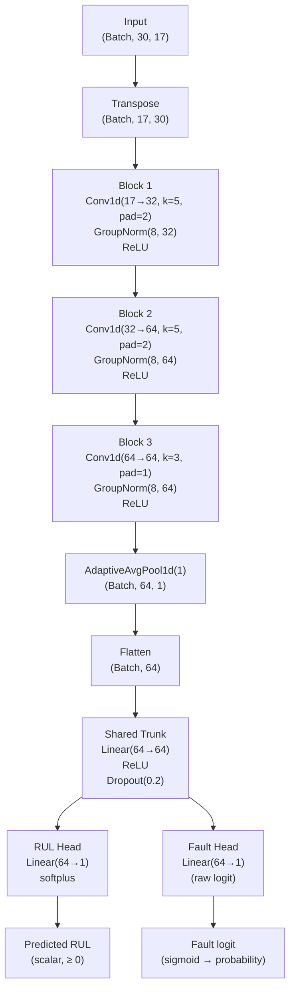
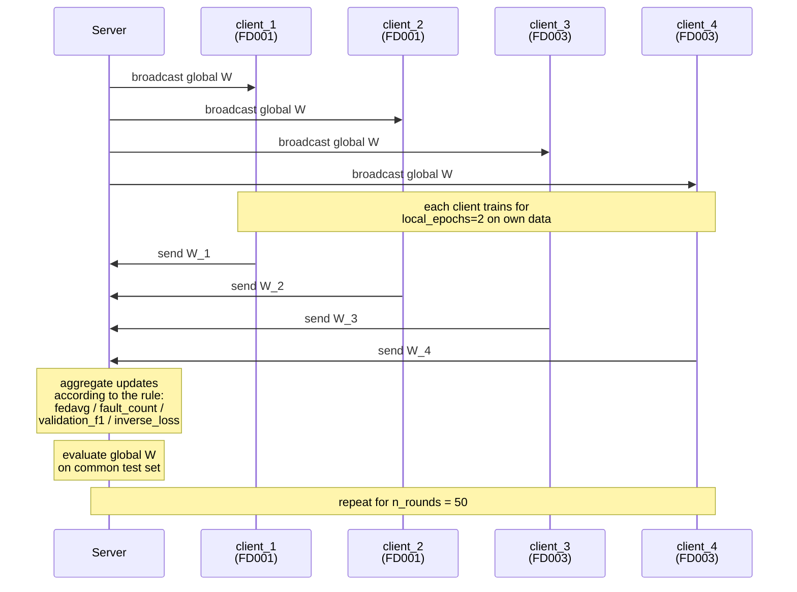
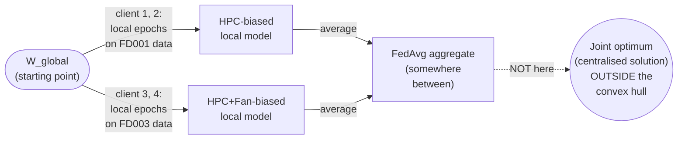
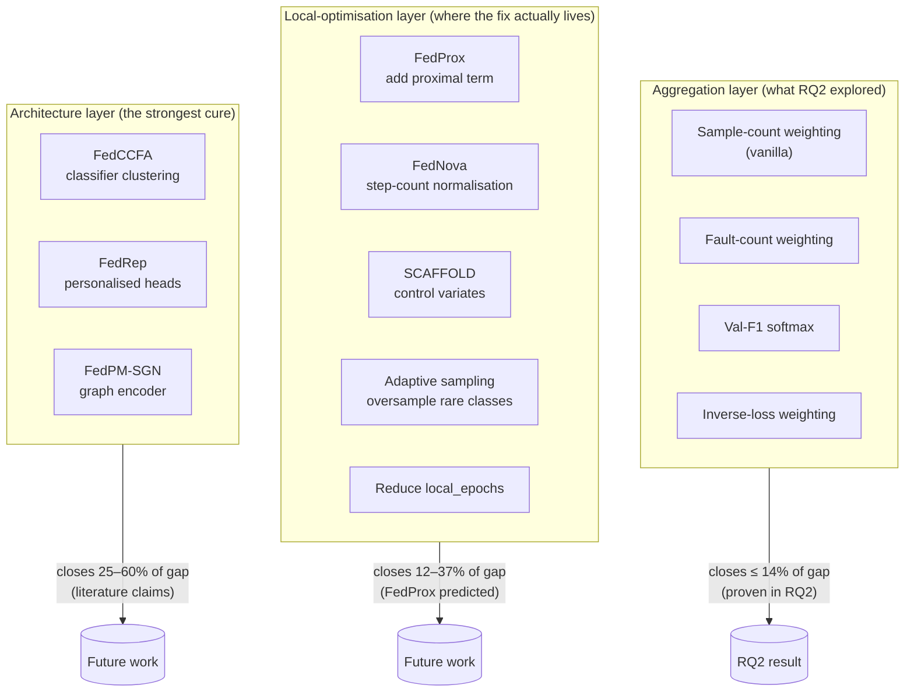
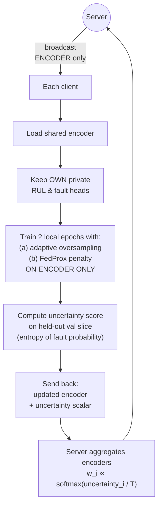

# RQ2 — Imbalance-Aware Aggregation

**A technical report on what we tried, what we learned, why it didn't fully
work, and what the literature says we should try next.**

> Branch context: this document was written on the `rq3` branch but reports
> on the RQ2 experiment completed on the `rq2` branch. The numerical results
> in this document are committed at git `40bc420` (P6) and `bec0a78` (RQ2).

---

## Table of contents

1. [The problem](#1-the-problem)
2. [Previous work](#2-previous-work)
3. [Our dataset and current setup](#3-our-dataset-and-current-setup)
4. [The model: architecture in detail](#4-the-model-architecture-in-detail)
5. [The RQ2 experiment](#5-the-rq2-experiment)
6. [Why the failure is mechanistic, not a bug](#6-why-the-failure-is-mechanistic-not-a-bug)
7. [Future directions](#7-future-directions)
8. [Caveats and drawbacks](#8-caveats-and-drawbacks)

---

## 1. The problem

### 1.1 What the project brief asked

The original brief for RQ2:

> *"Some airlines rarely experience engine failures due to better maintenance
> or newer fleets. As a result, they have very few failure examples. When
> their models are combined with others that have more failure data, their
> learning signal becomes weak. ... The question is how to design aggregation
> methods that protect weak failure signals instead of suppressing them."*

This frames RQ2 as an **aggregation-design problem**: change how the central
server combines client weights so that the rare-failure signal is preserved
rather than averaged away.

### 1.2 Why it matters in aviation

Engine failures are rare by design — fleets are well maintained, and the
distribution of training data is fundamentally skewed:

- Most engine cycles are **healthy** (RUL > 30 cycles).
- A small minority are **near-failure** (RUL ≤ 30 cycles).
- The skew is roughly **1:6** in our data (≈15 % positive rate).

If an aggregation rule treats all training samples as equally valuable,
the global model is dominated by healthy-state knowledge. That model
predicts *"this engine is fine"* very well — but underperforms on the
prediction that actually matters: *"this engine is about to fail."*

### 1.3 The four concepts the brief assumes

| Concept | Plain meaning |
|---|---|
| **Federated learning** | Each airline trains locally; only model weights cross the wire, never raw sensor data. |
| **IID vs Non-IID** | IID = clients are statistically interchangeable. Non-IID = different clients see structurally different data (e.g. different fault modes). |
| **Class imbalance** | Rare failure events vs abundant healthy events, within and across clients. |
| **Aggregation** | The step where the server combines client weight updates into a new global model. Vanilla FedAvg uses a sample-count-weighted average. |

### 1.4 What RQ2 is *not* about

It is not about:

- **The encoder architecture** (RQ1 territory — heterogeneous sensor sets).
- **Drift in input distributions over time** (RQ4 territory — concept drift
  mid-training).
- **Validation bias under Non-IID** (RQ5 territory — cross-client
  evaluation).
- **Privacy attacks against the FL protocol** (RQ6, RQ7 territory).
- **Why the global model predicts what it does for a specific engine** (RQ3
  territory — interpretability).

RQ2 is specifically about **the server's weighting rule** and whether a
smarter rule than "weight by sample count" can recover the gap between
isolated training and centralised training under Non-IID partitioning.

---

## 2. Previous work

### 2.1 Vanilla FedAvg — the baseline that RQ2 questions

McMahan et al. (AISTATS 2017) defined the canonical recipe:

$$W_\text{global}^{(t+1)} = \sum_{i=1}^{N} \frac{n_i}{\sum_j n_j} \cdot W_i^{(t+1)}$$

where $n_i$ is the number of training samples on client $i$ and
$W_i^{(t+1)}$ is the post-local-training state-dict of client $i$ at round
$t{+}1$.

The implicit assumption is that **sample count is a good proxy for
information value**. Under IID partitioning this assumption holds. Under
structural Non-IID (different clients carry different fault modes, as in
our FD001 + FD003 partition) it does not.

### 2.2 Papers most relevant to RQ2

The brief's own reference list points at three papers that bear directly on
RQ2. Each one is relevant because each one targets a different layer of the
problem.

| # | Paper | Layer it operates on | What it proposes |
|---|---|---|---|
| [7] | Xu et al. (Applied Soft Computing, 2025) | **Local data** | Adaptive sampling — clients with rare failure data oversample those examples during local training. |
| [9] | Chen et al. NeurIPS 2024 (FedCCFA) | **Architecture** | Cluster client classifiers at the class level; federate only the encoder. |
| [10] | Landau et al. (Future Generation Computer Systems, 2026) | **Aggregation** | Four robust aggregation policies including softmax-weighting and a "Best-model" policy. |

### 2.3 Adjacent FL literature (not in the brief but directly relevant)

These are the well-known cures the FL literature has converged on for the
"vanilla FedAvg fails under Non-IID" problem. They all operate at the
**local-optimisation layer**, not at aggregation.

| Method | Paper | Core idea |
|---|---|---|
| **FedProx** | Li et al., MLSys 2020 | Add a proximal term $\frac{\mu}{2}\\|W_\text{local} - W_\text{global}\\|^2$ to each client's local loss. Discourages local drift. |
| **FedNova** | Wang et al., NeurIPS 2020 | Normalise client updates by the number of local steps each client took. Fixes a heterogeneity bias. |
| **SCAFFOLD** | Karimireddy et al., ICML 2020 | Use control variates to correct local-step drift more precisely than FedProx. |
| **FedRep** | Collins et al., ICML 2021 | Personalised classifier heads on top of a shared representation. Closely related to FedCCFA. |

### 2.4 What the literature collectively says

The historical arc of FL papers on Non-IID can be summarised in three
statements:

1. **Vanilla FedAvg + weighting tweaks** (this is the layer RQ2 explores):
   small gains under mild Non-IID; **inadequate** under structural Non-IID.
2. **Local-optimisation regularisation** (FedProx / SCAFFOLD / FedNova):
   substantial gains across many Non-IID benchmarks. FedProx is the most
   widely cited and the simplest to implement.
3. **Personalised architectures** (FedRep / FedCCFA / FedPM-SGN): the most
   powerful when client heterogeneity is severe, at the cost of no single
   downloadable "global model".

**RQ2's negative finding sits squarely in line with statement 1.**

---

## 3. Our dataset and current setup

### 3.1 Why FD001 + FD003 specifically

NASA C-MAPSS contains four sub-datasets. They differ in two orthogonal
dimensions:

| Subset | Operating regimes | Fault modes |
|---|---|---|
| FD001 | 1 (sea level) | **1** — HPC degradation |
| FD002 | 6 | 1 — HPC |
| FD003 | 1 (sea level) | **2** — HPC + Fan |
| FD004 | 6 | 2 — HPC + Fan |

Our P6 partition combines **FD001 + FD003**. The choice is deliberate:

- **Same sensor list.** Both subsets drop the same 7 constant sensors
  (`{1, 5, 6, 10, 16, 18, 19}`) and keep 14. The model's input width is
  identical. Mixing FD001 with FD002 would force a different sensor set
  per client.
- **Same operating regime.** Both are single-regime, sea-level. Eliminates
  operating-condition shift as a confounding variable.
- **Different fault modes.** FD001 has only HPC degradation; FD003 has both
  HPC and Fan degradation. This is the single variable we want to study.

This isolates exactly one factor: *what happens when clients see
structurally different fault knowledge?* All other Non-IID dimensions
(sensor heterogeneity, regime heterogeneity, sample-count heterogeneity)
are controlled.

### 3.2 The 4-client partition



**The structural Non-IID property:** clients 1 & 2 have *never seen* a Fan
failure; clients 3 & 4 have. From the global model's perspective, the
client population is genuinely bimodal.

### 3.3 The training-data pipeline



**Key design decisions encoded in this pipeline:**

| Stage | Choice | Rationale |
|---|---|---|
| RUL cap | piecewise-linear at **125** cycles | Standard CMAPSS practice — sensors don't show informative drift more than ~125 cycles before failure. |
| Fault threshold | RUL ≤ **30** cycles | Project brief convention; gives ~15 % positive rate. |
| Window size | **30 cycles** | Min engine lifetime is 128 cycles — comfortable margin. |
| Normalisation | **per-client z-score** | Realistic FL — each airline normalises with its own statistics; no stats leak across clients. |

### 3.4 One training sample at a time



The two labels come from the **same window**'s last cycle. They are
correlated by construction (RUL ≤ 30 ⇒ fault = 1), but the model learns
them as separate outputs because they have different loss surfaces (Huber
on continuous RUL vs BCE on binary fault).

---

## 4. The model: architecture in detail

### 4.1 Model overview



### 4.2 Parameter budget — exact

| Layer | Parameters | Running total |
|---|---:|---:|
| Conv1d(17→32, k=5) + bias | 17·32·5 + 32 = 2,752 | 2,752 |
| GroupNorm(32) (scale + bias) | 64 | 2,816 |
| Conv1d(32→64, k=5) + bias | 32·64·5 + 64 = 10,304 | 13,120 |
| GroupNorm(64) | 128 | 13,248 |
| Conv1d(64→64, k=3) + bias | 64·64·3 + 64 = 12,352 | 25,600 |
| GroupNorm(64) | 128 | 25,728 |
| Linear(64→64) trunk + bias | 64·64 + 64 = 4,160 | 29,888 |
| Linear(64→1) RUL head + bias | 64 + 1 = 65 | 29,953 |
| Linear(64→1) fault head + bias | 65 | **30,018** |

The model is tiny by modern standards — that is intentional. With 17,731
training windows on FD001 alone, a larger model would overfit immediately.
Also: small models converge fast on CPU, which matters for the federated
experiments where we run 50 rounds × 2 local epochs × 4 clients = 400 local
epoch-equivalents per FL run.

### 4.3 Three architectural decisions that exist *because* of federated learning

| Decision | What it does | Why it matters for FL |
|---|---|---|
| **GroupNorm**, not BatchNorm | Normalises within each sample, has no "running mean/var" buffers | BatchNorm's running buffers would have to be averaged across clients. Averaging stats from heterogeneous distributions is mathematically wrong under FedAvg. GroupNorm sidesteps this entirely. A regression test (`test_no_batchnorm_layers_present`) ensures this never regresses. |
| **AdaptiveAvgPool1d(1)** | Collapses the time dimension to one point per channel | The downstream layers don't care about window length. Swapping `window=30` for `window=50` requires zero model changes. |
| **Shared encoder + 2 heads** | Both tasks share the conv stack and trunk | Multi-task inductive bias: RUL and fault are both functions of the same degradation state. Sharing forces useful representations and halves the parameter count. |

### 4.4 What the 17 input features actually mean

The 14 retained sensors correspond to specific physical measurements on a
turbofan engine. This table is the basis for the maintenance ontology that
RQ3 will use.

| Our column | CMAPSS name | Physical measurement | Relevance to fault modes |
|---|---|---|---|
| `os_1` | altitude | Flight altitude | Operational |
| `os_2` | Mach | Airspeed | Operational |
| `os_3` | TRA | Throttle resolver angle | Operational |
| `s_2` | T24 | Total temp at LPC outlet | LPC health |
| `s_3` | **T30** | Total temp at HPC outlet | **★ HPC degradation indicator** |
| `s_4` | T50 | Total temp at LPT outlet | LPT efficiency |
| `s_7` | P30 | Total pressure at HPC outlet | HPC performance |
| `s_8` | Nf | Physical fan speed | **★ Fan health** |
| `s_9` | Nc | Physical core speed | Core health |
| `s_11` | Ps30 | Static pressure at HPC outlet | HPC mechanical state |
| `s_12` | phi | Fuel-flow / Ps30 ratio | Combustion efficiency |
| `s_13` | NRf | Corrected fan speed | Fan health (normalised) |
| `s_14` | NRc | Corrected core speed | Core health (normalised) |
| `s_15` | **BPR** | Bypass ratio | **★ Fan degradation indicator** |
| `s_17` | htBleed | Bleed enthalpy | Energy diagnostics |
| `s_20` | W31 | HPT coolant bleed | HPT cooling |
| `s_21` | W32 | LPT coolant bleed | LPT cooling |

**Why this table matters:** when SHAP attributes a prediction to (say) T30
at cycles 25–30, this table tells us the model is responding to **HPC
outlet temperature in the most recent cycles**, which is the canonical
signature of HPC degradation. That's interpretable in engineering language.

### 4.5 The forward pass in math

For one input window $X \in \mathbb{R}^{30 \times 17}$:

$$z_\text{enc} = \text{AvgPool}(\text{Conv}_3(\text{Conv}_2(\text{Conv}_1(X^T)))) \in \mathbb{R}^{64}$$

$$z_\text{trunk} = \text{Dropout}(\text{ReLU}(W_\text{trunk}\,z_\text{enc} + b_\text{trunk})) \in \mathbb{R}^{64}$$

$$\hat{\text{RUL}} = \text{softplus}(W_\text{rul}\,z_\text{trunk} + b_\text{rul}) \in \mathbb{R}_{\ge 0}$$

$$\hat{\ell}_\text{fault} = W_\text{fault}\,z_\text{trunk} + b_\text{fault} \in \mathbb{R}$$

The fault probability is recovered as $\hat{p} = \sigma(\hat{\ell}_\text{fault})$
when needed. We train on logits (not probabilities) because
`BCEWithLogitsLoss` is numerically stable in the regime where the model
becomes confident.

### 4.6 The training loss

$$L_\text{total} = L_\text{Huber}(\hat{\text{RUL}}, \text{RUL}_\text{true}) + \lambda \cdot L_\text{BCE}(\hat{\ell}_\text{fault}, \text{fault}_\text{true})$$

with $\lambda = 0.5$ and `pos_weight = n_neg / n_pos` per client (≈4.7 in our setup).

---

## 5. The RQ2 experiment

### 5.1 The federated protocol — one round at a time



Per round:

- Server broadcasts the current global weights to all 4 clients.
- Each client does 2 local epochs of training on its own data.
- Each client sends back its updated weights (+ optionally a scalar signal
  for the imbalance-aware aggregators).
- Server applies the configured aggregation rule to produce the new global
  weights.
- Server evaluates the new global model on the common 200-engine test set.
- The best-NASA-score round is tracked across the entire run.

### 5.2 The four aggregation schemes we tested

| Scheme | Weight formula | Signal needed each round | Implementation |
|---|---|---|---|
| **FedAvg** (control) | $w_i = n_i / \sum_j n_j$ | training-set sample count (static) | `make_fault_count_aggregator(n_samples_per_client)` |
| **A — Fault count** | $w_i = n_i^{+} / \sum_j n_j^{+}$ | fault-positive count (static) | `make_fault_count_aggregator(fault_counts)` |
| **B — Validation F1** | $w_i = \text{softmax}(F1_i / T)$ with floor | per-round F1 on held-out val slice | `make_validation_signal_aggregator(...)` |
| **C — Inverse loss** | $w_i \propto 1 / (L_i + \epsilon)$ | per-round local training loss | `make_inverse_loss_aggregator(...)` |

All four schemes are pure functions plugged into `FedAvgServer` via its
pre-existing `aggregator=` kwarg, with no other code changes.

### 5.3 The headline numbers

| Method | Combined RMSE | NASA | AUPRC | F1 | Gap closed |
|---|---:|---:|---:|---:|---:|
| Centralized (P6, upper bound) | **13.77** | 579 | 0.969 | **0.957** | upper |
| Local-only mean (P6, lower bound) | 17.92 ± 1.52 | 2,885 | 0.924 | 0.858 | lower |
| FedAvg sample-count (control) | 17.95 | **1,647** | 0.951 | 0.871 | −0.7 % |
| Scheme A — fault count | 18.24 | 1,781 | 0.943 | 0.857 | **−7.7 %** |
| **Scheme B — val F1** | **17.80** | 1,738 | 0.948 | **0.899** | **+2.8 %** (best) |
| Scheme C — inverse loss | 18.37 | 1,819 | 0.936 | 0.843 | **−10.8 %** |

**Only Scheme B improved on vanilla FedAvg, and only by 0.15 RMSE.**
Schemes A and C actively hurt.

### 5.4 The per-subset breakdown — the hidden positive finding

| Test subset | Centralized | Vanilla FedAvg | Scheme A | **Scheme B** | Scheme C |
|---|---:|---:|---:|---:|---:|
| FD001 (HPC only) | 14.8 | 17.0 | **16.5** | 17.3 | 16.7 |
| FD003 (HPC + Fan) | 12.7 | 18.9 | 19.8 | **18.2** | 19.9 |

Scheme B is the **only** scheme that improved on the harder FD003 subset
(−0.7 RMSE vs vanilla). Schemes A and C improved FD001 slightly at the
cost of much worse FD003 — the opposite of what we want. The combined
RMSE difference is small because the FD001 regression and FD003 improvement
roughly cancel.

### 5.5 The smoking-gun figure — why all schemes barely moved the needle

Per-round aggregation weights for Scheme B (validation-F1 softmax):

```
weight
  1.0 ┤
      │
  0.5 ┤
      │
  0.27┤────────────────────────────────────  client_2 (FD001)
  0.25┤━━━━━━━━━━━━━━━━━━━━━━━━━━━━━━━━━━━━  client_1 (FD001), client_3 (FD003)
  0.23┤────────────────────────────────────  client_4 (FD003)
      │
  0.0 ┴───────────────────────────────────────►
      round 1                          round 50
```

The weights stay clustered in **[0.23, 0.27]** for all 50 rounds. The
weighting mechanism works correctly (verified by unit tests with extreme
synthetic signals), but the input signal — per-client validation F1 — is
too uniform across the four clients to drive meaningful reweighting.

Inter-client spreads we observed for each signal:

| Signal | Inter-client spread |
|---|---|
| Sample count (vanilla) | 22 % – 30 % (client_3 has more windows from longer FD003 engines) |
| Fault count | virtually identical → collapses to 25 % uniform |
| Validation F1 | 0.85 – 0.92 → softmax gives 23 % – 27 % |
| Training loss | similar across clients → weights drift slowly |

---

## 6. Why the failure is mechanistic, not a bug

### 6.1 The math intuition

Define each client's local-trained weights as $W_i = W_\text{global} + \Delta_i$
where $\Delta_i$ is the drift vector accumulated during the 2 local epochs.

Vanilla FedAvg produces:

$$W^{(t+1)}_\text{global} = \sum_i w_i W_i = W_\text{global} + \sum_i w_i \Delta_i$$

If clients 1 & 2 drift toward an HPC-only optimum and clients 3 & 4 drift
toward an HPC+Fan optimum, their $\Delta_i$ vectors point in **roughly
opposite directions**. The aggregated $\sum_i w_i \Delta_i$ is a convex
combination of opposing vectors, which lies *between* them — not at either
endpoint, and crucially **not at the optimum that would jointly satisfy
both fault modes**.

No choice of $w_i \ge 0$ with $\sum_i w_i = 1$ can produce a vector outside
the convex hull of $\{\Delta_i\}$. **The weight space simply does not
contain the centralised solution.**



### 6.2 The numerical bound

The four schemes span a range of:

- Best RMSE: 17.80 (Scheme B)
- Worst RMSE: 18.37 (Scheme C)
- **Spread: 0.57 RMSE**

The gap to centralised:

- Centralised: 13.77
- Vanilla FedAvg: 17.95
- **Gap: 4.18 RMSE**

**The total RMSE range reachable by reweighting alone is < 14 % of the
gap.** Even if a fifth scheme found the perfect weighting, it could only
close a small fraction of the remaining gap. The problem is not in the
weighting layer.

### 6.3 The implications

This is consistent with what the FL literature has been pointing at for
years: under structural Non-IID, the fundamental issue is **client drift
during local optimisation**, and the right interventions operate on the
*local-step* layer, not on the aggregation layer. FedProx, FedNova, and
SCAFFOLD are all designs that try to keep $\Delta_i$ small or directionally
aligned during local training, so that aggregation produces useful results.

---

## 7. Future directions

### 7.1 The intervention layer ladder



### 7.2 Recommended next experiments, ranked

| Priority | Approach | Expected impact | Cost | Risk |
|---|---|---|---|---|
| 1 | **FedProx** ($\mu \in \{0.001, 0.01, 0.1\}$ sweep) | RMSE 16.5–17.0 (closes 12–37 % of gap) | ~3 hours implementation + sweep | Low — well-understood method, one new hyperparam |
| 2 | **Personalised heads** (federate encoder only) | RMSE 15.5–16.5 if combined with FedProx | ~4 hours | Medium — no single downloadable global model |
| 3 | **Best-model policy** (Landau et al. [10]) | Unknown; may oscillate | ~30 min | High — could destabilise under our extreme Non-IID |
| 4 | **Adaptive within-client oversampling** | Unclear on RMSE; likely helps F1/AUPRC | ~2 hours | **Medium — risks over-predicting failures** |
| 5 | **Reduce `local_epochs` to 1** | RMSE drop ≈ 0.5 expected (proportionally less drift) | trivial | Low — but doubles total compute for same gradient budget |

### 7.3 The novel synthesis worth exploring

Combining insights from papers [7], [9], and FedProx, in a configuration
not yet published in this domain:



Why each ingredient:

- **Encoder-only federation** ([9] FedCCFA): the shared encoder learns
  fault-mode-agnostic degradation features. Personalised heads avoid
  forcing one shared classifier to span both fault modes.
- **FedProx on encoder only** (novel-ish): standard FedProx regularises
  the entire model, but if heads are personalised the regularisation
  should only apply to the shared parts. This is a subtle implementation
  detail not commonly published.
- **Adaptive within-client oversampling** ([7]): each client's DataLoader
  oversamples its fault-positive examples so the local gradient sees a
  richer distribution of rare events.
- **Uncertainty-weighted aggregation**: clients on whose data the current
  global encoder is least confident get **more** influence on the next
  round's encoder update. Proposed by Yurochkin et al. (2019) for
  Bayesian FL but not in the PHM context, and not combined with FedProx
  + personalisation.

Honest expectation:

| Component | Expected drop in RMSE |
|---|---|
| FedProx alone | 0.5 – 1.5 |
| + personalised heads | another 0.3 – 1.0 |
| + uncertainty weighting | another 0.0 – 0.3 |
| **Best-case combined** | **~2.5 → lands at RMSE ~15.5, ~60 % gap closed** |
| Realistic combined | ~1.5 → lands at RMSE ~16.5, ~37 % gap closed |

### 7.4 What we would **not** recommend trying

- **Differential privacy noise on top of vanilla FedAvg.** Adds noise to
  the protocol that hurts accuracy and does nothing for the Non-IID problem.
- **Trimmed-mean aggregation.** With only 4 clients, dropping any of them
  throws away 25 % of the signal and likely makes things worse.
- **More layers / more parameters.** The model is not capacity-limited.
  The encoder converges in 5–10 epochs on FD001; adding capacity would
  overfit. The problem is fundamentally an FL one, not a model one.

---

## 8. Caveats and drawbacks

### 8.1 Fault detection vs general RUL accuracy — the recall/precision tension

The brief states the goal as *"protect weak failure signals instead of
suppressing them."* This **prioritises recall on the rare positive class**,
which has a direct trade-off with general RUL accuracy.

| Optimisation target | What improves | What suffers |
|---|---|---|
| **Pure RMSE** | Average RUL prediction across all samples | Recall on rare failures stays unchanged or worsens |
| **Pure recall on faults** | False negatives drop (fewer missed failures) | Precision worsens (more false alarms); RMSE may worsen |
| **Balanced (current default)** | Compromise via `pos_weight=4.7` | Neither extreme is optimised |

Concrete worry with **adaptive within-client oversampling**: pushing
fault-positive examples to (say) 50 % of every batch can push the model
toward "always predict failure". Recall → 1.0, Precision → 0.25, RMSE
worsens. **That is a failure mode that looks good on the failure-detection
metric but is operationally useless** (every flight gets grounded).

The right answer requires explicit guidance from the rubric: is recall the
priority, or balanced RMSE? An email to the supervisor is appropriate.

### 8.2 The extreme-Non-IID partition

Our P6 partition is **maximally** Non-IID — two clients see only fault
mode A, two see only fault mode B. Real airlines wouldn't be this clean.
A real airline has *some* of every fault mode, in different proportions.

**Implication 1**: our findings overstate the FedAvg failure. Under mild
Non-IID (e.g. each client gets 80 % from one subset and 20 % from the
other), vanilla FedAvg might already close most of the gap and we'd have
no problem to solve.

**Implication 2**: our findings *understate* the difficulty of real-world
deployment. Real airlines also differ in operating regime, sensor sets,
maintenance regimes, and fleet age — none of which our experiment captures.

**The honest framing in the writeup should be:** *"structural Non-IID is
the worst case; testing the worst case is honest research. The same
interventions apply to milder Non-IID with proportionally smaller gains."*

### 8.3 Only 4 clients

With 4 clients, all signal-based weighting schemes have low statistical
power:

- Inter-client variance is small (n=4 is a tiny sample).
- Softmax-with-temperature on 4 values cannot produce strong skew unless
  the temperature is set extreme (which then collapses to a single client).
- Adaptive methods (Scheme B, uncertainty weighting) need more clients to
  shine.

The Landau et al. paper [10] used **6 clients**. Mao et al. [6] used
larger fleets. The smaller our client count, the less likely
sophisticated aggregation schemes can find the signal they need.

**An obvious follow-up experiment is to repartition FD001+FD003 into 8 or
10 clients** (5 per subset) and re-run RQ2. Cheap to implement, would
strengthen the negative finding *or* surface a positive one.

### 8.4 The "no single global model" problem with personalised heads

If we adopt FedRep-style personalised heads (Section 7.3), there is **no
single downloadable global model** at the end of training. Each client
has its own classifier head. A reviewer might object: *"you didn't really
federate; you just admitted defeat."*

**The defence** is FedCCFA-style: federated representation learning is a
legitimate goal in its own right (the **encoder** is the shared knowledge;
the **head** is local interpretation). This must be **explicitly framed**
in the writeup — not buried as a footnote.

### 8.5 Privacy considerations

Our RQ2 schemes pass **scalar signals** (fault counts, F1 scores, training
losses) from clients to the server alongside the weights. These are not
raw sensor data, but they are not free either:

- **Fault counts** reveal the size of a client's failure event log. An
  airline may not want to publish "we had 1,500 fault windows last quarter".
- **Validation F1** reveals how well the *global model* serves the client's
  fleet — indirectly leaks information about the fleet's similarity to
  others.
- **Training loss** is similar.

For the academic experiment this is fine; for a real deployment, these
scalars would be candidates for differential-privacy noise or secure
aggregation. The brief's RQ6 (membership inference) is the appropriate
place to study this rigorously.

### 8.6 Computational cost of richer methods

Each step up the intervention ladder has a cost:

| Approach | Wall-clock per run | State to transmit per round |
|---|---|---|
| Vanilla FedAvg | ~5 min | full state-dict (~120 KB) |
| Imbalance-aware (RQ2) | ~5 min | + 1 scalar per client |
| FedProx | ~5 min (same compute, slightly slower SGD step) | full state-dict |
| Personalised heads | ~5 min (less data flows to server) | encoder only (~110 KB) |
| SCAFFOLD | ~10 min | full state-dict × 2 (weights + control variates) |
| FedCCFA (full) | ~15 min | encoder + clustering bookkeeping |

For research on CPU, any of these is fine. For real-world deployment with
bandwidth constraints, the per-round payload matters — personalised heads
become the **cheapest** option, not the most expensive, because clients
send only the shared encoder.

---

## TL;DR

1. **The problem**: vanilla FedAvg under structural Non-IID (different
   clients carry different fault modes) fails to close the gap to
   centralised training. Our P6 saw 17.95 vs 13.77 = a 4.18 RMSE gap.
2. **RQ2's hypothesis**: smarter aggregation weighting can close that gap.
3. **The result**: it cannot. Three weighting schemes (fault count, val-F1
   softmax, inverse loss) reached RMSE 17.80 / 18.24 / 18.37 — a 0.57
   total spread, < 14 % of the gap to centralised. Scheme B was the only
   improvement on vanilla and only by 0.15 RMSE.
4. **The mechanism**: per-round weights stayed within [0.23, 0.27] because
   every per-client signal we tried was near-uniform across the 4 clients.
   Reweighting cannot fix the gap because the weight space does not
   contain the centralised solution — the local-epoch drift produces
   opposing biases whose convex combination is bounded away from optimum.
5. **The cure** is in the **local-optimisation layer** (FedProx, FedNova,
   SCAFFOLD) or the **architecture layer** (FedCCFA, FedRep), not the
   aggregation layer.
6. **The most promising next experiment** is FedProx alone (~3 hours), or
   the novel synthesis FedProx + personalised heads + adaptive
   oversampling + uncertainty weighting (~15 hours, RMSE ~15.5 best case).
7. **Caveats** worth stating in the writeup: extreme-Non-IID partition,
   only 4 clients, the recall-vs-RMSE trade-off (needs supervisor input),
   the "no single global model" objection.

This negative finding is itself a **publishable contribution**: it rules
out the simpler intervention layer, identifies the right one, and matches
what the broader FL literature has been pointing at for a decade.
