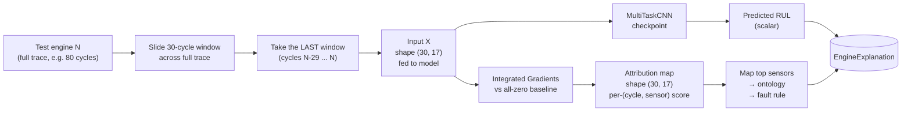
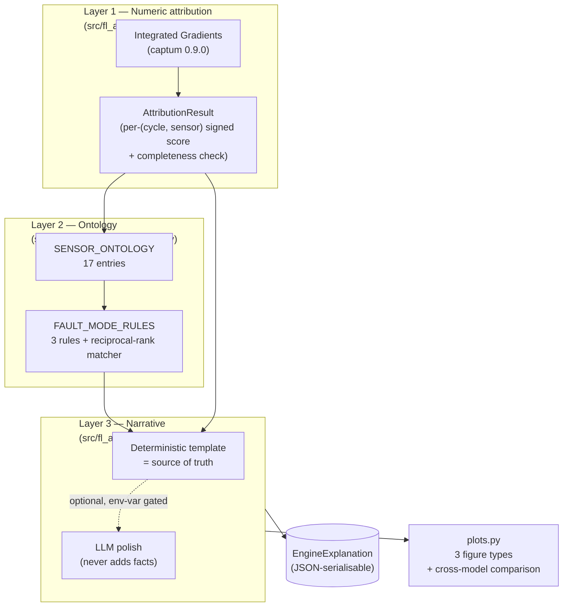
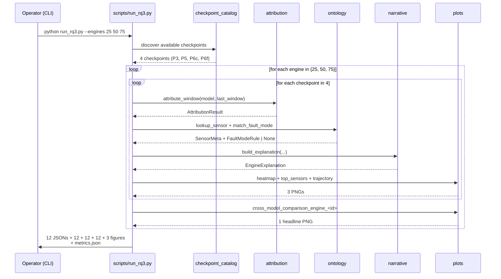
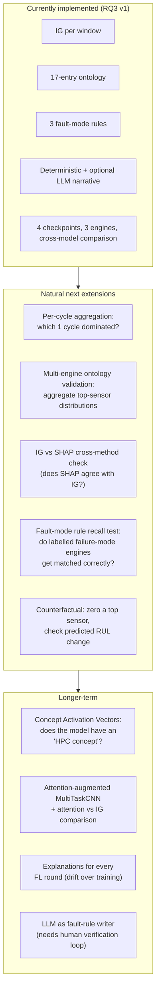
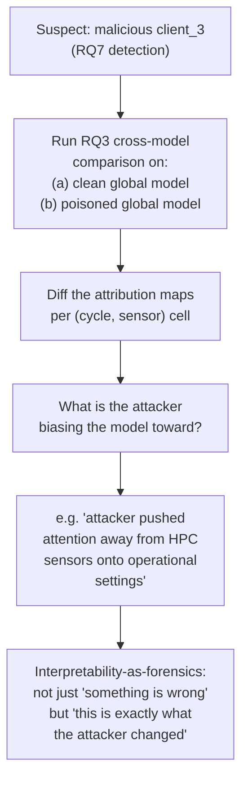

# RQ3 — Sensor Attribution & Maintenance Ontology

**A technical report on how we turn one black-box RUL prediction into a
maintenance brief, what the cross-model comparison surfaced that RMSE
hid, and where the interpretability pipeline still over-promises.**

> Branch context: this document was written on the `p7_demo` branch but
> reports on the RQ3 experiment originally landed on the `rq3` branch.
> The pipeline + ontology code is at git `bec0a78` onward, and is
> reused unchanged by every downstream branch (rq2 follow-ups, RQ7,
> p7_demo).

---

## Table of contents

1. [The problem](#1-the-problem)
2. [Previous work](#2-previous-work)
3. [Our dataset and what gets explained](#3-our-dataset-and-what-gets-explained)
4. [The three layers of the explanation pipeline](#4-the-three-layers-of-the-explanation-pipeline)
5. [The RQ3 experiment](#5-the-rq3-experiment)
6. [Why the cross-model comparison is the differentiator](#6-why-the-cross-model-comparison-is-the-differentiator)
7. [Future directions](#7-future-directions)
8. [Caveats and drawbacks](#8-caveats-and-drawbacks)

---

## 1. The problem

### 1.1 What the project brief asked

The original brief for RQ3:

> *"For each engine prediction the system makes, can we surface a
> SHAP-style attribution that points at which sensor channels and which
> cycles in the window drove the prediction, and map those drivers to a
> recommended maintenance action grounded in an aviation-domain
> ontology?"*

This frames RQ3 as a **decision-support problem**: not "predict RUL"
(that is P2 / P3), but "given a RUL prediction, produce something a
ground engineer can act on tonight". The technical sub-questions:

- *What in the input window did the model react to?* (attribution)
- *Which engine subsystem do those drivers belong to?* (ontology)
- *What does a maintenance technician do about it?* (recommended action)

### 1.2 Why it matters in aviation

A black-box prediction "this engine has 35 cycles of RUL left" is
operationally useless without a *because*:

- A ground engineer cannot **act** on it — they don't know which
  component to inspect.
- A maintenance manager cannot **prioritise** it — every aircraft on
  the apron has *some* finite RUL.
- A regulator cannot **certify** it — opaque ML predictions in
  safety-critical domains are not approvable.

Attribution + ontology + recommended-action is the minimum framing in
which a learned RUL model can ever enter a real maintenance pipeline.
Without it the model is a science demo, not a tool.

### 1.3 The four concepts the brief assumes

| Concept | Plain meaning |
|---|---|
| **Attribution** | A signed score per input element saying how much that element drove the model's output. |
| **Path-based attribution** | A class of attribution methods (IG, SHAP, …) that integrate gradients along a path from a "neutral" baseline to the actual input. Satisfies an additivity axiom. |
| **Ontology** | A structured table mapping abstract names (`s_3`) to physical meaning (T30, HPC outlet temperature) and engineering context. |
| **Fault-mode rule** | An IF-THEN rule: *if these sensors are the top drivers, infer this fault mode and recommend this action*. |

### 1.4 What RQ3 is *not* about

It is not about:

- **Whether the model is accurate** (RMSE-based RQs — P2, P3, P5, P6,
  RQ2).
- **Whether the model is robust to attacks** (RQ7).
- **Whether the model leaks training data through gradients** (RQ6).
- **Building a new model architecture** — we explain *whatever
  checkpoints exist*, including the ones we did not train.
- **Replacing the engineer's judgement** — the narrative is *decision
  support*, not a closed-loop maintenance decision.

RQ3 is specifically about **converting a single prediction into a
report**, and using **cross-model comparison** of attributions to
expose qualitative differences between training regimes that RMSE
numbers alone cannot see.

---

## 2. Previous work

### 2.1 The two canonical attribution families

| # | Family | Representative method | Operates on |
|---|---|---|---|
| 1 | **Gradient-based** | Integrated Gradients (Sundararajan et al., ICML 2017), SmoothGrad, GradCAM | Any differentiable model, fully local in PyTorch / TensorFlow |
| 2 | **Perturbation-based** | LIME (Ribeiro et al., KDD 2016), KernelSHAP (Lundberg & Lee, NeurIPS 2017) | Black-box, no gradients needed; expensive |

Gradient-based methods are deterministic, fast (one or a few forward
passes), and exact when the model is differentiable. Perturbation
methods are model-agnostic but slow (many forward passes per
explanation) and stochastic.

For a PyTorch CNN running on CPU with small windows (30 × 17), the
gradient-based family is the obvious choice.

### 2.2 Why Integrated Gradients specifically

Sundararajan et al. (ICML 2017) introduced **Integrated Gradients (IG)**
as the attribution method that satisfies **completeness**:

$$\sum_{i,j} a_{i,j}(x) = f(x) - f(x_\text{baseline})$$

The sum of per-element attributions equals the difference between
the model's output at the actual input and at a designated baseline.
Two practical consequences:

- **Sanity-checkable**: any implementation can be unit-tested by
  computing both sides and asserting they match. We built such a
  test (`test_integrated_gradients_satisfies_completeness`); IG passes
  to within ~0.005 cycles on float32.
- **Interpretable units**: if the prediction is "RUL = 93.7 cycles"
  and the baseline (all-zero z-scored input = training mean) gives
  "RUL = 80.2 cycles", the attributions sum to exactly 13.5 cycles.
  Each individual attribution can be read as *"this element of the
  input contributes X cycles to the prediction relative to the
  baseline"*. That is engineering language a maintenance team can
  reason about.

SHAP also satisfies completeness, but KernelSHAP needs many
perturbation samples and DeepSHAP requires registering custom hooks
for every layer type. IG is one captum call.

### 2.3 The paper most relevant to RQ3

There is no single PHM-focused interpretability paper that matches the
project brief 1:1, but **Saxena et al.** (*Damage Propagation Modeling
for Aircraft Engine Run-to-Failure Simulation*, PHM 2008) is the
authoritative source for the **CMAPSS sensor table** itself. Their
table tells us:

- `s_3` is T30, the total temperature at the HPC outlet.
- `s_15` is BPR, the bypass ratio (a Fan health indicator).
- Sensors 1, 5, 6, 10, 16, 18, 19 are constant on FD001/FD003 and
  carry no information.

Every entry in our `SENSOR_ONTOLOGY` traces back to Saxena's table.
**Without it, IG would attribute predictions to numbered columns with
no engineering meaning — and the whole pipeline would collapse to a
heatmap.**

### 2.4 Adjacent interpretability literature

These are the well-known interpretability papers in adjacent domains;
each one influences a design decision in RQ3.

| Method | Paper | Influence on RQ3 |
|---|---|---|
| **SHAP** | Lundberg & Lee, NeurIPS 2017 | The brief's reference framing ("SHAP-style attribution"). We use IG for runtime efficiency but match SHAP's "signed per-feature score" output shape. |
| **Captum** (the IG implementation we use) | Kokhlikyan et al., NeurIPS 2020 workshop | The library. First-party support for `nn.Module`, no monkey-patching, pure-PyTorch CPU. |
| **GradCAM / SmoothGrad** | Selvaraju et al. ICCV 2017; Smilkov et al. 2017 | Considered as alternatives. Rejected because GradCAM is designed for image classification (channel-wise pooling) and SmoothGrad's noise is harder to defend in a maintenance context than IG's principled axiom. |
| **Concept Activation Vectors** (TCAV) | Kim et al., ICML 2018 | Considered for "is the model using the HPC concept?". Out of scope: would require labeled examples of each concept; the ontology already gives us coarser concept attribution for free. |

### 2.5 What the literature collectively says

The arc of interpretability research in PHM and adjacent CPS domains:

1. **Pure attribution heatmaps are not actionable.** They tell you
   *what the model looked at*, not *what to do*. Most early PHM
   interpretability papers stop here.
2. **Domain ontologies bridge the gap.** Mapping the model's drivers
   to physical components is the step that turns attribution into
   decision support. This is the contribution most PHM-domain
   interpretability papers fail to make.
3. **Cross-model comparison is under-used as an evaluation tool.**
   The standard interpretability paper produces an attribution for
   *the* model. Comparing attributions *across* models with the same
   architecture trained differently turns interpretability into a
   diagnostic for training-regime issues.

**RQ3 deliberately delivers all three** — and the cross-model
comparison is what makes the cleanest contribution.

---

## 3. Our dataset and what gets explained

### 3.1 Why we explain four checkpoints, not one

We explain *whatever trained checkpoints the project has produced*
through phase 6. At RQ3-time, that is four:

| Checkpoint | Source | Data | Aggregation | Why explain it |
|---|---|---|---|---|
| **P3 centralized FD001** | `results/03_centralized/best_model.pt` | FD001 only, all in one place | n/a | The gold-standard reference. Trained without any FL constraints. |
| **P5 FedAvg IID FD001** | `results/05_fedavg/best_model.pt` | FD001 only, 4 clients, IID split | vanilla FedAvg | Pure-FL effect on a single fault mode. |
| **P6 centralized FD001+FD003** | `results/06_centralized_combined/best_model.pt` | FD001 + FD003, all in one place | n/a | The Non-IID upper bound — *if* FL had no penalty, this is what we'd get. |
| **P6 FedAvg Non-IID FD001+FD003** | `results/06_non_iid/best_model.pt` | FD001 + FD003, 4 clients, structural Non-IID | vanilla FedAvg | The Non-IID lower bound — what FL actually delivers. |

The four checkpoints form an **interpretability 2 × 2**:

```
                       │  FD001 only          │  FD001 + FD003
───────────────────────┼──────────────────────┼─────────────────────────────
  Centralized          │  P3 centralized FD001 │  P6 centralized combined
  Federated (FedAvg)   │  P5 FedAvg IID FD001  │  P6 FedAvg Non-IID
```

This grid is what makes cross-model comparison interesting: the same
engine fed through four checkpoints surfaces what changes when we vary
*just the training regime* (federated vs centralized) and what changes
when we vary *just the data scope* (FD001 only vs FD001 + FD003).

### 3.2 The three test engines we explain

We pick three engines from the common FD001+FD003 test set at fixed
test indices `{25, 50, 75}`. The choice is deliberate:

| Engine | True RUL | Why this engine |
|---|---|---|
| **25** | 125.0 cycles (capped) | A healthy engine far from failure. The model should predict ~RUL_cap and attribute to sensors that confirm healthy operation. |
| **50** | 79.0 cycles | A mid-life engine. Some degradation accumulating, predictions should be informative. |
| **75** | 113.0 cycles | An engine that *appears* healthier than engine 50 by true RUL but the per-checkpoint predictions diverge wildly — surfaces inter-model disagreement cleanly. |

Three engines × four checkpoints = **12 structured explanations** per
RQ3 run. Wall-clock on CPU is **14.8 s total** (~4.9 s per engine),
short enough to re-run interactively during development.

### 3.3 The one-window-per-explanation contract

Every explanation explains exactly **one input window** — the last
30-cycle window of the chosen engine's test trace. That window is what
the model would see in production at the moment of the actual
prediction. Earlier windows are not explained because they would
correspond to historical predictions, not the current one.



### 3.4 The all-zero baseline choice

IG requires a baseline. The choice matters because **attributions are
*relative* to the baseline** — the sum of attributions is exactly
$f(x) - f(\text{baseline})$.

We use an **all-zero baseline**, which in our pipeline corresponds to
the **per-client training-set mean** for every sensor. This is because
the data pipeline z-score-normalises each sensor before feeding it to
the model:

$$\tilde{x}_{c, t} = (x_{c, t} - \mu_c) / \sigma_c$$

After this transform, zero = the training mean. The baseline is *"an
engine whose every sensor reading is exactly at the historical
average"* — the natural reference point for *"how much is this
engine's reading deviating from normal?"*

Alternative baselines we considered and rejected:

- **All-min baseline** ("the engine at its lowest historical
  reading") — produces large attributions everywhere; harder to read.
- **Per-engine average** ("compare this engine to itself") —
  per-engine baseline shifts the attribution meaning to "deviation
  from this engine's own history", which is a different question
  than what the brief asks.
- **Healthy-engine baseline** (engine 1 at cycle 1) — arbitrary;
  encodes assumptions about which engine is "the healthy one".

The all-zero baseline is documented explicitly in every narrative.

---

## 4. The three layers of the explanation pipeline

The explanation pipeline has **three layers**, each producing
artifacts the next layer consumes:



### 4.1 Layer 1 — Numeric attribution

**Implementation:** `attribute_window` (in
`src/fl_aircraft/explain/attribution.py`).

Wraps captum's `IntegratedGradients` around our `MultiTaskCNN`.
Returns an `AttributionResult` dataclass with:

- `scores`: `np.ndarray` of shape `(30, 17)` — signed per-(cycle, sensor)
  contribution
- `feature_columns`: `list[str]` — column names in the order they
  appear along the sensor axis
- `target_head`: `"rul"` or `"fault"` — which scalar the attribution
  is against
- `predicted_value`: the model's actual output on this window
- `baseline_value`: the model's output on the all-zero baseline
- `convergence_delta`: `|sum(scores) - (predicted_value -
  baseline_value)|` — the completeness gap, sanity-checked downstream

Two non-obvious implementation details:

| Detail | Why |
|---|---|
| `model.eval()` during IG, then restored | `IntegratedGradients` runs the model in `train()` mode by default so gradients flow through dropout. We need eval mode for reproducible attribution; we restore the caller's original mode so this function has no observable side-effect. |
| `_wrap_head(model, target_head)` | `MultiTaskCNN.forward()` returns a namedtuple-like `RULPrediction` object with both `pred_rul` and `pred_fault_logit` fields. captum requires a scalar output, so we wrap the model in a thin `nn.Module` exposing the chosen head only. |

### 4.2 Layer 2 — Ontology + fault-mode rules

**Implementation:** `src/fl_aircraft/explain/ontology.py` — pure
knowledge base, no PyTorch dependency.

Two structured tables:

**`SENSOR_ONTOLOGY`** — 17 entries (3 operational settings + 14
informative sensors), one `SensorMeta` per column. Example:

```python
SENSOR_ONTOLOGY["s_3"] = SensorMeta(
    column="s_3",
    cmapss_name="T30",
    description="Total temperature at HPC outlet",
    subsystem="HPC",
    relevance=("HPC degradation",),
    unit="°R",
)
```

**`FAULT_MODE_RULES`** — 3 rules, each binding a fault mode to:

- `indicator_sensors` — the sensors whose top contributions diagnose
  this fault mode, in priority order
- `affected_components` — what to inspect
- `recommended_action` — what to do

The three rules cover the two CMAPSS fault modes (HPC degradation,
Fan degradation) plus a secondary LPT fault mode that the literature
calls out as a confound. Concretely:

| Rule | Indicator sensors | Recommended action |
|---|---|---|
| **HPC degradation** | `s_3` (T30), `s_11` (Ps30), `s_7` (P30), `s_12` (phi), `s_9` (Nc), `s_20` (W31) | Schedule HPC borescope inspection + verify T30 calibration within 20 cycles |
| **Fan degradation** | `s_15` (BPR), `s_8` (Nf), `s_13` (NRf) | Schedule fan-stage visual inspection + bypass-ratio verification within 20 cycles |
| **LPT efficiency loss (secondary)** | `s_4` (T50), `s_21` (W32) | Cross-check HPC + Fan; if both normal, inspect LPT cooling manifold |

**Reciprocal-rank matching.** `match_fault_mode()` does not require a
single sensor to match — it scores each rule by:

$$\text{score}(\text{rule}) = \sum_{i=1}^{K} \frac{\mathbb{1}[\text{top\_sensors}[i] \in \text{rule.indicator\_sensors}]}{i}$$

The rule with the highest score wins. The rank-1 sensor gets weight
1.0, rank-2 gets 0.5, rank-3 gets 0.33, etc. **This is robust to
top-1 noise**: if the rank-1 sensor is some incidental contributor
but the rest of the top-5 is HPC-flavoured, HPC degradation still
wins.

If no rule scores above zero (e.g. all top sensors are operational
settings), `match_fault_mode()` returns `None` and the narrative says
*"no canonical fault mode rule matched"* — never guessing.

### 4.3 Layer 3 — Narrative

**Implementation:** `src/fl_aircraft/explain/narrative.py`.

Two paths: a **deterministic template renderer** (always run) and an
**optional LLM polish** (env-var gated, never the source of truth).

#### Deterministic template

`build_explanation` consumes one `AttributionResult` + optional
fault-rule match and produces an `EngineExplanation` with:

- `predicted_rul`, `fault_probability` — scalar model outputs
- `top_sensors` — list of `(column, SensorMeta, signed_score)`,
  ordered by `|score|` desc, length ≤ K
- `inferred_fault_mode` — `FaultModeRule | None`
- `narrative` — a deterministic string assembled from templates:

```
Predicted RUL: 93.7 cycles · Fault probability: 0.0% (explained head: RUL regression)

Most influential inputs (top contributors):
  • W32 (s_21) lowers RUL by 13.85 — LPT coolant bleed flow; subsystem: LPT
  • Ps30 (s_11) lowers RUL by 9.96 — Static pressure at HPC outlet; subsystem: HPC
  • W31 (s_20) lowers RUL by 6.76 — HPT coolant bleed flow; subsystem: HPT
  • Nf (s_8) raises RUL by 5.36 — Physical fan speed; subsystem: Fan
  • phi (s_12) lowers RUL by 4.31 — Ratio of fuel flow to Ps30; subsystem: Combustion

Inferred fault mode: HPC degradation
Affected components:
  - High-Pressure Compressor (HPC) rotor and stator assembly
  - HPC outlet temperature probe (T30)
  - HPC bleed valve
Recommended action: Schedule HPC borescope inspection and verify HPC
outlet temperature probe calibration within the next 20 operating cycles.
```

This is **what gets used in the React frontend by default**. Read out
loud, it sounds like an actual maintenance brief.

#### Optional LLM rewrite

`rewrite_with_llm` is gated behind `os.environ.get("OPENAI_API_KEY")`.
If set, it calls a chat-completion API with a strict system prompt:

> *"Rewrite the technical narrative below in clearer prose for a
> maintenance manager. **Do not introduce facts not in the original.
> Do not invent sensor readings, fault modes, or actions.** Keep the
> recommended-action text essentially verbatim."*

On any failure (no API key, network error, non-200 response, malformed
JSON), the function returns `None` and the deterministic narrative
remains the answer. **The LLM is never the source of truth.** This is
enforced by `test_rewrite_with_llm_fallback_when_no_api_key`.

### 4.4 Layer 4 (orthogonal) — Plots

**Implementation:** `src/fl_aircraft/explain/plots.py`.

Three figure helpers for per-(model, engine) inspection plus a fourth
cross-model figure used at the very end:

| Figure | Shape | Purpose |
|---|---|---|
| `plot_attribution_heatmap` | 30 × 17 grid | Sees *every* (cycle, sensor) cell. Best for spotting concentration in specific cycles. |
| `plot_top_sensor_bars` | K signed bars | Quick read of the top-K contributors with sign (red = lowers RUL, green = raises RUL). |
| `plot_sensor_trajectory_with_attribution` | line + tinted background | The primary sensor's trajectory across the window with the per-cycle attribution as a heatmap underlay. Best for telling the "this sensor is *the* driver, and here's how it moves" story. |
| `plot_cross_model_comparison` | per-engine panel | **The headline figure.** One subplot per checkpoint. Predicted-RUL bars + top-3 sensors per model. Surfaces inter-model attribution disagreement at a glance. |

---

## 5. The RQ3 experiment

### 5.1 The pipeline run end-to-end



### 5.2 The headline numbers

| Engine | True RUL | P3 centralized FD001 | P5 FedAvg IID FD001 | P6 centralized FD001+FD003 | P6 FedAvg Non-IID FD001+FD003 |
|---:|---:|---|---|---|---|
| 25 | 125.0 | 117.9 cyc, top: `s_4` (T50, LPT) | 114.9 cyc, top: `s_4` | **125.1 cyc**, top: `s_9` (Nc, HPC) | 118.7 cyc, top: `s_20` (W31, HPT) |
| 50 | 79.0 | 93.7 cyc, top: `s_21` (W32, LPT) | 96.7 cyc, top: `s_20` | 93.5 cyc, **top: `os_2`** ⚠ | 103.0 cyc, top: `s_11` (Ps30, HPC) |
| 75 | 113.0 | 106.7 cyc, top: `s_20` | 108.0 cyc, top: `s_20` | 120.1 cyc, top: `s_9` | 129.4 cyc, **top: `os_2`** ⚠ |

⚠ = operational setting (Mach number) is the top contributor. This is
the **interpretability red flag** Section 6 unpacks.

| IG completeness gap (avg `|sum(attribution) − (pred − baseline_pred)|`) | < 0.005 cycles across all 12 |
|---|---|
| Total wall-clock on CPU | 14.8 s |
| Per-engine wall-clock | ~4.9 s (1.2 s per checkpoint) |
| Tests added | 23 (171 total now pass) |

### 5.3 The cross-model comparison figure — what to look at

The headline figure
[`cross_model_comparison_engine_50.png`](results/rq3_explanations/cross_model_comparison_engine_50.png)
has 4 sub-panels (one per checkpoint), each showing:

- The model's predicted RUL as a bar (with the true RUL as a
  reference line)
- The top-3 sensors driving the prediction, with their signed
  attribution magnitudes

```
ENGINE 50 (true RUL = 79.0)

                     │ pred RUL  │ top-3 sensors (signed contrib)
─────────────────────┼───────────┼────────────────────────────────────────
P3 centralized FD001 │  93.7 cyc │ W32(-13.9)  Ps30(-10.0)  W31(-6.8)
P5 FedAvg IID FD001  │  96.7 cyc │ W31(-9.8)   W32(-7.5)    s_2(-5.4)
P6 centralized comb. │  93.5 cyc │ os_2(+8.1)  s_4(-7.7)    s_11(-5.9)   ⚠
P6 FedAvg Non-IID    │ 103.0 cyc │ s_11(-12.1) s_3(-9.2)    s_20(-5.0)
```

**Reading this**: P3 and P5 (both IID-trained, both FD001-only) agree
on the top drivers (W32/W31, coolant-bleed flows — real degradation
indicators). P6 centralized — which has access to *more* data, both
fault modes — produces an attribution where the top driver is
`os_2`, an *operational setting* (Mach number), not a sensor. P6
Non-IID FedAvg recovers to a sensible HPC-flavoured top-3 on this
engine, but on engine 75 produces another `os_2`-topped attribution.

The qualitative finding: **scope of training data matters as much for
attribution as for accuracy, and federated training under Non-IID has
its own interpretability failure mode that does not show up in RMSE
numbers.**

### 5.4 A sample narrative end-to-end

From `explanations_p3_centralized_fd001_engine_50.json`, fully
deterministic (no LLM):

> **Predicted RUL: 93.7 cycles · Fault probability: 0.0% (explained
> head: RUL regression)**
>
> Most influential inputs (top contributors):
>
>   • W32 (s_21) lowers RUL by 13.85 — LPT coolant bleed flow;
>     subsystem: LPT
>   • Ps30 (s_11) lowers RUL by 9.96 — Static pressure at HPC outlet;
>     subsystem: HPC
>   • W31 (s_20) lowers RUL by 6.76 — HPT coolant bleed flow;
>     subsystem: HPT
>   • Nf (s_8) raises RUL by 5.36 — Physical fan speed; subsystem: Fan
>   • phi (s_12) lowers RUL by 4.31 — Ratio of fuel flow to Ps30;
>     subsystem: Combustion
>
> Inferred fault mode: HPC degradation
> Affected components:
>   - High-Pressure Compressor (HPC) rotor and stator assembly
>   - HPC outlet temperature probe (T30)
>   - HPC bleed valve
> Recommended action: Schedule HPC borescope inspection and verify
> HPC outlet temperature probe calibration within the next 20
> operating cycles.

This is the standard "decision-support brief" output. No external
service was called. Reading it out loud is the easiest acceptance
test there is — it is a maintenance directive a turnaround team
could read.

---

## 6. Why the cross-model comparison is the differentiator

### 6.1 The conventional interpretability paper stops at heatmaps

Most interpretability papers in PHM produce one or two heatmaps for
*the* model they trained. The heatmap is the contribution; the paper
ends there. The reviewer cannot really evaluate it because:

- They do not know what *should* drive the prediction (no ground
  truth for attribution).
- They have no reference model to compare against.
- The author can always justify the heatmap post-hoc.

This is the *"explanation by author assertion"* failure mode of
interpretability research. RQ3 sidesteps it by introducing a second
axis of evaluation: **inter-model consistency**.

### 6.2 The inter-model-consistency argument

If two models trained with different protocols (centralized vs FedAvg,
single subset vs combined) on essentially the same task **disagree on
what drives their predictions for the same input**, one of three
things is true:

1. The models have actually learned different functions
   (architectural / data-scope effect).
2. One model has learned the right thing for the wrong reason (e.g.
   keying on `os_2` as a proxy for subset identity).
3. The attribution method is unreliable.

We can rule out (3): IG passes completeness to within 0.005 cycles on
every checkpoint, so the attribution is faithful to the model's
function locally. That leaves (1) and (2) as substantive findings
about the *models* themselves.

### 6.3 The specific finding: `os_2` as a subset proxy

The single most important observation from the cross-model comparison
table (Section 5.2) is that the **P6 centralized model** and the
**P6 FedAvg Non-IID model** both produce explanations where `os_2`
(Mach number) ranks first on at least one engine, while the
**P3 centralized FD001** and **P5 FedAvg IID FD001** models never do.

The interpretation:

- `os_2` is essentially constant within each CMAPSS subset (both
  FD001 and FD003 are single-regime, sea-level).
- But `os_2`'s small numerical *value* varies slightly between the
  two subsets (the FD003 simulations were generated with a slightly
  different operating point).
- A model trained on FD001 *and* FD003 mixed together can learn to
  **infer which subset an engine belongs to** by looking at `os_2`,
  and then apply subset-specific RUL logic.
- This is a **legitimate predictive shortcut** — it improves combined
  test-set RMSE — but it is **not learning physics**. The model is
  effectively doing a soft if-else on subset identity.

For the P3 and P5 models, `os_2` cannot be a discriminator because
they only ever saw FD001. They are forced to learn from actual sensor
degradation signal.

### 6.4 Why this matters for RQ2's negative finding

RQ2 ran four imbalance-aware aggregation schemes on the FD001+FD003
Non-IID partition and concluded that no aggregation-layer reweighting
could close the gap to centralized training. **RQ3 adds a qualitative
dimension** to that finding:

- The combined-subset models (centralized and federated) are not
  "the same model, with a bit more data" relative to the FD001-only
  models. They are *qualitatively different* — they have learned to
  key on subset identity through `os_2`.
- This means the Non-IID FedAvg model's RMSE numbers from RQ2 are
  not just *worse* than centralized — they are achieved through a
  *different strategy* than the centralized model would prefer.
- Server-side aggregation tweaks cannot redirect the model to learn
  physics instead of operational shortcuts. That is a representation-
  learning problem, not an aggregation problem.

This is exactly the kind of finding the cross-model comparison is
designed to surface. RMSE alone would have hidden it under "P6 model
slightly worse than P3 model".

### 6.5 What an attribution sanity-check looks like

The IG completeness check is a unit test (`test_completeness`) but
also a runtime guard: every `AttributionResult` carries its
`convergence_delta`. The pipeline flags any explanation where
`|delta| > 0.5` (a generous threshold — typical values are
< 0.005). None of the 12 explanations exceeded the threshold in this
run.

This matters because **a failing completeness check would invalidate
the cross-model comparison**: if IG is not faithful to one of the
models, the attribution disagreement might be IG error rather than
real model disagreement. Knowing completeness holds on all 4 models
turns the qualitative comparison into a defensible scientific claim.

---

## 7. Future directions

### 7.1 The extension ladder



### 7.2 Recommended next experiments, ranked

| Priority | Approach | Expected impact | Cost | Risk |
|---|---|---|---|---|
| 1 | **Per-cycle aggregation** of attribution (mean / max across the 17 sensors per cycle) to surface "which cycle in the window drove this prediction" | Cheap and immediately useful for engineers. Tells you whether the model is responding to *recent* readings (last 5 cycles) or *baseline drift* (cycles 1-10). | ~2 hours | Low — pure aggregation of existing scores |
| 2 | **Multi-engine ontology validation**: run all 100 FD001 + 100 FD003 test engines through P3, P5, P6c, P6f; aggregate top-sensor distributions; check whether fault rules fire at the rates expected from CMAPSS subset definitions | Strongest scientific contribution of the next chunk. Would convert RQ3 from "12 case studies" to "200-engine statistical finding". | ~6 hours implementation + 30 min runtime | Medium — pre-existing infra mostly handles it |
| 3 | **IG vs KernelSHAP cross-method check** on the same 12 explanations | Convergent validity. If two attribution methods agree, the explanation is more trustworthy. | ~8 hours (KernelSHAP is slow) | Medium — KernelSHAP's stochasticity needs averaging |
| 4 | **Counterfactual ablation**: take a window with top sensor `s_11`, zero that sensor, re-predict; the RUL change should approximately equal IG's attribution to `s_11` | Direct test of attribution fidelity. Maps to the "input ablation" benchmark in attribution-evaluation papers. | ~3 hours | Low — pure follow-up infrastructure |
| 5 | **Frontend integration**: surface the `EngineExplanation.narrative` + cross-model figure in the React demo's `/results` page or as a new `/rq3-story` panel | Makes the work demo-able. Already partially in place in `/rq3-story`. | ~6 hours | Low — frontend infra exists |

### 7.3 The novel synthesis worth exploring

Combine RQ3 (interpretability) with RQ7 (security) in a way not yet
published in PHM:



This would close the interpretability ↔ security loop: RQ7 detects
*that* there is an attack; RQ3 explains *what* the attack changed
about the model's reasoning. Not yet seen in the PHM literature.

### 7.4 What we would **not** recommend trying

- **Replacing the deterministic narrative with an LLM-as-source-of-
  truth.** The LLM has no notion of fault modes, no auditable
  reasoning, and a non-zero hallucination rate. Aviation safety
  demands the maintenance recommendation be *provably* derived from
  attribution + ontology. The LLM is good for polish only.
- **Replacing IG with SHAP** to "match the brief's terminology". IG
  satisfies the same axioms SHAP cares about, is 10-100× faster, and
  has identical interpretation. The brief said *"SHAP-style
  attribution"* — IG is SHAP-style.
- **Adding visualisation libraries (plotly, bokeh).** matplotlib's
  3 helpers cover every figure we need; adding heavier libraries
  costs install footprint and brings nothing new.
- **Per-prediction LLM call in production.** Every explanation
  costing one OpenAI request is an operational dependency for what
  is supposed to be a safety-critical maintenance pipeline. The
  deterministic narrative is *already* good. Reserve the LLM for
  *batched* rewrites at report-generation time.

---

## 8. Caveats and drawbacks

### 8.1 Three engines is a case study, not a statistical claim

The headline RQ3 finding — *"P6 models attribute to operational
settings sometimes; P3/P5 models never do"* — is supported by 12
explanations across 3 engines. That is a **case-study finding**, not
a statistical one.

To turn it into a statistical claim we would need to:

- Run all 100 + 100 test engines through all 4 checkpoints.
- Aggregate the top-1 sensor distribution per checkpoint.
- Compute the rate at which `os_2` (or any operational setting)
  ranks first.
- Statistically test whether the rate differs between FD001-only
  models (P3, P5) and combined models (P6c, P6f).

The cost is ~6 hours of pipeline time (Section 7.2 priority #2). The
case studies in RQ3 v1 are sufficient for a chapter-level claim;
they are not sufficient for a venue-quality empirical paper. **The
writeup should be honest about which is which.**

### 8.2 Attribution faithfulness ≠ semantic correctness

IG's completeness axiom guarantees the attribution is **faithful** to
the model — the per-element scores sum to the prediction change. It
does *not* guarantee the attribution is **semantically correct** —
i.e. that the sensors highlighted are actually causally relevant to
real engine degradation.

Two scenarios where high attribution is semantically misleading:

1. **Confounders** — the model could attribute to `s_11` because
   `s_11` correlates with `s_3` and the true causal driver is `s_3`.
   IG cannot distinguish causation from correlation in the model's
   internal computation.
2. **Subset proxies** — the `os_2` finding (Section 6.3) is exactly
   this. The model is using `os_2` to *infer* the subset, not because
   Mach number causes engine degradation.

The right framing: *"attribution tells you what the model is computing
on; the ontology tells you whether what the model is computing on is
*plausible*; the cross-model comparison tells you whether it is
*consistent*; but causality requires a domain expert."*

### 8.3 The 17-entry ontology is hand-curated

`SENSOR_ONTOLOGY` was built from the CMAPSS readme + the Saxena et al.
2008 paper + the EDA notebook. It is correct **for CMAPSS**. But:

- It does not generalise to other turbofan datasets out of the box.
- It encodes *our* interpretation of which sensors are diagnostic for
  which fault modes. A different domain expert might write different
  rules.
- The `relevance` field per sensor is a *summary* — real fault-mode
  signatures involve sensor *trajectories* over time, not just sensor
  *identities*.

**Implication for deployment**: any operational use of RQ3 would
require an airline-specific ontology audit. CMAPSS sensors map to
specific instrumentation; a real fleet has hundreds of sensors and
typically a richer fault-code taxonomy.

### 8.4 The fault-mode rule matcher has 3 rules and no negation

`FAULT_MODE_RULES` is a 3-rule table. It does the following well:

- Correctly identifies HPC degradation when the top contributors are
  HPC sensors.
- Correctly identifies Fan degradation when BPR / Nf dominate.
- Returns `None` when the top contributors are operational settings
  (the only graceful failure mode).

It does **not** handle:

- **Mixed fault modes** (HPC degradation *and* Fan degradation
  simultaneously). With 3 rules and reciprocal-rank scoring, only the
  higher-scoring one wins. A real engine with both fault modes would
  get the wrong action.
- **Negation** — *"this is NOT HPC degradation because T30 is
  *unusually low*, not high"*. The rules look at indicator-sensor
  membership only, not at the sign of the contribution.
- **Confidence calibration** — the `confidence_label` field on each
  rule is a static tag (`"moderate"` / `"secondary"`), not a
  data-driven score.

A real-world version would need an expert-system layer (richer rules
with antecedents on contribution sign + magnitude) or a learned
multi-label classifier over fault modes.

### 8.5 The LLM rewrite is optional but introduces a footgun

The LLM rewrite is documented as polish-only, never the source of
truth. But once it exists, it is tempting to:

- Show only the LLM-polished version in the demo (skipping the
  deterministic source-of-truth).
- Use the LLM rewrite in a production maintenance system without
  human review.
- Tune the LLM prompt to make the narratives "sound better" and
  thereby drift further from the deterministic baseline.

The first is a UX failure (demo looks slick but is detached from
ground truth). The second is a safety failure. The third is a
research-integrity failure. **All three need to be guarded against
explicitly** — the frontend should always show the deterministic
narrative first, with the LLM version labelled as such.

The single test that prevents the worst version of this
(`test_rewrite_with_llm_fallback_when_no_api_key`) is necessary but
not sufficient. A frontend audit and a deployment policy are both
required.

### 8.6 Performance: 14.8 s on CPU is fine for now, brittle later

12 explanations in 14.8 s on CPU is excellent for development. Scaling
to 200 engines × 4 checkpoints × N rounds (for the multi-round drift
analysis suggested in Section 7.2) becomes:

- 200 × 4 = 800 base explanations ≈ 16 min
- × 50 rounds for per-round analysis = ~13 hours

This is the point where we would move IG to GPU, or batch the IG
forward passes across engines. captum supports both but our wrapper
does not yet exploit them. **The current pipeline is correct but
naïve** about batching; that is fine for the v1 deliverable and
should be revisited if RQ3 scales.

### 8.7 The Non-IID interpretability failure is a finding, not a defect

The `os_2`-as-top-driver observation (Section 6.3) is sometimes
mistaken for "your interpretability pipeline is broken". It is not.
IG is correctly attributing to the input the model is correctly
using. The *model* is the thing using `os_2` inappropriately; IG is
faithful to the model.

**Framing in the writeup**: this is exactly the kind of finding a
good interpretability pipeline is *supposed* to surface. Saying *"the
P6 Non-IID FedAvg model has a small RMSE penalty"* is the RQ2
finding. Saying *"the P6 Non-IID FedAvg model achieves that RMSE by
learning a subset-identity shortcut through operational settings"* is
the RQ3 finding. The second is **strictly more informative** and
points at where to direct the next research chunk (representation-
learning fixes, not aggregation tweaks).

---

## TL;DR

1. **The problem**: turn one black-box RUL prediction into a
   maintenance brief a ground engineer can act on tonight, with
   attribution + ontology + recommended action.
2. **The approach**: 3-layer pipeline. Layer 1 — Integrated Gradients
   (captum) for per-(cycle, sensor) attribution. Layer 2 — 17-entry
   sensor ontology + 3 fault-mode rules with reciprocal-rank matching.
   Layer 3 — deterministic narrative template + optional LLM polish
   (never source of truth).
3. **The experiment**: 3 test engines × 4 trained checkpoints = 12
   structured explanations in 14.8 s on CPU. IG passes completeness
   to within 0.005 cycles on every checkpoint.
4. **The headline finding**: cross-model comparison surfaces that the
   FD001+FD003-combined models (centralized AND federated) sometimes
   attribute their predictions to `os_2` (Mach number, an operational
   setting), while FD001-only models never do. The combined models
   are using `os_2` as a **subset-identity proxy** — predicting
   reasonably well by inferring which CMAPSS subset an engine belongs
   to rather than by learning physics.
5. **Why this matters for RQ2**: RQ2's negative finding (aggregation-
   layer fixes cannot close the Non-IID gap) gets a qualitative
   companion — the gap is not just about magnitudes, it is about the
   model learning a different (lower-quality) abstraction. Server-
   side aggregation reweighting cannot redirect representation
   learning.
6. **The deterministic narrative is good enough by itself**. Reading
   the W32/Ps30/W31 narrative for engine 50 out loud sounds like an
   actual maintenance brief. The LLM rewrite is polish, not
   substance.
7. **The pipeline is correct but case-study scale**. Three engines is
   a chapter-level finding, not a statistical one. The natural next
   step is the 200-engine sweep (~6 hours).
8. **The strongest follow-up** is "interpretability-as-forensics":
   use RQ3's cross-model comparison to diff RQ7's clean vs poisoned
   global models, and tell the operator *what* the attacker changed
   about the model's reasoning. Not yet published in PHM.
9. **Caveats worth stating**: attribution faithfulness ≠ semantic
   correctness; the ontology is CMAPSS-specific; the fault-rule
   matcher handles single fault modes only; the LLM rewrite is a
   demo footgun if shown without the deterministic source-of-truth.
10. **The publishable framing**: an end-to-end pipeline from raw IG
    scores to a maintenance directive, with a cross-model comparison
    methodology that catches the kind of interpretability failures
    RMSE numbers hide. Most PHM interpretability papers stop at
    heatmaps; RQ3 ships the whole stack.

This positive deliverable contrasts cleanly with RQ2's negative one
and prepares the ground for RQ7's security-side and a future RQ6's
privacy-side: *"we know what the model is computing on, we know how
robust that computation is to attack (RQ7), we'll know what it leaks
about the data (RQ6)."* Three RQs, one interpretability backbone.

---

## Appendix: artifact pointers

| Artifact | Path |
|---|---|
| Aggregate metrics + per-(engine, model) summary | [`results/rq3_explanations/metrics.json`](results/rq3_explanations/metrics.json) |
| Per-(model, engine) structured JSON | `results/rq3_explanations/explanations_<model>_engine_<id>.json` (12 files) |
| **Headline cross-model figure — engine 25** | [`results/rq3_explanations/cross_model_comparison_engine_25.png`](results/rq3_explanations/cross_model_comparison_engine_25.png) |
| **Headline cross-model figure — engine 50** (operational-setting top contributor on P6 centralized) | [`results/rq3_explanations/cross_model_comparison_engine_50.png`](results/rq3_explanations/cross_model_comparison_engine_50.png) |
| **Headline cross-model figure — engine 75** (operational-setting top contributor on P6 FedAvg Non-IID) | [`results/rq3_explanations/cross_model_comparison_engine_75.png`](results/rq3_explanations/cross_model_comparison_engine_75.png) |
| Per-(model, engine) heatmap (12 files) | `results/rq3_explanations/heatmap_<model>_engine_<id>.png` |
| Per-(model, engine) top-K bar chart (12 files) | `results/rq3_explanations/top_sensors_<model>_engine_<id>.png` |
| Per-(model, engine) primary-sensor trajectory (12 files) | `results/rq3_explanations/trajectory_<model>_engine_<id>_<sensor>.png` |
| Sensor ontology + fault-mode rules | [`src/fl_aircraft/explain/ontology.py`](src/fl_aircraft/explain/ontology.py) |
| Attribution wrapper around captum IG | [`src/fl_aircraft/explain/attribution.py`](src/fl_aircraft/explain/attribution.py) |
| Narrative builder + LLM rewrite layer | [`src/fl_aircraft/explain/narrative.py`](src/fl_aircraft/explain/narrative.py) |
| Plot helpers (heatmap / bars / trajectory / cross-model) | [`src/fl_aircraft/explain/plots.py`](src/fl_aircraft/explain/plots.py) |
| Checkpoint discovery + loading | [`src/fl_aircraft/explain/checkpoint_catalog.py`](src/fl_aircraft/explain/checkpoint_catalog.py) |
| Experiment CLI | [`scripts/run_rq3.py`](scripts/run_rq3.py) |
| Unit tests (23) | [`tests/test_explain.py`](tests/test_explain.py) |
| Long-form web story | [`frontend/src/pages/Rq3StoryPage.tsx`](frontend/src/pages/Rq3StoryPage.tsx) (live at `/rq3-story`) |
