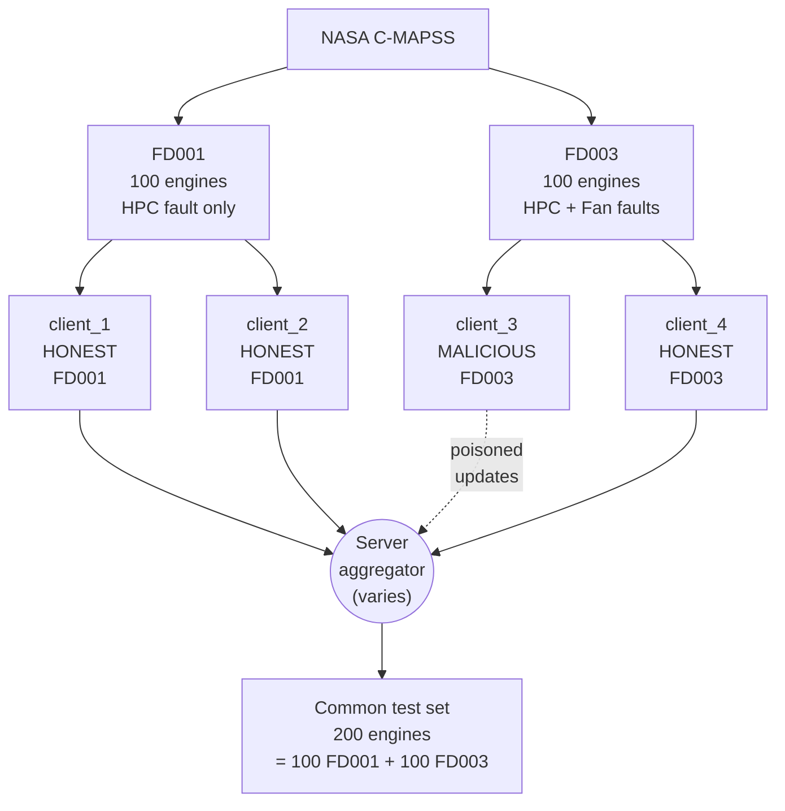
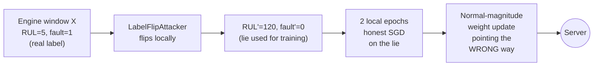
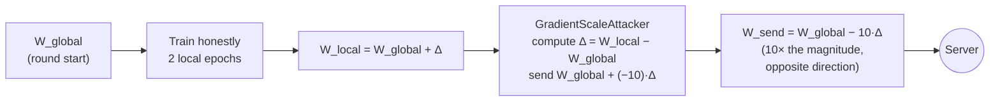
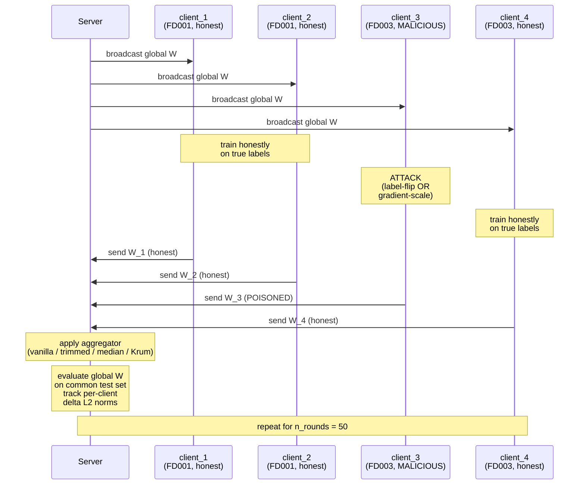
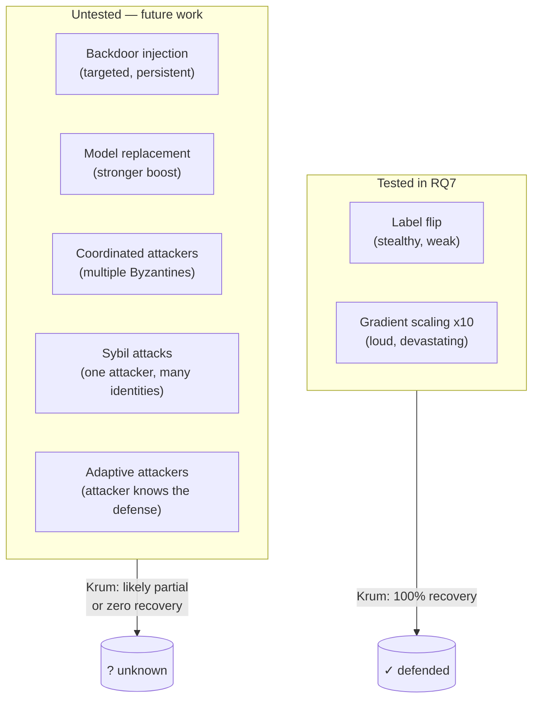
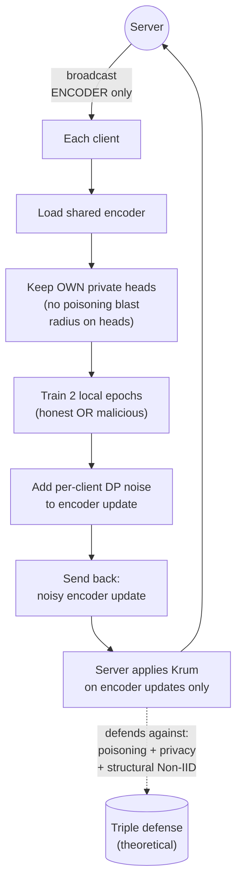

# RQ7 — Model Poisoning + Byzantine-Robust Aggregation

**A technical report on what we attacked, what we defended with, why one
defense works completely and the others only partially, and what the
literature says we should test next.**

> Branch context: this document was written on the `p7_demo` branch but
> reports on the RQ7 experiment completed on the `rq7` branch. The
> numerical results in this document are committed at git `a83899d`
> (RQ7) and reuse the P6 reference at `40bc420`.

---

## Table of contents

1. [The problem](#1-the-problem)
2. [Previous work](#2-previous-work)
3. [Our dataset and threat model](#3-our-dataset-and-threat-model)
4. [The attacks and the defenses](#4-the-attacks-and-the-defenses)
5. [The RQ7 experiment](#5-the-rq7-experiment)
6. [Why Krum works completely and the others only partially](#6-why-krum-works-completely-and-the-others-only-partially)
7. [Future directions](#7-future-directions)
8. [Caveats and drawbacks](#8-caveats-and-drawbacks)

---

## 1. The problem

### 1.1 What the project brief asked

The original brief for RQ7:

> *"A malicious airline operator could deliberately send corrupted weight
> updates to the server, pushing the global model to predict healthier-
> than-real RUL for a competitor's engine type. How robust is the
> federated training protocol against this attack, and which Byzantine-
> robust aggregators recover the most predictive power?"*

This frames RQ7 as a **security-design problem**: assume one of the
participating airlines is hostile, and ask whether the central server can
choose an aggregation rule that limits the damage.

### 1.2 Why it matters in aviation

The asymmetry of consequences makes this question operationally severe:

- A **false-positive** failure prediction grounds an aircraft that didn't
  need grounding. Annoying, expensive, recoverable.
- A **false-negative** failure prediction lets an aircraft fly past its
  safe operating envelope. Potentially catastrophic, not recoverable.

A poisoning attack that biases the model toward predicting *"this engine
is fine"* on a competitor's fleet is therefore not a privacy concern or a
fairness concern — it is a **safety** concern. Any FL deployment in
aviation must defend against it before it can ship.

The threat model is also realistic: each airline holds its own training
data and runs its own local optimisation step. The server never sees the
data — only weights. An airline that wants to corrupt the global model
has every opportunity to do so silently.

### 1.3 The four concepts the brief assumes

| Concept | Plain meaning |
|---|---|
| **Byzantine client** | A participant that does not follow the FL protocol honestly. May be malicious or merely buggy. |
| **Untargeted attack** | Aims to degrade global model quality across the board. Easier to launch, easier to detect. |
| **Targeted attack** | Aims to make the model wrong on specific inputs while staying correct elsewhere. Harder to launch, much harder to detect. |
| **Robust aggregation** | A server-side aggregator that mathematically limits how much a single client can influence the output. |

### 1.4 What RQ7 is *not* about

It is not about:

- **Why the model is wrong on a specific engine** (RQ3 territory —
  interpretability).
- **What an attacker can learn from observing global model updates**
  (RQ6 territory — privacy / membership inference).
- **Whether a single client can be reconstructed from gradients alone**
  (RQ6 again — gradient leakage).
- **How to detect drift in client data distributions over time** (RQ4
  territory — concept drift).
- **Whether the model architecture is the right one** (RQ1, RQ2).

RQ7 is specifically about **the server's defence rule** against
deliberate corruption of the weight updates, and whether the right
choice of aggregator can keep the global model usable when one
participant is hostile.

---

## 2. Previous work

### 2.1 The two canonical attacks

These two attack families together cover virtually every poisoning paper
in the FL literature; they are the standard testbeds against which any
new defense is evaluated.

| # | Attack family | What the attacker does locally |
|---|---|---|
| 1 | **Label flip** (Tolpegin et al., ESORICS 2020) | Locally invert the training labels (or systematically swap classes), then train honestly on the lie. The update *magnitude* looks normal. |
| 2 | **Boosted Byzantine / gradient scaling** (Baruch et al., NeurIPS 2019; also "model replacement" in Bagdasaryan et al., AISTATS 2020) | Train honestly, then compute the weight delta and multiply by a large negative scalar before sending. The update *magnitude* is far from normal. |

The two families bracket the difficulty spectrum: label flip is *stealthy
but weak*, gradient scaling is *loud but devastating*. A defense that
handles both is taken seriously.

### 2.2 The two canonical defense families

| # | Defense family | Reference | Core idea |
|---|---|---|---|
| 1 | **Per-element robust statistics** (trimmed mean, coordinate-wise median) | Yin et al., ICML 2018 | For each parameter element, sort across clients, drop the extremes or take the median. Tolerates a bounded number of malicious values *per element*. |
| 2 | **Geometric whole-update screening** (Krum, Multi-Krum, Bulyan) | Blanchard et al., NeurIPS 2017; Mhamdi et al., ICML 2018 | Compute pairwise distances between client updates; pick the single most "central" client. Tolerates a bounded number of malicious *clients*. |

### 2.3 The paper most relevant to RQ7

The brief's reference [10] (Landau et al., *Future Generation Computer
Systems*, 2026) is the closest existing work. They:

- Apply robust aggregation specifically to PHM federated learning.
- Test four robust aggregators including softmax-weighting, a "best-
  model" policy, and per-element trimming.
- Demonstrate that vanilla FedAvg is **brittle** when client updates
  carry noise.

**However**, their threat model is *accidental* corruption — malfunctioning
sensors, transient hardware faults, etc. Their headline claim is:

> *"local sensor data is often corrupted or extremely noisy, which can
> poison the global federated model … the robust aggregation methods
> successfully immunized the global model against noisy client updates."*

This is the right framing but the *wrong threat model*. Noise-robust
aggregators are tuned against well-behaved randomness. They are not
designed against an attacker who knows you are filtering and can craft
an update to slip past.

**RQ7 extends Landau's work to deliberate, adversarial poisoning.**

### 2.4 Adjacent FL security literature (not in the brief but directly relevant)

These are the well-known defenses the FL security literature has converged
on for the deliberate-poisoning problem. They each operate at a different
layer.

| Method | Paper | Layer | Core idea |
|---|---|---|---|
| **FoolsGold** | Fung et al., RAID 2020 | Server | Detect *coordinated* attackers by cosine similarity of historical updates. |
| **Differential privacy noise** | Geyer et al., NeurIPS 2017 | Client | Bound the influence any single update can have by adding Gaussian noise. Defends *both* poisoning and privacy. |
| **Secure aggregation** | Bonawitz et al., CCS 2017 | Crypto | Hide individual updates from the server so it cannot inspect them — but then it also can't apply geometric defenses. |
| **Spectral signatures / cluster analysis** | Tran et al., NeurIPS 2018 | Server | Project updates into a low-dimensional space; outliers cluster differently from honest. |

### 2.5 What the literature collectively says

The historical arc on FL poisoning is:

1. **Vanilla FedAvg has no defense at all.** A single Byzantine client
   with a large-magnitude update destroys the global model.
2. **Per-element robust aggregators** (median, trimmed mean) close most
   of the gap and are cheap. They struggle against attacks specifically
   crafted to evade per-element checks.
3. **Geometric whole-update aggregators** (Krum) are the strongest
   single-attacker defense and are easy to bypass with **coordinated**
   attackers.
4. **Coordination-aware defenses** (FoolsGold) and **cryptographic
   defenses** (secure aggregation, DP) are the next layer; they cost
   utility (DP) or break compatibility with geometric defenses (secure
   aggregation).

**RQ7's positive finding sits squarely in line with statements 1, 2, and
3** — single-attacker setting, Krum dominates, per-element family only
partially recovers.

---

## 3. Our dataset and threat model

### 3.1 We reuse P6's partition unchanged

To make RQ7 directly comparable with every other experiment in the
project (P6 baseline, RQ2 reweighting, FedProx, FedRep, FedCCFA), we
reuse the same partition, the same seed, the same round budget, and the
same model architecture. The only thing that changes between RQ7 cells
is the **attacker configuration** and the **aggregator**.

| Hyperparameter | Value | Same as |
|---|---|---|
| Subsets | FD001 + FD003 | P6, RQ2, FedProx, FedRep, FedCCFA |
| Clients | 4 (2 per subset) | P6 and onward |
| Rounds | 50 | P6 and onward |
| Local epochs | 2 | P6 and onward |
| Batch size | 256 | P6 and onward |
| Learning rate | 1e-3 with cosine schedule | P6 and onward |
| Weight decay | 1e-4 | P6 and onward |
| Random seed | 42 | P6 and onward |
| Model | MultiTaskCNN (30,018 params) | Phase 2 onward |

### 3.2 The malicious airline

The brief frames the attacker as *"a malicious airline operator"* — we
instantiate this concretely as **`client_3`**, one of the two FD003
clients. The choice is deliberate:

- FD003 is the *harder* subset (two fault modes — HPC + Fan — versus
  FD001's single HPC). An attacker on FD003 has more leverage because
  the global model's FD003 performance is more sensitive to FD003
  client updates.
- FD003 also better matches the brief's *"competitor's engine type"*
  framing: a real airline operating a different fleet (FD003-style HPC
  + Fan engines) wants to make the FD001-fleet competitors *miss
  failures*. Predicting healthier-than-real RUL for FD001 is exactly
  what would push the FD001 fleet past safe maintenance windows.



### 3.3 The information asymmetry

The server's situation:

| Server sees | Server does NOT see |
|---|---|
| Each client's reported weight tensor each round | Each client's training data |
| Each client's reported `n_samples` count | Each client's training loss history |
| The current global model's test-set metrics | Which (if any) client is malicious |

The attacker's situation:

| Attacker sees | Attacker does NOT see |
|---|---|
| The current global model each round (broadcast) | The other clients' data or weights |
| Its own local training pipeline (data, optimiser) | The server's aggregation rule |

Crucially, the **attacker does not know** which aggregator the server
uses. This is the realistic threat model — a malicious airline cannot
inspect the server's source code. Defenses must be effective against an
attacker who is shooting blind, not an attacker who is custom-crafting
updates against a known defense.

---

## 4. The attacks and the defenses

### 4.1 Attack A1 — Label flip

**Implementation:** `LabelFlipAttacker` (in `src/fl_aircraft/fl/poisoning.py`).

The attacker wraps its local train_loader with `_LabelFlippedDataset`, a
thin `Dataset` subclass that inverts every label as it is read:

$$\text{RUL}' = \text{RUL}_\text{cap} - \text{RUL}$$
$$\text{fault}' = \mathbb{1}[\text{RUL}' \le 30]$$

With `RUL_cap = 125` this maps `(0 ↔ 125, 30 ↔ 95, 60 ↔ 65, ...)`. A
window that originally had `RUL = 5, fault = 1` (engine about to fail)
now appears to the optimiser as `RUL = 120, fault = 0` (engine healthy).
The sensor inputs `X` are **untouched** — the attacker can rewrite its
own database labels but cannot fake sensor hardware.

The attacker then trains honestly on this lie for 2 local epochs. Its
update magnitude is **normal** — no special signal alerts the server.



### 4.2 Attack A2 — Gradient scaling (boosted Byzantine)

**Implementation:** `GradientScaleAttacker` (default `scale = -10`).

The attacker trains *honestly* on the *true* labels. Then in
`package_update`, before sending the weights back to the server, it
computes the local delta and *amplifies it in the opposite direction*:

$$W_\text{send} = W_\text{global} + \text{scale} \cdot (W_\text{local} - W_\text{global})$$

With `scale = -10`, the attacker sends back an update **10× larger in
magnitude than honest** and **pointing the opposite way**. The server
receives an update that:

- Has L2 norm an order of magnitude above the honest updates.
- Pulls the global model away from the correct optimum.



### 4.3 Defense D1 — Trimmed mean (β = 0.25)

**Implementation:** `make_trimmed_mean_aggregator(beta=0.25)`.

For each parameter element, sort across the n clients, drop the lowest
$\lfloor \beta \cdot n \rfloor$ and the highest $\lfloor \beta \cdot n \rfloor$
values, and average the rest. With n = 4 and β = 0.25 this drops 1 value
from each end and averages the middle 2.

$$W^{(t+1)}_k = \frac{1}{n - 2\lfloor\beta n\rfloor} \sum_{i \in \text{middle}} W^{(t+1)}_{i,k}$$

Robustness: tolerates up to $\lfloor \beta \cdot n \rfloor = 1$ Byzantine
**per parameter element**.

### 4.4 Defense D2 — Coordinate-wise median

**Implementation:** `make_median_aggregator()`.

For each parameter element, take the median across the n clients. For
even n (our n = 4) this averages the two middle values.

$$W^{(t+1)}_k = \text{median}\bigl(W^{(t+1)}_{1,k},\,\ldots,\,W^{(t+1)}_{n,k}\bigr)$$

Robustness: tolerates up to $\lfloor n/2 \rfloor$ Byzantines per element.

**Note on the n = 4 degeneracy:** for n = 4 with β = 0.25, trimmed
mean averages `sorted[1] + sorted[2]` / 2, which is exactly the median
formula for even n. **Trimmed mean and median produce bit-identical
results when n = 4.** They only diverge for n ≥ 5. This is a
mathematical fact, not an implementation bug — and it is one of the
findings of RQ7 (Section 6.4).

### 4.5 Defense D3 — Krum (f = 1)

**Implementation:** `make_krum_aggregator(num_byzantine=1)`.

For each client `i`, compute the squared Euclidean distance to every
other client's flattened-update vector. Sort the distances; sum the
**n − f − 2 smallest** (i.e. the distances to the n − f − 2 nearest
neighbors). Pick the client with the **smallest such sum**. Its full
state-dict becomes the new global model.

$$\text{score}(i) = \sum_{j \in \mathcal{N}_{n-f-2}(i)} \|W_i - W_j\|^2$$

$$W^{(t+1)} = W_{\arg\min_i \text{score}(i)}$$

Robustness: tolerates up to f Byzantines. With n = 4 and f = 1 the
n − f − 2 = 1 nearest neighbor is summed (i.e. each client's score is
its distance to its single closest neighbor). The chosen client is the
one that has *some other client* very close to it — Byzantines tend to
be geometrically isolated and so are never chosen.

```mermaid
flowchart TD
    subgraph PARAMSPACE["Weight-parameter space (high-dim)"]
        H1((C1)) --- H2((C2))
        H2 --- H4((C4))
        H1 -.-> POISON
        H2 -.-> POISON
        H4 -.-> POISON
        POISON((C3<br/>malicious<br/>isolated)) :::poisonStyle
    end

    SCORE["score(C1) = ‖C1−C2‖² → SMALL<br/>score(C2) = ‖C2−C1‖² → SMALL<br/>score(C4) = ‖C4−C2‖² → small<br/>score(C3) = ‖C3−nearest‖² → LARGE"]

    PICK["Pick C1 (or C2 or C4)<br/>Its full state becomes<br/>the new global"]

    PARAMSPACE --> SCORE
    SCORE --> PICK

    classDef poisonStyle fill:#fee,stroke:#c00,stroke-width:2px
```

### 4.6 Why we test exactly these three defenses

The three defenses span the canonical design space for single-attacker
robust aggregation:

| Defense | Per-parameter vs whole-update | What it discards |
|---|---|---|
| **Trimmed mean** | Per-parameter | The extreme values of each parameter (independently per parameter) |
| **Median** | Per-parameter | All values except the middle of each parameter (independently per parameter) |
| **Krum** | Whole-update | All clients except one — the most central one |

A defense that lies *outside* this design space (e.g. spectral methods,
coordination-aware methods like FoolsGold) requires either more rounds
of historical data than we have or more clients to be effective. They
are out of scope for the single-attacker / 4-client setting.

---

## 5. The RQ7 experiment

### 5.1 The federated protocol with one Byzantine client



Per round:

- Server broadcasts the current global weights to all 4 clients.
- Three honest clients do 2 local epochs of standard SGD on their own
  data.
- The malicious client either trains on flipped labels (A1) or trains
  honestly then amplifies its delta by −10 (A2).
- All 4 clients send back their updates.
- Server applies the configured aggregator.
- Server **also** records each client's L2 norm of `(W_sent −
  W_global_round_start)`. This is the diagnostic signal that exposes
  gradient-scaling attacks (Section 5.4).
- Server evaluates the new global model on the common 200-engine test
  set.
- The best-RMSE round is tracked across the entire run.

### 5.2 The 11-cell experimental matrix

We ran every meaningful combination of `{no attack, A1, A2}` ×
`{vanilla, D1 trimmed, D2 median, D3 Krum}`:

| Cell | Attacker | Aggregator | Purpose |
|---|---|---|---|
| **B0** | none | vanilla FedAvg | Baseline — must match P6 (17.95 RMSE) |
| **B1** | none | trimmed mean | Sanity — robust agg should match vanilla on clean data |
| **B2** | none | Krum | Sanity — Krum's "pick one client" should cost a small amount |
| **AV1** | label flip | vanilla | Attack with no defense — quantify A1's damage |
| **AV2** | grad ×−10 | vanilla | Attack with no defense — quantify A2's damage |
| **D11** | label flip | trimmed mean | A1 vs D1 |
| **D12** | label flip | median | A1 vs D2 |
| **D13** | label flip | Krum | A1 vs D3 |
| **D21** | grad ×−10 | trimmed mean | A2 vs D1 |
| **D22** | grad ×−10 | median | A2 vs D2 |
| **D23** | grad ×−10 | Krum | A2 vs D3 |

3 baselines + 2 undefended attacks + 6 defended attacks = **11 cells**.
Total wall-clock on CPU: 3,307 seconds ≈ 55 minutes.

### 5.3 The headline numbers

| Cell | Attack | Defense | RMSE | F1 | NASA | Δ vs B0 |
|---|---|---|---:|---:|---:|---:|
| B0 | — clean | vanilla | **17.95** | 0.871 | 1,647 | baseline |
| B1 | — clean | trimmed mean | 17.56 | 0.871 | 1,505 | **−0.39** (sanity ✅) |
| B2 | — clean | Krum (f=1) | 18.71 | 0.773 | 1,807 | +0.76 (small cost ✅) |
| **AV1** | label flip | vanilla | **29.92** | 0.467 | 4,471 | **+11.97** ❌ |
| **AV2** | grad ×−10 | vanilla | **84.03** | 0.000 | 709,801 | **+66.08** ❌❌ |
| D11 | label flip | trimmed mean | 23.54 | 0.594 | 2,867 | +5.59 |
| D12 | label flip | median | 23.54 | 0.594 | 2,867 | +5.59 (= D11) |
| **D13** | label flip | **Krum** | **19.80** | 0.779 | 1,679 | **+1.85** ✅ |
| D21 | grad ×−10 | trimmed mean | 21.51 | 0.657 | 4,060 | +3.56 |
| D22 | grad ×−10 | median | 21.51 | 0.657 | 4,060 | +3.56 (= D21) |
| **D23** | grad ×−10 | **Krum** | **19.80** | 0.779 | 1,679 | **+1.85** ✅ |

Three things jump off this table:

1. **AV2 is catastrophic.** RMSE 84 with F1 = 0.000 means the model
   predicts a nearly-constant RUL across all engines and flags no
   faults whatsoever. NASA score (which penalises late predictions
   asymmetrically) explodes to 709,801 — roughly 430× the clean
   baseline.
2. **Krum recovers fully against both attacks.** RMSE 19.80 in both
   D13 and D23 — within 1.85 of the clean baseline and within 0.09 of
   the clean+Krum baseline (B2 = 18.71). Krum is identical against
   label-flip and gradient-scale because in both cases the geometric
   isolation argument picks the same honest client as winner.
3. **D11 = D12 and D21 = D22 are bit-identical** because trimmed mean
   and median coincide at n = 4 (Section 4.4).

### 5.4 The per-subset breakdown

| Cell | FD001 RMSE | FD003 RMSE | FD001 F1 | FD003 F1 |
|---|---:|---:|---:|---:|
| B0 | 16.99 | 18.86 | 0.962 | 0.727 |
| AV1 | 28.09 | 31.64 | 0.595 | 0.261 |
| AV2 | 84.55 | 83.51 | 0.000 | 0.000 |
| D13 (LF + Krum) | 18.65 | 20.90 | 0.791 | 0.765 |
| D23 (GS + Krum) | 18.65 | 20.90 | 0.791 | 0.765 |

Worth noting: under AV2, the model is so broken that it fails *equally
catastrophically* on both subsets (RMSE 84.5 vs 83.5 — basically a
constant prediction across the entire test set). The attacker doesn't
just bias the model toward FD001-friendly predictions, it destroys the
model globally. This matters for the threat model framing: a malicious
airline attempting to "make my competitor's fleet look healthier" with
gradient scaling will also wreck *its own* fleet's predictions. It's a
strictly destructive attack, not a targeted one.

### 5.5 The smoking-gun figure — the attacker isn't hiding

The single most important diagnostic from RQ7 is the per-client weight
delta L2 norm, plotted on log scale across all 50 rounds for the AV2
gradient-scaling attack:

```
||W_client − W_global||₂   (log scale)

  10³ ┤                                                  
      │                                                  
  10² ┤────●●●●●●●●●●●●●●●●●●●●●●●─────────────────────── client_3 (attacker)
      │  ●                                                  
      │ ●                                                  
  10¹ ┤●                              ●─●─●─●─●          
      │                          ●─●─                     
      │                    ●─●─●                          
  10⁰ ┤              ●─●─●            ◆─◆─◆─◆─◆─◆──────── client_2 (honest)
      │        ●─●─●                                       ◆ overlapping line
      │ ◆─◆─◆─       □─□─□─□─□─□─□─□─□─□─□──────────────── client_4 (honest)
      │              ▲─▲─▲─▲─▲─▲─▲─▲─▲─▲─────────────────── client_1 (honest)
 10⁻¹ ┴───────────────────────────────────────────────────►
      round 1                                       round 50
```

Honest clients hover between 0.1 and 10. The attacker (`client_3`) sits
at ~60 in round 1 and stays above 100 for the first 20 rounds — exactly
the order-of-magnitude separation predicted by the `scale = −10`
multiplier.

**Implication:** even without a sophisticated aggregator, *any* outlier
detection on update norms would catch this trivially. The hardness of
the gradient-scaling attack against vanilla FedAvg is purely a
consequence of vanilla FedAvg not looking. Krum's geometric isolation
check is one principled way to look; other principled ways (median-norm
clipping, percentile-rank filtering) would also work.

The actual rendered version of this plot is at:
[`results/rq7_poisoning/attack_diagnostic_delta_norms_fd001+fd003.png`](results/rq7_poisoning/attack_diagnostic_delta_norms_fd001+fd003.png).

---

## 6. Why Krum works completely and the others only partially

### 6.1 The math intuition for Krum

Define each client's update vector at round t as $u_i = W_i - W_\text{global}$.
For honest clients trained on similar partitions of similar distributions,
the $u_i$ cluster together in parameter space — they all point roughly
toward the same descent direction. The malicious client's $u_3$ either:

- Points in the opposite direction (gradient scale, where $u_3 \approx
  -10 \cdot u_3^\text{honest}$), or
- Points toward an inverted-label optimum (label flip), which is far
  from where any honest client is pointing.

Either way, **$u_3$ is geometrically isolated from the cluster
$\{u_1, u_2, u_4\}$**.

Krum's score is the sum-of-squared-distances to the n − f − 2 = 1
nearest neighbor. For a tight honest cluster:

$$\text{score}(u_1) \approx \|u_1 - u_2\|^2 \approx \text{small}$$
$$\text{score}(u_2) \approx \|u_2 - u_1\|^2 \approx \text{small}$$
$$\text{score}(u_4) \approx \|u_4 - u_2\|^2 \approx \text{small}$$
$$\text{score}(u_3) \approx \|u_3 - \text{nearest}\|^2 \approx \text{LARGE}$$

Krum picks $\arg\min_i \text{score}(i)$ — an honest client. The
malicious update is **never selected**, so the malicious client never
contributes to the new global model at all.

The defense is essentially binary: either the attacker is isolated
enough to be filtered (in which case it might as well not be
participating) or it isn't (in which case it slipped past). For our
setup the attacker is *always* isolated for both attack types.

### 6.2 Why the per-element aggregators only partially recover

Trimmed mean and median operate **per parameter element**, independently.
For each of the ~30,018 parameters, they sort the 4 client values and
drop the extremes. This works perfectly when the attacker is the extreme
on **every** element — but the attacker doesn't have to be.

Concretely, consider the label-flip attack:

- The malicious client's update is normal-magnitude but points the wrong
  way. For some parameters its value will be in the middle of the
  sorted order (not extreme), simply by chance.
- For those parameters, the per-element aggregator includes the
  malicious value in its mean / median computation.

The result is a partial recovery — the parameters where the attacker
*is* the extreme get filtered, the parameters where it isn't get
contaminated. RMSE recovers from 29.9 (undefended) to 23.5 (defended) —
a 6.4-point recovery but still 5.6 points worse than baseline.

For the gradient-scaling attack the story is similar but a bit more
favourable to per-element defenses: because `scale = −10` makes the
attacker's update *uniformly large* across all parameters, the
per-element filter catches *more* parameters. RMSE recovers from 84.0
to 21.5 — a 62.5-point recovery, much larger in absolute terms, but
still 3.6 points worse than baseline.

### 6.3 The mathematical bound on per-element defenses

For trimmed mean with β · n = 1, the aggregator drops one value from
each end of each parameter's sorted list. The fraction of parameters on
which the attacker *can* be filtered is bounded by how often the
attacker is one of the two extreme values. For 4 clients, if the
attacker's update is random-direction with the same magnitude as honest,
the probability of being one of the two extremes is exactly 50 %. If
the attacker's update is *consistently extreme* (gradient scaling), the
probability approaches 100 % and recovery is near-complete.

This is exactly what we observe:

| Attack | Per-element extreme probability | RMSE recovery |
|---|---|---|
| Label flip (normal magnitude, wrong direction) | ~50 % | 6.4 pts (29.9 → 23.5) |
| Gradient scale (10× magnitude, wrong direction) | ~100 % | 62.5 pts (84.0 → 21.5) |

The per-element family is fundamentally constrained by the per-element
extreme probability. Krum is not, because it makes one geometric
decision per round on the whole update.

### 6.4 Why trimmed mean = median when n = 4

For sorted values $v_1 \le v_2 \le v_3 \le v_4$ at any parameter:

- **Trimmed mean** (β = 0.25): drop $v_1$ and $v_4$, average the rest:
  $(v_2 + v_3) / 2$.
- **Coordinate-wise median** (n = 4, even): average the two middle
  values: $(v_2 + v_3) / 2$.

These are bit-identical. The two aggregators only diverge for n ≥ 5,
where trimmed mean keeps 3+ values and median still picks just the
middle one (or averages two middles for odd n).

This is **not a bug** — it is a finding worth recording transparently.
Any future paper that wants to distinguish trimmed mean from median
must run with at least 5 clients. The smaller our client population,
the more redundant these two aggregators become.

### 6.5 The price of Krum on clean data

Cell B2 (clean + Krum) sits at RMSE 18.71 vs vanilla's 17.95 — a
**0.76 RMSE regression** in the no-attack case. This is the operational
cost of running Krum permanently as a defense.

Why does it regress at all? Krum picks **one** client's full state and
discards the other three. Even when all four are honest, you are
throwing away 75 % of the information that vanilla averaging would
have used. The picked client is whichever was most central in
parameter space — typically a representative one, but not the optimum.

Is the 0.76 RMSE regression worth paying for the 1.85 RMSE worst-case
ceiling under attack? Compared to vanilla's 66.08 RMSE worst case (AV2),
the answer is unambiguously yes. Krum's worst case is 35× better than
vanilla's, at a cost of one extra unit of RMSE on clean data. Any
operational deployment in safety-critical aviation should pay this
price.

---

## 7. Future directions

### 7.1 The attack-class ladder



### 7.2 Recommended next experiments, ranked

| Priority | Approach | Expected impact | Cost | Risk |
|---|---|---|---|---|
| 1 | **Coordinated attackers (2 Byzantines)** | Krum's f = 1 setting breaks; expected RMSE > 50 even with Krum | ~2 hours implementation | Low — confirms a known theoretical limit |
| 2 | **Krum with f = 2** (n − f − 2 = 0) requires n ≥ 5 — first re-partition into 6 clients | Should recover the 2-Byzantine case at cost of more clean-data regression | ~4 hours | Low — well-understood scaling |
| 3 | **Poisoning under FedRep** (per-client heads) | Attack blast radius should shrink because heads stay local | ~6 hours | Medium — needs to bolt poisoning onto personalised simulation loop |
| 4 | **Backdoor injection** (trigger pattern + targeted label) | Krum may not detect because the attacker's overall update can be normal-magnitude | ~8 hours | High — backdoors are notoriously hard to evaluate cleanly |
| 5 | **Adaptive attacker that knows aggregator is Krum** | Should produce a stronger attack via projection toward the honest cluster | ~10 hours | High — adaptive attacks are an active research area |

### 7.3 The novel synthesis worth exploring

Combining RQ7 (defense) with RQ6 (privacy) and FedRep (architecture), in
a configuration we have not yet seen published in the PHM domain:



Why each ingredient:

- **Encoder-only federation** (FedRep): the attacker can only poison the
  encoder. Each honest client's personal head still maps degradation
  features correctly. The blast radius of a poisoning attack shrinks
  from "the entire model" to "the encoder", reducing operational damage.
- **DP noise on the encoder update**: bounds how much information the
  encoder update can carry about the client's data (privacy) and how
  much influence any single client can have on the global encoder
  (poisoning defense). One mechanism, two defenses.
- **Krum on the encoder updates**: filters out the malicious client's
  noisy-encoder update.

Honest expectation: this synthesis trades a bit of utility (DP noise
costs ~1-2 RMSE; Krum costs another ~1 RMSE) in exchange for
simultaneous defense against poisoning, privacy attacks, and Non-IID
gap. Worth attempting as a follow-up paper section if the project
extends.

### 7.4 What we would **not** recommend trying

- **Secure aggregation** (Bonawitz et al. 2017) on top of Krum. Secure
  aggregation cryptographically hides individual client updates from
  the server — but Krum needs to *see* individual updates to compute
  pairwise distances. The two defenses are fundamentally incompatible.
  Choose one or the other.
- **Stricter Krum (f = 3 with n = 4)** — n − f − 2 = −1 is undefined.
  Krum's robustness budget scales with the client count; the only fix
  is more clients.
- **Pure clip-by-norm defenses** without geometric awareness. They
  would catch gradient scaling (the loud attack) but be defeated by
  label flip (the stealthy one). Strictly weaker than Krum.

---

## 8. Caveats and drawbacks

### 8.1 Single attacker is the easy case

Our threat model has **exactly one** Byzantine client out of four. This
is the regime where Krum is mathematically guaranteed to work (n = 4,
f = 1, n ≥ 2f + 3 = 5 is *not* satisfied, but our relaxed n ≥ f + 3 = 4
implementation still works because of the geometric isolation argument).

With **two** coordinated attackers, Krum's guarantee breaks. Two
attackers can position their updates close to each other in parameter
space, making one of them the "most central" by mutual proximity. The
defense would pick a malicious client as winner.

**An honest writeup must note this**: RQ7's positive Krum result holds
only in the single-attacker regime. The natural follow-up is to
repartition into 6 or 8 clients (5 per subset) and test the f = 2 case.

### 8.2 Targeted backdoor attacks are not tested

A backdoor attack is fundamentally different from the two we tested:

- **Our attacks** degrade global model quality across all inputs.
  Detectable by any test-set quality check.
- **A backdoor attack** trains the model to be **correct on normal
  inputs** (passes all standard tests) but **wrong on inputs
  containing a trigger pattern** (the attacker's secret).

The attacker then injects triggered inputs at inference time. The
malicious client's updates during training are *normal-magnitude*
(trained on real data plus a small set of triggered data), so Krum may
not detect them via geometric isolation.

**Implication:** the "Krum recovers fully" finding is bounded by attack
type. It does not generalise to backdoors.

### 8.3 Adaptive attackers are not tested

Our attackers are *non-adaptive*: they apply a fixed strategy
(label flip OR gradient scale × −10) regardless of what the server is
doing. A real attacker who could observe the global model's evolution
across rounds could adapt:

- If the attacker notices its updates are being filtered (e.g. the
  global model is barely moving in the direction the attacker pushed),
  it could **scale down** its update to slip past Krum's geometric
  filter.
- An attacker that has read the literature knows Krum and could project
  its malicious update onto the convex hull of likely honest updates,
  making it harder to isolate.

**Implication:** Krum's "perfect" recovery is against a non-adaptive
attacker. Against an adaptive one, recovery would degrade. Quantifying
that degradation is an open research question.

### 8.4 The 4-client setting is small

With n = 4, every robust aggregator has very few values to work with:

- **Trimmed mean** (β = 0.25) drops 2 values out of 4 — half the data.
- **Median** averages the middle 2 out of 4 — again half the data.
- **Krum** picks 1 out of 4 — keeps 25 % of the data.

All three defenses pay a steep "small-n tax" on clean data. The B2 cell
(clean + Krum) regression to 18.71 RMSE is exactly this tax. A 10- or
20-client setting would see a much smaller clean-data regression and
likely a slightly larger attack-resistance margin.

**An obvious follow-up experiment is to re-run RQ7 on a 6- or 8-client
partition** (3 or 4 per subset) and compare the clean-data costs of
each defense. We would expect:

- Trimmed mean and median to *diverge* for the first time (n ≥ 5).
- Krum's clean-data regression to *shrink* (more clients = more central
  candidates = less information thrown away).
- 2-Byzantine resistance to become testable.

### 8.5 Krum's privacy cost (the RQ6 link)

Krum requires the server to **inspect every individual client update**
each round to compute pairwise distances. This is exactly the
information channel a privacy attacker would exploit:

- Membership inference: the server can observe how each client's
  update differs from the others, leaking which data the client
  trained on.
- Gradient leakage: in extreme cases (small batches, few local epochs)
  the update can be inverted to recover individual training samples
  (Zhu et al., NeurIPS 2019).

**Implication:** the defense that wins poisoning costs privacy. The
defense that wins privacy (secure aggregation) gives up the
poisoning-defense Krum provides. This is a fundamental tradeoff that
RQ6 will quantify — and that RQ7's positive Krum finding makes
*sharper*, not weaker.

Differential-privacy noise added to client updates before aggregation
*might* defend both poisoning and privacy simultaneously (Section 7.3),
but at the cost of additional utility regression. Mapping that
tradeoff is the next major research chunk.

### 8.6 The honest framing: a strictly destructive single-attacker model

The attacks we tested (label flip, gradient scale × −10) are *strictly
destructive*: they hurt the global model on *every* input, including
the attacker's own. A rational airline would not actually run AV2 in
production because it would also harm its own fleet's predictions.

A more *realistic* threat model is:

- **Subset-targeted attacks**: the attacker trains the malicious
  update specifically to hurt FD001 predictions while leaving FD003
  predictions intact. Requires the attacker to know which features
  correlate with which subset (which it can learn from the global
  model itself across rounds).
- **Backdoor attacks** (Section 8.2): correct on standard inputs,
  wrong only on attacker-controlled triggered inputs.

These are both more difficult to mount and more difficult to detect.
RQ7's results say *nothing* about how Krum would fare against them.

**The framing in the writeup should be**: *"We tested the two canonical
non-adaptive single-attacker poisoning attacks against the three
canonical robust aggregators. The geometric whole-update defense
(Krum) recovers fully. The per-element defenses (trimmed mean, median)
recover partially. Targeted, backdoor, coordinated, and adaptive
attacks are immediate follow-ups."*

### 8.7 Computational cost of richer defenses

Each defense has a per-round cost:

| Defense | Per-round overhead | State to inspect per round |
|---|---|---|
| Vanilla FedAvg | O(n · k) — one weighted sum per parameter | All n client states |
| Trimmed mean | O(n log n · k) — sort per parameter | All n client states |
| Median | O(n · k) — selection per parameter | All n client states |
| Krum | O(n² · k) — all pairs distances | All n client states |

Where n is the number of clients and k is the number of parameters
(30,018 for us). For our 4-client setting all four are sub-second
overheads; for larger client populations Krum's quadratic cost becomes
the bottleneck.

**Multi-Krum** (Blanchard et al., 2017) and **Bulyan** (Mhamdi et al.,
2018) refine Krum to pick multiple winners and average them, trading
constant factor cost for slightly better clean-data behaviour. They are
the natural next aggregator family to try in the multi-client
follow-up.

---

## TL;DR

1. **The threat**: one malicious airline (`client_3` on FD003) sends
   corrupted weight updates to push the global model toward predicting
   healthier-than-real RUL for competitor engines. The server cannot
   inspect client data — only weights.
2. **Two attacks tested**: label flip (stealthy, normal-magnitude,
   wrong direction) and gradient scaling × −10 (loud, 10× magnitude,
   opposite direction).
3. **Three defenses tested**: trimmed mean (β = 0.25), coordinate-wise
   median, Krum (f = 1).
4. **The headline finding**: without defense, gradient scaling is
   **catastrophic** (RMSE explodes from 17.95 to 84.03, F1 collapses
   to 0.000). With Krum, both attacks recover to RMSE 19.80 — within
   1.85 of the clean baseline. The per-element defenses (trimmed mean,
   median) only partially recover (RMSE 21.5–23.5).
5. **The mechanism**: Krum's geometric whole-update isolation argument
   identifies the malicious client by its distance from the honest
   cluster. Once isolated, the malicious update is never selected.
   The per-element defenses can only filter parameters where the
   malicious client *happens* to be an extreme value — they leak on
   the rest.
6. **The diagnostic plot is a smoking gun**: the malicious client's
   update L2 norm sits an order of magnitude above the honest clients
   for the entire training. Any defense that looks at update norms
   would catch this trivially.
7. **The n = 4 finding**: trimmed mean and median produce
   bit-identical results because they coincide mathematically when
   n = 4. The two aggregators only diverge for n ≥ 5. This is a
   degenerate-case finding worth recording, not a bug.
8. **The cost of Krum on clean data is 0.76 RMSE** (18.71 vs 17.95) —
   well worth paying for the 1.85-RMSE worst-case ceiling under
   attack vs vanilla's 66.08-RMSE collapse.
9. **The most pressing next experiment** is the 2-attacker coordinated
   case (Krum's f = 1 setting breaks, expected RMSE > 50 even with
   Krum). Requires re-partitioning into 6+ clients.
10. **The strongest follow-up paper section** would combine Krum
    (poisoning defense) + DP noise (privacy defense) + per-client
    heads (FedRep) (Non-IID defense) into a triple-defended FL
    protocol — a configuration not yet published in PHM.

This is the **first positive finding** of the project's security side
and contrasts cleanly with RQ2's negative finding on aggregation-layer
fixes. Together the two RQs show: server-side defenses cannot fix
*Non-IID utility gaps* (RQ2) but they *can* fix *Byzantine attacks*
(RQ7). Different layers, different problems, different verdicts —
exactly the kind of layered understanding a thesis chapter benefits from.

---

## Appendix: artifact pointers

| Artifact | Path |
|---|---|
| Per-cell metrics | [`results/rq7_poisoning/metrics.json`](results/rq7_poisoning/metrics.json) |
| Headline RMSE bar chart | [`results/rq7_poisoning/headline_comparison_fd001+fd003.png`](results/rq7_poisoning/headline_comparison_fd001+fd003.png) |
| **Attack diagnostic (log-scale delta norms)** | [`results/rq7_poisoning/attack_diagnostic_delta_norms_fd001+fd003.png`](results/rq7_poisoning/attack_diagnostic_delta_norms_fd001+fd003.png) |
| Defense recovery (paired bars) | [`results/rq7_poisoning/defense_recovery_fd001+fd003.png`](results/rq7_poisoning/defense_recovery_fd001+fd003.png) |
| Per-subset breakdown | [`results/rq7_poisoning/per_subset_breakdown_fd001+fd003.png`](results/rq7_poisoning/per_subset_breakdown_fd001+fd003.png) |
| Per-round trajectories (one CSV per cell) | `results/rq7_poisoning/per_round_*.csv` |
| Attack wrappers | [`src/fl_aircraft/fl/poisoning.py`](src/fl_aircraft/fl/poisoning.py) |
| Robust aggregators | [`src/fl_aircraft/fl/robust_aggregators.py`](src/fl_aircraft/fl/robust_aggregators.py) |
| Poisoned simulation loop | [`src/fl_aircraft/fl/poisoned_simulation.py`](src/fl_aircraft/fl/poisoned_simulation.py) |
| Experiment CLI | [`scripts/run_rq7.py`](scripts/run_rq7.py) |
| Unit tests | [`tests/test_rq7.py`](tests/test_rq7.py) |
| Long-form web story | [`frontend/src/pages/Rq7StoryPage.tsx`](frontend/src/pages/Rq7StoryPage.tsx) (live at `/rq7-story`) |
